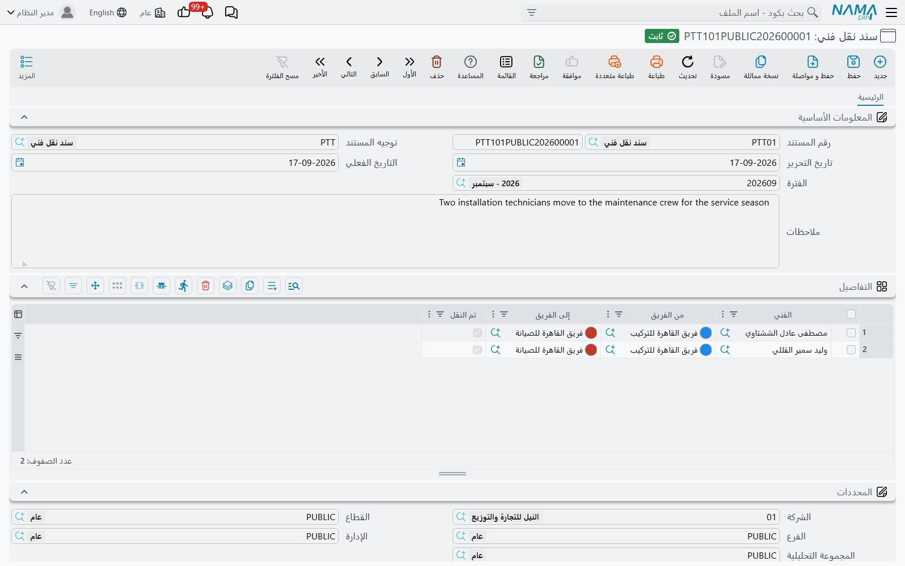

# سندات نقل الفنيين

::: info الترخيص المطلوب
`crm-technician-appointments`.
:::

لأن الفني لا ينتمي إلا إلى فريق واحد، فنقل شخص ليس مسألة تعديل سجلَّي فريقين — إذ سيُرفض عملك في منتصفه، ويصير الشخص لوهلة عضواً في الفريقين معاً. و**سند نقل فني** موجود ليجعل النقلة ذرّية: مستند واحد، وترحيل واحد، ويخرج الفريقان من الطرف الآخر صحيحين.

وهو سجل أيضاً. فبعد ستة أشهر يكون لسؤال «متى انتقل عصام من القاهرة إلى الجيزة» إجابةٌ لها رقم مستند وتاريخ.

## جدول التفاصيل

المستند رأسه من النوع المعتاد — رقم ودفتر وتوجيه وتاريخ فعلي وفترة وملاحظات — ومعه جدول كل سطر فيه نقلة شخص واحد:

| العمود | المعنى |
|---|---|
| الفني | الموظف المنقول — مطلوب |
| من الفريق | الفريق الذي يغادره — مطلوب |
| إلى الفريق | الفريق الذي ينضم إليه — مطلوب |
| تم النقل | يعلّم عليه النظام بعد تنفيذ النقلة |

وينقل `TRANS000001` أربعة أشخاص دفعةً واحدة — ثلاثة إلى فريق تركيب القاهرة وواحد عائد إلى الجيزة — وهي الطريقة الطبيعية لتسجيل إعادة توزيع موسمية.

ويعينك الجدول على ملئه من أي الطرفين:

- **اختر الفني أولاً** فيبحث النظام عن الفريق الذي هو فيه حالياً ويضعه لك في **من الفريق**. وهذا عملياً أسرع الطرق: فأنت تعرف من ينتقل، ولا تعرف بالضرورة أين يجلس اليوم.
- **اختر «من الفريق» أولاً** فيضيق منتقي **الفني** على أعضاء ذلك الفريق.
- و**إلى الفريق** لا يعرض أبداً الفريق الذي تنقل منه.

## ما الذي يُفحص

تُفرض قاعدتان عند ترحيل المستند، وكلتاهما تُبلَّغ على السطر المخالف:

**لا أحد مرتين.** فالفني لا يظهر إلا في سطر واحد — *«الفني … مكرر في أكثر من سطر، ولا يمكن نقل الفني إلا مرة واحدة في المستند»*. وإن انتقل أحدهم مرتين حقاً فذلك مستندان بتاريخين، وهو أيضاً السجل الأصدق.

**ولا أحد إلى فريق هو فيه أصلاً** — *«الفني … موجود بالفعل في الفريق …»*. وهذا يعني عادةً أن النقلة تمت بالفعل، بهذا المستند أو بغيره.

## ماذا يفعل الترحيل

عند الترحيل يؤدي المستند العمل بنفسه: فيُزال فنيّ كل سطر لم يُنقل بعد **من فريق «من الفريق» ويُضاف إلى فريق «إلى الفريق»**، وتُحفظ سجلات الفرق المتأثرة، ويُعلَّم على **تم النقل** في السطر.

وهذا التعليم مهم. فهو يعني أن السطر نُفِّذ، وهو ما يمنع تكرار النقلة نفسها إن رُحِّل المستند مرة أخرى بعد تعديل — إذ تُتخطى السطور المعلَّمة ولا يُنفَّذ إلا الجديد منها.

::: tip ما الذي لا يمسّه النقل
النقلة تغيّر عضوية الفرق ولا شيء غيرها. فالمواعيد المحجوزة أصلاً لأي من الفريقين تحتفظ بفرقها وأوقاتها، وسندات توزيع الخدمات السابقة تظل تسمّي مَن أدّى العمل.

فإن انتقل أحدهم في منتصف الأسبوع فانظر في الحجوزات التي يحملها الفريقان بالفعل وقرّر، حالةً حالة، هل يمضي العمل بالفريق على وضعه الجديد. وإن كان المنقول هو **مشرف الفريق** الذي غادره فسمِّ مشرفاً جديداً هناك — فالمشرف يجب أن يكون أحد فنيّي ذلك الفريق أنفسهم.
:::

## التسلسل المعتاد

1. حرِّر سند النقل بسطر لكل شخص ينتقل.
2. دع «من الفريق» يملأ نفسه، ثم اختر «إلى الفريق».
3. رحِّل — فتُحدَّث الفرق وتُعلَّم السطور.
4. افتح الفريقين للتأكد من العضوية، وأصلح المشرف في أي منهما إن مسّته النقلة.
