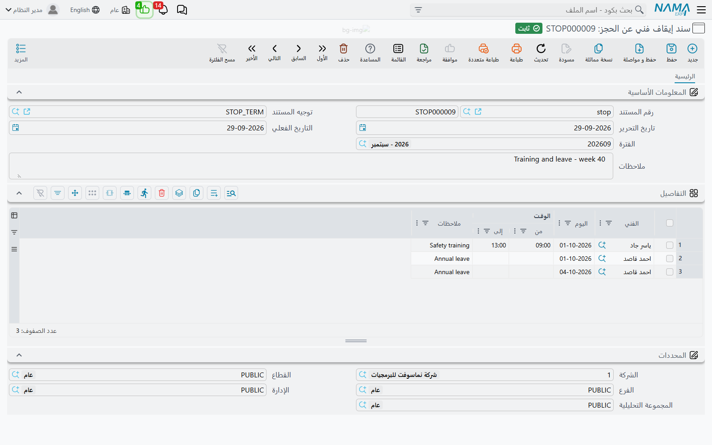

# سند إيقاف فني عن الحجز

::: info الترخيص المطلوب
`crm-technician-appointments`.
:::

أنت تحجز فرقاً لا أفراداً، لكن الفريق لا يخرج إلا إذا حضر أفراده. فإذا كان أحد فنيَّي فريق التركيب في إجازة يوم الخميس فالفريق ليس متاحاً حقاً يوم الخميس، مهما بدا تقويمه فارغاً. و**سند إيقاف فني عن الحجز** (Technician Unavailability) هو الطريقة التي تخبر بها النظام بذلك: إجازة سنوية، أو يوم تدريب، أو يوم مرضي، أو صباح في السفارة. تُدخل الشخص والوقت، وما دام السند مرحَّلاً لا يستطيع أحد أن يحجز فريق ذلك الشخص في ذلك الوقت.

وتسرده القائمة تحت **مواعيد الفنيين** بعد فرق الفنيين مباشرة، باسم **سندات إيقاف الفنيين عن الحجز**.

## جدول التفاصيل

للسند المعلومات الأساسية المعتادة (الدفتر والتوجيه والتواريخ والملاحظات) وجدول واحد مطلوب هو **التفاصيل**، فيه سطر لكل كتلة زمنية:

| العمود | المعنى |
|---|---|
| الفني (Technician) | الموظف غير المتاح — مطلوب |
| اليوم (Day) | التاريخ — مطلوب |
| من وقت (From-Time) | متى يبدأ الإيقاف. والفراغ يعني من أول اليوم |
| إلى وقت (To-Time) | متى ينتهي الإيقاف. والفراغ يعني إلى آخر اليوم |
| ملاحظات (Description) | السبب — «إجازة سنوية»، «تدريب سلامة» |

اترك الوقتين فارغين لإيقاف اليوم كله. وأسبوع الإجازة خمسة سطور، سطر لكل يوم عمل. ويمكن أن يجمع السند الواحد عدة فنيين، فيحمل سند واحد يوم تدريب الفريق كله.

وحين يُملأ الوقتان معاً يجب أن يكون «إلى وقت» بعد «من وقت»، وإلا رُفض الترحيل على ذلك السطر برسالة *"To-Time must be after From-Time"*.

## ماذا يفعل الإيقاف

الإيقاف يخص **الفني**، ويوقف **الفريق** الذي ينتمي إليه. فلأن الفريق يخرج وحدةً واحدة، يكفي غياب عضو واحد ليصير الفريق كله غير قابل للحجز في ذلك الوقت:

- في [تقويم الحجز](/ar/modules/crm/technician-appointments/crm-technician-appointment-calendar) يُرسم الإيقاف على أسبوع الفريق كتلةً رمادية مخطَّطة عنوانها **غير متاح**، ويُستبعد الفريق من قائمة الفرق حين ترسم فترة فوقها.
- وحين يُحفظ موعد، تُرفض كل فترة جديدة أو منقولة لفريق فيه فني موقوف برسالة *"Technician {0} is unavailable during this period"*. والفحص يجري في الخادم، فيسري كذلك على المواعيد التي تُعدَّل من شاشتها. انظر [الموعد الفني](/ar/modules/crm/technician-appointments/crm-technician-appointment).

والفحص ينظر إلى أعضاء الفريق لحظة الحجز. فإن نقل [سند نقل فني](/ar/modules/crm/technician-appointments/crm-technician-transfers) الفنيَّ إلى فريق آخر انتقل الإيقاف معه: فصار يوقف الفريق الجديد، وعاد الفريق القديم متاحاً.

ولا يُحسب إلا السند **المرحَّل**. فالمسودة لا توقف شيئاً، وإلغاء السند يرفع الإيقاف.

## المواعيد المحجوزة أصلاً في وقت الإيقاف

كثيراً ما تُدخل الإجازة بعد أن تكون الزيارات قد حُجزت. والنظام لا يرفض السند لذلك، ولا ينقل شيئاً ولا يلغيه. فحين ترحّل يظهر لك تحذير لكل موعد لفريق الفني يقع في وقت الإيقاف:

*"Appointment {0} is already booked for {1} during the blocked period"*

و`{0}` هو الموعد و`{1}` هو الفني. ويُرحَّل السند مع ذلك. والمواعيد الملغاة لا تُذكر. فاستعمل هذه القائمة قائمةَ مهام: افتح كل موعد في تقويم الحجز وانقله، أو أعطِ العمل فريقاً آخر، أو ألغِه.

::: tip لا نص عربي لهذه الرسائل
الرسائل الثلاث في هذه الصفحة ليست لها ترجمة عربية بعد، فتظهر بالإنجليزية في الواجهة العربية أيضاً.
:::
