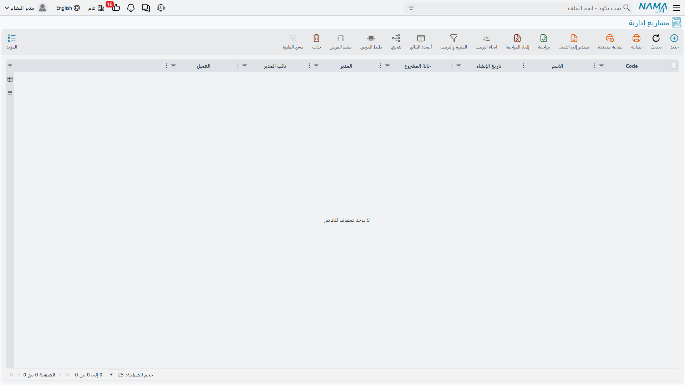

# نظرة عامة على ادارة المشاريع (ECPA)

::: info الترخيص المطلوب
`ecpa` — رمز واحد للوحدة كلها، إمّا أن تعمل بكاملها أو لا تظهر أصلاً. لا توجد تراخيص فرعية، فلا توجد
حالة «مرخّص جزئياً» تحتاج شرحاً: إمّا أن تجد كل الشاشات التالية في القائمة أو لا تجد منها شيئاً. وعنوان
القائمة هو **ادارة المشاريع** (Project Management).
:::

المكتب الهندسي لا يبيع شيئاً يوضع على رفّ. ما يبيعه هو بعد ظهر الثلاثاء: أربع ساعات لمهندس إنشائي فوق
رسم أساسات، ويوم لرسّام يراجع مسقطاً أفقياً، وساعة لشريك في اجتماع مع العميل. المخزون هنا بشر،
والتكلفة رواتب، والسؤالان اللذان يقضّان مضجع المكتب هما: *من عمل على ماذا؟* و*متى نستطيع أن نُصدر
فاتورة بهذا العمل؟*

ووحدة **ادارة المشاريع** موجّهة تحديداً لهذا الشكل من الشركات: المكاتب المعمارية والهندسية، وبيوت
الاستشارات، ومكاتب المراجعة والمحاماة، واستوديوهات التصميم. وكل ما فيها مبني على أن المُنتَج عمل مهني
يُسعَّر بالساعة أو بأتعاب متفق عليها لكل مرحلة، وأن العقدة الحقيقية هي تحويل ساعات مُسجَّلة إلى فاتورة
يمكن الدفاع عنها أمام العميل.

وسنتابع في وثائق هذه الوحدة كلها مكتباً واحداً:

> **مكتب المنارة الهندسي** يفوز بعمل تصميمي للعميل `CUST-011` هو **تصميم تشطيب البرج**، فيصير مشروعاً
> برمز `PRJ-0042`. ويُفوتَر العمل على أربع مراحل — التصميم المبدئي، والتصميم الابتدائي، والتصميم
> التنفيذي، ومستندات الطرح — وتشارك فيه ثلاثة من تخصصات المكتب: معماري وإنشائي وكهربائي. وسارة
> (`EMP-7`) واحدة من المعماريين المكلّفين به.

## اسم الوحدة في القائمة «ادارة المشاريع» وليس ECPA

«ECPA» هو رمز الوحدة، وستقابله في شاشات التراخيص وفي حديث الدعم الفني. لكنك لن تقابله في القائمة.
فمجموعة القائمة اسمها **ادارة المشاريع** بالعربية و**Project Management** بالإنجليزية، ومن يبحث في
شجرة القوائم عن الحروف الأربعة لن يجدها.

والانقسام نفسه يتكرر في المستوى الأدنى: كل نوع سجلّ في الوحدة يحمل داخلياً البادئة `CPA`، لكنك ترى على
الشاشة أسماء عادية — **مشروع إداري**، **مهمة مشروع**، **تنفيذ مهام**، **فاتورة المشروع**. استعمل
أسماء الشاشات. والموضع الوحيد الذي تظهر فيه البادئة الداخلية هو الرموز المختصرة على دفاتر المستندات
(`CPAP` و`CPATS` و`CPAPI` وغيرها)، وهي هناك غير ضارة.

::: info كلمتان متشابهتان إلى حدّ الخطر بالعربية
**المرحلة** (Project Milestone) و**مرحلة المشروع** (Project Stage) شيئان مختلفان تماماً، والفارق بين
اسميهما كلمة واحدة.

فـ**المرحلة** ملف رئيسي: اسم طور قابل للفوترة مثل «التصميم الابتدائي». تُنشئ منها بضعة سجلات لكل مشروع
وتعلّق عليها المهام وسطور الفواتير. أما **مرحلة المشروع** فمستند يُرحَّل: ورقة جدولة ومال، فيها تواريخ
مستهدفة وعدّادات أيام تأخير وجداول تكلفة.

فلا تكتب ولا تقل «مرحلة» مجرّدة حيث يحتمل المعنى الاثنين. وهذه الوثائق تُقيّد الكلمة دائماً.
:::

## من أين جاء الاسم

الإجابة القصيرة أن ECPA ليست اختصاراً لشيء تفعله الوحدة، وإنما هو اسم المكتب الذي بُنيت من أجله.

**ECPAs** مكتب محاسبين قانونيين في مصر يعمل في الضرائب والمراجعة. في عام 2014 تواصلوا مع «نما»
وهم يريدون إدارة مشاريعهم على نحو سليم — المشاريع نفسها، والمهام اللازمة لإنجازها. ومن ذلك التعاون
خرجت هذه الوحدة.

ومن هنا حملت الوحدة اسمهم. و`CPA` اختصار للمحاسبين القانونيين، وهو أيضاً سبب حمل كل نوع سجل بداخلها
للبادئة `CPA`. وبنظرة اليوم كان الأولى أن تُسمّى «إدارة الوقت» أو «ادارة المشاريع» منذ البداية، وهو
ما تقوله القائمة فعلاً الآن، أما الاسم الكودي فقد بقي على حاله.

::: info كلمة شكر
الشكر موصول للأستاذ **أشرف حجر**، الرئيس التنفيذي لـ ECPAs، الذي منح «نما» ثقته في عام 2014 حين لم
يكن لدينا ما نعرضه ولا عملاء يُذكرون. تلك الثقة هي سبب وجود هذه الوحدة.

وECPAs اليوم من أقوى شركاء «نما» — يبيعون نظام نما ويطبّقونه بأنفسهم. شراكة بدأت بأن قرر أحدهم أن
يمنح شركة ناشئة فرصتها.
:::

## هل هذه هي الوحدة التي تريدها؟ ادارة المشاريع أم المقاولات

في نما وحدتان تتحدثان عن «مشروع»، ويصل إلى هنا من اختار الوحدة الخطأ بما يكفي لأن نحسم الأمر في جملة
واحدة:

> **ادارة المشاريع للشركات التي سلعتها ساعات مهنية قابلة للفوترة. والمقاولات للشركات التي تبني —
> تُسنِد أعمالاً لمقاولي باطن، وتحصر كميات، وتُصدر مستخلصات.**

فإن كان الحديث يدور حول مقاول، أو جدول كميات، أو أمر شراء، أو موازنة تنفيذية، أو تفتيش موقع، فأنت في
[وحدة المقاولات](/ar/modules/contracting/contracting-overview) لا هنا. والوحدتان لا تشتركان في سجلّ
واحد ولا في ترخيص واحد.

| | **ادارة المشاريع (ECPA)** | **المقاولات** |
|---|---|---|
| ما الذي يُباع | وقت الناس مُسعَّراً بمعدل، إضافة إلى أتعاب لكل مرحلة | كميات عمل مُسعَّرة ببند جدول كميات ومحصورة في الموقع |
| سجلّ المشروع | **مشروع إداري** — ملف رئيسي تُعدّله في مكانه | مستندات محورها العقد |
| كيف تُلتقط التكلفة | ساعات على مستندات التنفيذ × معدل، إضافة إلى مستندات المصروف | صرف مواد، وتكاليف مباشرة، وتخصيص معدات، ودفتر عمالة يومي |
| كيف يُفوتَر العميل | **فاتورة المشروع**، تُملأ بتجميع سطور التنفيذ والمصروف | مستخلصات مبنية على كميات محصورة |
| مقاولو الباطن | غير موجودين في النموذج أصلاً | منظومة كاملة من المقاولين وعقودهم ومستخلصاتهم |
| الموازنات | غير موجودة | موازنات تقديرية وتنفيذية ومستندات تنفيذها |
| المشتريات وضبط الجودة والموقع | غير موجودة | طلبات وأوامر شراء، وتفتيش، وتقارير اختبار |

ويبقى تشابه اسم واحد ينبغي الاستعداد له: في المقاولات نوع سجلّ اسمه **مشروع** فحسب، أما هنا فاسمه
**مشروع إداري**. والعميل المرخَّص للوحدتين يرى في القائمة شاشتَي «مشروع» لا صلة بينهما.

## المفردات التي تُضبط أولاً

قبل إدخال أول عمل، يصف المكتب نفسه مرة واحدة. وليس شيء من هذا بيانات حركة، بل هو اللغة المشتركة التي
تُرشِّح بها كل شاشة لاحقة وتُجمِّع.

**نوع المشروع** و**نوع مشروع فرعى** يصنّفان العمل — سكني، تجاري، وأنواعهما الفرعية. ونوع المشروع هو
التصنيف الوحيد الذي يحمل سلوكاً حقيقياً: فنوع المهمة يجب أن يتبع نوع مشروعها، وتتسلسل عنه فلاتر عدة
شاشات. أما **تصنيف المشروع** فبطاقة للتقارير لا أكثر.

و**التخصصات** هي مِهَن المكتب: معماري، إنشائي، كهربائي، ميكانيكي. و**المراحل** هي الأطوار التي يُسلَّم
بها العمل ويُفوتَر: التصميم المبدئي، والتصميم الابتدائي، والتصميم التنفيذي، ومستندات الطرح.

والاثنان الأخيران يتضاربان في بعضهما، وهذا الضرب هو قلب الوحدة. فـ**مجموعة المراحل والتخصصات** تحفظ
مجموعة قابلة لإعادة الاستعمال من أزواج (مرحلة، تخصص)، فيرث المشروع الجديد ذو الشكل المألوف الجدول كله
بضغطة واحدة بدل كتابته خانة خانة. وعلى المشروع نفسه يصير الجدول مصفوفة حقيقية من حزم العمل — أربع
مراحل × ثلاثة تخصصات = اثنتا عشرة حزمة، لكل منها ساعاتها وتكلفتها التقديرية. وتفصيل ذلك كله في
[المراحل ومصفوفة المراحل والتخصصات](/ar/modules/ecpa/projects/ecpa-milestones-and-matrix).

ويكتمل المعجم بملفين آخرين: **نوع المهمة**، الذي يربط المهمة بنوع مشروع، و**بند مصروف مشروع**، وهو
كتالوج فئات المصاريف القابلة للاسترداد — تاكسي، طباعة، بريد سريع، رسوم تصريح — ويحمل كل بند منها
الحساب الذي تنزل عليه تكلفته.

## من عرض الأسعار إلى الفاتورة

هذا هو خط العمل الرئيسي، بالترتيب الذي يسلكه أي عمل.

1. **عرض الأسعار.** **عرض أسعار مشروع** يسعّر العمل: سطور مُسعَّرة، والمهام التي يتوقع المكتب تنفيذها
   بساعاتها ومعدلاتها، والمصاريف المتوقعة، وجدول الدفعات. وهو مستند حقيقي له دفتر و**توجيه**، لكنه لا
   يُحدث أي أثر محاسبي — فهو عرض تجاري.

2. **الفوز بالعمل.** زر *قبول العرض* ينقل حالة العرض، وزر **إنشاء المشروع والمهام المتعلقة به** يحوّله إلى **مشروع
   إداري** حيّ بقائمة مهامه جاهزة. وهذا هو مسار «مشروع جديد» الحقيقي في الوحدة.

3. **المشروع.** **المشروع الإداري** هو عمود ما بعد ذلك كله. وهو *ملف رئيسي* لا مستند: لا دفتر له ولا
   توجيه ولا اعتماد، وتظلّ تعدّله طول عمر العمل. وتنتقل حالته بزر **تغيير الحالة** الذي يكتب سطر تاريخ
   في كل مرة. وهو يحمل العميل، والمدير ونائبه، وفريق العمل، وقائمة المراحل، وقائمة التخصصات، ومصفوفة
   حزم العمل.

4. **المهام.** يُتابَع التنفيذ عبر **مهام المشروع**، وهي أيضاً ملفات رئيسية، تتعلّق كل مهمة بالمشروع
   ولها نوع ومرحلة وتخصص و**جدول المنفّذين** — سطر لكل موظف، وفيه ساعاته المخططة ومعدل ساعته وتكلفته
   المخططة. وجدول المنفّذين هو الموضع الذي تعيش فيه فعلياً تقديرات عمالة المشروع.

5. **الساعات.** يسجّل الموظفون أوقاتهم على مستند **تنفيذ مهام**، وهو مستند يومي فيه زرّا بدء وإيقاف
   وسطر لكل فترة عمل. وهناك شاشة مستقلة اسمها **طلب تنفيذ مهام** تسجّل عملاً ينوي أحدهم القيام به.
   والساعات المسجّلة على مستند التنفيذ تنزل على سطر المنفّذ المطابق بوصفها وقتاً **مُسجَّلاً**.

6. **الموافقة.** يفتح المدير مستند **موافقة على تنفيذ مهمة**، ويضغط *تجميع السجلات* ليسحب الأوقات
   المنتظرة على المشاريع التي يديرها، ثم يقبل كل سطر أو يقتطع منه، ثم يعتمد. وعند هذه اللحظة تتحول
   الساعات المُسجَّلة إلى ساعات **فعلية**، ويُعاد بناء تكلفة المهمة، وتتحدّث إجماليات المشروع.

7. **المصاريف النثرية.** **طلب مصروف** هو مطالبة الموظف — تاكسي، فاتورة طباعة — مصنَّفة ببند مصروف
   ومرتبطة بمهمة. و**سند مصروف** هو الوجه المحاسبي: تضغط *تجميع الطلبات* وتعتمد، فتُقيَّد التكلفة
   وتُختَم المطالبات بأنها عولجت.

8. **الفاتورة.** **فاتورة المشروع** تُطالِب العميل. وما يميّزها عائلة أزرار *التجميع* التي تكنس سطور
   التنفيذ غير المفوترة وسطور المصروف غير المفوترة إلى سطور فاتورة فلا يعيد أحد كتابتها. و**مردود
   فاتورة المشاريع** يعكس فاتورة باستعمال التوجيه نفسه.

وعلى امتداد ذلك كله، **الاجراءات** سجلّات حرة لأفعال متابعة على مشروع أو مهمة — مكالمة متابعة، تقديم
مستند إلى البلدية — تُنشأ يدوياً أو تتولّد من سطور مستند التنفيذ.

## مسار الجدولة

إلى جانب خط التنفيذ يوجد خط ثانٍ أقلّ إحكاماً للجدولة والمال على مستوى المرحلة.

**مرحلة المشروع** مستند يُرحَّل يحمل مجموعة سطور مراحل، لكل منها فترة مستهدفة وفترة متوقعة وعدد أيام
تأخير وعدد أيام عطلات — إضافة إلى جداول لإيرادات المرحلة، وتكاليف المستلزمات المخزنية والموردين،
وتكاليف العمالة، وتكاليف الأصول الثابتة، وتكاليف المناولة. وهي الشاشة الوحيدة في الوحدة التي تعرض
الإيراد والتكلفة جنباً إلى جنب.

و**تمديد مرحلة مشروع** يمنح وقتاً إضافياً على مرحلة، مرحلةً مرحلةً، مقابل قائمة أسباب من مستويين.

وثمة حقيقة يحسن حملها من البداية لأنها تحكم طريقة استعمال هذه الورقة: **مرحلة المشروع ليست مرتبطة
بمشروع.** فليس على المستند حقل مشروع أصلاً. وهي تصل إلى مشروع فقط عبر المراحل المختارة في سطورها، ولا
تكتب شيئاً إلى المشروع أبداً، ويجوز تماماً أن تجتمع في مستند واحد مراحل تخصّ مشروعين مختلفين. والشرح
حيث ينفع في [مصادر تكلفة وإيراد المشروع](/ar/modules/ecpa/ecpa-costing-and-profitability).

## القائمة مجموعةً مجموعة

| مجموعة القائمة | ما تجده فيها |
|---|---|
| **مشاريع** | نوع المشروع، نوع مشروع فرعى، المشروع الإداري، تصنيف المشروع، التخصص، مجموعة المراحل والتخصصات، المرحلة، الاجراء، اختصار إلى ملف **العميل** المشترك، قالب مشروع، عرض أسعار مشروع، مرحلة مشروع، تمديد مرحلة مشروع، وقائمتا أسباب التمديد. |
| **المهام** | نوع المهمة ومهمة المشروع. |
| **تنفيذ / الموافقة على المهام** | تنفيذ مهام، طلب تنفيذ مهام، وموافقة على تنفيذ مهمة. |
| **المصــاريف** | بند مصروف مشروع، طلب مصروف، وسند مصروف. |
| **الفاتورة** | فاتورة المشروع ومردود فاتورة المشاريع. |
| **الإعدادات** | سجلّ الإعدادات الوحيد للوحدة: المعدلات وساعات الشهر القياسية التي تحوّل الوقت المُسجَّل إلى مال. انظر [إعدادات ادارة المشاريع](/ar/modules/ecpa/ecpa-configuration). |

ومدخل **العميل** في مجموعة «مشاريع» اختصار إلى ملف العملاء المشترك في المنتج كله، وليس شاشة خاصة بهذه
الوحدة.

## أين تكون الوحدة أرقّ مما تبدو

ثلاثة أمور يحسن معرفتها قبل أن يلتزم مكتب بهذه الوحدة، لأنها تحدد ما يمكن الوعد به.

**لا شيء يُلزِم بموازنة.** عرض الأسعار يسعّر العمل، وشاشة المشروع تحمل قيمة تعاقد وتكلفة تقديرية،
والمصفوفة تحمل ساعات وتكاليف تقديرية لكل حزمة عمل. وكل ذلك أرقام على شاشة: لا مستند يمنع تجاوزاً، ولا
تحقّق يقارن التقدير بالفعلي، ولا سجلّ موازنة في الوحدة أصلاً. فالتقديرات هنا للاسترشاد.

**قصة الجدولة عرضية.** مراحل المشروع وتمديداتها تسجّل فترات مستهدفة ومتوقعة وتعدّ أيام التأخير. وهذا كل
ما في الأمر: لا مسار حرج، ولا اعتماديات بين المهام، ولا موازنة موارد، ولا مخطط جانت. والمكتب الذي
يحتاج جدولة حقيقية يديرها خارج نما ويسجّل نتيجتها هنا.

**التقارير تقريران عن الأوقات.** تشحن الوحدة تقريرَي **اوقات الموظفين** و**تفاصيل أوقات الموظفين** ولا
شيء غيرهما: لا تقرير ربحية مشروع، ولا تقرير أعمال تحت التنفيذ، ولا لوحة معلومات. وأقرب شيء إلى عرض
الربحية هو جدولا الإيرادات والتكاليف في شاشة مرحلة المشروع، وهما على الشاشة فقط. انظر
[تقارير ادارة المشاريع](/ar/modules/ecpa/ecpa-reports) لمعرفة ما يجيب عنه التقريران، و
[مصادر تكلفة وإيراد المشروع](/ar/modules/ecpa/ecpa-costing-and-profitability) لتجميع بقية الصورة.

## إلى أين بعد ذلك

إن كنت تُعدّ الوحدة للتشغيل فاقرأ
[أنواع وتصنيفات وتخصصات المشاريع](/ar/modules/ecpa/projects/ecpa-project-setup) ثم
[المراحل ومصفوفة المراحل والتخصصات](/ar/modules/ecpa/projects/ecpa-milestones-and-matrix) — فالمصفوفة
هي الفكرة التي يتّكئ عليها كل ما عداها.

وإن كنت تدعم موقعاً يعمل بالفعل فابدأ بـ
[المشروع الإداري](/ar/modules/ecpa/projects/ecpa-managed-project) و
[مصادر تكلفة وإيراد المشروع](/ar/modules/ecpa/ecpa-costing-and-profitability)، فهما يجيبان عن معظم ما
يصلك من أسئلة.
