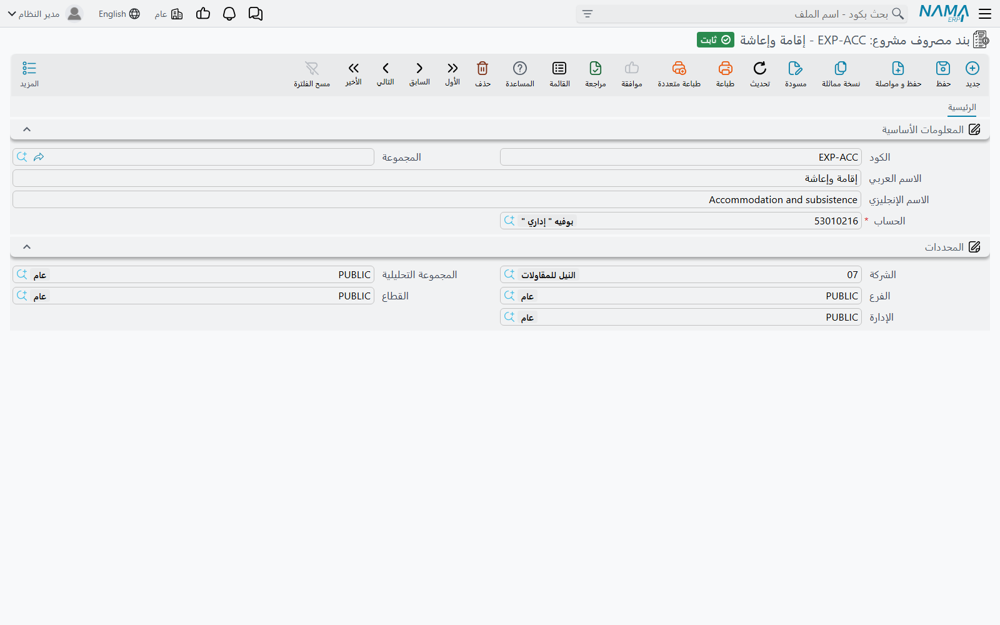
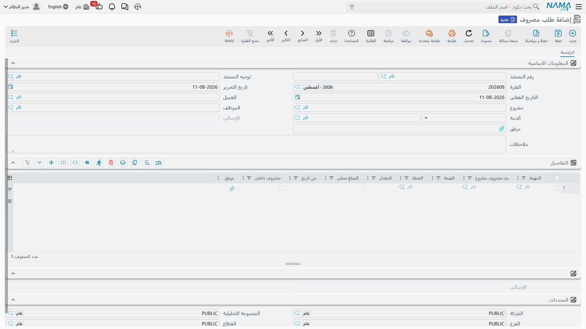
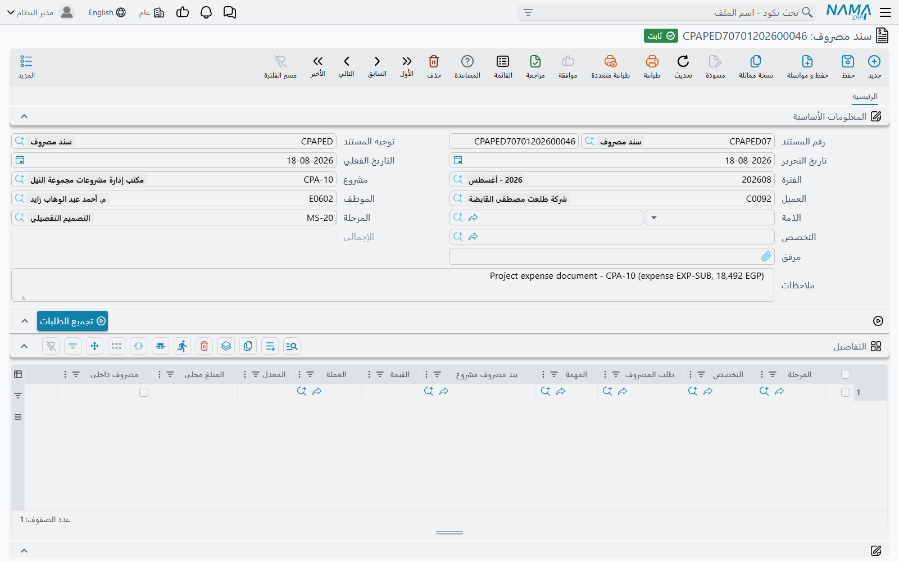

# مصاريف المشروع

::: info الترخيص
الشاشات الثلاث المشروحة هنا تحتاج كود الترخيص `ecpa`.
:::

المكتب الاستشاري يبيع وقت موظفيه، لكن الوقت وحده لا يمثل الفاتورة كلها. أحدهم يركب سيارة أجرة إلى
موقع العميل، أو يدفع رسوم ترخيص للبلدية، أو يطبع مجموعة مستندات طرح، أو يرسل عقدًا موقَّعًا إلى مقر
العميل. تتعامل **ادارة المشاريع (ECPA)** مع هذه المبالغ من خلال ثلاث شاشات تقع معًا تحت مجلد
**المصــاريف** (Expense) في قائمة الوحدة:

- **بند مصروف مشروع** (Project Expense Item) — كتالوج قصير بالأشياء التي يجوز المطالبة بها، وفيه
  يتحدد حساب كل بند.
- **طلب مصروف** (Project Expense Request) — المطالبة نفسها: من صرف، وكم، وعلى أي مهمة من أي مشروع.
- **سند مصروف** (Project Expense Document) — تسجيل المحاسب لمجموعة من المطالبات المقبولة.

كلمة "طلب" تبخس الشاشة الوسطى حقها. **طلب المصروف مستند كامل**: له دفتر، وتوجيه، واعتماد، وتأثير
محاسبي خاص به. وهو أيضًا السجل الذي تعيد فاتورة المشروع تحميله على العميل — أما سند المصروف فلا
دخل له بالفوترة إطلاقًا. احتفظ بهذا الفارق في ذهنك أثناء القراءة، فهو يفسر معظم ما يأتي بعده.

كذلك هناك عمود واحد في المطالبة — **مصروف داخلى** (Internal Account) — يحدد في صمت أي الحسابات
سيستخدمها القيد، **وهل** سيرى العميل المبلغ أصلًا. له قسم مستقل أدناه، وهو الحقل الذي يجب ضبطه قبل
أي شيء آخر.

## كتالوج بنود المصروف

**بند مصروف مشروع** ملف رئيسي صغير: كود، واسم عربي وآخر إنجليزي، ومجموعة اختيارية للتصنيف،
و**المحددات** المعتادة — ثم حقل واحد يحمل الوزن الحقيقي كله: **الحساب** (Account).

الحساب **إجباري**، وقائمة اختياره لا تعرض إلا الحسابات التفصيلية، وهذا ليس تفصيلًا شكليًا. فعند
تحويل سطر المصروف إلى قيد محاسبي، يكون الحساب المسجَّل على بند المصروف هو ما يعيده مصدر
**الذمة على مستوى السطر** (Line Subsidiary) في التوجيه. أي أن **بند المصروف هو الطريقة الوحيدة
التي يختار بها سطر المطالبة حساب مصروفه**. من يكتفي ببند واحد اسمه "انتقالات" لكل أنواع الصرف
سيحصل على رقم واحد مجمَّع في الأستاذ العام؛ ومن يفتح `EXP-TAXI` و`EXP-PRINT` و`EXP-PERMIT`
و`EXP-COURIER`، كل منها على حسابه التفصيلي، يحصل على تحليل للمصروفات دون مجهود إضافي.

لذلك ابنِ هذه القائمة وشجرة الحسابات مفتوحة أمامك؛ فهي أقصر خطوة إعداد في الوحدة وأبعدها أثرًا.

## تحرير المطالبة: طلب مصروف

يفتح الموظف شاشة **طلب مصروف**، ويحدد المشروع، ثم يسرد ما صرفه.

يقول الرأس من يطالب، وعلى ماذا:

| الحقل | ما يحمله |
|---|---|
| رقم المستند (الدفتر / الكود) | الدفتر والرقم المعتادان |
| توجيه المستند | التوجيه الذي يحدد الحسابات التي ستستخدمها المطالبة |
| الفترة، تاريخ التحرير، التاريخ الفعلي | تواريخ المستند المعتادة. والتاريخ الفعلي هو أيضًا التاريخ الذي يُختم به كل سطر |
| مشروع | المشروع الذي سيُحمَّل بالمصروف. تُضيَّق قائمة اختياره بالعميل إن كان مملوءًا، وإلا فبالمشاريع المسجَّل عليها الموظف |
| العميل | يُملأ تلقائيًا بمجرد اختيار المشروع، ويُفرَّغ بتفريغه |
| الموظف | من صرف المبلغ |
| الذمة | الطرف الحسابي المستحِق — مورد أو عميل أو موظف. وهو ما يستخدمه أي جانب في التوجيه مضبوط على *ذمة المستند* (Document Subsidiary)، وغالبًا يكون الموظف صاحب المطالبة |
| الإجمالى | يجمعه النظام من السطور |
| مرفق، ملاحظات | حزمة الإيصالات وملاحظة حرة |
| المحددات | الشركة، مجموعة التحليل، الفرع، القطاع، الإدارة |

كل سطر في جدول **التفاصيل** يمثل شيئًا واحدًا تم شراؤه:

| العمود | ما يحمله |
|---|---|
| المهمة | المهمة التي ستُحمَّل. لا تعرض القائمة إلا مهام مشروع الرأس التي حالتها «قيد التنفيذ» أو «لم تبدأ» |
| بند مصروف مشروع | أي بند من الكتالوج — وبالتالي أي حساب |
| القيمة، العملة، المعدل، المبلغ محلي | المبلغ المطالب به. القيمة إجبارية ولا يجوز أن تكون صفرًا، ويُعاد حساب المبلغ المحلي مع كل حفظ |
| مصروف داخلى | هل يتحمل المكتب هذا السطر أم يعيد تحميله على العميل — انظر القسم التالي |
| مرفق | إيصال هذا السطر بالذات |

الاعتماد متسامح عن قصد. القاعدة الوحيدة التي ستوقفك هي **قيمة** فارغة أو صفرية في أحد السطور
(*"Please specify a value"*). لا شيء غير ذلك يمنع الاعتماد، ومن ثَم فإن الانضباط في ملء المشروع
والموظف والذمة يجب أن يأتي من إجراءات العمل عندك؛ فالقيد المحاسبي لن يكون أفضل من هذه الحقول
الثلاثة.

وإذا كان لديك تعريف اعتماد يغطي المستند، تسير المطالبة في دورة الاعتماد المعتادة، وتعرض حالة
الاعتماد على المعتمِد إجمالي المطلوب وبنود المصروف المطالب بها قبل أن يقرر.

## مصروف داخلى — من يتحمل المبلغ في النهاية

هذا هو الحقل الذي لا يصح أن يُفهم خطأ، لأنه يؤدي وظيفتين في وقت واحد.

**الوظيفة الأولى: أي الحسابات يستخدمها القيد.** يحمل توجيه المصروف أربعة جوانب حسابية في زوجين —
زوج مدين/دائن داخلي، وزوج مدين/دائن خارجي. وعند بناء القيد تُقسَّم السطور: السطور المؤشَّر عليها
**مصروف داخلى** تُسجَّل بالزوج **الداخلي**، والسطور غير المؤشَّر عليها بالزوج **الخارجي**.
والزوجان يُقرآن فعليًا، فيجب ضبط كليهما في أي توجيه تنوي استخدامه لمطالبات مختلطة.

**الوظيفة الثانية: هل يُحاسَب العميل.** زر **تجميع المصاريف** (Collect Expenses) في فاتورة المشروع
لا يلتقط إلا سطور المطالبات التي **لم** يُؤشَّر فيها على مصروف داخلى. والسطر المؤشَّر عليه لا تراه
الفوترة، ولا يوجد مفتاح لاحق يعيد إظهاره.

مرِّر المبلغ نفسه على الوضعين ليتضح الفرق. خذ سطرًا واحدًا بقيمة **500** انتقالات، على المهمة
`TSK-0042-03` من المشروع `PRJ-0042`، مطالِبها الموظف `EMP-7` (سارة) وحساب ذمتها هو ذمة المستند:

| | **مؤشَّر** على مصروف داخلى | **غير مؤشَّر** |
|---|---|---|
| المعنى | المكتب يتحمل الـ 500 | المكتب يتوقع أن يدفعها العميل |
| الحسابات المستخدمة | الزوج **الداخلي** مدين/دائن من التوجيه | الزوج **الخارجي** مدين/دائن من التوجيه |
| ضبط نموذجي | مدين: حساب مصروف الانتقالات المسجَّل على بند المصروف، دائن: حساب ذمة سارة | مدين: حساب المصروفات القابلة لإعادة التحميل على المشروع، دائن: حساب ذمة سارة |
| في فاتورة المشروع | لا يظهر أبدًا — يتخطاه *تجميع المصاريف* | يُجمَّع كسطر بقيمة **500** ويُحمَّل على العميل |
| الأثر الصافي | تكلفة 500 بلا إيراد | تكلفة 500 مقابل إيراد 500 |

::: warning التأشير هو الوضع الافتراضي — أزِله عن قصد
بمجرد اختيار المشروع أو المهمة في السطر، يُؤشَّر على **مصروف داخلى** تلقائيًا إن كان لا يزال
فارغًا. أي أن كل مطالبة تتركها كما هي تعني أن المكتب يتحمل قيمتها. وكل ما تنوي إعادة تحميله على
العميل يجب أن تزيل التأشير عنه يدويًا، في كل سطر، قبل اعتماد المطالبة.
:::

ولأن الفوترة تعمل على **الطلب** لا على السند، فإن هذا القرار يستقر لحظة اعتماد المطالبة، لا لحظة
تسجيل المحاسب لها. فسطر معتمَد غير مؤشَّر عليه يصلح للفوترة سواء حُرِّر له سند مصروف أم لم يُحرَّر —
راجع [فاتورة المشروع](/ar/modules/ecpa/invoicing/ecpa-project-invoice) للطرف الآخر من العملية.

## مطالبات تُحرَّر تلقائيًا من تنفيذ المهام

ليست كل المطالبات مكتوبة باليد. فسطر **تنفيذ مهام** يمكن أن يحمل بند مصروف وقيمة خاصة به — أجرة
البريد السريع التي دُفعت أثناء زيارة الموقع نفسها التي تُسجَّل ساعاتها. وعند اعتماد **موافقة على
تنفيذ مهمة** المقابلة، ينشئ النظام تلقائيًا طلب مصروف لهذا المستند، مستخدمًا الدفتر والتوجيه
المسمَّيَين في توجيه مستند تنفيذ المهام نفسه، وناقلًا من كل سطر مؤهَّل المشروع والمهمة وبند المصروف
والقيمة **وحالة حقل مصروف داخلى**. ويشير الطلب المتولِّد إلى المستند الذي جاء منه، وإلغاء الموافقة
يحذفه من جديد.

ولا تُنتج سطور مطالبة إلا سطور التنفيذ التي تحمل بند مصروف فعلًا، والتوليد يحدث عند اعتماد
الموافقة لا عند حفظ مستند التنفيذ. تفاصيل الآلية في
[تسجيل أوقات تنفيذ المهام](/ar/modules/ecpa/task-execution/ecpa-timesheets) و
[الموافقة على أوقات التنفيذ](/ar/modules/ecpa/task-execution/ecpa-timesheet-approval).

## تسجيل المطالبات: سند مصروف

بعد أن يقرر المكتب اعتماد دفعة من المطالبات المقبولة — عادةً كل ما لموظف واحد من مطالبات معلَّقة
على مشروع واحد — يحرر المحاسب **سند مصروف** واحدًا.

رأس السند هو رأس الطلب نفسه مضافًا إليه حقلان، **المرحلة** و**التخصص**، يعملان كقيم افتراضية
للسطور: كل سطر يُترك فارغًا يأخذ قيمة الرأس عند الحفظ، فالسند المحرَّر لمرحلة واحدة وتخصص واحد
يحتاج كتابتهما مرة واحدة. أما جدول التفاصيل فهو جدول الطلب بعد إسقاط تاريخ السطر ومرفقه، وإضافة
ثلاثة أعمدة: المرحلة، والتخصص، و**طلب المصروف** الذي يسمي المطالبة التي جاء منها كل سطر.

### زر تجميع الطلبات

أنت لا تكتب السطور. املأ **الموظف** و**مشروع** في الرأس ثم اضغط **تجميع الطلبات**. يبحث الزر عن كل
سطر مطالبة معتمَد لم يسجّله سند مصروف بعد، مضيَّقًا بهذين الحقلين، ويكتب سطرًا في السند لكل نتيجة
يحمل الطلب المصدر والمهمة وبند المصروف والقيمة وحالة مصروف داخلى.

::: warning تجميع الطلبات يستبدل الجدول بالكامل
الزر لا يضيف إلى الموجود — بل يعيد بناء جدول التفاصيل من نتيجة البحث، فيضيع كل ما كان فيه. كما
أنه بلا **الموظف** و**مشروع** لا يكون مضيَّقًا بشيء: سيسحب كل سطور المطالبات المعتمَدة غير
المسجَّلة في قاعدة البيانات كلها. املأ الرأس أولًا دائمًا.
:::

وهناك قاعدتان تُطبَّقان عند الاعتماد، وكلتاهما عن الاتساق مع الرأس: مهمة السطر يجب أن تتبع
**مشروع** الرأس، ويجب أن يكون **الموظف** المذكور في الرأس أحد منفذي تلك المهمة. لهذا السبب يغطي
سند المصروف الواحد موظفًا واحدًا على مشروع واحد — اعتبر ذلك شكل المستند لا قيدًا عليه.

كما يختم الاعتماد كل سطر مطالبة مجمَّع بأنه "تمت معالجته"، فلا يعرضه *تجميع الطلبات* مرة أخرى في
أي سند. وتعديل سند معتمَد يعيد ترتيب هذا الأمر تلقائيًا: السطور التي حذفتها تعود قابلة للتجميع،
والسطور التي أضفتها تُختم، ويُعاد إرسال القيد المحاسبي بوصفه تعديلًا. والإلغاء يحرر السطور كلها.

## ماذا يفعل الاعتماد فعليًا

لا يكتب أي من المستندين في الأستاذ العام أثناء الحفظ. الاعتماد يُنشئ **طلب أعمال** تجري
**معالجته** في الخلفية على الحسابات المضبوطة في **توجيه** المستند — الزوج الداخلي للسطور المؤشَّر
عليها، والزوج الخارجي لما عداها. أما المستند نفسه فيعود إليك فورًا.

ويوفر النظام لكل سطر قيد: القيمة والعملة من سطر المطالبة، وحساب بند المصروف حيث يطلب التوجيه
**الذمة على مستوى السطر**، وذمة الرأس حيث يطلب **ذمة المستند**، والعميل أو الموظف أو المشروع من
الرأس حيث يسمي مصدر الحساب أو مجموعة التحليل أحدها. وتصبح ملاحظات المستند بيان القيد، وتنتقل
محددات المستند معه.

وإذا فشلت المعالجة — فترة مقفلة، أو حساب ناقص في أحد الجوانب الأربعة — يبقى المستند معتمدًا ويظهر
الفشل في شاشة **طلبات الأعمال**. صفِّها على حالة الفشل، وحدد السطور، ثم استخدم
**المزيد ← إعادة المعالجة** بعد معالجة السبب. أما الجوانب الحسابية نفسها فموصوفة في
[توجيهات مستندات المشاريع](/ar/modules/ecpa/invoicing/ecpa-document-terms).

## مثال متكامل: من المطالبة إلى القيد

المشروع `PRJ-0042` "تصميم تشطيبات البرج" للعميل `CUST-011`، والموظفة `EMP-7` (سارة) تعمل على
المهمة `TSK-0042-03` "المعاينة الميدانية".

1. تحرر سارة الطلب **`PER-000117`** بتاريخ فعلي `2026-03-05`، والمشروع `PRJ-0042`، والموظف والذمة
   `EMP-7`، وبسطرين على المهمة `TSK-0042-03`:
   - بند المصروف `EXP-TAXI` بقيمة **220**، **بدون** تأشير على مصروف داخلى — الأجرة ستُحمَّل على
     العميل؛
   - بند المصروف `EXP-PRINT` بقيمة **80**، **مع** التأشير — الطباعة على حساب المكتب.

   يظهر إجمالي الرأس **300**، وتخبر حالة الاعتماد المعتمِد بذلك تمامًا: 300 للبندين `EXP-TAXI`
   و`EXP-PRINT`.
2. اعتماد `PER-000117` ينشئ طلب أعماله المحاسبي. تُعالَج الـ 80 بالزوج الداخلي — عادةً مدين حساب
   الطباعة المسجَّل على `EXP-PRINT` ودائن حساب ذمة سارة. وتُعالَج الـ 220 بالزوج الخارجي، فتستقر
   على الحساب الذي يستخدمه المكتب للمصروفات التي ينوي تحصيلها.
3. يفتح المحاسب سند مصروف جديدًا **`PED-000058`**، ويضبط الموظف `EMP-7` والمشروع `PRJ-0042`، ثم
   يضغط **تجميع الطلبات**. يصل السطران وفي كل منهما `طلب المصروف = PER-000117`، والإجمالي **300**.
4. اعتماد `PED-000058` يختم سطري المطالبة بأنهما عولجا — فلن يراهما سند مصروف آخر — وينشئ طلب
   أعماله المحاسبي الخاص، مقسومًا مرة أخرى 80 داخلي و220 خارجي، لكن هذه المرة وفق توجيه سند
   المصروف نفسه.
5. لاحقًا تُشغَّل **تجميع المصاريف** في فاتورة مشروع `PRJ-0042`، فتلتقط **الـ 220 فقط**: الـ 80
   داخلية ولا تراها الفوترة. تُحمَّل الـ 220 على `CUST-011`، ويُختم سطر المطالبة فلا يمكن فوترته
   مرة ثانية.
6. أما **التكلفة الحالية** (Total Project Cost) في شاشة المشروع فلم تتغير بأي خطوة مما سبق. فهي
   لا تزال تعرض ساعات التنفيذ المعتمَدة × المعدل فقط.

هذه النقطة الأخيرة تفاجئ كثيرين، ولذلك تستحق أن تُذكر مستقلة.

## أين تذهب النقود بعد ذلك

**لا يُنشئ أي من المستندين سند دفع، ولا يمكن ربطه بواحد.** فلا طلب المصروف ولا سند المصروف يحمل
رصيدًا متبقيًا ولا جدول أقساط ولا مرجع سداد، ولا يوجد في جانب المدفوعات ما يشير إلى أي منهما.
السداد عملية محاسبية عادية: اضبط الجانب الدائن في التوجيه ليجعل حساب ذمة الموظف — أو المورد —
دائنًا، ثم صفِّ هذا الحساب بسند صرف عادي. تستردّ سارة الـ 300 عبر حساب ذمتها، ولن يحمل سند الصرف
الذي دفع لها أي رابط إلى `PER-000117`.

كما أن هذين المستندين لا يغذيان رقم التكلفة في شاشة المشروع. مطالبات المصروف تصل إلى الأستاذ العام
وتصل إلى فاتورة العميل، لكن **التكلفة الحالية** في شاشة المشروع الإداري تكلفة عمالة فقط — مجموع
ساعات منفذي المهام × المعدل. ولرؤية الصرف على المشروع شاملًا المصاريف تحتاج تقريرًا محاسبيًا
مُصفّى على محدد المشروع، لا شاشة من شاشات الوحدة. والخريطة الكاملة لمسار كل نوع من التكلفة في
[مصادر تكلفة وإيراد المشروع](/ar/modules/ecpa/ecpa-costing-and-profitability).
