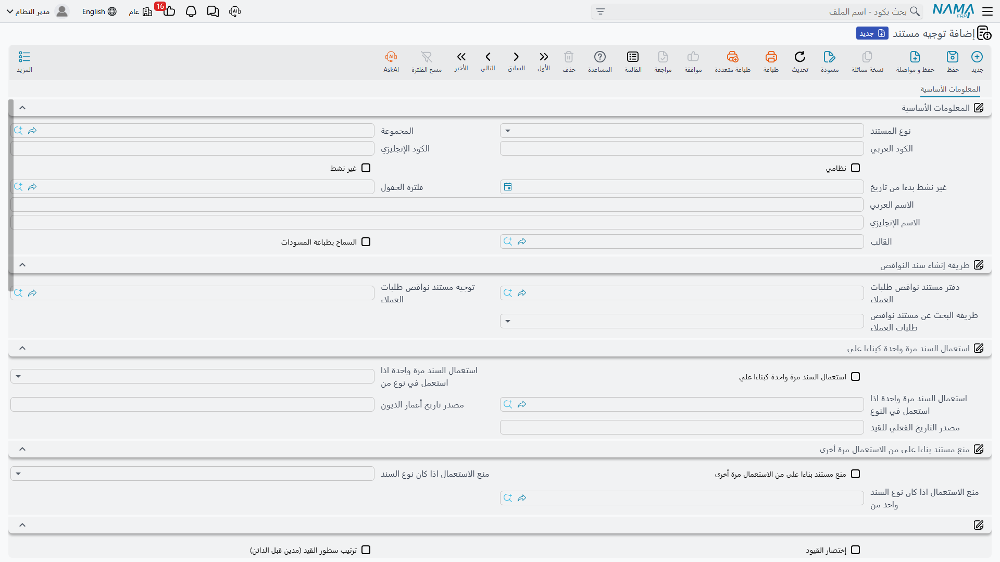

# توجيهات مستندات المشاريع

::: info الترخيص
كل توجيه مذكور في هذه الصفحة يخص أحد مستندات ادارة المشاريع (ECPA) ويحتاج كود الترخيص `ecpa`.
:::

المستند في نما يعرف **ماذا** حدث: 38 ساعة على مهمة، أو 1,500 مصروف سفر، أو أتعاب بقيمة 10,860. لكنه
لا يعرف **أي الحسابات** يجب أن يمسّها ذلك. وهذه وظيفة توجيه المستند: سجل إعداد صغير يُربط بدفتر
المستند، ويقول «حين يُعتمد مستند من هذا النوع، اجعل هذا مديناً وذاك دائناً».

تسلّم وحدة ادارة المشاريع سبعة أنواع من المستندات تحمل توجيهاً، وتتقاسم فيما بينها خمسة تعريفات:
الفاتورة والمردود يستخدمان تعريفاً واحداً، وتنفيذ المهام وطلب تنفيذ المهام يستخدمان تعريفاً واحداً.
هذه الصفحة جولة في تلك الشاشات الخمس: لماذا وُجدت كل واحدة، وما الذي تُنشئه في دفتر الأستاذ،
وأي الخيارات القليلة تغيّر سلوك الوحدة فعلاً. وهي عن قصد ليست قائمة حقول — فشاشة توجيه الفاتورة وحدها تعرض نحو
مئتي مدخل، ولم ينتفع أحد قط بجدول من مئتي سطر.

## المستندات السبعة والتوجيهات الخمسة

| المستند | شاشة التوجيه | ما يحدده التوجيه |
|---|---|---|
| [فاتورة المشروع](/ar/modules/ecpa/invoicing/ecpa-project-invoice) | التأثير — وهي الشاشة الكبرى | كل حساب يمسّه قيد الفوترة، إضافة إلى سلوك أزرار التجميع |
| [مردود فاتورة المشاريع](/ar/modules/ecpa/invoicing/ecpa-project-returns) | **التعريف نفسه** المستخدم في الفاتورة | الشيء نفسه، لكن على سجل توجيه مستقل |
| [سند مصروف](/ar/modules/ecpa/expenses/ecpa-project-expenses) | التأثير — أربعة جوانب حسابية | الحسابات التي يستخدمها قيد المصروف، مقسومة حسب «مصروف داخلى» |
| [طلب مصروف](/ar/modules/ecpa/expenses/ecpa-project-expenses) | التأثير — أربعة جوانب بالشكل نفسه | الشيء نفسه، للمطالبة ذاتها |
| [تنفيذ مهام](/ar/modules/ecpa/task-execution/ecpa-timesheets) | الإعدادات | قيد تكلفة العمالة، وطلب المصروف المُولَّد، وإنشاء الاجراءات |
| [طلب تنفيذ مهام](/ar/modules/ecpa/task-execution/ecpa-timesheets) | **التعريف نفسه** المستخدم في تنفيذ المهام | الشيء نفسه |
| [موافقة على تنفيذ مهمة](/ar/modules/ecpa/task-execution/ecpa-timesheet-approval) | الإعدادات — خيار واحد | هل يُعاد إصدار التأثير المحاسبي لسندات التنفيذ بعد الموافقة |

أما بقية مستندات الوحدة — عرض أسعار المشروع، ومرحلة المشروع، وتمديد مرحلة المشروع — فلا توجيه خاصاً
لها، ولا ينشئ أي منها قيداً في الأستاذ العام.

## أين يوجد كود التوجيه واسمه

هناك حقيقة بنيوية تربك الجميع، فلتأتِ قبل كل شيء.

**خمس من شاشات التوجيه هذه ليس فيها صفحة معلومات أساسية.** افتح توجيه فاتورة المشروع، أو مردود
فاتورة المشاريع، أو سند المصروف، أو طلب المصروف، أو الموافقة على تنفيذ المهمة، فستجد نفسك مباشرة في
صفحة التأثير المحاسبي: لا كود، ولا اسم، ولا علامة «غير نشط»، ولا قالب، ولا خيارات طباعة في أي مكان
من الشاشة.

هذا لا يعني أن التوجيه بلا كود ولا اسم، بل يعني أن هذه البيانات تُضبط من **شاشة قائمة التوجيهات** لا
من داخل السجل. أنشئ التوجيه من القائمة، وسمِّه هناك، وعطّله هناك حين يُستغنى عنه. أما داخل الشاشة
فأنت تضبط الحسابات والسلوك فقط.

ويستثنى من ذلك توجيه تنفيذ المهام / طلب تنفيذ المهام: فهو **يحمل** مجموعة المعلومات الأساسية
المعتادة، ويمكن تسميته وتعطيله من شاشته نفسها.

## ما هو الجانب المحاسبي

تكاد كل شاشة توجيه في هذه الوحدة أن تكون مبنية من وحدة واحدة متكررة: **الجانب المحاسبي**. والجانب
نموذج صغير يجيب عن سؤال واحد — *أي حساب يجب أن يمسّه هذا النصف من القيد؟* — وهو النموذج نفسه أينما
ظهر.

وأهم ما فيه:

- **الجانب المحاسبي (Side Configuration)** — سجل الجانب الذي يعطي القيد شكله.
- **نوع مصدر الحساب** و**الحساب** — إما حساب ثابت تختاره هنا، وإما تعليمة بقراءة الحساب من حقل مرجع.
- **نوع كيان مصدر الحساب** و**معرّف حقل مصدر الحساب** — يُستخدمان حين يُقرأ الحساب من مرجع.
- **نوع الحساب الفرعي (الذمة)** — الأستاذ المساعد الذي يُقيَّد عليه هذا الجانب.
- **حساب الحقيبة** و**عملة الحساب من الحقيبة** — لمن يحتفظ بالحسابات في حقيبة على العميل أو المشروع
  أو الموظف.
- **البيان** و**البيان 2**، كل منهما كقالب أو كاستعلام، وهما ما يضع وصفاً مقروءاً على سطر القيد.

وإذا كانت الإعدادات العامة مفعّلة لمصادر المحددات والمراجع في التوجيهات، فسينمو كل جانب ليحمل ثلاثي
مصدر لكل محدد مفعّل (القطاع، الفرع، الإدارة، المجموعة التحليلية، السجل، والمراجع 1–3). ولهذا فإن عدد
الحقول في هذه الشاشات غير ثابت، وقد تبدو شاشة توجيه الفاتورة في تركيب ما أضخم منها في تركيب آخر.

وثمة قاعدتان تسريان على كل جانب في كل شاشة من هذه الشاشات:

1. **الزوج الناقص لا ينشئ شيئاً.** إذا تُرك الجانب المدين أو الدائن في أي كتلة بلا ضبط، فلن تنتج تلك
   الكتلة أي سطر قيد، وبلا رسالة. أي أن التوجيه ينشئ بالضبط ما ضبطته له، لا أكثر ولا أقل. وهذه هي
   الوسيلة التي تُطفئ بها قيوداً كاملة.
2. **مصادر الذمم المتاحة تختلف باختلاف المستند.** الفاتورة والمردود يتيحان موظف السطر، وعميل الرأس،
   ومشروع السطر. وتوجيها المصروف يتيحان الموظف والعميل والمشروع وذمة المستند وذمة السطر — و*ذمة
   السطر* فيهما هي حساب بند المصروف نفسه، وهذا ما يجعل كتالوج بنود المصروف هو المحرّك الحقيقي
   لقيد المصاريف. أما توجيه التنفيذ فيتيح موظف السطر، وإدارة ذلك الموظف، ومشروع السطر، إضافة إلى
   ذمة المستند وذمة السطر.

## توجيه فاتورة المشروع والمردود

هذه أكبر شاشة في الوحدة، وتستحق أن تُخطَّط على الورق أولاً. لها صفحة واحدة اسمها **التأثير**، وكل ما
فيها يقع تحت واحد من ثلاثة أغراض: الحسابات التي يستخدمها القيد، وكيفية توجيه الخصومات والضرائب،
وسلوك أزرار التجميع.

### الحسابات التي تستخدمها الفاتورة

اقرأ الصفحة كقائمة بالقيود التي **قد** ينشئها المستند. كل قيد جانب مدين وجانب دائن، ولا ينتج شيئاً
حتى يُملأ النصفان.

| القيد | القيمة المقيَّدة | متى يُنتَج |
|---|---|---|
| **القيد الرئيسي** | القيمة الفعلية لكل سطر | دائماً. وجانباه مطلوبان — لا يمكن حفظ التوجيه بدونهما. وهو قيد المدينين مقابل الإيراد |
| **قيد المصروف الخارجي** | قيمة سطور المصروف الخارجية (القابلة للفوترة) التي وراء سطر الفاتورة | فقط عند تفعيل *إنشاء التأثير الحسابي للمصاريف الخارجية*، وفقط على السطور التي بناها زر تجميع — فالسطر المكتوب باليد ليس وراءه سطور مطالبة |
| **قيد خصم الرأس** | الخصم المكتوب في رأس المستند | فقط عند ضبط جانبيه. ويُقيَّد مرة واحدة على أول سطر في المستند |
| **قيود الضرائب الأربعة** | قيم الضريبة 1 و2 و3 و4 في كل سطر | لكل ضريبة من الضرائب الأربع جانب مدين وجانب دائن خاص بها في هذه الشاشة |
| **قيود خصومات السطر الأربعة** | قيم الخصم 1 و2 و3 و4 في كل سطر | تُضبط بطريقة مختلفة — انظر أدناه |
| **قيد القيمة المحسوبة** | القيمة المحسوبة لكل سطر | فقط للسطور التي بلا بند مصروف، وفقط عند ضبط الجانبين. وهي الكتلة التي تستخدمها الشركات للاعتراف بتكلفة العمل بجوار الإيراد |

وكتلتا خصومات السطر والقيمة المحسوبة استثناء: فبدلاً من جانب حسابي كامل يُملأ في مكانه، كل منهما
**مرجع إلى سجل «إعداد الجانب المحاسبي»** — حقل واحد لا اثنا عشر. لذلك، قبل أن تستطيع توجيه خصم
السطر 1 إلى أي مكان، يجب أن ينشئ أحدهم سجل الجانب المحاسبي ذاك، ثم تختاره هنا. أما بقية الجوانب في
الشاشة فتُملأ في مكانها.

::: tip خطّط لتوجيه المردود في الوقت نفسه
يستخدم مردود فاتورة المشاريع هذا التعريف نفسه، على سجل توجيه خاص به، وهو ينشئ قيده في **الاتجاه
نفسه** الذي تنشئ به الفاتورة قيدها. اضبط توجيه المردود كمرآة لتوجيه الفاتورة — بعكس المدين والدائن في
كل كتلة تستخدمها — وإلا فإن إشعار الدائن سيُحمّل العميل من جديد. راجع
[مردود فاتورة المشاريع](/ar/modules/ecpa/invoicing/ecpa-project-returns).
:::

### الخياران اللذان يغيّران ما يُقيَّد

علامتان في هذه الشاشة تقرران هل تُقيَّد السطور ذات بند المصروف مرة، أم مرتين، أم عبر القيد الخارجي
وحده. وهما تعملان كزوج، والثانية لا تفعل شيئاً ما لم تكن الأولى مفعّلة:

| إنشاء التأثير الحسابي للمصاريف الخارجية | إنشاء تأثير محاسبي للسطور التي ليس لها بند مصروف | ما تقيّده الفاتورة المعتمَدة |
|---|---|---|
| غير مفعّل | أياً كان | القيد الرئيسي لكل سطر، وبلا قيد مصروف خارجي |
| **مفعّل** | غير مفعّل | القيد الرئيسي لكل سطر، **إضافة إلى** قيد مصروف خارجي بقيمة المطالبة التي وراء كل سطر. فالسطر الحامل لبند مصروف يُقيَّد مرتين: مرة بقيمته المفوترة ومرة بقيمة مصروفه |
| **مفعّل** | **مفعّل** | تُستبعد السطور الحاملة لبند مصروف من القيد الرئيسي وتظهر في قيد المصروف الخارجي وحده، بينما تُقيَّد السطور التي بلا بند مصروف بالطريقة المعتادة. وهذه هي التركيبة التي تريدها أغلب الشركات |

والصف الأوسط هو ما ينبغي تجنبه ما لم تعرف سبب رغبتك فيه. فإذا كان قصدك أن «المصاريف المُعاد فوترتها
تذهب إلى حسابات استرداد المصروفات، والأتعاب وحدها تذهب إلى الإيراد»، ففعّل الخيارين معاً.

### الخياران اللذان يغيّران سلوك التجميع

آخر خيارين في الشاشة لا يمسّان دفتر الأستاذ إطلاقاً، وإنما يغيّران ما تضعه أزرار التجميع في الجدول عند
الضغط عليها. وهذا يجعلهما مؤثرين بهدوء، كما يعني أن تغييرهما لا يمسّ أي مستند محفوظ من قبل.

**الأخذ في الاعتبار التاريخ الفعلي عند تجميع الفواتير.** عند تفعيله، لا تجمع أزرار *تجميع الأوقات*
و*تجميع المصاريف* و*تجميع الأوقات والمصروفات* إلا سطور المصدر المؤرخة في تاريخ الفاتورة الفعلي أو
قبله. وعند تركه، يتجاهل التجميع التواريخ تماماً ويأخذ كل سطر غير مفوتر ضمن مدى أكواد المشاريع، بما
في ذلك عمل مؤرخ بعد الفاتورة. وهذا هو الخيار الذي يجعل فوترة نهاية الشهر تنضبط: فمعه، لا تستطيع
فاتورة بتاريخ 31 يناير أن تفوتر تنفيذات فبراير بالخطأ. ومن الأفضل لأغلب الشركات تفعيله.

**طريقة تجميع القيمة المحسوبة.** يحكم هذا الخيار عمود *القيمة المحسوبة*، وهو الرقم الإعلامي الذي
يجلس بجوار المبلغ المفوتر. اترك الخيار فارغاً فتكرر القيمة المحسوبة إجمالي التجميع نفسه، وهو ما لا
يفيد بشيء. أما إذا ملأته — بأي من قيمتيه — فستُقرأ القيمة المحسوبة من قراءة منفصلة لتكلفة التنفيذ
لذلك المشروع وتلك المهمة، فيُظهر العمودان عمداً رقمين مختلفين: ما كلّفك العمل، بجوار ما تطالب به.

ثم يقرر الاختيار بين القيمتين أي سطور التنفيذ تُحتسب:

| القيمة | الأثر |
|---|---|
| **تجميع القيم الموافق عليها فقط** | لا تُغذّي التكلفة المحسوبة إلا سطور التنفيذ المعتمدة — وفي زر *تجميع التنفيذات* لا تُسحب إلى جدول التنفيذات إلا السطور المعتمدة أصلاً |
| **تجميع الكل** | تُحتسب كل سطور التنفيذ، معتمدة كانت أو غير معتمدة |

والشركة التي تُشغّل خطوة موافقة حقيقية ينبغي أن تختار *تجميع القيم الموافق عليها فقط*، فهو أيضاً ما
يُبقي الساعات غير المعتمدة خارج جدول التنفيذات.

## توجيها سند المصروف وطلب المصروف

هاتان أسهل شاشتين في الوحدة. لكل منهما صفحة واحدة و**أربعة جوانب حسابية**، وهما بالشكل نفسه:

| زوج الجوانب | ينطبق على |
|---|---|
| **مدين داخلي / دائن داخلي** | سطور المطالبة المؤشَّر فيها **مصروف داخلى** — أي التكاليف التي تتحملها الشركة |
| **مدين خارجي / دائن خارجي** | سطور المطالبة غير المؤشَّر فيها — أي التكاليف التي سيُعاد تحميلها على العميل |

هذه هي الشاشة كلها. فعلامة واحدة على سطر المطالبة تختار أي زوج يُستخدم، ولهذا تعامل صفحة
[مصاريف المشروع](/ar/modules/ecpa/expenses/ecpa-project-expenses) حقل «مصروف داخلى» بوصفه الحقل الذي
يجب ضبطه قبل أي شيء آخر.

والجوانب الأربعة كلها مقروءة فعلاً، ويرفض التوجيه الحفظ ما لم يحمل الزوجان المضبوطان حسابات. وفي
كلا التوجيهين تعيد *ذمة السطر* حساب بند المصروف نفسه، فالضبط المعتاد هو: حساب المصروف من ذمة السطر
في جانب، وحساب الموظف أو المورد الدائن في الجانب الآخر.

## توجيه تنفيذ المهام وطلب تنفيذ المهام

تعريف واحد يخدم المستندين، في صفحة عنوانها **الإعدادات**. وخلافاً للتوجيهات السابقة يبدأ بمجموعة
المعلومات الأساسية المعتادة، فهذا التوجيه يُسمّى ويُعطَّل من شاشته نفسها.

وما بقي منه زوج حسابي واحد وأربعة إعدادات:

- **مدين / دائن** — قيد تكلفة العمالة. كل سطر تنفيذ معتمَد يصبح سطر قيد بقيمة إجمالي تكلفة السطر.
  ولا ينشئ المستند قيداً إلا إذا ضُبط **الجانبان** معاً؛ فإن تُرك أحدهما فارغاً لم يقيّد التنفيذ
  شيئاً. والمعتاد أن يكون المدين حساب أعمال تحت التنفيذ أو تكلفة عمالة، والدائن حساب مستحقات رواتب.
- **دفتر المستند** و**توجيه المستند** (مجموعة الإنشاء التلقائي) — الدفتر والتوجيه المستخدمان **لطلب
  المصروف الذي يولّده التنفيذ** حين تحمل سطوره بنود مصروف. املأهما إذا كانت شركتك تسمح للمهندس
  بتسجيل مصروفاته على السند نفسه الذي يسجّل فيه ساعاته، واتركهما فارغين وإلا فلا مكان يُولَّد فيه شيء.
- **مجموعة الاجراءات** — سمِّ مجموعة هنا، فيُنشئ كل سطر تنفيذ يحمل نصاً في «الاجراء القادم» سجل اجراء
  في تلك المجموعة عند اعتماد المستند، حاملاً الموظف والعميل والمشروع والمهمة. واتركها فارغة فلا
  تُنشأ اجراءات إطلاقاً.
- **عمل تأثير محاسبي للسطور الموافق عليها فقط** — عند تفعيله لا تتحول إلى سطور قيد إلا السطور
  المعتمدة. وهذا نصف ترتيب «التكلفة لا تدخل دفتر الأستاذ إلا بعد اعتماد المدير»، والنصف الآخر هو توجيه
  الموافقة أدناه.
- **الأخذ في الاعتبار الوقت المسجل مع الحفظ** — عند تفعيله، يحتسب الفحص الذي يقارن ساعات المنفّذ
  بالساعات المخططة أيضاً الساعات المسجلة التي لم تُعتمد بعد، فيصل التنبيه أبكر.

## توجيه الموافقة على تنفيذ مهمة

صفحة واحدة وخيار واحد: **إعادة اصدار التأثير المحاسبي لسندات التنفيذ**.

شاشة صغيرة وأثر حقيقي. فعند اعتماد مستند الموافقة على تنفيذ مهمة، تُكتب نتائج الموافقة على سندات
التنفيذ التي يغطيها. ومع تفعيل هذا الخيار، يُعاد إصدار التأثير المحاسبي لكل سند تنفيذ متأثر. وهذا
تحديداً ما يجعل خيار *عمل تأثير محاسبي للسطور الموافق عليها فقط* في توجيه التنفيذ يُنتج شيئاً: فسند
التنفيذ اعتُمد قبل الموافقة ولم يقيّد شيئاً، والموافقة هي التي ترسل القيد.

فإن كنت تعمل بمحاسبة السطور المعتمدة فقط، فعّل هذا الخيار. وإن لم تكن، فاتركه.

## تركيب مجموعة توجيهات متكاملة

خذ المكتب الهندسي المستخدم في هذا القسم كله: يفوتر أتعاباً، ويعيد تحميل السفر والطباعة، ويشغّل خطوة
موافقة على الساعات، ويقيّد تكلفة العمالة على الأعمال تحت التنفيذ. مجموعة التوجيهات الصالحة له تبدو
هكذا.

**توجيه الفاتورة** — القيد الرئيسي: مدين حساب العميل المدين، دائن إيراد أتعاب المشروع. زوج الضريبة 1:
مدين ضريبة مستحقة، دائن ضريبة مستحقة السداد. زوج خصم السطر 1: سجل جانب محاسبي يشير إلى «الخصم
المسموح به» مقابل العميل. وقيد المصروف الخارجي مضبوط، مع تفعيل *إنشاء التأثير الحسابي للمصاريف
الخارجية* و*إنشاء تأثير محاسبي للسطور التي ليس لها بند مصروف* معاً، لتذهب المصاريف المُعاد فوترتها
إلى حساب استرداد المصروفات بدلاً من الإيراد. مع تفعيل *الأخذ في الاعتبار التاريخ الفعلي*، وضبط
*طريقة تجميع القيمة المحسوبة* على **تجميع القيم الموافق عليها فقط**.

**توجيه المردود** — الشاشة نفسها، مملوءة كمرآة: مدين مردودات المبيعات، دائن حساب العميل المدين،
وأزواج الضرائب والخصومات معكوسة بالطريقة نفسها. ويُربط بدفتر المردود الخاص به.

**توجيها طلب المصروف وسند المصروف** — الزوج الخارجي: مدين حساب المصروف الآتي من ذمة السطر، دائن حساب
الموظف الدائن. والزوج الداخلي: مدين حساب أعباء داخلية، دائن الحساب الدائن نفسه. والضبط نفسه في
التوجيهين، حتى تُقيَّد المطالبة بالطريقة نفسها سواء كانت تُطلب أو تُصرف.

**توجيه التنفيذ** — مدين أعمال تحت التنفيذ، دائن مستحقات رواتب، مع تفعيل *عمل تأثير محاسبي للسطور
الموافق عليها فقط*، ودفتر وتوجيه إنشاء يشيران إلى دفتر طلبات المصروف الذي تستخدمه الشركة للمطالبات
المسجلة على سندات التنفيذ، ومجموعة اجراءات مسماة حتى تتحول ملاحظات المتابعة إلى سجلات حقيقية.

**توجيه الموافقة** — مع تفعيل *إعادة اصدار التأثير المحاسبي لسندات التنفيذ*، لتصل الساعات المعتمدة
إلى دفتر الأستاذ لحظة اعتماد المدير.

وقبل تشغيل الوحدة فعلياً، اعتمد مستنداً واحداً من كل نوع على دفتر تجريبي واقرأ القيود الناتجة. فكل
شاشة من هذه الشاشات تقيّد ما ضبطته أنت فقط، وبصمت، فالقيد الذي لا يظهر أرجح أن يكون زوجاً نصفه
فارغ لا خللاً في النظام.
