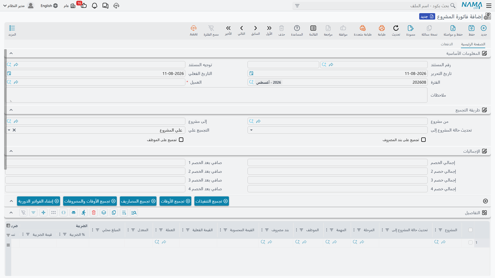
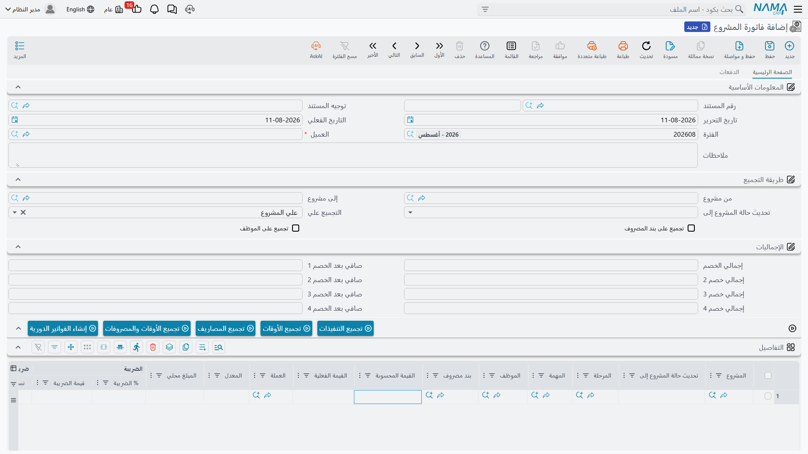
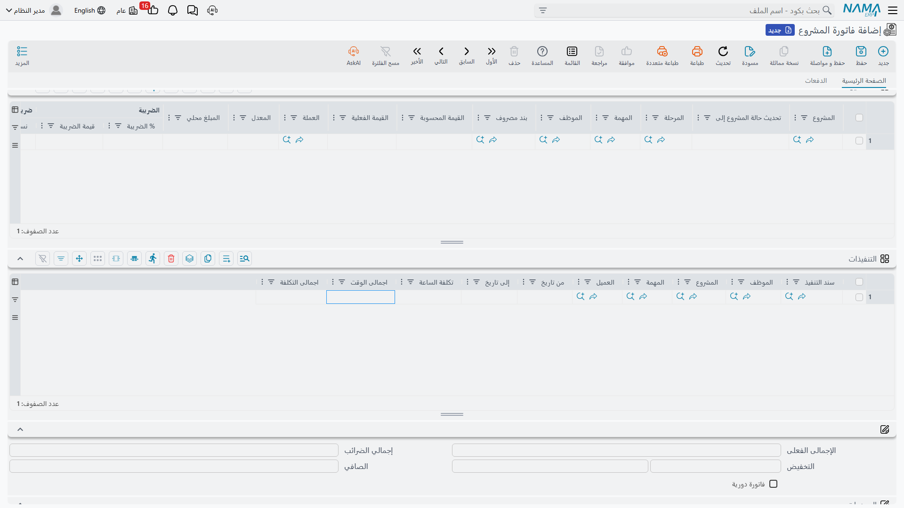

# فاتورة المشروع

::: info الترخيص المطلوب
`ecpa` — كود واحد للوحدة كلها، ولا توجد تراخيص فرعية.
:::

فاتورة المشروع هي الفاتورة التي يرسلها المكتب إلى عميله عن عمل تم إنجازه بالفعل. وهي لا تشبه فاتورة
البضاعة في شيء: لا أصناف ولا كميات. كل سطر فيها هو **مشروع واحد** — أو مهمة واحدة أو مرحلة واحدة —
أمامه مبلغ.

وهذا المبلغ وحده هو موضوع هذه الصفحة. ففي أغلب الأحوال لا يكتبه أحد: تضغط أحد أزرار **التجميع**،
فيجمع النظام الأوقات الموافق عليها والمصاريف القابلة للتحميل التي لم تُفوتَر بعد، ويسعّرها، ويجمّعها
بالطريقة التي طلبتها، ويضعها في الجدول. وفهم **أي زر يقرأ أي بيانات، وكيف يحوّلها إلى مال** هو الفرق
بين فاتورة صحيحة وفاتورة خاطئة في صمت.

تجد الشاشة في **ادارة المشاريع ← الفاتورة ← فاتورة المشروع**.



## قيمتان في كل سطر، والفوترة على واحدة منهما فقط

يحمل كل سطر في الفاتورة مبلغين، والتفرقة بينهما تسري على كل ما يلي:

- **القيمة المحسوبة** — ما توصّل إليه النظام. وهي للقراءة فقط في الجدول ولا يمكنك الكتابة فيها.
  اعتبرها اقتراح أزرار التجميع.
- **القيمة الفعلية** — **وهي المبلغ الذي تجري الفوترة عليه فعلاً.** كل إجمالي في المستند، وكل ضريبة،
  وكل خصم، وكل قيد محاسبي يُبنى على هذا الرقم، ولن يُعتمد المستند ما دام في أي سطر قيمة فعلية بصفر.



## كيف يصل المبلغ إلى السطر

هناك خمس طرق تنشأ بها **القيمة الفعلية**، وطريقة سادسة تنشئ فواتير كاملة لا سطوراً. والقراءة الصحيحة
لهذا الجزء أن تعتبره اختياراً: *كيف ملأت هذه الفاتورة؟* — لأن الإجابة هي التي تحدد معنى المبلغ ومصدره.

| كيف ملأتها | من أين يأتي المال | تملأ القيمة الفعلية؟ |
|---|---|---|
| كتبتها بنفسك | منك | نعم |
| **تجميع الأوقات** | الساعات الموافق عليها × أجر الموظف في المهمة × معدل عمل اليوم العادي | نعم |
| **تجميع المصاريف** | قيمة سطور طلبات المصروف القابلة للتحميل على العميل | نعم |
| **تجميع الأوقات والمصروفات** | الاثنان معاً في عملية واحدة | نعم |
| **تجميع التنفيذات** | تكلفة سطور تنفيذ المهام نفسها | **لا** — يقترح فقط وأنت تسعّر |
| **إنشاء الفواتير الدورية** | قيمة الفوترة الدورية المحفوظة على المشروع | نعم، على مستندات جديدة |

ولا توجد — عن قصد — **طريقة تفوتر بنسبة الإنجاز ولا طريقة تفوتر بقيمة المرحلة**. فالمرحلة في سطر
الفاتورة وصف ومفتاح تجميع، وقيمتها الخاصة لا تُقرأ أبداً. كذلك لا يغذّي جدول دفعات عرض الأسعار أي شيء
هنا؛ فإن كنت تحاسب بالأقساط كتبت قيمة القسط بنفسك.

### أن تكتب المبلغ بنفسك

طريقة متاحة دائماً، وهي الأصل في كل ما لا تعرفه أزرار التجميع. أضف سطراً، واختر **المشروع** (تعرض
القائمة مشاريع عميل الفاتورة غير المنتهية)، وضيّق السطر إن شئت بـ **المرحلة** أو **المهمة** أو
**الموظف** أو **بند المصروف**، ثم اكتب **القيمة الفعلية**. لا شيء في المستند يمنع ذلك، ولا شيء يراجعه.

### إعداد عملية التجميع

أزرار التجميع الأربعة كلها تقرأ نفس مجموعة الحقول في الرأس، واسمها **طريقة التجميع**. املأها قبل أن
تضغط أي زر:

| الحقل | ماذا يفعل |
|---|---|
| **العميل** | إلزامي — لا ينظر التجميع إلا في أعمال هذا العميل |
| **من مشروع** / **إلى مشروع** | **مدى أكواد مشاريع** لا قيمتين في السطور. كل ما يجده التجميع يجب أن يقع داخله، ويجب ملء أحدهما على الأقل |
| **التجميع علي** | كيف تُحزَم السطور المجمَّعة في سطور فاتورة: **علي المشروع** (الافتراضي) أو **علي المهمة** أو **علي المرحلة** |
| **تجميع على بند المصروف** | تقسيم إضافي للحُزم حسب بند المصروف |
| **تجميع على الموظف** | تقسيم إضافي للحُزم حسب الموظف |

فإن كان العميل أو طريقة التجميع أو حقلا المشروع فارغة، توقف الزر وأخبرك بالناقص. وعند الاعتماد، إن كان
أحد مشروعي المدى يخص عميلاً غير عميل الرأس، رفض المستند الاعتماد برسالة تذكر المشروع.

### تجميع الأوقات

يجمع **سطور الأوقات الموافق عليها** — أي سطور مستندات
[الموافقة على أوقات التنفيذ](/ar/modules/ecpa/task-execution/ecpa-timesheet-approval) المعتمدة — التي
لم تأخذها فاتورة من قبل ويقع كود مشروعها داخل المدى.

ويسعّرها هكذا:

```
قيمة السطر = أجر الساعة للموظف في جدول منفّذي المهمة
           × الساعات الموافق عليها
           × معدل عمل اليوم العادي (من إعدادات الوحدة)
```

ولهذا نتيجتان تقابلهما عملياً. إن لم يكن الموظف **مدرجاً في جدول منفّذي المهمة** فلا أجر يُعثر عليه
ويخرج السطر بقيمة **صفر**. وإن تُرك **معدل عمل اليوم العادي** فارغاً في
[شاشة الإعدادات](/ar/modules/ecpa/ecpa-configuration) خرجت كل سطور الوقت المجمَّعة بصفر أيضاً — وهذا
هو السبب الأشهر لفاتورة تجمع سطوراً بلا مبالغ.

### تجميع المصاريف

يجمع **سطور طلبات مصروف المشروع** التي لم تأخذها فاتورة من قبل، ويقع كود مشروعها داخل المدى، وتأتي من
طلب معتمد (غير مسودة). والمبلغ هو القيمة المكتوبة في سطر طلب المصروف، ولا شيء يعيد تسعيرها.

و**المصاريف الداخلية لا تُجمَّع أبداً**: فالسطر الذي عليه علامة *مصروف داخلى* تكلفة يتحملها المكتب،
والسطور الخارجية وحدها هي القابلة للتحميل على العميل. هذه العلامة وحدها هي قرار الفوترة كله في جانب
المصاريف، وهي مشروحة بالكامل في [مصاريف المشروع](/ar/modules/ecpa/expenses/ecpa-project-expenses).

### تجميع الأوقات والمصروفات

العمليتان في مرور واحد وفي مجموعة سطور واحدة. وهذا هو الزر الذي تستخدمه أغلب المكاتب فعلاً، لأن
العمالة الموافق عليها والمصاريف المُحمَّلة تذهبان عادة في فاتورة واحدة.

### كيف تتحول السطور المجمَّعة إلى سطور فاتورة

أياً كان الزر الذي ضغطته من الثلاثة، تُحزَم السطور التي عُثر عليها ويصبح كل حزمة سطر فاتورة واحداً،
و**القيمة الفعلية = إجمالي الحزمة**:

- مع **التجميع علي = علي المشروع**: سطر لكل مشروع، ويُفرَّغ عمودا المهمة والمرحلة لأنهما لم يعودا
  يصفان السطر كله؛
- مع **علي المهمة**: سطر لكل مهمة؛
- مع **علي المرحلة**: سطر لكل مرحلة، ويُفرَّغ عمودا المهمة **والمشروع**، لأن حزمة المرحلة ليست عن
  مهمة بعينها؛
- بوضع علامة **تجميع على بند المصروف** تُقسَّم كل حزمة مرة أخرى حسب بند المصروف، وبدونها يُفرَّغ عمود
  بند المصروف؛
- بوضع علامة **تجميع على الموظف** تُقسَّم كل حزمة مرة أخرى حسب الموظف.

ويحتفظ كل سطر بذاكرة دقيقة للسطور المصدرية التي ابتلعها. وهذه الذاكرة هي التي تمنع فوترة نفس العمل
مرتين، وهي أيضاً ما يقرؤه خيار تحميل المصاريف في التوجيه وقت الاعتماد.

وتُؤخذ عملة السطر ومعدله من المشروع — من العملة الموجودة في حافظة حسابات المشروع — وتُقرَّب المبالغ
إلى منزلتين عشريتين. ثم يجمع حقل **الإجمالى الفعلى** في الرأس القيم الفعلية للسطور.

### تجميع التنفيذات

طريق مختلف ومستوى تفصيل مختلف. فبدلاً من الساعات الموافق عليها والمجمَّعة يقرأ **سطور تنفيذ المهام
المفردة** التي لم تُفوتَر قط، ويسعّرها بـ **اجمالى التكلفة** الخاص بالسطر — أي تكلفة تلك الساعة
المشتقة من الرواتب، لا سعر بيع.

وهو يسألك عن فترة تاريخية، ويأخذ فترة المستند المالية بدلاً منها كلما كان للمستند فترة. ثم يُنسخ كل
سطر تنفيذ مطابق إلى جدول **التنفيذات** أسفل الشاشة — أي سند تنفيذ، وأي موظف، وأي مهمة، والساعات
وتكلفة الساعة — كسجل متابعة للقراءة فقط لما جرى التقاطه.



ثم ينشئ سطر فاتورة واحداً لكل مشروع، ويضع مجموع تكلفة تنفيذات ذلك المشروع في **القيمة المحسوبة**،
ويترك **القيمة الفعلية فارغة**. وهذا مقصود: الزر يقترح ما كلّفه العمل، وأنت تقرر بكم تحاسب عليه. ولأن
السطر الذي لا قيمة فعلية له لا يُعتمد، فإن الفاتورة المبنية على *تجميع التنفيذات* وحده تُستكمل دائماً
باليد.

## العمل الذي سبقت فوترته

بمجرد أن تأخذ فاتورة سطراً مصدرياً، لا يُجمَّع هذا السطر مرة أخرى. وتوضع العلامة عند **اعتماد**
الفاتورة لا عند ضغط الزر، وتُرفع إذا ألغيت اعتماد المستند.

- **تجميع الأوقات / المصاريف / الأوقات والمصروفات** يضع علامة «تمت المعالجة» على سطور الموافقة وسطور
  طلبات المصروف التي استهلكها، فتختفي من كل عمليات التجميع التالية.
- **تجميع التنفيذات** يختم سطور تنفيذ المهام بمرجع هذه الفاتورة.

::: warning اختر طريق تجميع واحداً والتزم به
عائلتا العلامات لا ترى إحداهما الأخرى. *تجميع الأوقات* لا ينظر إلا إلى علامة المعالجة على سطور
الموافقة، و*تجميع التنفيذات* لا ينظر إلا إلى ختم الفاتورة على سطور التنفيذ. و**نفس الساعة المنفَّذة**
موجودة في الموضعين: مرة كسطر تنفيذ، ومرة داخل سطر موافقة.

ولذلك فإن المكتب الذي يستخدم *تجميع التنفيذات* في فاتورة و*تجميع الأوقات والمصروفات* في أخرى سيفوتر
نفس الساعات مرتين، ولن ينبّهه أي من المستندين. اختر الطريق الذي يفوتر به مكتبك واستخدمه وحده.
:::

وهناك أمر ثانٍ يخص *تجميع التنفيذات*. فعند اعتماد الفاتورة تُوضع العلامة على **كل سطور سند التنفيذ
المجمَّع التي تشترك في نفس المشروع ونفس المهمة**، بما فيها السطور التي وقعت خارج الفترة التي اخترتها
ولم تُفوتَر أصلاً. وتخرج تلك الساعات من دائرة الفوترة نهائياً. فإن كنت تفوتر بالتنفيذات، فاجمع فترات
كاملة لا فترات جزئية.

## الخصومات والضرائب في السطر

يحتمل كل سطر أربعة خصومات وأربع ضرائب، وتُطبَّق بترتيب ثابت.

**الخصومات الأربعة متتالية** — كل خصم يُحسب على ما تبقّى بعد الذي قبله:

```
الصافي بعد الخصم 1 = القيمة الفعلية − الخصم 1
الصافي بعد الخصم 2 = الصافي بعد الخصم 1 − الخصم 2
الصافي بعد الخصم 3 = الصافي بعد الخصم 2 − الخصم 3
الصافي بعد الخصم 4 = الصافي بعد الخصم 3 − الخصم 4
```

ويمكن إدخال كل خصم كقيمة أو كنسبة من الرصيد الجاري فوقه.

أما **الضرائب الأربع فلا تتتالى**: فكلها تُحسب على نفس الأساس، وهو المبلغ المتبقي بعد الخصومات
الأربعة، فلا تُحسب الضريبة 2 على الضريبة 1 أبداً:

```
الضريبة ن = الصافي بعد الخصم 4 × نسبة الضريبة ن
الصافي   = الصافي بعد الخصم 4 + الضريبة 1 + 2 + 3 + 4
```

وفوق السطور يوجد **تخفيض في الرأس** واحد، يُدخَل كنسبة أو كقيمة على الإجمالى الفعلى للمستند. ويكون
**الصافي** في الرأس هو مجموع صوافي السطور ناقصاً هذا التخفيض.

وبتطبيق ذلك على مثالنا: سطر بقيمة **10,860.00**، وخصم أول 5 % قيمته **543.00**، وضريبة 1 بنسبة 15 %:

```
الصافي بعد الخصم 1 = 10,860.00 − 543.00 = 10,317.00
الضريبة 1          = 10,317.00 × 15 %   =  1,547.55
الصافي             = 10,317.00 + 1,547.55 = 11,864.55
```

## اعتماد الفاتورة

الحفظ فوري. أما الاعتماد فيرفع **طلب أعمال** **تجري معالجته في الخلفية** وينتج عنه القيد في دفتر
الأستاذ، فيظهر القيد بعد لحظة لا في لحظة الضغط. وإن فشل وجدته في شاشة **طلبات الأعمال**، حيث تصفّي
بحالة المعالجة وتستخدم **المزيد ← إعادة المعالجة / إعادة الاعتماد**.

وما يُقيَّد وفي أي حسابات أمر يرجع بالكامل إلى **توجيه المستند** الموضوع على الفاتورة. فالتوجيه
هو المكان الذي تحدد فيه الحساب المدين للمبلغ والحساب الدائن له، وهو يحمل أزواج حسابات خاصة بكل ضريبة
من الأربع، وكل خصم من خصومات السطر الأربعة، وتخفيض الرأس، وتحميل المصاريف الموضّح بعد قليل. وكل ذلك
يُعدّ في شاشة واحدة، مشروحة في
[توجيهات مستندات المشاريع](/ar/modules/ecpa/invoicing/ecpa-document-terms) — وتشترك الفاتورة و
[مردود فاتورة المشاريع](/ar/modules/ecpa/invoicing/ecpa-project-returns) في نفس شاشة التوجيه.

وأمران عن القيد يستحقان الذكر هنا لا هناك: المبلغ الذي يُقيَّد عن السطر نفسه هو **القيمة الفعلية** —
لا الصافي ولا القيمة المحسوبة. وكل زوج حسابات في التوجيه اختياري: فإن تُرك أحد طرفيه فارغاً لم يُنتَج
ذلك الجزء من القيد أصلاً. والتوجيه الذي لم يُملأ فيه سوى المدين والدائن الرئيسيين لا يقيّد إلا مبالغ
السطور.

ولا تفحص الفاتورة قبل الاعتماد سوى ثلاثة أشياء: أن مشروعي المدى يخصان عميل الرأس، وأن كل سطر له قيمة
فعلية غير صفرية. ولا شيء غير ذلك يُفحص.

::: info لا شيء يضع سقفاً لما تفوتره
لا يقارن أي جزء من الوحدة الفاتورة بقيمة تعاقد ولا بعرض أسعار ولا بقيمة مرحلة ولا بما سبقت فوترته.
فالسعر المتفق عليه في عرض الأسعار لا يُنسخ إلى المشروع أصلاً، ولا يُكتب في أي مكان رقم لما تمت فوترته
حتى تاريخه. ومشروع سُعِّر بـ 24,000 يمكن أن تصدر عليه فاتورة بـ 100,000، ومرتين، ويُعتمد المستند بلا
اعتراض. والضمانة الوحيدة في النظام هي ضمانة مستوى السطر الموصوفة أعلاه، وهي تمنع تجميع نفس **العمل**
مرتين، لكنها لا تضع سقفاً **للمال**، ولا تفعل شيئاً على الإطلاق مع السطور المكتوبة يدوياً.

فإذا احتاج المكتب إلى سقف، وجب بناؤه كتحقق مخصص.
:::

## خيارات التوجيه التي تغيّر سلوك التجميع

معظم شاشة التوجيه يخص الحسابات. لكن فيها بضعة خيارات مسطحة تغيّر سلوك أزرار التجميع وما يُقيَّد،
ومكانها الطبيعي هو الحديث عن الأزرار نفسها.

**طريقة تجميع القيمة المحسوبة** تغيّر مصدر *القيمة المحسوبة*. اتركها فارغة فتكون القيمة المحسوبة في
السطر المجمَّع صورة من المبلغ الذي جُمِع. واملأها — بـ **تجميع الكل** أو **تجميع القيم الموافق عليها
فقط** — فتُؤخذ القيمة المحسوبة بدلاً من ذلك من تكلفة سطور تنفيذ المهام لهذا المشروع وهذه المهمة،
فيعرض العمودان عن قصد رقمين مختلفين: ما كلّفه العمل إلى جوار ما تطلبه. واختيار *تجميع القيم الموافق
عليها فقط* يقصر ذلك على سطور التنفيذ الموافق عليها، ويفعل الشيء نفسه مع *تجميع التنفيذات* الذي يسحب
بدونه سطوراً غير موافق عليها إلى جدول التنفيذات.

**الأخذ في الاعتبار التاريخ الفعلي عند تجميع الفواتير** هو الخيار الذي يجعل الفوترة الشهرية تنضبط.
فبوضع العلامة لا تلتقط عمليات التجميع الثلاث إلا السطور المؤرخة في تاريخ الفاتورة الفعلي أو قبله.
وبدونها تُهمل التواريخ تماماً، فتفوتر فاتورة مؤرخة 31 يناير أعمالَ فبراير بلا اعتراض.

**إنشاء التأثير الحسابي للمصاريف الخارجية** يشغّل قيداً محاسبياً ثانياً إلى جوار القيد الرئيسي: الجزء
الخارجي (القابل للتحميل) من سطور طلبات المصروف التي غذّت كل سطر فاتورة، يُقيَّد على زوج الحسابات
الخارجي في التوجيه. ولأنه يعمل من السطور المصدرية التي يحتفظ بها السطر، فهو لا يقيّد شيئاً على السطور
المكتوبة يدوياً ولا على الفواتير الدورية، إذ لا سطور مصدرية لها.

ورفيقه **إنشاء تأثير محاسبي للسطور التي ليس لها بند مصروف** لا يفعل شيئاً إلا إذا كان الخيار السابق
موضوعاً أيضاً. وبوضع الاثنين معاً يخرج أي سطر يحمل بند مصروف من القيد الرئيسي تماماً ولا يظهر إلا في
قيد المصاريف، بينما تُقيَّد السطور التي لا بند مصروف لها بشكل عادي. وهذه هي التوليفة التي تريدها أغلب
التطبيقات: الإيراد يُقيَّد مرة، والمصاريف المُحمَّلة تُقيَّد على حدة.

وأخيراً، أزواج حسابات **خصومات السطر الأربعة** وزوج **القيمة المحسوبة** تُعدّ بطريقة مختلفة عن بقية
الشاشة: كل منها إشارة إلى سجل *إعداد الجانب المحاسبي* لا حساب تكتبه في مكانه. فأنشئ تلك السجلات أولاً ثم
اخترها هنا.

## الفوترة الدورية والاشتراكات

المكاتب التي تحاسب بمبلغ شهري ثابت بدلاً من عمل مقيس لا تجمّع شيئاً. فهي تضع المبلغ المتكرر في جدول
الفوترة الدورية على المشروع نفسه — راجع
[المشروع الإداري](/ar/modules/ecpa/projects/ecpa-managed-project) — ثم تستخدم زر **إنشاء الفواتير
الدورية** في شاشة الفاتورة.

وهو ليس زر تجميع: فهو لا يمس الفاتورة المفتوحة أمامك. تعطيه تاريخاً فعلياً، فيعمل في الخلفية على كل
المشاريع غير المنتهية التي تحمل قيمة دورية، ويفحص أيها استحق بحسب مدة الفاتورة الدورية الخاصة به،
ويجمّع المستحق منها **حسب العميل**، وينشئ **مسودة فاتورة واحدة لكل عميل** — سطراً لكل سطر فوترة دورية
بالقيمة المكتوبة فيه. وتُنشأ المستندات الجديدة على **دفتر وتوجيه الشاشة التي ضغطت الزر منها**، فافتح
شاشة الفاتورة على الدفتر الصحيح أولاً.

والمبلغ هنا هو الرقم الثابت المحفوظ على المشروع، ولا يُشتق من ساعات ولا مصاريف ولا نسبة إنجاز.

## ماذا تكتب الفاتورة على المشروع

لا شيء تقريباً، ومن الأفضل معرفة ذلك مقدماً.

الاستثناء الوحيد هو **تحديث حالة المشروع إلى**. اضبطه في الرأس فيُنسخ إلى كل السطور عند الحفظ، وعند
الاعتماد يضبط كل سطر له مشروع وحالة حالةَ ذلك المشروع تبعاً له. وبهذا تُعلِّم المكاتب المشروع بأنه
منتهٍ عند الفاتورة الأخيرة دون فتح شاشة المشروع.

وما عدا ذلك يبقى كما هو. فلا قيمة مفوترة ولا رصيد متبقٍ ولا إجمالي ما سبقت فوترته يُكتب على المشروع
الإداري، ولا على مراحله (Milestone)، ولا على مستندات مرحلة المشروع (Project Stage). وجدول الإيرادات
في [مستندات مرحلة المشروع](/ar/modules/ecpa/projects/ecpa-project-stages) يتابع فواتير المبيعات في سلسلة
الإمداد لا هذه الفواتير. فإن أردت معرفة ما تمت فوترته على مشروع، استخرجه من الفواتير نفسها.

## المثال كاملاً

دراسة الجدوى التي جرى تسعيرها في صفحة
[عرض أسعار المشروع](/ar/modules/ecpa/projects/ecpa-sales-quotation) صارت المشروع **Q-000123** للعميل
**C-0012**، بمهمتيه *معاينة الموقع* و*كتابة التقرير*، و**معدل عمل اليوم العادي** = `1`.

خلال الشهر:

- سُجِّلت أوقات التنفيذ ووُوفِق عليها: **38 ساعة** لأحمد على معاينة الموقع، و**12 ساعة** لسارة على
  معاينة الموقع، و**25 ساعة** لأحمد على كتابة التقرير؛
- وسجّل طلب مصروف مشروع **انتقالات 1,500** بدون علامة *مصروف داخلى*، و**طباعة 300** مع العلامة.

يفتح المستخدم فاتورة مشروع، ويختار العميل **C-0012**، ويضع **من مشروع** و**إلى مشروع** كليهما على
`Q-000123`، ويترك **التجميع علي** على **علي المشروع**، ثم يضغط **تجميع الأوقات والمصروفات**:

| المصدر | الساعات | الأجر | القيمة |
|---|---|---|---|
| أحمد / معاينة الموقع | 38 | 120 | 4,560.00 |
| سارة / معاينة الموقع | 12 | 150 | 1,800.00 |
| أحمد / كتابة التقرير | 25 | 120 | 3,000.00 |
| انتقالات (مصروف خارجي) | — | — | 1,500.00 |
| طباعة (مصروف داخلي) | — | — | *لا تُجمَّع* |

ولأن التجميع علي المشروع ولم توضع أي من علامتي التقسيم الإضافي، تستقر المصادر الأربعة القابلة
للتحميل في **سطر واحد** للمشروع Q-000123 بـ **قيمة فعلية 10,860.00**.

ثم يضيف المستخدم خصماً أول 5 % وضريبة 1 بنسبة 15 %، فيصبح صافي السطر **11,864.55**، ويعتمد المستند.
ويُعالَج طلب الأعمال في الخلفية: يُجعل العميل مديناً بـ **10,860.00** مقابل حساب الإيراد، وتُقيَّد
الضريبة **1,547.55** والخصم **543.00** كلٌّ على زوج حساباته، تماماً كما أُعدّ التوجيه. وتُختم سطور
الأوقات الثلاثة وسطر مصروف الانتقالات بأنها فُوتِرت، فتبدأ فاتورة الشهر التالي من صفحة نظيفة.

وإذا لزم رد جزء من هذه الفاتورة لاحقاً، راجع
[مردود فاتورة المشاريع](/ar/modules/ecpa/invoicing/ecpa-project-returns).
