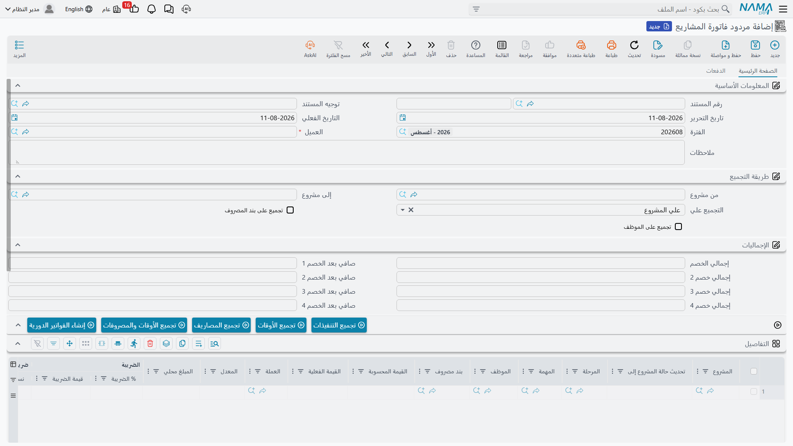

# مردود فاتورة المشاريع

::: info الترخيص
شاشة مردود فاتورة المشاريع جزء من وحدة ادارة المشاريع (ECPA)، ويتوقف ظهورها على كود الترخيص `ecpa`.
:::

عاجلاً أو آجلاً يصدر المكتب الهندسي فاتورة ما كان ينبغي أن تصدر: مشروع خاطئ، أو مرحلة صدرت فاتورتها
مرتين، أو ساعات مهندس حُسبت بسعر غير صحيح، أو عميل رفض جزءاً من الأتعاب. لا بد أن تعود القيمة، ولا
بد أن يُظهر دفتر الأستاذ أنها عادت.

هذا هو دور **مردود فاتورة المشاريع**. تجده أسفل مجموعة **الفاتورة** في قائمة ادارة المشاريع،
مباشرة بعد [فاتورة المشروع](/ar/modules/ecpa/invoicing/ecpa-project-invoice). وهو مستند كامل مثل أي
مستند آخر: له دفتر ورقم، وتوجيه، وفترة مالية، واعتماد، وتأثير محاسبي يُنتَج في الخلفية على
هيئة طلب أعمال.

كل شيء فيه تقريباً هو الفاتورة نفسها: الشاشة نفسها، وبنية السطور نفسها، والضرائب الأربع نفسها،
والخصومات الأربعة المتتالية نفسها، وأزرار التجميع نفسها، ونوع التوجيه نفسه. أما ما يختلف فهو قليل في
الكود وكبير الأثر في العمل اليومي، وهذه الصفحة تدور حول هذا المختلف تحديداً.

## المردود مستند قائم بذاته

أهم حقيقة بنيوية أولاً: **مردود فاتورة المشاريع غير مرتبط بالفاتورة التي يردّها.**

لا يوجد حقل «الفاتورة الأصلية» في الرأس، ولا زر «إنشاء مردود من الفاتورة» في شاشة الفاتورة، ولا أي
قائمة تربط فاتورة بمردودها. تفتح مردوداً جديداً فارغاً، وتختار العميل، ثم تقرر بنفسك ما الذي تردّه.
الرابط الوحيد بين المستندين هو العميل والمشروع وما تكتبه أنت في الملاحظات.

ولهذا نتيجة يجب ذكرها بصراحة، لأنها تفاجئ من اعتاد وحدات المبيعات: **لا شيء يطابق المردود مع ما تمت
فوترته فعلاً.** النظام لا يجمع فواتير العميل، ولا يقرأ إجمالي ما فُوتِر على المشروع، ولا يقارن
الرقمين. يستطيع المستخدم أن يردّ 100,000 على مشروع لم تصدر عليه سوى فاتورة بـ 10,000، وأن يصدر
المردود نفسه مرتين، ولن تعترض الشاشة ولن يعترض الاعتماد.

فإذا احتاجت الشركة إلى سقف للمردود، فهذا السقف يُبنى كتحقق مخصص. أما في النظام كما يُسلَّم، فالانضباط
إجرائي: اكتب كود الفاتورة الأصلية في ملاحظات المردود، ودع دورة الاعتماد على دفتر المردود تقوم
بالمراجعة التي لا يقوم بها البرنامج.

## الشاشة هي شاشة الفاتورة

شاشة التحرير وشاشة القائمة وشاشة البحث للمردود مبنية بالكود نفسه الذي يبني شاشات الفاتورة، فمن يعرف
إحداهما يعرف الأخرى. تحتوي الصفحة الرئيسية على:

| المجموعة | ما تحتويه |
|---|---|
| المعلومات الأساسية | كود المستند (الدفتر + الرقم)، التوجيه، تاريخ التحرير، التاريخ الفعلي، الفترة المالية، **العميل**، الملاحظات |
| طريقة التجميع | من مشروع وإلى مشروع — وهما **مدى أكواد مشاريع** لا قيمة سطر — مع التجميع علي (علي المشروع / علي المهمة / علي المرحلة) ومفتاحَي التجميع الإضافيين: تجميع على بند المصروف وتجميع على الموظف |
| أزرار العمل | تجميع الأوقات، تجميع المصاريف، تجميع الأوقات والمصروفات، تجميع التنفيذات |
| جدول التفاصيل | سطر لكل قيمة تُردّ: المشروع، المرحلة، المهمة، الموظف، بند المصروف، القيمة المحسوبة، **القيمة الفعلية**، العملة والمعدل، أزواج الضرائب الأربعة، درجات الخصم الأربع، الملاحظات، المحددات |
| جدول التنفيذات | قائمة للقراءة فقط بسطور تنفيذ المهام التي جمعها زر تجميع التنفيذات |
| الإجماليات | الإجمالى الفعلى، إجمالي الضرائب، خصم الرأس، الصافي |
| المحددات | الشركة، القطاع، الفرع، الإدارة، المجموعة التحليلية |

**القيمة الفعلية** هي الرقم الذي يهم في كل سطر: هي ما يُردّ فعلاً، وعليها تُحسب الضرائب والخصومات،
وهي التي تصل إلى دفتر الأستاذ. أما القيمة المحسوبة فللعلم فقط ولا يمكن كتابتها. وحساب الخصم والضريبة مطابق
تماماً لحساب الفاتورة: الخصومات الأربعة تتتابع، ثم تُفرض الضرائب الأربع جميعها على القاعدة نفسها بعد
الخصم. وقد شُرح هذا السلَّم بالتفصيل في
[صفحة فاتورة المشروع](/ar/modules/ecpa/invoicing/ecpa-project-invoice) ولا يُعاد هنا.

## كيف تُبنى السطور

أغلب المردودات تُكتب باليد، وهذه هي الطريقة المقصودة لاستخدام المستند: تضيف سطراً، وتختار المشروع،
وتكتب المبلغ الذي تردّه، وتضبط نسبة الضريبة لتطابق الفاتورة الأصلية.

أزرار التجميع الأربعة موجودة على الشاشة أيضاً، لأن المردود يشترك مع الفاتورة في مجموعة الأزرار
نفسها. وهي تعمل هنا كما تعمل هناك تماماً — وهذا هو ما ينبغي فهمه قبل الضغط على أحدها. فأزرار *تجميع
الأوقات* و*تجميع المصاريف* و*تجميع الأوقات والمصروفات* تلتقط **سطور الموافقات وسطور طلبات المصروف
التي لم تُفوتَر بعد**، وزر *تجميع التنفيذات* يلتقط **سطور تنفيذ المهام التي لم تُفوتَر بعد**. أي
أنها تجمع العمل غير المفوتر، لا العمل المفوتر.

لذلك فإن الضغط على *تجميع الأوقات والمصروفات* في مردود لن يأتي أبداً بالساعات التي تريد ردّها، لأن
تلك الساعات موسومة بأنها فُوتِرت. وما سيأتي به هو عمل لم تصدر له فاتورة بعد، وهو آخر ما يُتوقع من
إشعار دائن. فتعامل مع أزرار التجميع في هذه الشاشة كوسيلة لجلب سطور جاهزة إذا احتجتها فعلاً، واكتب
المردود المعتاد باليد.

## ما لا يفعله اعتماد المردود

هذه أهم سلوك في الصفحة كلها، وهي التي تُربك كل موقع لم يُنبَّه إليها.

عند اعتماد فاتورة المشروع، تَسِم الفاتورة مصادرها: سطور الموافقة على تنفيذ المهام التي فوترتها تُعلَّم
بأنها عُولجت، وسطور تنفيذ المهام التي فوترتها تُختم بمرجع الفاتورة. هذا الوسم هو ما يمنع فوترة
الساعة الواحدة مرتين.

**واعتماد مردود فاتورة المشاريع لا يزيل هذا الوسم.** الساعات وسطور المصروف التي أخذتها الفاتورة تبقى
مأخوذة. العمل المردود لا يعود إلى مجموعة العمل القابل للفوترة، ولن يلتقطه أي زر تجميع بعد ذلك.

::: warning العمل المردود لا يمكن تجميعه على فاتورة جديدة
إذا فوترت 40 ساعة، ثم أصدرت مردوداً بها، ثم أردت إعادة فوترتها بشكل صحيح، فلن يجد *تجميع الأوقات*
ولا *تجميع التنفيذات* شيئاً — فسطور المصدر ما زالت موسومة بأنها فُوتِرت.
:::

وأمامك طريقان مدعومان للعودة، ويستحق الأمر الاختيار بينهما **قبل** إصدار المردود:

1. **إلغاء اعتماد الفاتورة الأصلية.** إلغاء اعتماد الفاتورة يعكس تأثيرها المحاسبي ويزيل الوسم عن كل
   سطر مصدر استهلكته، فيعود العمل إلى المجموعة القابلة للفوترة. عندها تصحح الفاتورة وتعتمدها من جديد
   ولا حاجة إلى مردود أصلاً. هذا هو التصرف الصحيح حين تكون الفاتورة خاطئة والفترة ما زالت مفتوحة.
2. **إصدار المردود ثم كتابة إعادة الفوترة باليد.** بعد وجود المردود يمكنك إصدار فاتورة جديدة بسطر
   مكتوب يدوياً بالمبلغ الصحيح. ستفقد الارتباط بسطور تنفيذ المهام والمصروف الأصلية، فتصبح الفاتورة
   الجديدة مبلغاً مجرداً بدلاً من مبلغ مُجمَّع — لكن الفترة المقفلة تبقى مقفلة.

باختصار: استخدم المردود حين يجب أن تعود النقود إلى العميل فعلاً، وألغِ اعتماد الفاتورة حين تكون
الفوترة نفسها قد رُكِّبت خطأً.

## الحسابات التي يستخدمها المردود

يُنشئ المردود قيده المحاسبي عبر توجيه المستند تماماً كالفاتورة، وهو يستخدم **النوع نفسه من
التوجيه**: شاشة توجيه فاتورة المشروع وشاشة توجيه المردود تعريف واحد، فكل خيار فيهما يعني الشيء نفسه
في المستندين. راجع
[توجيهات مستندات المشاريع](/ar/modules/ecpa/invoicing/ecpa-document-terms) لمعرفة ما تحتويه الشاشة.

وهناك أمر واحد في هذا الترتيب يجب أن تعرفه قبل أن تضبط أي شيء:

::: warning المردود لا يعكس الجانبين نيابة عنك
يُنشئ المردود قيده في **الاتجاه نفسه** الذي تُنشئ به الفاتورة قيدها: يجعل الجانب المدين هو ما يحدده
الجانب المدين في التوجيه، والدائن هو ما يحدده الجانب الدائن — فليس هناك عكس تلقائي للإشارة في إشعار
الدائن.
:::

والنتيجة قاعدة إعداد لا تحذيراً: يحتاج المردود إلى **توجيه خاص به، مضبوط كمرآة لتوجيه الفاتورة**:

| | توجيه الفاتورة | توجيه المردود |
|---|---|---|
| القيد الرئيسي، الجانب المدين | حساب العميل المدين | مردودات المبيعات / إيراد الأتعاب |
| القيد الرئيسي، الجانب الدائن | إيراد أتعاب المشروع | حساب العميل المدين |
| زوج الضريبة 1 | ضريبة مستحقة / ضريبة مستحقة السداد | معكوس بالطريقة نفسها |
| أزواج الخصم | الخصم المسموح به / العميل | معكوس بالطريقة نفسها |

فإذا نسخت توجيه الفاتورة إلى دفتر المردود دون عكس الجانبين، سيجعل المردود العميل مديناً مرة ثانية —
أي إشعار دائن يزيد ما على العميل. ولن يمنع النظام ذلك. ابنِ التوجيه المعكوس مرة واحدة، واربطه بدفتر
المردود، وراجع قيد أول مردود معتمَد في دفتر الأستاذ قبل تشغيل الوحدة فعلياً.

وكما في الفاتورة، يُرسَل القيد كطلب أعمال في الخلفية، فيظهر بعد الاعتماد بلحظة لا داخله. وإذا فشل،
تجد السطر في شاشة **طلبات الأعمال**، حيث يمكن إعادة معالجته من قائمة المزيد.

## ما يتحقق منه النظام قبل الاعتماد

القليل جداً، ومعرفة مقدار هذا القليل مفيدة:

1. إذا مُلئ **من مشروع**، فيجب أن يكون عميله هو عميل الرأس.
2. إذا مُلئ **إلى مشروع**، فيجب أن يكون عميله هو عميل الرأس.
3. يجب أن يحمل كل سطر **قيمة فعلية** غير صفرية.

وفيما عدا هذه القواعد الثلاث والفحوص العامة للمستندات (الدفتر والفترة والمحددات)، يُعتمد المردود
بما كتبته. لا سقف للمبلغ، ولا فحص للتكرار، ولا إشارة إلى فاتورة — ولهذا تحديداً تستحق دورة الاعتماد
على دفتر المردود أن تُضبط.

## مثال عملي

خذ الفاتورة الواردة في [صفحة فاتورة المشروع](/ar/modules/ecpa/invoicing/ecpa-project-invoice):
المشروع `Q-000123` للعميل `C-0012`، فُوتِر بزر *تجميع الأوقات والمصروفات* في سطر واحد قيمته
**10,860.00**، ناقصاً خصماً 5 % وزائداً ضريبة 15 %، ليصبح الصافي **11,864.55**. وقد وُسِمت خمسة
سطور مصدر — ثلاث كتل ساعات معتمدة ومصروف سفر قابل للفوترة — بأنها فُوتِرت عند الاعتماد.

والآن يعترض العميل على 12 ساعة لسارة على مهمة *المعاينة الميدانية*، فُوترت بسعر 150 للساعة، وتوافق
الشركة على ردّها.

1. افتح **مردود فاتورة المشاريع** جديداً، واختر دفتر المردود (الدفتر الذي يحمل التوجيه المعكوس)
   والعميل `C-0012`.
2. اضغط *تجميع الأوقات والمصروفات* على سبيل التجربة فلن **يأتي شيء** — فسطور المصدر الخمسة موسومة
   بأنها فُوتِرت. أضف إذن **سطراً واحداً باليد**: المشروع `Q-000123`، *القيمة الفعلية* **1,800.00**،
   ضريبة 1 = 15 %.
3. يجري حساب السطر عند الحفظ: القيمة بعد الخصم 1,800.00، الضريبة 1 = 270.00، صافي السطر
   **2,070.00**. ويعرض الرأس *الإجمالى الفعلى* 1,800.00 و*الصافي* 2,070.00.
4. اعتمد المستند. ومع وجود التوجيه المعكوس، ينتج طلب الأعمال في الخلفية:

   | مدين | دائن | المبلغ |
   |---|---|---|
   | مردودات المبيعات | العميل `C-0012` | 1,800.00 |
   | ضريبة مستحقة السداد | ضريبة مستحقة | 270.00 |

5. تبقى ساعات سارة الاثنتا عشرة موسومة بأنها فُوتِرت، فتخرج من مجموعة العمل القابل للفوترة نهائياً
   ما لم يُلغِ أحد اعتماد الفاتورة الأصلية — وهو ما لا ينبغي لأحد فعله بعد اعتماد المردود.

هذه الخطوة الأخيرة هي التي يجب شرحها لكل مستخدم جديد: المردود أدى دوره تجاه العميل وتجاه دفتر الأستاذ،
لكنه لم يُعِد العمل إلى الرف، ولن يفعل.
