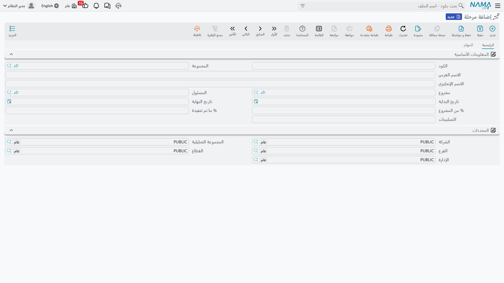
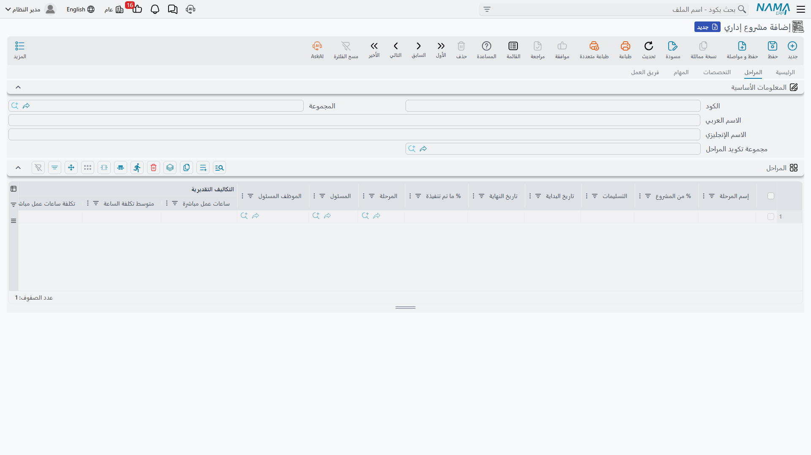
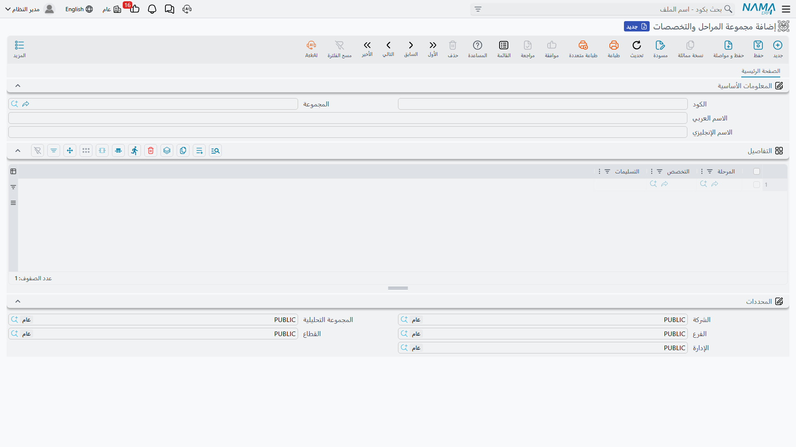
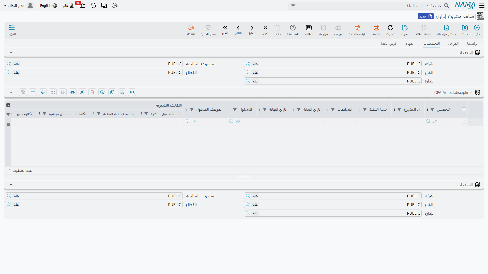
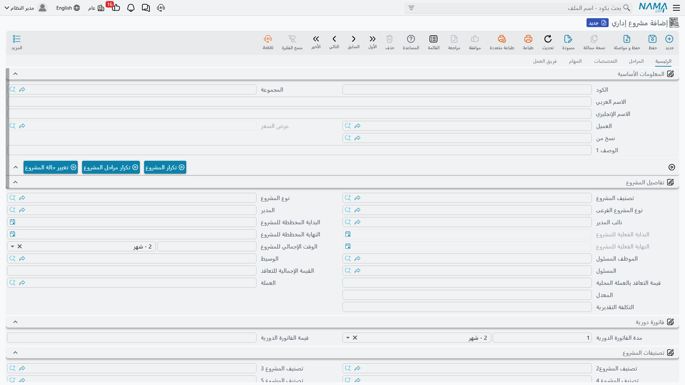

# المراحل ومصفوفة المراحل والتخصصات

::: info الترخيص المطلوب
`ecpa` — كود واحد للوحدة كلها، ولا توجد تراخيص فرعية.
:::

المكتب الهندسي لا يبيع «فيلا» قط. إنما يبيع **تصميماً مبدئياً**، ثم **تصميماً ابتدائياً**، ثم
**تصميماً تنفيذياً**، ثم حزمة **مستندات الطرح** — ويصدر فاتورته مع تسليم كل منها. وهو كذلك لا يشغّل
«فيلا»: بل يعمل فيها فريق معماري وفريق إنشائي وفريق كهرباء، ولكل منهم شريحة من كل مرحلة.

فعمل المشروع مقطوع في اتجاهين معاً — حسب **المرحلة** وحسب **التخصص** — ووحدة التخطيط الحقيقية ليست
أياً منهما وحده، بل الخلية التي يلتقيان فيها: *العمل الإنشائي في مرحلة التصميم التنفيذي*. وتسمي وحدة
ادارة المشاريع (ECPA) هذه الخلايا **جدول التفاصيل** على المشروع، وهذه الصفحة عن كيفية إيصالها إلى
هناك ومعنى الأرقام التي فيها.

وسنبني مثالاً واحداً ونحمله إلى آخر الصفحة: المشروع `P-2026-014` **فيلا 27، النخيل**، بـ
**أربع مراحل وثلاثة تخصصات — اثنتا عشرة حزمة عمل**.

::: info المرحلة ومرحلة المشروع شيئان مختلفان
هذه الصفحة عن **المرحلة** — اسم طور من أطوار مشروع واحد. وفي الوحدة كذلك **مرحلة مشروع**، وهي مستند
جدولة وتكلفة يُرحَّل ويشير إلى المراحل على سطوره. والتسميتان متقاربتان جداً، فقُل دائماً أيهما تقصد.
ولمراحل المشروع [صفحتها الخاصة](/ar/modules/ecpa/projects/ecpa-project-stages).
:::

## أولاً — المراحل، الأطوار التي تُطالِب بها

**المرحلة** طور واحد من أطوار مشروع واحد، محفوظ كسجل قائم بذاته حتى تستطيع أشياء أخرى أن تشير إليه:
فالمهام تُجمَّع تحت المراحل، وسطور فاتورة المشروع يمكن أن تُرفع على مرحلة بعينها، ومستندات مرحلة
المشروع وتمديداتها تبني سلاسل تواريخها من المراحل.

وتجد الملف في **ادارة المشاريع ← مشاريع ← مرحلة**، ويحمل المشروع الذي ينتمي إليه، والموظف المسئول،
وتاريخ بداية ونهاية، و**% من المشروع** و**% ما تم تنفيذة**.



::: tip اقرأ ملف المرحلة ولا تكتب فيه
أنت لا تنشئ مرحلة من هنا في العادة. فالمراحل تُولَّد من صفحة **المراحل** على المشروع نفسه: كل سطر في
ذلك الجدول يصير سجل مرحلة عند حفظ المشروع، والسطر الذي تحذفه يأخذ سجل مرحلته معه، وحذف المشروع يحذفها
جميعاً. وإنشاء مرحلة باليد ينتج سجلاً لا يعرف عنه جدول المشروع شيئاً.
:::

### صفحة المراحل على المشروع

افتح المشروع `P-2026-014` وانتقل إلى صفحة **المراحل**. كل سطر يسمّي طوراً ويقول كم يمثل من المشروع
كله:

| إسم المرحلة | % من المشروع |
|---|---|
| التصميم المبدئي | 10 |
| التصميم الابتدائي | 20 |
| التصميم التنفيذي | 55 |
| مستندات الطرح | 15 |

ويحمل السطر كذلك تاريخ بداية ونهاية، وموظفاً مسئولاً، و**% ما تم تنفيذة** تكتبها أنت بيدك كلما تقدم
الطور، ومجموعة من أعمدة التكاليف التقديرية سنعود إليها في القسم الثالث — وهي تُملأ لك لا تكتبها.

وفوق الجدول يقع حقل **مجموعة تكويد المراحل**، وهي مجموعة التكويد المستخدمة في ترقيم سجلات المراحل التي
تولّدها هذه الصفحة. اضبطها مرة فتخرج المراحل المولَّدة بأكواد مرتبة، واتركها فتُكوَّد من كود المشروع
ورقم السطر.



## ثانياً — مجموعة المراحل والتخصصات، قالب قابل لإعادة الاستخدام

المكتب الذي يصمم الفيلات يفعل ذلك بالطريقة نفسها في كل مرة. وإعادة كتابة تقسيم المراحل والتخصصات نفسه
على كل مشروع جديد هي بالضبط نوع العمل الذي يُفترض أن يزيله نظام تخطيط الموارد، و
**مجموعة المراحل والتخصصات** (**ادارة المشاريع ← مشاريع ← مجموعة المراحل والتخصصات**) هي ما يزيله.

والذي يجب فهمه عن هذا الملف — ويفاجئ الجميع تقريباً — أنه **ليس جدولاً ثنائي البعد**. إنما هو رأس
وقائمة مسطحة واحدة، وكل سطر فيها زوج واحد من **(مرحلة، تخصص)**. والمصفوفة مستنتَجة من *الأزواج التي
اخترت إنشاءها*؛ أما التركيبات التي تركتها فهي التي لا يعمل فيها ذلك التخصص في تلك المرحلة.

ويسجل مكتب النخيل مجموعة واحدة، `PDG-VILLA` «تقسيم تصميم الفيلات»، باثني عشر سطراً:

| المرحلة | التخصص |
|---|---|
| التصميم المبدئي | معماري |
| التصميم المبدئي | إنشائي |
| التصميم المبدئي | كهرباء |
| التصميم الابتدائي | معماري |
| التصميم الابتدائي | إنشائي |
| التصميم الابتدائي | كهرباء |
| التصميم التنفيذي | معماري |
| التصميم التنفيذي | إنشائي |
| التصميم التنفيذي | كهرباء |
| مستندات الطرح | معماري |
| مستندات الطرح | إنشائي |
| مستندات الطرح | كهرباء |

اثنا عشر سطراً، واثنتا عشرة حزمة عمل. وقد لا تحتاج مجموعة ثانية لأعمال التشطيبات الداخلية إلا سبعة
سطور، لأن الإنشائي لا يشارك في الأطوار الأولى — وهذه هي فائدة القالب المبني باليد: يلتقط شكل العمل بما
فيه من فراغات.

ولا توجد على هذا الملف نسب ولا ساعات ولا تكاليف. إنه يحمل **الأسماء فقط**. وكل رقم يُدخل على مستوى
المشروع، لأن كل مشروع يساوي مبلغاً مختلفاً.



### ماذا يحدث حين تختار مجموعة على المشروع

على الصفحة الرئيسية للمشروع حقل **مجموعة المراحل و التخصصات** يقع فوق المصفوفة مباشرة. اختر
`PDG-VILLA` فيملأ النظام **ثلاثة** جداول دفعة واحدة، من تلك القائمة ذات الاثني عشر زوجاً:

| الجدول | ما الذي يستقبله |
|---|---|
| **التفاصيل** (المصفوفة على الصفحة الرئيسية) | سطر لكل سطر في المجموعة — اثنا عشر سطراً، في كل منها المرحلة والتخصص مضبوطان سلفاً |
| صفحة **المراحل** | سطر لكل مرحلة *مميزة* في المجموعة — أربعة سطور: المبدئي والابتدائي والتنفيذي ومستندات الطرح |
| صفحة **التخصصات** | سطر لكل تخصص *مميز* في المجموعة — ثلاثة سطور: معماري وإنشائي وكهرباء |

وما عدا ذلك على تلك السطور — النسب والساعات والتكاليف والتواريخ والمسئولون — يُترك فارغاً لتملأه أنت.
فالقالب يعطيك الهيكل، والأرقام أرقامك.

::: warning اختيار مجموعة يستبدل الجداول الثلاثة
الجداول الثلاثة **تُستبدل** ولا يُضاف إليها. فإن كنت قد كتبت نسب المراحل أو ساعات التخصصات أو نسب
المصفوفة ثم اخترت مجموعة، ضاع ذلك العمل. اختر المجموعة أولاً على مشروع جديد، ثم املأ الأرقام بعدها.
:::

## ثالثاً — جداول المشروع نفسه هي المصفوفة الحقيقية

أوصل القالب اثنتي عشرة خلية فارغة إلى المشروع. وعلينا الآن أن نضع فيها المال، وهنا تعيش آلية الوحدة
الذكية حقاً: **تُسعِّر المشروع بالتخصص، ويوزّع النظام التسعير على المراحل.**

### صفحة التخصصات هي المُدخَل

انتقل إلى صفحة **التخصصات** على المشروع. كل تخصص يأخذ نسبته من المشروع وتقديراً لما سيستهلكه:

| التخصص | % المشروع | ساعات عمل مباشرة | متوسط تكلفة الساعة | تكاليف غير مباشرة |
|---|---|---|---|---|
| معماري | 50 | 800 | 60 | 12 000 |
| إنشائي | 30 | 400 | 65 | 6 000 |
| كهرباء | 20 | 200 | 55 | 3 000 |

وعمودان على هذا الجدول يملآن نفسيهما فور الحفظ: **تكلفة ساعات عمل مباشرة** = الساعات × متوسط تكلفة
الساعة، و**الإجمالى** يضيف التكاليف غير المباشرة فوقها.

| التخصص | تكلفة ساعات عمل مباشرة | الإجمالى |
|---|---|---|
| معماري | 800 × 60 = 48 000 | 60 000 |
| إنشائي | 400 × 65 = 26 000 | 32 000 |
| كهرباء | 200 × 55 = 11 000 | 14 000 |
| **المشروع** | **85 000** | **106 000** |

فتقدير فيلا 27 هو 1 400 ساعة و106 000 من التكلفة — ولم يُربط أي من هذه الأرقام بمرحلة بعد.



### والمصفوفة توزّعه

افتح الآن جدول **التفاصيل** على الصفحة الرئيسية للمشروع. في كل سطر من السطور الاثني عشر تكتب رقماً
**واحداً** فقط: **نسبة توزيع التخصص على المرحلة** — *أي حصة من عمل هذا التخصص نفسه تقع في هذه
المرحلة*.

اقرأ التعريف مرتين، فهو الشيء الوحيد الذي يخطئ فيه الناس. ليست حصة من المرحلة، ولا حصة من المشروع، بل
حصة من عمل **ذلك التخصص**. ولهذا يجب أن تبلغ نسب الفريق المعماري عبر المراحل الأربع مائة، وكذلك نسب
الفريق الإنشائي ونسب فريق الكهرباء — كل عمود من المصفوفة يبلغ مجموعه مائة وحده.

ويعرف مكتب النخيل فرقه جيداً بما يكفي ليوزّعها توزيعاً مختلفاً:

| التخصص | التصميم المبدئي | التصميم الابتدائي | التصميم التنفيذي | مستندات الطرح |
|---|---|---|---|---|
| معماري | 8 % | 18 % | 60 % | 14 % |
| إنشائي | 10 % | 20 % | 50 % | 20 % |
| كهرباء | 15 % | 25 % | 50 % | 10 % |

فالمعماريون ينجزون معظم عملهم في التصميم التنفيذي، بينما فريق الكهرباء أكثر انشغالاً في الأطوار
المبكرة حين تُعتمد الأحمال والمسارات.

وفور الحفظ يمر النظام على كل سطر في المصفوفة، فيجد سطر التخصص المقابل على صفحة التخصصات ويصغّره:

```
% المشروع                   = % المشروع للتخصص        × نسبة توزيع التخصص
ساعات عمل مباشرة            = ساعات التخصص            × نسبة توزيع التخصص
متوسط تكلفة الساعة          = متوسط التخصص            (يُنسخ كما هو ولا يُصغَّر)
تكاليف غير مباشرة           = غير مباشرة التخصص       × نسبة توزيع التخصص
تكلفة ساعات عمل مباشرة      = ساعات هذا السطر × متوسط تكلفة الساعة على هذا السطر
الإجمالى                    = تكلفة ساعات عمل مباشرة + تكاليف غير مباشرة
```

فتخرج حزم العمل الاثنتا عشرة لفيلا 27:

| المرحلة | التخصص | نسبة التوزيع | % المشروع | ساعات مباشرة | متوسط الساعة | تكلفة مباشرة | غير مباشرة | الإجمالى |
|---|---|---|---|---|---|---|---|---|
| التصميم المبدئي | معماري | 8 | 4.00 | 64 | 60 | 3 840 | 960 | 4 800 |
| التصميم المبدئي | إنشائي | 10 | 3.00 | 40 | 65 | 2 600 | 600 | 3 200 |
| التصميم المبدئي | كهرباء | 15 | 3.00 | 30 | 55 | 1 650 | 450 | 2 100 |
| التصميم الابتدائي | معماري | 18 | 9.00 | 144 | 60 | 8 640 | 2 160 | 10 800 |
| التصميم الابتدائي | إنشائي | 20 | 6.00 | 80 | 65 | 5 200 | 1 200 | 6 400 |
| التصميم الابتدائي | كهرباء | 25 | 5.00 | 50 | 55 | 2 750 | 750 | 3 500 |
| التصميم التنفيذي | معماري | 60 | 30.00 | 480 | 60 | 28 800 | 7 200 | 36 000 |
| التصميم التنفيذي | إنشائي | 50 | 15.00 | 200 | 65 | 13 000 | 3 000 | 16 000 |
| التصميم التنفيذي | كهرباء | 50 | 10.00 | 100 | 55 | 5 500 | 1 500 | 7 000 |
| مستندات الطرح | معماري | 14 | 7.00 | 112 | 60 | 6 720 | 1 680 | 8 400 |
| مستندات الطرح | إنشائي | 20 | 6.00 | 80 | 65 | 5 200 | 1 200 | 6 400 |
| مستندات الطرح | كهرباء | 10 | 2.00 | 20 | 55 | 1 100 | 300 | 1 400 |

اقرأ سطور المعماري رأسياً تجد 64 + 144 + 480 + 112 = 800 ساعة، و
3 840 + 8 640 + 28 800 + 6 720 = 48 000 من التكلفة المباشرة — وهو بالضبط ما أُدخل على صفحة التخصصات.
فلم يُخلق شيء ولم يضع شيء؛ إنما قُطع تقدير التخصص إلى أربع قطع.



::: info تكتب مرجعين ونسبة واحدة، ولا شيء غير ذلك
كل عمود تكلفة في المصفوفة يُعاد حسابه من صفحة التخصصات في كل حفظ، فالرقم المكتوب مباشرة في أحدها
يُهمَل عند الحفظ التالي. فإن كانت تكلفة حزمة عمل خاطئة، فالإصلاح على صفحة التخصصات أو في النسبة، لا
في الخلية.
:::

### ثم يتجمّع صاعداً على المراحل

بعد أن قطع التقدير بالتخصص، يجمعه النظام فوراً بالمرحلة ويكتب النتيجة على صفحة **المراحل**. فتأخذ كل
مرحلة مجموع سطورها في المصفوفة، ومتوسط تكلفة ساعة مشتقاً من الإجماليين:

| المرحلة | % من المشروع | ساعات مباشرة | تكلفة ساعات عمل مباشرة | متوسط تكلفة الساعة |
|---|---|---|---|---|
| التصميم المبدئي | 10 | 134 | 8 090 | 60.37 |
| التصميم الابتدائي | 20 | 274 | 16 590 | 60.55 |
| التصميم التنفيذي | 55 | 780 | 47 300 | 60.64 |
| مستندات الطرح | 15 | 212 | 13 020 | 61.42 |
| **المشروع** | **100** | **1 400** | **85 000** | |

ومتوسط تكلفة ساعة المرحلة ليس متوسطاً لمعدلات التخصصات الثلاثة، بل هو `التكلفة ÷ الساعات` لتلك
المرحلة، فتخرج المرحلة التي يعمل فيها الفريق الإنشائي الغالي نسبةً أكبر أغلى. ومستندات الطرح عند
61.42 هي أغلى ساعة في هذا المشروع لهذا السبب بالذات.

::: info التكاليف غير المباشرة لا تتجمّع صاعداً
يبقى عمود **تكاليف غير مباشرة** على المرحلة كما كتبته تماماً — فالـ 21 000 من التكاليف غير المباشرة
الموزَّعة على المصفوفة *لا* تُجمع على سطور المراحل، وإجمالي المرحلة هو تكلفة ساعات عملها المباشرة زائد
ما هو مكتوب من تكاليف غير مباشرة على سطر المرحلة نفسه. فإن أردت إجماليات أطوار تشمل التكاليف غير
المباشرة، فأدخلها لكل مرحلة على صفحة المراحل كذلك.
:::

وكالمصفوفة، تُعاد أعمدة التكاليف التقديرية على المراحل في كل حفظ لكل مرحلة تظهر في المصفوفة، فعاملها
كقراءات لا كحقول تملؤها.

## ما الذي يتحقق منه النظام عند الحفظ

أربع قواعد تحفظ اتساق الجداول الثلاثة، وهي سبب جدوى القالب — فالمشروع المبني من مجموعة يستوفي أول
قاعدتين تلقائياً.

1. **كل تخصص في المصفوفة يجب أن يكون موجوداً على صفحة التخصصات**، وإلا رُفض الحفظ مع تسمية التخصص
   الذي لم يُعثر عليه.
2. **وكل مرحلة في المصفوفة يجب أن تكون موجودة على صفحة المراحل**، بالمعاملة نفسها.
3. **نسب التخصص الواحد لا يجوز أن يزيد مجموعها على 100.** فعمود المعماري في مصفوفتنا مجموعه 100
   بالضبط؛ ارفع أي سطر فيه يُرفض الحفظ.
4. **سطور المرحلة لا تطالب من المشروع بأكثر مما تطالب به المرحلة نفسها.** فسطور التصميم التنفيذي
   الثلاثة تبلغ 55 % من المشروع، وهي بالضبط الـ 55 % المكتوبة على سطر تلك المرحلة. ارفع نسب السطور
   دون رفع المرحلة يُرفض الحفظ.

ولا يشترط النظام أن يبلغ مجموع نسب المراحل مائة، ولا نسب التخصصات. فالمشروع الذي لا يغطي تقسيمه إلا
70 % من العمل يُحفظ بلا اعتراض، ولهذا فنظرة سريعة على الإجماليات قبل تسليم المشروع تستحق العشر ثوانٍ.

## بناء المصفوفة بلا قالب

إن كان المشروع لا يتبع أياً من أشكال المكتب المعتادة، فاملأ صفحتي المراحل والتخصصات باليد ثم استخدم
الأزرار فوق المصفوفة على الصفحة الرئيسية:

- **إنشاء مصفوفة من المراحل و التخصصات** — يبني كل تركيبة ممكنة: أربع مراحل × ثلاثة تخصصات = اثنا عشر
  سطراً، سواء أكانت الاثنا عشر عملاً حقيقياً أم لا.
- **نسخ المراحل الي التفاصيل** — سطر مصفوفة لكل مرحلة، والتخصص متروك فارغاً.
- **نسخ التخصصات الي التفاصيل** — سطر مصفوفة لكل تخصص، والمرحلة متروكة فارغة.

::: warning الأزرار الثلاثة تستبدل المصفوفة
وهي لا تضيف إليها. فالضغط على أحدها يمسح جدول التفاصيل ويعيد بناءه، ويأخذ معه كل نسبة توزيع كتبتها.
استخدمها في البداية ثم عدّل، ولا تستخدمها أبداً كوسيلة «لإضافة السطور الناقصة» إلى مصفوفة سعّرتها
بالفعل.
:::

والاختيار بين القالب وزر إنشاء المصفوفة هو في حقيقته اختيار بين مجموعة منتقاة باليد وبين كل التركيبات.
فالمجموعة أنسب حين تكون بعض الخلايا فارغة فعلاً — كأعمال التشطيبات الداخلية التي لا عمل إنشائي فيها في
الأطوار الأولى. والزر أسرع حين يمس كل تخصص كل مرحلة فعلاً، كما في فيلا 27.

## ما الذي تصلح له المصفوفة وما لا تصلح له

الساعات والتكاليف التقديرية في المصفوفة **للعلم فقط**. فلا شيء في الوحدة يقارنها بما يحدث فعلاً: لا
ينطلق تنبيه حين يتجاوز الفريق المعماري 800 ساعة، ولا يُمنع مستند لتجاوزه تقديراً. إنها خطة تستطيع
التقرير عنها، لا موازنة يفرضها النظام. ومن أين تأتي التكلفة الفعلية موضوع
[مصادر تكلفة وإيراد المشروع](/ar/modules/ecpa/ecpa-costing-and-profitability).

أما المراحل نفسها فمستخدمة في أنحاء الوحدة كلها:

- **المهام** تُجمَّع تحت مرحلة، فتقع الساعات المسجلة على المهمة داخل طور — انظر
  [مهام المشروع](/ar/modules/ecpa/tasks/ecpa-tasks).
- **سطور فاتورة المشروع** يمكن أن تُرفع على مرحلة بعينها، وهكذا يطالب المكتب بـ «التصميم المبدئي،
  10 % من التعاقد» — انظر [فاتورة المشروع](/ar/modules/ecpa/invoicing/ecpa-project-invoice). ولا توجد
  أتمتة تصدر فاتورة لمرحلة حين تبلغ نسبة معينة؛ فقرار المطالبة يبقى بيد إنسان.
- **مستندات مرحلة المشروع** وتمديداتها تستخدم المراحل لبناء سلسلة التواريخ ولتسجيل أيام التأخير —
  انظر [مستندات مرحلة المشروع](/ar/modules/ecpa/projects/ecpa-project-stages).

و**% ما تم تنفيذة** على المرحلة تُكتب باليد. ونسبة التقدم الوحيدة التي تحسبها الوحدة بنفسها هي نسبة
تنفيذ المشروع، وهي ساعات المهام الفعلية مقسومة على المخططة — ولا شيء يرجّحها بالمراحل. قُل ذلك صراحةً
لمن يتوقع أن تنتج المصفوفة تقرير تقدم.
