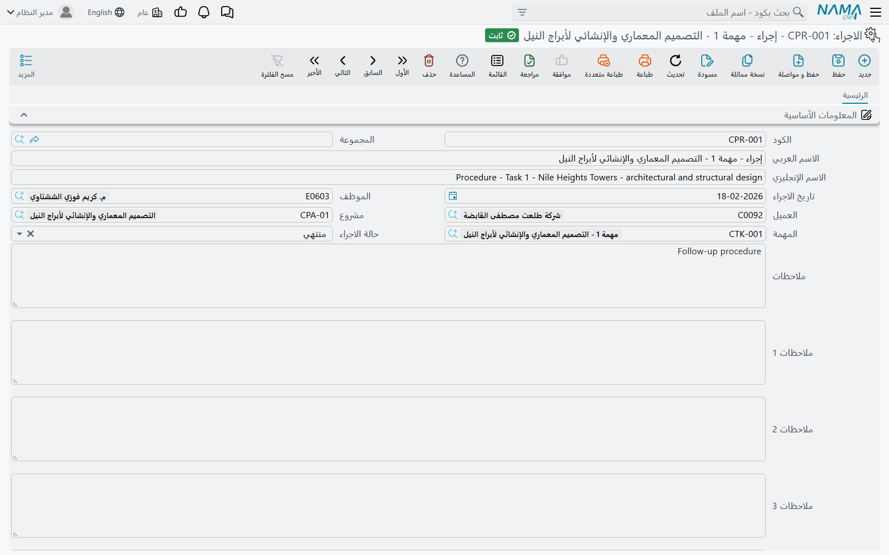

# الاجراءات

الاسم يوقع في اللبس، فلنبدأ من هنا: **الاجراء** في وحدة **ادارة المشاريع (ECPA)** ليس تعريفاً لدورة عمل، ولا قائمة تحقق نموذجية، ولا روتيناً مخزَّناً. هو **سجل متابعة** — الشيء التالي الذي ينبغي أن يحدث في العمل، مكتوباً حتى لا يُنسى.

اقرأه على أنه بند «للتنفيذ»: *مَن* المسؤول، و*ماذا* ينبغي عمله، و*لأي عميل ومشروع ومهمة*، و*متى*، و*أين وصل الآن*.

تجده في **ادارة المشاريع > مشاريع > الاجراء**، ويحتاج ترخيص `ecpa`.

والاجراء — كالمشروع — **ملف رئيسي**: كود ومجموعة واسمان، بلا دفتر ولا توجيه مستند ولا معالجة في الخلفية. تحفظه فيوجد.

## الشاشة

كل شيء في صفحة واحدة.

| الحقل | ماذا يحمل |
|---|---|
| **الكود** و**المجموعة** | زوج الهوية المعتاد، وتستطيع المجموعة توليد الكود تلقائياً |
| **الاسم العربي** / **الاسم الإنجليزي** | عملياً: نص المتابعة نفسه، مثل *«استخراج موافقة البلدية»* |
| **تاريخ الاجراء** | موعد استحقاقه، أو تاريخ حدوثه |
| **الموظف** | المسؤول عنه |
| **العميل** | العميل الذي يخصه |
| **مشروع** | [المشروع الإداري](/ar/modules/ecpa/projects/ecpa-managed-project) الذي ينتمي إليه |
| **المهمة** | [المهمة](/ar/modules/ecpa/tasks/ecpa-tasks) المعنية تحديداً |
| **حالة الاجراء** | أين وصل — انظر أدناه |
| **الوصف** و**ملاحظات 1** حتى **ملاحظات 4** | خمسة حقول نصية واسعة |

ومراجع العمل الثلاثة يضيّق بعضها بعضاً كلما ملأتها: اختر العميل فلا تعرض قائمة المشروع إلا مشاريع ذلك العميل؛ ثم اختر المشروع فلا تعرض قائمة المهمة إلا مهام ذلك المشروع. املأها بالترتيب تبقَ القوائم قصيرة.

وتعرض **حالة الاجراء** القيم: *لم تبدأ* و*تحت التشغيل* و*مؤجلة* و*منتهي* و*غير مسؤولين عنه* و*معاد فتحه* و*أخري*. وهي حالة وصفية: لا شيء في الوحدة يتفرّع عليها ولا قاعدة تعتمد عليها. لكنها تكسبك شاشة قائمة صالحة للعمل — فالحالة فلتر وعمود ترتيب معاً، فتصبح «كل ما هو تحت التشغيل في عيادة الرياض» بحثاً واحداً.

وحقول الملاحظات الأربعة موجودة لأن لكل مكتب مجموعة ملاحظات مختلفة قليلاً يحتفظ بها مع المتابعة: نص العميل الحرفي، ورقم صادر الخطاب، والقرار الداخلي. استعملها كما يتفق فريقك، وسمّها بما يناسبها من شاشة [إعدادات الحقول والكيانات](/ar/platform/fields-and-entities-settings/fields-settings-overview) حتى لا يضطر أحد إلى تذكّر معنى «ملاحظات 3» في هذا السجل بالذات.

::: tip حقول أكثر مما تعرضه الشاشة
يحمل السجل كذلك حقول مرفقات ومراجع وأرقام وأوصاف إضافية غير موضوعة على التخطيط الافتراضي. فإذا احتاجت متابعاتكم أن تشير إلى مستند أو تحمل قيمة، فاطلبوا من فريق التطبيق وضعها بـ[معدّل الشاشات](/ar/platform/screen-modifier/screen-modifier-overview) وتحديد أنواع السجلات التي يجوز أن تشير إليها تلك المراجع.
:::

## الاجراءات المتولدة من ورقة تنفيذ المهام

معظم الاجراءات في مكتب مشغول لا تُكتب على هذه الشاشة أصلاً، بل تصل من الميدان.

فكل سطر في مستند [تنفيذ المهام](/ar/modules/ecpa/task-execution/ecpa-timesheets) فيه موضع لـ**الاجراء التالي**: سطر قصير يقول ما الذي ينبغي أن يحدث بعد ذلك، وتاريخ له. فيكتب المهندس عند إغلاق زيارة الموقع *«استخراج موافقة البلدية»* ويؤرخها **15-04-2026** ويحفظ المستند.

وما إذا كان لذلك أثر يتوقف على إعداد واحد: أن يسمّي **توجيه** مستند تنفيذ المهام **مجموعة الإجراءات**. وهذه المجموعة هي المفتاح الرئيسي.

- فإذا كانت مجموعة الإجراءات مذكورة في التوجيه، أنشأ كل سطر يحمل نص إجراء تالٍ سجلَ إجراء — باسم ذلك النص، تحت تلك المجموعة بكود تلقائي، بالتاريخ المدخل، وحاملاً موظف السطر وعميله ومشروعه ومهمته.
- وإن عدّلت النص وحفظت مرة أخرى، حُدّث الاجراء نفسه ولم يتكرر.
- وإن ألغيت مستند تنفيذ المهام، حُذفت معه الاجراءات التي ولّدها.
- وإن خلا التوجيه من مجموعة الإجراءات، لم يُنشأ شيء وبقي النص ملاحظة على سطر المستند.

والاجراءات المتولدة بهذه الطريقة تصل **بلا حالة**. فإن كان فريقك يعمل على قائمة المتابعات بالفلترة على الحالة، فينبغي أن يضع أحدهم حالة عند استلام البند؛ فالاجراء الخالي من الحالة لا يظهر تحت أي فلتر حالة.

## أين تظهر

في موضعين. شاشة قائمة الاجراءات هي شاشة العمل — تفلتر بالحالة أو الموظف أو المشروع أو التاريخ فتحصل على متابعات اليوم. وشاشة [المهمة](/ar/modules/ecpa/tasks/ecpa-tasks) تحمل قائمة مدمجة بكل إجراء سُجّل على تلك المهمة، وهي جواب سؤال: «ما الذي اتُّفق عليه في هذا الجزء من العمل وما الذي ما زال مفتوحاً؟».
