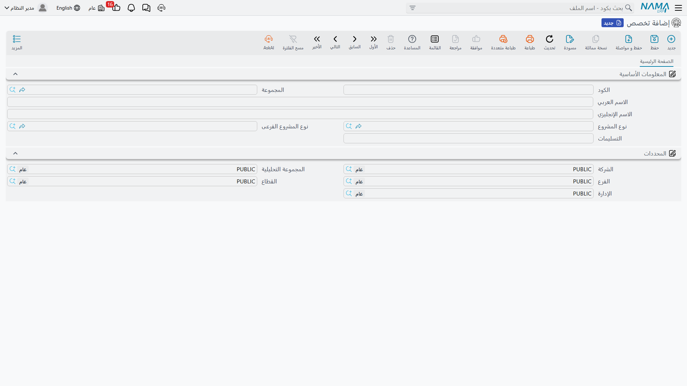

# أنواع وتصنيفات وتخصصات المشاريع

::: info الترخيص المطلوب
`ecpa` — كود واحد للوحدة كلها، ولا توجد تراخيص فرعية.
:::

قبل أن يفتح مكتب هندسي أول مشروع له في وحدة ادارة المشاريع (ECPA)، عليه أن يُعلِّم النظام مفرداته
الخاصة: أي أنواع من الأعمال يبيع، وكيف يحب أن يقسّم محفظته لأغراض التقارير، وأي تخصصات مهنية ينتمي
إليها موظفوه. وتحمل هذه المفردات أربعة ملفات رئيسية صغيرة، كلها تحت
**ادارة المشاريع ← مشاريع**.

وهي ليست على درجة واحدة من الأهمية، ومعرفة ذلك مبكراً توفر جهداً كثيراً. فـ **نوع المشروع** هو الوحيد
الذي يغيّر سلوك النظام فعلاً. أما الثلاثة الباقية فتصنيف: يحفظها النظام ويعرضها في القوائم ويتيح
الفلترة والتقارير عليها، وهذا كل ما تفعله.

وسنتابع في هذه الصفحة تجهيز مكتب هندسي صغير اسمه **النخيل للهندسة**، يعمل في نوعين من الأعمال ويوظف
أربعة تخصصات.

## نوع المشروع — الملف الحامل

**نوع المشروع** هو المستوى الأعلى من كتالوج خدمات المكتب: نوع التعاقد الذي يبيعه. ويبيع مكتب النخيل
نوعين:

| الكود | الاسم |
|---|---|
| `RES` | سكني |
| `COM` | تجاري |

وكل مشروع يحمل واحداً منها. والسجل نفسه بسيط عن قصد — كود ومجموعة تكويد واسم عربي واسم إنجليزي
والمحددات المعتادة (الشركة والمجموعة التحليلية والفرع والقطاع والإدارة). لا معدلات عليه ولا حسابات
ولا قيم افتراضية.

وما يجعله حاملاً هو ما يحدث في مواضع أخرى بمجرد أن يحمله المشروع:

- **يضبط المهام.** أنواع المهام نفسها مرتبطة بنوع مشروع. وعند حفظ المهمة يتحقق النظام أن نوع المهمة
  المختار ينتمي إلى نفس نوع مشروع المهمة، ويرفض الحفظ إن اختلفا. فالمشروع `سكني` لا يقبل إلا أنواع
  مهام أُنشئت للأعمال السكنية. وتجد التفصيل في
  [مهام المشروع](/ar/modules/ecpa/tasks/ecpa-tasks).
- **يضيّق القوائم.** على المشروع وعلى عرض أسعار المشروع، اختيار نوع المشروع يقصر قائمة نوع المشروع
  الفرعى على أنواعه الفرعية. وعلى المهمة يقصر قائمة أنواع المهام بالطريقة نفسها.
- **ينتقل مع العمل.** يُنسخ النوع والنوع الفرعي من المشروع إلى كل مهمة وإلى سطور تنفيذ المهام، فيمكن
  تحليل الأوقات حسب النوع دون الرجوع إلى المشروع. وينتقلان كذلك حين يُنشأ المشروع من عرض أسعار.

ولشاشة نوع المشروع صفحة ثانية تعرض **كل مشاريع هذا النوع** — عرض للقراءة فقط يبيّن كود المشروع
والعميل والمدير ونائب المدير والمسئول. وهي أسرع طريقة للإجابة على «ما الذي يجري لدينا تحت السكني؟»
دون فتح قائمة المشاريع وفلترتها.

::: tip ابدأ بأنواع المشاريع
كل شيء آخر في الوحدة إما معلق على نوع مشروع أو مفلتر به. وإنشاء أنواع المهام قبل أنواع المشاريع يعني
الرجوع لتعديلها جميعاً، كما أن فتح قائمة أنواع المهام على مشروع بلا نوع مشروع أمر يُستحسن تجنبه.
:::

## نوع مشروع فرعى — تفريع أضيق للنوع

**النوع الفرعي** يقسّم النوع إلى الصور التي يميّزها المكتب فعلاً. وشاشته صورة طبق الأصل من شاشة نوع
المشروع مع حقل واحد إضافي: **نوع المشروع**، وهو إلزامي. وهذا الأب هو ما يجعل التتابع يعمل — تختار
«سكني» على المشروع فلا تُعرض إلا الأنواع الفرعية السكنية.

ويجهّز مكتب النخيل أربعة:

| الكود | الاسم | نوع المشروع |
|---|---|---|
| `RES-VIL` | فيلا | سكني |
| `RES-APT` | عمارة سكنية | سكني |
| `COM-RET` | محلات تجارية | تجاري |
| `COM-OFF` | مبنى مكاتب | تجاري |

وكالنوع، يُنسخ النوع الفرعي على المهام وعلى سطور تنفيذ المهام، وهو أحد فلاتر قائمة المشاريع. ولا يحمل
معدلات ولا حسابات — وجوده كي يصير سؤال «كم من الوقت أنفقنا على الفيلات العام الماضي؟» سؤالاً تجيب
عنه القوائم.

## تصنيف المشروع — وسم للتقارير، وثمانية منه

**تصنيف المشروع** هو طريقة المكتب الخاصة في وسم المشروع لأغراض التقارير: قطاع عام أم خاص، أو حسب
المنطقة، أو حسب مصدر التمويل، أو حسب الحجم. والسجل ليس إلا كوداً ومجموعة والاسمين.

ويستخدم مكتب النخيل تصنيفين:

| الكود | الاسم |
|---|---|
| `PUB` | قطاع عام |
| `PRV` | قطاع خاص |

والغريب أن المشروع يتيح **ثمانية خانات مستقلة** لنفس هذا الملف، فيمكن للمكتب أن يشغّل حتى ثمانية
محاور وسم متوازية: القطاع في الأولى، والمنطقة في الثانية، ومصدر التمويل في الثالثة، وهكذا. وعلى شاشة
المشروع تقع الخانة الأولى في مجموعة **تفاصيل المشروع** بجوار نوع المشروع ونوع المشروع الفرعى، بينما
تُجمع الخانات من الثانية إلى الثامنة في مجموعة مستقلة أسفل الشاشة عنوانها **تصنيفات المشروع**. وكثيراً
ما يبحث الناس عن الخانة الأولى هناك فلا يجدونها.

وكن صريحاً مع مستخدميك في وظيفة التصنيف: يُحفظ ويُعرض ويُفلتر به، ولا تعتمد عليه أي قاعدة أو حساب أو
قيد محاسبي في الوحدة. وهذا ليس نقصاً — فهو تماماً ما يُنتظر من وسم تقارير — لكن المستشار الذي يَعِد
بأن التصنيف سيقود التسعير أو الاعتمادات سيضطر إلى سحب وعده.

## التخصص — من ينفّذ أي جزء من العمل

**التخصص** تخصص مهني: معماري، إنشائي، كهرباء، ميكانيكا، تكييف، حصر كميات. ففي المكتب الهندسي يُقسَّم
عمل المشروع في اتجاهين معاً — حسب **المرحلة** وحسب **التخصص** — والتخصص هو المحور الثاني.

ولمكتب النخيل أربعة تخصصات:

| الكود | الاسم |
|---|---|
| `ARC` | معماري |
| `STR` | إنشائي |
| `ELE` | كهرباء |
| `MEC` | ميكانيكا |

والسجل نفسه كود ومجموعة تكويد والاسمان. وقيمته كلها في المواضع التي يُستخدم فيها:

- على صفحة **التخصصات** في المشروع، حيث يأخذ كل تخصص نسبته من المشروع وساعاته وتكاليفه التقديرية؛
- في **مصفوفة التفاصيل** على المشروع، حيث يصير كل زوج (مرحلة، تخصص) حزمة عمل واحدة — انظر
  [المراحل ومصفوفة المراحل والتخصصات](/ar/modules/ecpa/projects/ecpa-milestones-and-matrix)؛
- في **مجموعة المراحل والتخصصات** القابلة لإعادة الاستخدام، وهي القالب الذي يجمع المراحل بالتخصصات
  مسبقاً؛
- على سطور **طلب المصروف وسند المصروف**، فيُحمَّل المصروف على تخصص؛
- على سطور **تنفيذ المهام**، حيث يأتي التخصص افتراضياً من رأس المستند، فتُحلَّل ساعات العمل حسب
  التخصص.

::: info المعدلات لا تعيش على التخصص
الساعات التقديرية ومتوسط تكلفة الساعة والتكاليف غير المباشرة التي يربطها المكتب مثلاً بفريقه الإنشائي
تُدخل **لكل مشروع** على صفحة التخصصات في ذلك المشروع، لا على ملف التخصص. فيمكن لمشروعين أن يُقيّما
التخصص نفسه تقييماً مختلفاً تماماً، وهو غالباً ما يريده المكتب.
:::

## ترتيب تجهيز المفردات

1. **أنواع المشاريع** — `RES` سكني، `COM` تجاري.
2. **الأنواع الفرعية** تحتها — `RES-VIL` و`RES-APT` و`COM-RET` و`COM-OFF`.
3. **تصنيفات المشاريع** — `PUB` و`PRV`، وأي محور ثانٍ تريده في الخانة الثانية.
4. **التخصصات** — `ARC` و`STR` و`ELE` و`MEC`.
5. **أنواع المهام** لكل نوع مشروع، حتى تصير المهام قابلة للحفظ أصلاً — في
   [مهام المشروع](/ar/modules/ecpa/tasks/ecpa-tasks).
6. **المراحل وقالب المراحل والتخصصات**، وعندها تبدأ المفردات السابقة في إنتاج هيكل عمل حقيقي — في
   [المراحل ومصفوفة المراحل والتخصصات](/ar/modules/ecpa/projects/ecpa-milestones-and-matrix).

وبوجود هذه كلها يصير إنشاء مشروع جديد اختياراً من قوائم في معظمه — وتشرح صفحة
[المشروع الإداري](/ar/modules/ecpa/projects/ecpa-managed-project) الشاشة نفسها.
