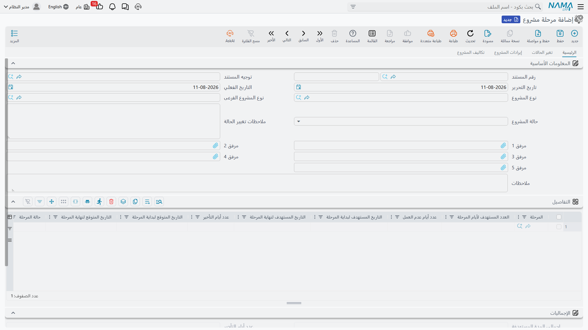
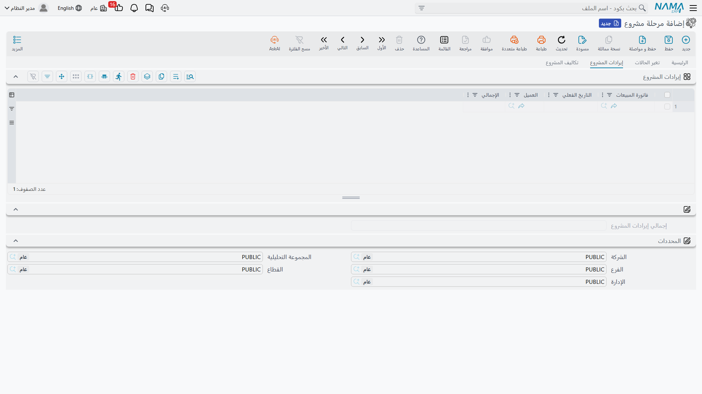
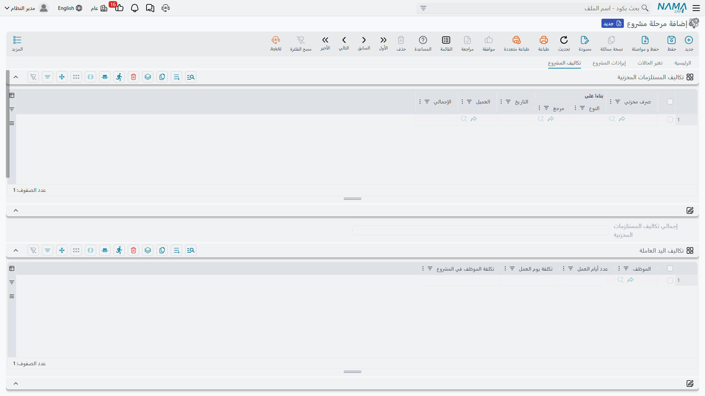

# مستندات مرحلة المشروع

معظم شاشات ادارة المشاريع (ECPA) مبنية حول الأشخاص والساعات. أما **مستند مرحلة مشروع (Project Stage)**
فهو الشاشة الوحيدة في الوحدة التي تترك الساعات جانباً وتسأل سؤالاً مختلفاً: هذه المجموعة من المراحل —
هل انتهت في موعدها، وهل حققت ربحاً؟

والمستند يجيب على السؤالين في ورقة واحدة. نصفه العلوي جدول زمني: تُدرِج المراحل بالترتيب، وتعطي كل
مرحلة عدداً مستهدفاً من الأيام، فيسلسل المستند التواريخ بحيث تبدأ كل مرحلة حيث انتهت سابقتها. وأي
تأخير يُسجَّل لاحقاً يدفع التواريخ **المتوقعة** إلى ما بعد التواريخ **المستهدفة**، فيقف العمودان جنباً
إلى جنب ويصبح حجم التأخير مرئياً بلا حساب. أما نصفه السفلي فورقة هامش ربح: تُرفق فيها الفواتير التي
حُصِّلت على العمل والمستندات التي كلّفته — الصرف المخزني، وأيام العاملين، وأيام الأصول، والخدمات
المشتراة، وسندات الصرف — ثم يجمع المستند الطرفين ويخرج برقم الربح.

**أين تجدها:** `ادارة المشاريع ← مشاريع ← مرحلة مشروع`. وكما هو الحال في كل شاشات الوحدة، تحتاج إلى كود
الترخيص `ecpa`.

## مستند مرحلة المشروع غير مرتبط بمشروع

قبل أي شيء آخر، حقيقة واحدة عن طريقة عمل هذه الشاشة، لأن بقية الصفحة تُقرأ قراءة مختلفة بعد معرفتها.

**لا يوجد في مستند مرحلة المشروع حقل للمشروع.** لن تجده في الصفحة الرئيسية، ولا في أي تبويب، ولا في
شاشة القوائم — والمستند لا يكتب أي شيء في المشروع إطلاقاً. والصلة بالمشروع غير مباشرة: كل سطر في الجدول
الزمني يسمّي **مرحلة (Project Milestone)**، والمراحل تتبع مشاريع، وهذا هو كل ما في العلاقة. فلا شيء
تُدخِله هنا يظهر في شاشة المشروع الإداري؛ ولا تتأثر التكلفة الحالية للمشروع، ولا حالته، ولا نسبة إتمامه.

ويترتب على ذلك ثلاثة أمور عملية:

- **تصل إلى المستند بكوده الخاص**، أو بنوع المشروع ونوعه الفرعي في رأس المستند، أو عن طريق محدداته — لا
  بالتنقل من داخل مشروع.
- **قد يحمل المستند الواحد مراحل من أكثر من مشروع.** فالنظام لا يتحقق من انتمائها لمشروع واحد. وهذا
  مفيد أحياناً (فترة تجهيز موقع مشتركة بين برجين في نفس المشروع العقاري)، وفيما عدا ذلك يبقى ضبطه
  مسؤولية انضباطك في التسمية.
- **اعتماد المستند لا "يُغلق" أي مرحلة.** فحالة المرحلة التي تضعها في السطر تعيش في السطر نفسه، ولا
  يُمسّ كارت المرحلة الأصلي.

اقرأ هذا المستند على أنه ورقة تجارية قائمة بذاتها عن مجموعة عمل محددة الاسم. فهذا ما هو عليه، وبهذا
المعنى فهو الموضع الوحيد في الوحدة الذي يجتمع فيه الإيراد والتكلفة على شاشة واحدة — راجع
[مصادر تكلفة وإيراد المشروع](/ar/modules/ecpa/ecpa-costing-and-profitability) للصورة الأوسع.

::: info مرحلة أم مستند مرحلة مشروع؟
كارتان مختلفان، والاسمان متقاربان بما يكفي لإرباك أي أحد. **المرحلة (Project Milestone)** ملف رئيسي —
مرحلة واحدة مسمّاة من مشروع واحد ("التصميم المبدئي" في مشروع مارينا تاور). أما **مرحلة مشروع
(Project Stage)** فهو المستند الذي نتحدث عنه هنا، وهو يُدرِج عدداً من تلك المراحل ويضع حولها جدولاً
زمنياً وهامش ربح. والمراحل نفسها تُولَّد من صفحة المراحل داخل المشروع؛ راجع
[المراحل ومصفوفة المراحل والتخصصات](/ar/modules/ecpa/projects/ecpa-milestones-and-matrix).
:::

## الجدول الزمني

تحمل الصفحة `الرئيسية` رأس المستند المعتاد — كود المستند ودفتره، وتوجيه المستند، وتاريخ التحرير،
والتاريخ الفعلي — بالإضافة إلى نوع المشروع ونوعه الفرعي اللذين يُصنَّف المستند تحتهما، وحالته، وخمس خانات
مرفقات، ووصف. ثم يأتي جريد `التفاصيل`، وهو الجدول الزمني.

خذ مكتباً هندسياً يدير مراحل تصميم مشروع **مارينا تاور**. ثلاث مراحل بالترتيب، تبدأ في الأول من مارس:

| المرحلة | العدد المستهدف لأيام المرحلة | عدد أيام عدم العمل | التاريخ المستهدف للبداية | التاريخ المستهدف للنهاية |
|---|---|---|---|---|
| التصميم المبدئي | 30 | 4 | 01-03-2026 | 31-03-2026 |
| التصميم الابتدائي | 45 | 6 | 31-03-2026 | 15-05-2026 |
| مستندات الطرح | 25 | 2 | 15-05-2026 | 09-06-2026 |

لم يُكتب من هذا الجدول سوى أربعة أرقام: الأعداد المستهدفة الثلاثة، و**تاريخ بداية السطر الأول**. وكل ما
عداها يحسبه المستند.

- **التاريخ المستهدف لنهاية المرحلة** = تاريخ بداية السطر + عدده المستهدف من الأيام.
- **التاريخ المستهدف لبداية المرحلة** في كل سطر بعد الأول هو تاريخ نهاية السطر السابق — فالمراحل مفترض
  أنها متتابعة بلا فواصل. اكتب تاريخ البداية في السطر الأول فقط.
- **عدد أيام عدم العمل** ملاحظة عن المرحلة لا مُدخَل في الجدولة. فهو لا يطيل التواريخ ولا يقصّرها،
  ولا يُستخدم إلا في إجمالي "صافي المدة بعد خصم أيام عدم العمل" أسفل الجريد.

ولأن السلسلة تسري من أعلى إلى أسفل، فطريقة تحريك مرحلة متأخرة هي تعديل العدد المستهدف لمرحلة سابقة عليها،
لا كتابة تاريخ في سطرها. ولا يجوز تكرار المرحلة الواحدة في المستند، والبحث يساعدك هنا: فهو يُخفي كل مرحلة
مستخدَمة بالفعل في السطور.

ويسجّل عمودان إضافيان موقف كل مرحلة: `حالة المرحلة` (مبدئي، قيد التنفيذ، منتهي) وبجوارها
`ملاحظات تغيير الحالة`.

### أيام التأخير والتواريخ المتوقعة

إلى جانب الأعمدة المستهدفة تقف ثلاثة أعمدة أخرى، وهي سبب أهمية إبقاء هذه الشاشة محدَّثة:

- **عدد أيام التأخير** — أيام التأخر في هذه المرحلة. و**لا يمكنك كتابته**. فهو لا يُكتب إلا عن طريق
  [تمديد مراحل المشروع](/ar/modules/ecpa/projects/ecpa-stage-extensions)، وهو المستند القصير الذي يمنح
  وقتاً إضافياً، وهو يحمل دائماً مجموع أيام التأخير من كل مستندات التمديد المعتمدة على تلك المرحلة.
- **التاريخ المتوقع للبداية** و**التاريخ المتوقع للنهاية** — نفس السلسلة مرة أخرى، لكن بعد إضافة أيام
  التأخير. فالتاريخ المتوقع لبداية السطر الأول هو تاريخه المستهدف، وبداية كل سطر بعده هي نهاية السطر
  السابق المتوقعة، ونهاية كل سطر = بدايته المتوقعة + العدد المستهدف من الأيام + أيام التأخير.

لنفترض أن العميل استغرق عشرة أيام إضافية لاعتماد الكتلة المعمارية، فاعتُمد تمديد بعشرة أيام على مرحلة
التصميم المبدئي. لن يتحرك العمود المستهدف — فهو الوعد، ويبقى شاهداً على الوعد. أما العمود المتوقع فيقول
الحقيقة:

| المرحلة | عدد أيام التأخير | التاريخ المتوقع للبداية | التاريخ المتوقع للنهاية | التاريخ المستهدف للنهاية |
|---|---|---|---|---|
| التصميم المبدئي | 10 | 01-03-2026 | 10-04-2026 | 31-03-2026 |
| التصميم الابتدائي | 0 | 10-04-2026 | 25-05-2026 | 15-05-2026 |
| مستندات الطرح | 0 | 25-05-2026 | 19-06-2026 | 09-06-2026 |

مرحلة واحدة متأخرة في أعلى الجدول دفعت البرنامج كله عشرة أيام إلى الأمام، وهو بالضبط ما يتوقعه المصمم،
وبالضبط الرقم الذي سيسأل عنه العميل.

### مجموعة الإجماليات

أسفل الجريد تجمع مجموعة `الإجماليات` — وهي للعرض فقط — أعمدة الجدول. وفي المثال السابق:

| الحقل | القيمة | كيف وصل إليها |
|---|---|---|
| إجمالي المدة المستهدفة | 100 | 30 + 45 + 25 |
| عدد أيام التأخير | 10 | مجموع تأخير السطور |
| إجمالي المدة المتوقعة | 110 | المستهدفة + التأخير |
| عدد أيام عدم العمل | 12 | 4 + 6 + 2 |
| صافي المدة المستهدفة (بعد خصم أيام عدم العمل) | 88 | 100 − 12 |
| صافي المدة المتوقعة (بعد خصم أيام عدم العمل) | 98 | 110 − 12 |

والسطران الأخيران هما سبب وجود عمود أيام عدم العمل أصلاً: فهما يحوّلان مدة التقويم إلى أيام عمل فعلية،
وهذا هو الرقم الذي يحتاجه مخطط الموارد.

وتحت الإجماليات تأتي مجموعة المحددات المعتادة — الشركة والفرع والإدارة والقطاع ومجموعة التحليل — كما في
أي مستند آخر.

### تبويب تغير الحالات

التبويب الثاني `تغير الحالات` يملؤه النظام بالكامل. وهو يحوي جريدين للتاريخ: أحدهما لحالات المراحل في
السطور (أي مرحلة، من أي حالة، إلى أي حالة، بواسطة من، ومتى)، والآخر لحالة المستند نفسه. ويُضاف سطر جديد
كلما تغيّرت حالة أو تغيّرت ملاحظة الحالة، فيُقرأ التبويب كسرد متتابع لكيفية تحرّك المراحل لا كلقطة
للوضع الحالي فقط. وتاريخ التغيير المسجَّل هو يوم إجراء التعديل، لا التاريخ الفعلي للمستند.

أما حالة المستند نفسه فتتيح ثلاث قيم — **قيد التنفيذ** و**منتهي** و**ملغي** — وهي تصف هذه الورقة. إنها
حالة مستند مرحلة المشروع، وليست حالة أي مشروع، ولا تنتقل إلى أي مكان آخر.

## جانب الإيراد

التبويب الثالث `إيرادات المشروع` هو الموضع الوحيد في ادارة المشاريع الذي يُربط فيه الإيراد بشيء غير
القيد المحاسبي للفاتورة نفسها.

يختار كل سطر **فاتورة مبيعات** واحدة، فيملأ المستند تاريخها الفعلي وعميلها وصافي قيمتها نيابة عنك، ولا
يبقى أمامك قرار حقيقي سوى: أي الفواتير تخص هذه المجموعة من المراحل؟ وفي مارينا تاور، فاتورتان:

| فاتورة المبيعات | التاريخ الفعلي | العميل | الإجمالي |
|---|---|---|---|
| SI-2026-0431 | 12-04-2026 | مارينا للتطوير | 250,000 |
| SI-2026-0588 | 27-05-2026 | مارينا للتطوير | 168,000 |

**إجمالي إيرادات المشروع: 418,000.**

وانتبه لنوع المستند الذي يقبله هذا العمود. فهو فاتورة المبيعات من جانب سلاسل الإمداد في النظام — نفس
المستند الذي ترفعه أي شركة تجارية. أما [فاتورة المشروع](/ar/modules/ecpa/invoicing/ecpa-project-invoice)
التي ترفعها هذه الوحدة على الساعات والمصاريف المجمّعة فهي مستند آخر، وليست ما يجمعه هذا الجريد. ومن
يفوتر بالكامل عن طريق فواتير المشروع سيجد فائدة محدودة في تبويب الإيرادات، وعليه أن يقرأ رقم الربح على
هذا الأساس.

## جانب التكلفة

التبويب الرابع `تكاليف المشروع` يضم خمسة جريدات، لكل منها إجماليه الخاص. وهذه هي النظرة المجمّعة الوحيدة
للتكلفة في الوحدة — وأهم ما ينبغي فهمه عنها أن **كل سطر فيها يُوضَع باليد**.

لا شيء يصل إلى هنا وحده. فالصرف المخزني الذي خرج للمشروع لا يظهر، وتنفيذ المهام المعتمد لا يظهر، وسند
المصروف المعتمد لا يظهر، وفاتورة المشتريات لا تظهر. لا بد أن يفتح شخص هذا التبويب ويختار كل مستند بنفسه.
أما الأتمتة التي تقدمها الشاشة فحقيقية لكنها متواضعة: بمجرد اختيارك المستند تُقرأ منه تواريخه والطرف
المقابل وقيمته، فتكون الأرقام أرقام المستند لا تقديراً معاد كتابته.

::: info الصورة مقطوعة عند حد الشاشة
تُظهر الصورة أعلاه أول جريدين فقط. أما جريدات الأصول الثابتة والمناولة والتكاليف الأخرى ومجموعة ربح
المشروع فتقع أسفل المساحة الظاهرة من التبويب؛ انزل بالشاشة الحقيقية للوصول إليها.
:::

**تكاليف المستلزمات المخزنية** — المواد التي صُرفت من المخزن للعمل. اختر مستند **صرف مخزني** فيمتلئ
السطر بمستنده الأصلي وتاريخه والعميل وصافي قيمته.

**تكاليف اليد العاملة** — رقم العمالة الوحيد في هذه الورقة، وهو مكتوب لا مجمَّع. ثلاثة أعمدة: الموظف،
و`عدد أيام العمل`، و`تكلفة يوم العمل`. والرابع `تكلفة الموظف في المشروع` هو حاصل ضربهما. فمهندس موقع
40 يوماً بتكلفة 700 لليوم = 28,000. ولاحظ أن هذه تكلفة **يوم** لا ساعة، وهي مستقلة تماماً عن التكلفة
الساعية التي تستخدمها المهام وأوقات التنفيذ في باقي الوحدة — فلا شيء يُنسخ بين الاثنين في أي اتجاه.

**تكاليف الأصول الثابتة** — نفس الشكل للمعدات: أصل ثابت، وعدد أيام العمل، وتكلفة يوم العمل، وحاصل
ضربهما. فجهاز مساحة 30 يوماً بتكلفة 600 لليوم = 18,000. ولا صلة لهذا الرقم بالإهلاك ولا بعهدة الأصول ولا
بأي مستند آخر في وحدة الأصول الثابتة؛ إنه تقديرك أنت لقيمة وقت المعدة على هذا العمل.

**تكاليف المناولة** — اختر **فاتورة متنوعات** فيمتلئ السطر بمستندها الأصلي وتاريخها والمورد وصافي قيمتها.
وعنوان الجريد يسمّي الحالة الشائعة، لكن العمود يقبل ببساطة أي فاتورة متنوعات، فأي خدمة مشتراة فُوترت بهذه
الطريقة مكانها هنا.

**التكاليف الأخري** — اختر **سند صرف** فيمتلئ السطر بمستنده الأصلي وتاريخه والمورد الذي صُرف له والمبلغ.
وهذا هو الوعاء الجامع لكل مال خرج من المنشأة على العمل دون أن يمر بفاتورة مشتريات.

واستكمالاً لمثال مارينا تاور:

| جريد التكلفة | الإجمالي |
|---|---|
| إجمالي تكاليف المستلزمات المخزنية | 96,000 |
| إجمالي تكاليف اليد العاملة | 74,500 |
| إجمالي تكاليف الأصول الثابتة | 18,000 |
| إجمالي تكاليف المناولة | 12,500 |
| إجمالي التكاليف الأخري | 9,200 |

## تجميع الربح

في أسفل تبويب التكاليف تعيد مجموعة `ربح المشروع` عرض الإجماليات الستة وتعطي النتيجة. والحساب بسيط بقدر
ما يبدو:

| السطر | القيمة |
|---|---|
| إجمالي إيرادات المشروع | 418,000 |
| ناقص: إجمالي تكاليف المستلزمات المخزنية | 96,000 |
| ناقص: إجمالي تكاليف اليد العاملة | 74,500 |
| ناقص: إجمالي تكاليف الأصول الثابتة | 18,000 |
| ناقص: إجمالي تكاليف المناولة | 12,500 |
| ناقص: إجمالي التكاليف الأخري | 9,200 |
| *(مجموع التكاليف)* | *210,200* |
| **ربح المشروع** | **207,800** |

تعرض المجموعة الإجماليات الستة بجوار رقم الربح؛ فإن أردت إجمالي التكلفة كرقم مستقل فاجمع سطور التكلفة
الخمسة. وتُعاد هذه الحسابات في كل مرة يُحفظ فيها المستند ومرة أخرى عند اعتماده، فالمستند المحدَّث باستمرار
يعرض هامشاً محدَّثاً باستمرار.

وهناك أمران **لا** يعنيهما هذا الرقم:

- **لا يُقارَن بشيء.** لا توجد ميزانية تقديرية مُلزِمة في ادارة المشاريع. فأعمدة التكلفة التقديرية في
  المشروع وقيمة التعاقد في رأسه أرقام للاسترشاد فقط، ولا شيء في هذه الشاشة — لا تحقق ولا تنبيه ولا منع —
  يقارن الربح أو التكاليف بها. ومستند يُظهر خسارة يُعتمد بنفس سهولة مستند يُظهر ربحاً.
- **ليس تكلفة المشروع.** فـ`التكلفة الحالية` في شاشة المشروع الإداري هي تكلفة العمالة من أوقات التنفيذ
  المعتمدة ولا شيء غيرها. الرقمان يجيبان على سؤالين مختلفين، وليس مقصوداً أن يتطابقا. راجع
  [مصادر تكلفة وإيراد المشروع](/ar/modules/ecpa/ecpa-costing-and-profitability).

## الاعتماد، والحارس ضد ازدواج التكلفة

مستند مرحلة المشروع مستند بالمعنى الكامل: له دفتر وكود وتوجيه وتاريخ تحرير وتاريخ فعلي، ويُعتمد لا
يُحفظ فقط. والاعتماد يُجري ثلاثة اختبارات.

1. **لا بد أن يحمل السطر الأول تاريخ بداية مستهدفاً** — فبدونه لا يوجد ما تبدأ منه السلسلة.
2. **لا يجوز تكرار المرحلة الواحدة** في نفس المستند.
3. **لا يجوز احتساب أي مستند إيراد أو تكلفة مرتين.** فنفس فاتورة المبيعات أو الصرف المخزني أو فاتورة
   المتنوعات أو سند الصرف لا يجوز أن يتكرر في هذا المستند، **ولا** أن يكون موجوداً بالفعل في مستند مرحلة
   مشروع آخر معتمَد. وإن حدث، رُفض الاعتماد.

والاختبار الثالث هو البطل الصامت في هذه الشاشة. فلأن المستندات تُجمَّع باليد، ولأن عمل المشروع الواحد
يتوزع عادة على عدة مستندات مراحل، فالخطر الواضح هو احتساب نفس الفاتورة على ورقتين — والنظام لن يسمح لك
بذلك. ولاحظ أن الاختبار يغطي الجريدات الأربعة التي تحمل مرجعاً لمستند. أما جريدا اليد العاملة والأصول
الثابتة فلا يحملان مستنداً، فلا شيء يمنع إدخال نفس الموظف أو نفس الأصل في سطرين؛ اضبط هذين الجريدين
بنفسك.

وليس للاعتماد أثر مالي في ذاته: فمستند مرحلة المشروع **لا ينشئ قيداً محاسبياً ولا حركة مخزنية**. آثاره
داخلية بالكامل — يُضاف تاريخ الحالة وتُعاد الإجماليات. ولذلك فإلغاؤه رخيص بالمثل: لا يوجد ما يُعكَس،
ويبقى تاريخ الحالات سجلاً لما جرى.

## تمديد المرحلة

أنت لا تكتب التأخير في الجدول الزمني أبداً. فإذا تأخرت مرحلة، ارفع مستند
[تمديد مرحلة مشروع](/ar/modules/ecpa/projects/ecpa-stage-extensions) على مستند المرحلة، مسمّياً المرحلة
وعدد الأيام والسبب. واعتماده يكتب الأيام في السطر المقابل هنا ويعيد تسلسل التواريخ المتوقعة، وهكذا وصلت
العشرة أيام إلى مرحلة التصميم المبدئي في الجدول أعلاه.
