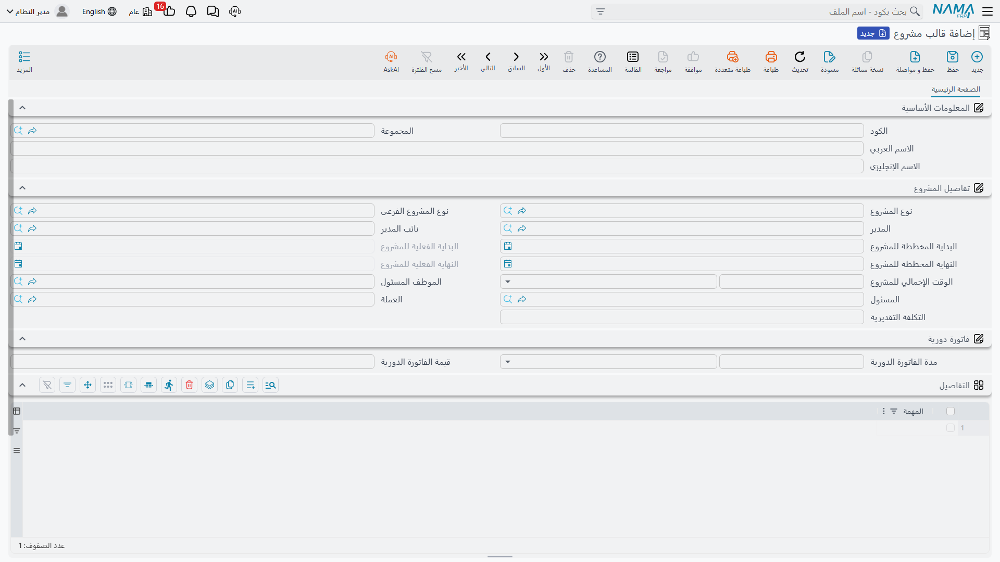

# قوالب المشاريع

معظم المكاتب تكرر عدداً محدوداً من الأعمال. فمشروع التشطيبات الداخلية يحتاج دائماً حصراً للموقع وتصوراً مبدئياً ورسومات تفصيلية وحزمة عطاء وإشرافاً موقعياً، ويستغرق عادة ستة أشهر، وينتهي على الحسابات نفسها. و**قالب المشروع** في وحدة **ادارة المشاريع (ECPA)** يلتقط هذا التكرار حتى لا يُعاد كتابته مع كل عميل جديد.

تجده في **ادارة المشاريع > مشاريع > قالب مشروع**، ويحتاج ترخيص `ecpa`.

والقالب ملف رئيسي صغير هادئ — لا دفتر له ولا توجيه مستند ولا شيء فيه يُعالَج — وقيمته كلها فيما يوفّره على غيره من إدخال.

## اقرأ هذا قبل أن تصمم قالباً

القالب **لا يُنشئ مشاريع**. فليس في الوحدة زر «إنشاء مشروع من قالب»، ولا يحمل [المشروع الإداري](/ar/modules/ecpa/projects/ecpa-managed-project) حقل قالب أصلاً.

الذي يستهلك القالب هو [عرض أسعار المشروع](/ar/modules/ecpa/projects/ecpa-sales-quotation)، والسلسلة هي:

**قالب ← عرض أسعار ← عرض أسعار معتمد ← مشروع ومهام**

فصمّم قوالبك لمن يكتب عرض السعر، لا لمدير المشروع. وهذه الجملة وحدها تفسّر كل ما يأتي في هذه الصفحة.

## ماذا تحمل الشاشة

**المعلومات الأساسية** — **الكود** و**المجموعة** و**الاسم العربي** و**الاسم الإنجليزي**، ومعها **حافظة الحسابات** الخاصة بالقالب.

**تفاصيل المشروع** — افتراضات هذا النوع من الأعمال: **نوع المشروع** و**نوع المشروع الفرعى**، و**المدير** و**نائب المدير**، و**البداية** و**النهاية** المخططتان، و**الوقت الإجمالي للمشروع** بوحدته، و**الموظف المسئول** و**المسئول** و**التكلفة التقديرية** و**العملة**.

**التفاصيل** — جدول بعمود واحد يسرد **المهام** التي يحتاجها هذا النوع من الأعمال عادة. وكل سطر يشير إلى سجل مهمة قائم، وبهذا تُكتب منهجية المكتب: الخطوات المعيارية، بترتيبها، وبالتسمية نفسها في كل مرة.

**الحسابات** و**المحددات** — الحساب الرئيسي وخمسة حسابات مرقّمة، والشركة والقطاع والفرع والإدارة ومجموعة التحليل.

وفي مكتب *نما للعمارة* يكفي قالب واحد لمعظم أعماله: الكود `TPL-FITOUT` والاسم *تشطيبات داخلية*، نوع المشروع **تشطيبات داخلية**، والوقت الإجمالي **6 شهور**، وخمسة أسطر مهام — حصر الموقع، تصور مبدئي، رسومات تفصيلية، حزمة عطاء، إشراف موقعي.

## ما الذي ينتقل، وإلى أين

هناك تسليمان اثنان، وكل منهما ينقل شيئاً مختلفاً.

**حين يختار المُسعِّر القالب على عرض الأسعار**، يستقبل العرض **البداية** و**النهاية** المخططتين و**الوقت الإجمالي للمشروع** ووحدته، و**كل أسطر قائمة المهام**. وهذه هي اللحظة التي يثبت فيها القالب جدواه: يفتح المُسعِّر عرضاً فارغاً ويسمّي القالب، فتكون المهام الخمس المعيارية ومدة الستة أشهر حاضرة أمامه للتسعير.

أما بقية ما على القالب — نوع المشروع ونوعه الفرعي والمديران والموظف المسؤول والتكلفة التقديرية والعملة والمحددات — فلا يُنقل في هذه الخطوة، بل يكتبه المُسعِّر على عرض الأسعار، ومن هناك *تصل* إلى المشروع.

**وحين يُشغَّل زر «إنشاء المشروع و المهام» على عرض أسعار معتمد**، يُبنى [مشروع إداري](/ar/modules/ecpa/projects/ecpa-managed-project) و[مهامه](/ar/modules/ecpa/tasks/ecpa-tasks). وكل ما على المشروع الجديد تقريباً مصدره عرض الأسعار. أما الشيء الوحيد الذي يُؤخذ من القالب في هذه اللحظة فهو **حافظة الحسابات**، وبشرط ألا يحمل عرض الأسعار حسابات خاصة به.

::: tip أين تضع الحسابات
لأن حافظة الحسابات هي الحقل الوحيد الذي يصل من القالب إلى المشروع مباشرة، فيستحق أن تملأه بعناية في كل قالب تنشئه. وهي أنظف وسيلة في الوحدة لتقول: «كل مشاريع التشطيبات الداخلية تُسجَّل على هذه الحسابات ما لم تنص الصفقة على غير ذلك».
:::

## ما الذي يبقى على المشروع الجديد

المشروع المبني بهذه السلسلة يصل ومعه ترويسته وتواريخه وقائمة مهامه، **ولا شيء غير ذلك**. فجداول **المراحل** و**التخصصات** و**التفاصيل** كلها فارغة، وكذلك سجل **فريق العمل**.

وليس هذا نقصاً في قالبك — فالقالب لا يملك مراحل ولا تخصصات ليعطيها. ابنِها على المشروع بالطريقة المعتادة: إما بكتابتها في صفحتَي المراحل والتخصصات، وإما باختيار **مجموعة المراحل و التخصصات** التي تملأ الجداول الثلاثة دفعة واحدة، وتشرحها [صفحة المراحل والمصفوفة](/ar/modules/ecpa/projects/ecpa-milestones-and-matrix).

فالقسمة العملية إذن: **القالب يوحّد قائمة العمل والتقويم، ومجموعة المراحل والتخصصات توحّد توزيع المراحل والتخصصات.** والمكاتب التي تُعدّ الاثنين معاً يصلها المشروع الجديد شبه مكتمل باختيارين.
