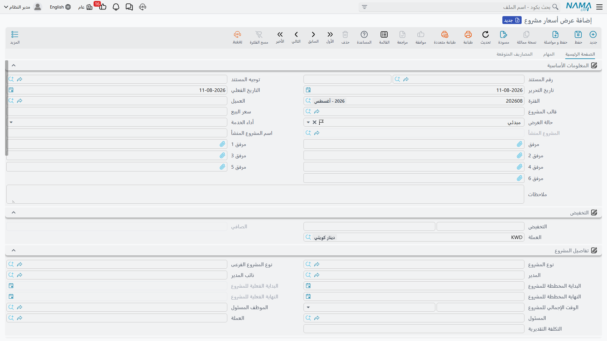
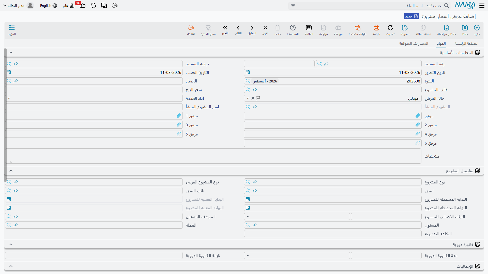

# عرض أسعار المشروع

::: info الترخيص المطلوب
`ecpa` — كود واحد للوحدة كلها، ولا توجد تراخيص فرعية.
:::

كل شاشة أخرى في وحدة ادارة المشاريع (Project Management / ECPA) تفترض أن المشروع موجود بالفعل. أما
عرض الأسعار فهو المكان الذي يأتي منه المشروع. إنه العرض الذي يقدمه المكتب الاستشاري أو الهندسي لعميله
قبل أن يبدأ أحد في العمل: هذه هي المهام التي سننفذها، وهؤلاء هم الأشخاص الذين سينفذونها وعدد الساعات
المتوقع لكل منهم، وهذه هي المصاريف المتوقعة، وهذا هو السعر، وهذه هي طريقة السداد التي نقترحها.

وعندما يوافق العميل، يحوّل زر واحد على الشاشة نفسها هذا العرض إلى مشروع حقيقي ومجموعة مهام — وهذا
الزر هو الطريق الفعلي لإنشاء مشروع جديد في الوحدة. لا يوجد إجراء اسمه «إنشاء مشروع من قالب» في أي
مكان؛ القالب يغذّي **عرض الأسعار**، وعرض الأسعار هو الذي ينشئ المشروع.

تجد الشاشة في **ادارة المشاريع ← مشاريع ← عرض أسعار مشروع**.

::: tip عرض الأسعار لا يُحدث أي أثر محاسبي
عرض الأسعار مستند: له دفتر وتوجيه مستند (توجيه) وتاريخ تحرير وتاريخ فعلي، وأنت تعتمده. لكن اعتماده لا
ينتج عنه أي قيد محاسبي على الإطلاق — لا مدين ولا دائن ولا طلب أعمال. هو سجل لما قبل البيع ومصدر
للمشروع الذي سينشأ منه؛ والمال لا يتحرك إلا مع
[فاتورة المشروع](/ar/modules/ecpa/invoicing/ecpa-project-invoice).
:::

## المثال الذي سنسير عليه

مكتب «نما للاستشارات» يقدّم عرضاً للعميل **C-0012** لدراسة جدوى، مستعيناً بقالب المشروع **TP-STUDY**.
العمل يتكون من جزأين — *معاينة الموقع* و*كتابة التقرير* — ويشارك فيه أربعة موظفين. المكتب يطلب
**25,000** مقابل العمل، بخصم مجاملة 4 %، على ثلاث دفعات.

كل رقم في هذه الصفحة مأخوذ من هذا العمل نفسه، وهو نفس العمل الذي تجري فوترته في صفحة
[فاتورة المشروع](/ar/modules/ecpa/invoicing/ecpa-project-invoice).

## البداية من قالب مشروع

أول ما يفعله معظم المستخدمين في عرض جديد، بعد اختيار العميل، هو اختيار **قالب المشروع**. القالب هيكل
محفوظ لنوع معيّن من الأعمال — راجع [قوالب المشاريع](/ar/modules/ecpa/projects/ecpa-project-templates) —
وأهم ما يقدمه هنا هو قائمة أسماء المهام التي يتضمنها عادة هذا النوع من الأعمال.

اختيار **TP-STUDY** يفعل شيئين على الفور:

1. ينقل تاريخ البداية المخططة والنهاية المخططة والوقت الإجمالي للمشروع من القالب إلى مجموعة
   **تفاصيل المشروع** في العرض.
2. يملأ جدول **التفاصيل** بسطر لكل مهمة في القالب: `معاينة الموقع` و`كتابة التقرير`.

::: warning اختيار القالب يستبدل جدول التفاصيل
سطور المهام لا تُدمج، بل يُفرَّغ الجدول ويُعاد بناؤه من القالب. اختر القالب قبل أن تبدأ في تعديل أسماء
المهام، لا بعده.
:::

الساعات ليست جزءاً مما يسلّمه القالب. القالب يحمل الأسماء، أما الجهد والمال فيُبنيان في الصفحة التالية.

## الصفحة الرئيسية — العرض نفسه

مجموعة **المعلومات الأساسية** تحمل بيانات المستند (الدفتر والكود، توجيه المستند، تاريخ التحرير،
التاريخ الفعلي، الفترة) ثم البيانات التجارية: **العميل** و**قالب المشروع** و**سعر البيع**
و**حالة العرض**، ثم **المشروع المنشأ** الذي يملؤه النظام لاحقاً. ويستحق حقل **اسم المشروع المنشأ**
عناية خاصة: فهو الذي يصبح اسم المشروع الذي ينشئه العرض، باللغتين. وتكتمل المجموعة بسبع خانات للمرفقات
وحقل الملاحظات.

مجموعة **التخفيض** إلى جوارها تحمل النسبة والقيمة معاً، ثم **الصافي** والعملة. اكتب سعر البيع فيتبعه
الصافي؛ وأدخل تخفيضاً فيصبح الصافي هو سعر البيع ناقص قيمة التخفيض. وتستقر الأرقام عند الحفظ.

في مثالنا: **سعر البيع 25,000**، وتخفيض **4 %** قيمته **1,000**، و**الصافي 24,000**.

مجموعة **تفاصيل المشروع** هي ما سيُسلَّم إلى المشروع عند قبول العرض: نوع المشروع ونوعه الفرعي، المدير
ونائب المدير، البداية والنهاية المخططة والفعلية، الوقت الإجمالي للمشروع، الموظف المسئول، والتكلفة
التقديرية. ولا شيء هنا مُلزِم؛ فالتكلفة التقديرية رقم استرشادي داخلي، والوحدة لا تقارنه أبداً بما
يكلّفه العمل فعلاً. راجع
[مصادر تكلفة وإيراد المشروع](/ar/modules/ecpa/ecpa-costing-and-profitability) لمعرفة ما يتجمّع فعلاً
وما لا يتجمّع.

مجموعة **فاتورة دورية** تحمل مدة وقيمة، للمكاتب التي تحاسب عملاءها باشتراك دوري بدلاً من عمل مقيس.
وتنتقل هذه القيمة إلى المشروع المنشأ كسطر فوترة دورية، ومن هناك تلتقطها
[فاتورة المشروع](/ar/modules/ecpa/invoicing/ecpa-project-invoice).

مجموعة **الإجماليات** هي التي تراقب فيها العرض وهو يُجمَع. والقيم الثلاث كلها تُحسب عند الحفظ:

| الإجمالي | مصدره |
|---|---|
| **إجمالى عدد الساعات المتوقعة** | عمود إجمالى الوقت في جدول التفاصيل |
| **إجمالى أجر الساعة لكل المهام** | حاصل ضرب الوقت المخطط في أجر الساعة لكل سطر في صفحة المهام |
| **إجمالى بند المصروف** | عمود القيمة في جدول المصاريف المتوقعة |

وأخيراً، مجموعة الحسابات أسفل الصفحة تحمل حسابات الذمم التي سيحملها المشروع: حساب رئيسي وخمسة حسابات
أخرى. ولا تعرض عليك القوائم إلا الحسابات المعرَّفة كذمم للمشاريع، وما تختاره هنا يُنسخ إلى المشروع
المنشأ. وإن تركتها فارغة استُخدمت حسابات القالب بدلاً منها.

### جدول التفاصيل — قائمة أسماء بإجمالي محسوب

لجدول التفاصيل عمودان: اسم **المهمة** و**إجمالى الوقت**. واسم المهمة نص يُكتب ولا يُختار من قائمة،
لأن المهمة لم تُنشأ بعد وقت تقديم العرض — ويعرض النظام اقتراحات مبنية على الأسماء الموجودة في الجدول
حتى تكتبها بنفس الصياغة في كل مكان.

أما عمود **إجمالى الوقت** فلا تكتبه أنت. في كل عملية حفظ يُستبدل بمجموع الوقت المخطط لكل سطر في صفحة
**المهام** يحمل نفس اسم المهمة. فجدول التفاصيل إذن ملخّص لصفحة المهام، وصفحة المهام هي مكان العمل
الحقيقي.

## صفحة المهام — حيث يُبنى السعر

هذه هي قلب عرض الأسعار: سطر لكل موظف في كل مهمة — من ينفذها، وبين أي تاريخين، وكم ساعة تخطط له، وبأي
أجر للساعة، وكم تبلغ التكلفة. ويمكن تحديد سقف يومي وشهري للساعات في كل سطر، وينتقل هذا السقف إلى
المهمة المنشأة.

سطورنا الأربعة:

| الموظف | المهمة | الوقت المخطط | أجر الساعة | التكلفة المخططة |
|---|---|---|---|---|
| E-101 أحمد | معاينة الموقع | 40 | 120 | 4,800 |
| E-102 سارة | معاينة الموقع | 20 | 150 | 3,000 |
| E-101 أحمد | كتابة التقرير | 30 | 120 | 3,600 |
| E-103 عمر | كتابة التقرير | 10 | 200 | 2,000 |

وعند الحفظ يصبح إجمالى الوقت في جدول التفاصيل **60** لمعاينة الموقع و**40** لكتابة التقرير، ويصبح
**إجمالى عدد الساعات المتوقعة 100** و**إجمالى أجر الساعة لكل المهام 13,400**.

::: tip الأجر هنا أجر بيع، ويرافق العمل حتى الفاتورة
أجر الساعة الذي تدخله في هذا الجدول يُنسخ إلى جدول المنفذين في المهمة المنشأة، وهو الأجر الذي تستخدمه
فاتورة المشروع عند تجميع الأوقات الموافق عليها. أما التكلفة فرقم مختلف تماماً مصدره الرواتب، ويُحسب
على مستند تنفيذ المهام. والفرق بين الاثنين مشروح جنباً إلى جنب في
[إعدادات ادارة المشاريع](/ar/modules/ecpa/ecpa-configuration).
:::

أعمدة الوقت الفعلي والتكلفة الفعلية ونسبة التنفيذ في هذا الجدول تخص العمل المنفَّذ لا العرض، وتظل
فارغة في عرض الأسعار. أما عمود **المستند المنشأ** في أقصى الجدول فيمتلئ بعد إنشاء المشروع والمهام،
ويخبرك بالمهمة التي تحوّل إليها كل سطر.

## صفحة المصاريف المتوقعة — تقدير داخلي

الصفحة الثالثة تسرد المصاريف النثرية التي تتوقع أن يتحملها العمل: اسم المهمة، و**بند مصروف مشروع**
(إلزامي)، و**القيمة**، وعلامة **مصروف داخلى**.

في دراستنا: `انتقالات` بقيمة **1,500** بدون علامة مصروف داخلى، و`طباعة` بقيمة **300** مع العلامة —
أي **إجمالى بند المصروف 1,800**.

وعلامة *مصروف داخلى* تعني هنا ما تعنيه في بقية الوحدة: المصروف الداخلي تكلفة يتحملها المكتب، والمصروف
الخارجي مصروف يُتوقع تحميله على العميل. والقصة كاملة في
[مصاريف المشروع](/ar/modules/ecpa/expenses/ecpa-project-expenses).

لكن كن واضحاً بشأن طبيعة هذه الصفحة: هي **تقدير يعيش على عرض الأسعار**. تغذّي إجمالي المصاريف ولا شيء
غيره — فقبول العرض لا ينشئ طلبات مصروف ولا سندات مصروف ولا أي سطر تكلفة على المشروع. وعندما ينفَّذ
العمل فعلاً تُسجَّل المصاريف الحقيقية كطلبات مصروف مشروع بالطريقة المعتادة، وهي — لا هذه — ما يمكن
لفاتورة المشروع أن تحاسب عليه.

## جدول الدفعات

اختر **نموذج الدفع** فيُبنى جدول الدفعات ويُحدَّث مع كل حفظ: سطر لكل قسط بكوده ووصفه ونسبته وقيمته
وتاريخ استحقاقه. ونموذج `50-30-20` على صافٍ قدره 24,000 يعطي **12,000** و**7,200** و**4,800**.

وإلى جوار المبالغ تقف أعمدة **القيمة المدفوعة** و**المحصل نظاميا** و**المتبقي**، وهي تتابع السداد:
فعند تحصيل سندات قبض على عرض الأسعار تظهر المبالغ في *المحصل نظاميا* وينقص *المتبقي*. ولا ينتج عن عرض
الأسعار نفسه أي أثر محاسبي — فالقيد يخص سند القبض.

::: info الجدول وعد بالسداد وليس تعليمات فوترة
لا شيء يربط سطور الأقساط هذه بفاتورة المشروع. الفاتورة لا تقرأها إطلاقاً، وليست مصدراً لأي مبلغ في
الفاتورة. فإذا كان المكتب يحاسب بالأقساط فإنه يكتب قيمة القسط في سطر الفاتورة يدوياً.
:::

وجدول **الملاحظات** تحته يحمل عمودين نصيين حرين لأي شيء آخر يخص العرض. وهما يبقيان على عرض الأسعار،
ولا يُنقلان إلى المشروع ولا إلى أي مهمة.

## القبول والرفض وإنشاء العمل

توجد ثلاثة أزرار في الصفحة الرئيسية.

**قبول العرض** يضبط **حالة العرض** على **مقبول**، و**رفض العرض** يضبطها على **مرفوض** — والحالة
المسجَّلة رفضٌ صريح، فاستعمله حين لا يمضي العرض قُدُماً، لا بوصفه وسيلة لتعليق العرض مؤقتاً. وكلا
الزرين يعمل على الشاشة المفتوحة أمامك، فعليك حفظ المستند بعدهما. وتضم قائمة الحالات أيضاً **مبدئي** — وهي
الحالة التي يبدأ بها أي عرض جديد — و**بانتظار رد العميل** التي تضبطها بنفسك أثناء التفاوض.

أما **إنشاء المشروع والمهام المتعلقة به** فهو الزر المهم. وقبل أن يعمل:

- يجب أن يكون العرض **محفوظاً**؛
- ويجب أن تكون حالته **مقبول**، وإلا رفض الزر العمل وأخبرك بذلك؛
- ويجب أن يكون له **قالب مشروع**؛ فالعرض بلا قالب يُرفض برسالة تطلب منك اختيار قالب مشروع.

ثم يسألك سؤالين — **مجموعة المشروع** و**مجموعة المهام** — وهما يحددان مجموعات الترقيم التي تُصنَّف
تحتها السجلات الجديدة. وإن تركت مجموعة المشروع فارغة أخذ المشروع كود عرض الأسعار نفسه.

وما يبنيه، في مثالنا:

1. **مشروع واحد**، اسمه من *اسم المشروع المنشأ*، للعميل C-0012، بحالة **قيد التنفيذ**. ويستلم نوع
   المشروع ونوعه الفرعي، المدير ونائب المدير، التواريخ المخططة والفعلية، الوقت الإجمالي للمشروع،
   المسئول والتكلفة التقديرية، ومحدداته، وحافظة الحسابات من عرض الأسعار (أو من القالب إن لم تكن
   موجودة في العرض). ويُضاف إليه سطر فوترة دورية واحد يحمل قيمة الفاتورة الدورية. ثم يُكتب المشروع
   الناتج في حقل **المشروع المنشأ** على عرض الأسعار.
2. **مهمة لكل اسم مهمة مذكور** — `معاينة الموقع` و`كتابة التقرير`. كل مهمة مرتبطة بالمشروع الجديد
   وبالعميل، وتبدأ بحالة **قيد التنفيذ**، وترث الفترة المخططة ونوع المشروع والمدة المخططة من عرض
   الأسعار، وتحمل سطر منفّذ لكل سطر في صفحة المهام يحمل اسمها: الموظف، والوقت المخطط، وأجر الساعة،
   والتكلفة المخططة، والسقف اليومي والشهري.
3. **روابط العودة**: كل سطر في جدول التفاصيل يسجّل المهمة التي نتجت عنه، وكل سطر في صفحة المهام يسجّل
   مستنده المنشأ، فتعرف دائماً إلامَ تحوّل العرض.

وإذا أدخل أحد موظفاً أمام اسم مهمة لم يظهر أصلاً في جدول التفاصيل، أُضيف السطر الناقص إلى الجدول
تلقائياً.

::: warning تشغيل الزر مرة ثانية يعيد بناء المهام من عرض الأسعار
الإجراء قابل لإعادة التشغيل عن قصد: فإن ضغطته ثانية عثر على المشروع والمهام التي أنشأها سابقاً بدلاً
من تكرارها. لكن جدول المنفّذين في كل مهمة **يُفرَّغ ويُعاد بناؤه** من صفحة المهام في عرض الأسعار،
فيضيع أي سطر منفّذ أُضيف أو حُذف أو عُدِّل أجره على المهمة نفسها. وبعد أن يبدأ العمل الحقيقي، عدِّل
المهمة لا عرض الأسعار.
:::

## ما لا ينتقل إلى المشروع

يستحق أن تعرفه قبل أن يبحث عنه أحد في المشروع الجديد:

- **السعر المتفق عليه يبقى على عرض الأسعار.** لا سعر البيع ولا الصافي يُكتب على المشروع، فلا توجد على
  المشروع قيمة تعاقد تُقارن بها الفواتير. ولا شيء في الوحدة يضع سقفاً لما يمكن فوترته — راجع صفحة
  [فاتورة المشروع](/ar/modules/ecpa/invoicing/ecpa-project-invoice).
- **المصاريف المتوقعة تبقى على عرض الأسعار**، كما سبق.
- **جدول الدفعات يبقى على عرض الأسعار.**
- **جداول المراحل (Milestones) والتخصصات وفريق العمل في المشروع الجديد تكون فارغة.** فالمراحل ومصفوفة المراحل
  والتخصصات تُبنى على المشروع بعد إنشائه — راجع
  [المراحل ومصفوفة المراحل والتخصصات](/ar/modules/ecpa/projects/ecpa-milestones-and-matrix).
- **سطور الملاحظات تبقى على عرض الأسعار.**

## العمل من أوله إلى آخره

1. عرض أسعار جديد للعميل **C-0012** بقالب **TP-STUDY** ← يمتلئ جدول التفاصيل بـ *معاينة الموقع* و
   *كتابة التقرير*.
2. صفحة المهام: أربعة سطور مجموعها **100 ساعة مخططة** و**13,400** تكلفة عمالة مخططة.
3. صفحة المصاريف المتوقعة: انتقالات **1,500** (خارجي) وطباعة **300** (داخلي) ← **1,800**.
4. سعر البيع **25,000**، وتخفيض 4 % = **1,000**، و**الصافي 24,000**.
5. نموذج الدفع `50-30-20` ← أقساط **12,000 / 7,200 / 4,800**.
6. احفظ. تقرأ الإجماليات 100 و13,400 و1,800.
7. **قبول العرض**، ثم احفظ مرة أخرى.
8. **إنشاء المشروع والمهام المتعلقة به** مع مجموعة مشروع ومجموعة مهام ← المشروع **Q-000123** بحالة
   قيد التنفيذ، والمهمتان *معاينة الموقع* و*كتابة التقرير* بمنفّذيهما.

ومن هنا يُسجَّل العمل على [مستندات تنفيذ المهام](/ar/modules/ecpa/task-execution/ecpa-timesheets)،
ثم [يُوافَق عليه](/ar/modules/ecpa/task-execution/ecpa-timesheet-approval)، ثم يُفوتَر على
[فاتورة المشروع](/ar/modules/ecpa/invoicing/ecpa-project-invoice) — وهناك تتحول الـ 25,000 إلى مال.
