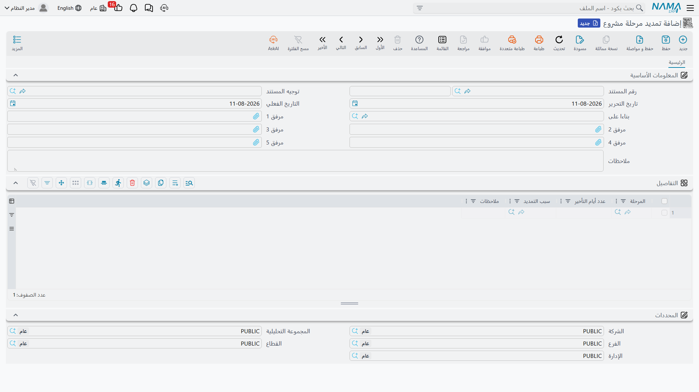

# تمديد مراحل المشروع

[مستند مرحلة المشروع](/ar/modules/ecpa/projects/ecpa-project-stages) يحمل الوعد: كل مرحلة، وعددها
المستهدف من الأيام، والتواريخ المترتبة عليها. ثم تتأخر المراحل، ويبقى السؤال: ماذا نفعل بالتأخير؟ وتجيب
ادارة المشاريع (ECPA) إجابة مقصودة — **أنت لا تعدّل الجدول الزمني لاستيعاب التأخير**. فالتواريخ المستهدفة
تبقى كما اتُّفق عليها تماماً، ويُسجَّل التأخير في مستند مستقل له تاريخه وحجمه وسببه.

وهذا المستند هو **تمديد مرحلة مشروع**، وهو الشيء الوحيد في الوحدة القادر على إطالة مستند المرحلة. فعمود
`عدد أيام التأخير` في مستند المرحلة لا يمكن الكتابة فيه؛ بل يُكتب من هنا.

**أين تجده:** `ادارة المشاريع ← مشاريع ← تمديد مرحلة مشروع`، تحت كود الترخيص `ecpa`.

## الشاشة

صفحة واحدة، وقصيرة. رأس المستند هو الطقم المعتاد — كود المستند ودفتره، وتوجيه المستند، وتاريخ التحرير،
والتاريخ الفعلي، وخمس مرفقات، ووصف — بالإضافة إلى حقل واحد أهم من البقية.

حقل **بناءا على** يسمّي مستند مرحلة المشروع الذي يجري تمديده، ولا بد من ملئه أولاً. فالبحث عن المرحلة في
السطور أسفله مقصور على المراحل الموجودة في ذلك المستند — وهو بالضبط ما تريده، إذ لا يمكن للتمديد أن يطيل
إلا مرحلة يجدولها المستند بالفعل — لكن معنى ذلك أن البحث لا يُرجع شيئاً إطلاقاً ما دام حقل «بناءا على»
فارغاً. فإن بدا لك البحث معطّلاً، فهذا هو السبب في الغالب الأعم.

ثم يأخذ جريد `التفاصيل` سطراً لكل مرحلة متأخرة:

| العمود | ما يوضع فيه |
|---|---|
| **المرحلة** | المرحلة التي تأخرت. إلزامية، ولا بد أن تكون إحدى مراحل المستند الأصلي. |
| **عدد أيام التأخير** | عدد أيام التأخر. إلزامي. |
| **سبب التمديد** | السبب، يُختار من قائمة الأسباب. اختياري. |
| **ملاحظات** | الصياغة الحرة للسبب، لما لا يستوعبه كود السبب من تفاصيل. |

وأسفل الجريد تأتي مجموعة المحددات المعتادة.

ولا يوجد في هذا المستند حقل لطالب التمديد ولا للمعتمِد. فمن رفع المستند يسجّله النظام باعتباره محرّره،
وإن كانت التمديدات تحتاج اعتماداً في منشأتك فذلك يتم عبر آلية الموافقات العامة في النظام لا عبر شيء خاص
بهذه الشاشة.

## ماذا يفعل الاعتماد

لنكمل مثال مارينا تاور من صفحة مستند المرحلة. المستند يجدول التصميم المبدئي (30 يوماً من أول مارس)،
والتصميم الابتدائي (45 يوماً)، ومستندات الطرح (25 يوماً)، بنهاية مستهدفة في 9 يونيو. ثم يستغرق العميل عشرة
أيام إضافية لاعتماد الكتلة المعمارية.

1. ارفع مستند تمديد، واضبط **بناءا على** على مستند مرحلة مارينا تاور، وأضف سطراً واحداً: التصميم
   المبدئي، 10 أيام تأخير، والسبب *تأخر اعتماد العميل*.
2. اعتمد المستند.
3. افتح مستند المرحلة. سترى سطر التصميم المبدئي وقد صار **عدد أيام التأخير 10**، وتاريخاً متوقعاً
   للنهاية في 10 أبريل مقابل تاريخ مستهدف في 31 مارس. ولأن التواريخ المتوقعة تتسلسل كما تتسلسل المستهدفة،
   فقد تحرك التصميم الابتدائي ومستندات الطرح عشرة أيام أيضاً، وصارت مجموعة الإجماليات تقرأ:
   **إجمالي المدة المستهدفة 100، عدد أيام التأخير 10، إجمالي المدة المتوقعة 110**.

ولنفترض بعدها أن الاستشاري الإنشائي أضاع أربعة أيام في التصميم الابتدائي. ارفع مستند تمديد **ثانياً** على
نفس مستند المرحلة، بسطر واحد: التصميم الابتدائي، 4 أيام. وبعد اعتماده يصبح المستند: التصميم المبدئي 10
أيام تأخير، والتصميم الابتدائي 4، وإجمالي التأخير 14، وإجمالي المدة المتوقعة 114.

ويستحق هذا المستند الثاني وقفة، لأنه يكشف كيف يعمل الحساب فعلاً. فالتمديد لا **يضيف** أيامه إلى ما كان
موجوداً قبله. بل في كل مرة يُعتمد فيها تمديد، يعيد النظام قراءة **كل مستندات التمديد المعتمدة على ذلك
المستند**، ويجمع أيام التأخير لكل مرحلة على حدة، ثم يكتب المجاميع في سطور مستند المرحلة — واضعاً صفراً
في كل مرحلة لم يمسّها أي تمديد. ثم يعيد تسلسل التواريخ المتوقعة ويعيد حساب مجموعة الإجماليات.

والنتيجة المريحة أن الأرقام لا يمكن أن تنحرف:

- **إلغاء مستند تمديد يُزيل أيامه هو بالضبط**، لا أكثر ولا أقل، وتبقى بقية التمديدات بأيامها.
- **تصحيح مستند تمديد** — بتغيير عدد الأيام أو بنقل السطر إلى مرحلة أخرى — يترك مستند المرحلة حاملاً
  المجموع المصحَّح، لا مجموع القديم والجديد معاً.
- **نقل التمديد إلى مستند مرحلة آخر** بتغيير حقل «بناءا على» ينظّف المستند الذي جاء منه كما يحدّث
  المستند الذي انتقل إليه.

وكما هو الحال في مستند المرحلة نفسه، ليس للتمديد أثر مالي: فاعتماده لا يكتب قيداً محاسبياً ولا يحرّك
مخزوناً. وغرضه كله هو أرقام أيام التأخير تلك وسجل أسبابها.

## الأسباب وأنواع الأسباب

السبب المكتوب في السطر يأتي من قائمة من مستويين، تُجهَّز مرة واحدة ثم تُترك.

**نوع سبب تمديد مرحلة** هو المستوى الخارجي — العائلة التي ينتمي إليها السبب. والتجهيز المعتاد ثلاثة أو
أربعة أنواع: *العميل*، *الاستشاري*، *المقاول*، *قوة قاهرة*.

**سبب تمديد مرحلة** هو السبب نفسه، ويحمل حقل **نوع السبب** المشير إلى أحد الأنواع أعلاه. فقد يسجّل مكتب
هندسي مثلاً:

| سبب التمديد | نوع السبب |
|---|---|
| تأخر اعتماد التصميم المقدَّم | العميل |
| تأخر تسليم الموقع | العميل |
| تأخر ورود ملاحظات الاستشاري | الاستشاري |
| إعادة رسم بعد تغيير تصميمي | المقاول |
| توقف بسبب الطقس | قوة قاهرة |

والشاشتان ملفان رئيسيان بسيطان: كود، ومجموعة، واسم عربي واسم إنجليزي، وخانات مرفقات، ومحددات. لا أكثر —
وهذا هو المقصود — ولا شيء خلفهما. فالسبب لا يغيّر عدد الأيام الممنوحة، ولا يقيّد المستندات التي يجوز
استخدامه عليها، ولا يغذّي أي حساب في أي مكان من الوحدة. وإنما توجد القائمتان لتصبح سنة كاملة من
التمديدات قابلة للفلترة والقراءة: *كم يوماً خسرناه بسبب العميل، وكم خسرناه بسببنا نحن؟* وهذا سؤال لا
يُجاب عليه إلا إذا اختيرت الأسباب باتساق، وهو ما يجعل تجهيز القائمتين جيداً أمراً يستحق العناء وإن كان
لا شيء يفرضه.
