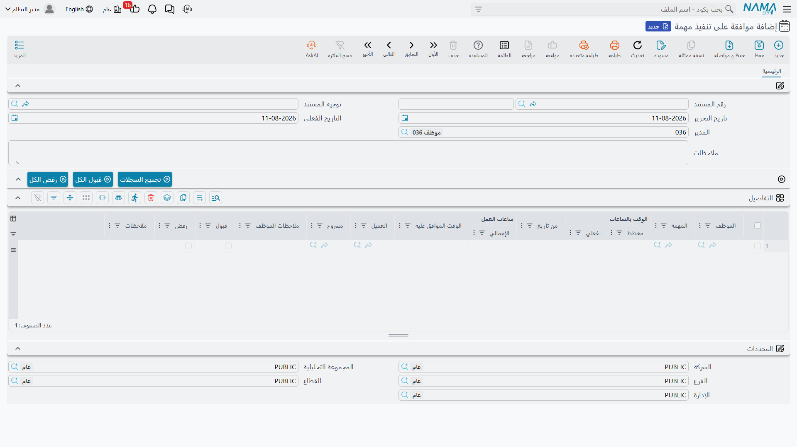
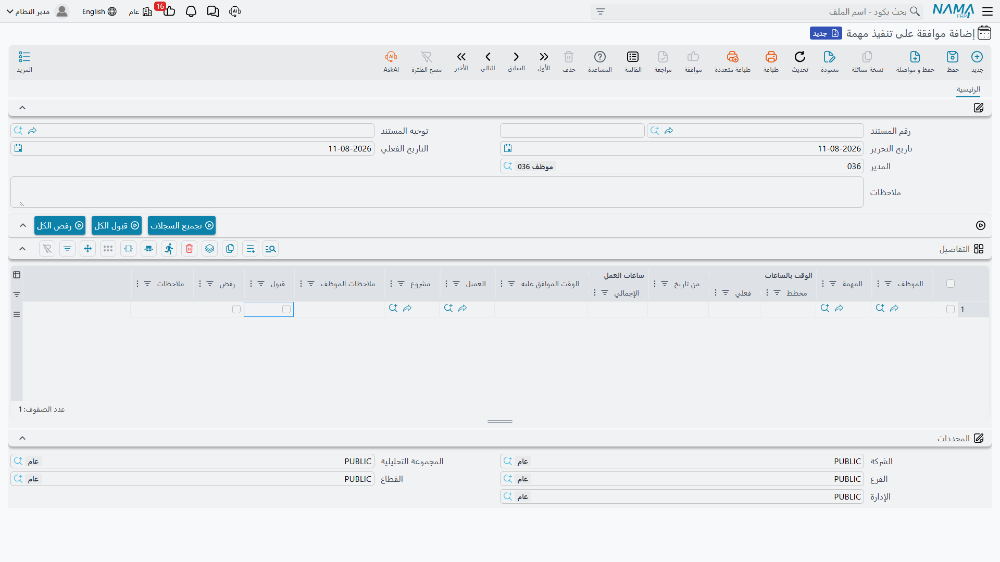

# الموافقة على أوقات التنفيذ

الساعات المسجَّلة على مستند [تنفيذ مهام](/ar/modules/ecpa/task-execution/ecpa-timesheets) ادّعاء لا واقع. تجلس في عمود **الوقت المسجل** على المهمة، ولا تكلّف المشروع شيئاً، ولا تحرّك نسبة إتمام. ومستند **موافقة على تنفيذ مهمة** هو الذي يحوّلها إلى واقع: يفتح مدير المشروع مستنداً، ويجذب إليه كل ما قدّمته فرقه، ويقرّر سطراً سطراً ما يقبله وكم يقبل منه، ثم يحفظ. وذلك الحفظ هو اللحظة التي يصير فيها الوقت المسجل وقتاً **فعلياً**، وتتحرك فيها التكلفة الفعلية للمهمة، وتلحق بها إجماليات المشروع.

تجده في **ادارة المشاريع > تنفيذ / الموافقة على المهام > موافقة على تنفيذ مهمة**، ويحتاج ترخيص `ecpa`.

## الترويسة قصيرة، وحقل المدير هو كل نموذج الصلاحيات

ليس هناك كثير لتملأه: دفتر وكود، وتاريخ تحرير، وتاريخ فعلي، وملاحظات — و**المدير**، الذي يأتي افتراضياً موظفَ المستخدم المسجَّل دخوله.

وهذا الحقل وحده يقرر ما يُسمَح للمستند برؤيته. فحين تضغط *تجميع السجلات* لا يعيد النظام إلا ساعاتٍ تخصّ مشاريعَ **هذا المدير مديرُها أو نائب مديرها**. فلا يستطيع مدير أن يجذب — ومن ثمّ لا يستطيع أن يوافق على — فرق مدير آخر. واترك الحقل فارغاً يرفض التجميع أن يعمل أصلاً.

وتوجيه المستند اختياري هنا. فالموافقة لا ترفع قيداً محاسبياً خاصاً بها، ولذلك لا يحمل التوجيه إلا ضبطاً واحداً موصوفاً في آخر هذه الصفحة.

## تجميع السجلات — بناء الجدول

يُبنى جدول هذا المستند بزر **تجميع السجلات**، وهكذا يُقصد استعماله: لا تكتب سطوراً، بل تجمّعها ثم تقرّر فيها.

وضغطُه يسأل مجموعة أسئلة مدى، كلها اختيارية:

| السؤال | ماذا يضيّق |
|---|---|
| **من مشروع / إلى مشروع** | مدى أكواد المشاريع |
| **من مرحلة / إلى مرحلة** | مدى أكواد مراحل المشروع (Project Milestone) |
| **من موظف / إلى موظف** | مدى أكواد الموظفين — وهي طريقة المدير في اعتماد شخص واحد في المرة |
| **من تاريخ / إلى تاريخ** | أيام العمل المطلوب جذبها |
| **هذا الشهر** | موضوع افتراضياً؛ وما دام موضوعاً فهو يتجاوز التاريخين بالشهر الميلادي الحالي |

وفوق أي إجابة تعطيها يُطبَّق شرطان دائماً ولا سبيل إلى تخفيفهما:

- أن تكون حالة السطر **بإنتظار الموافقة** وأن يكون مستنده قد أُرسل للموافقة — فمستند تنفيذ لم يضغط أحد عليه *إرسال للموافقه* لا يُرى هنا مهما كان تاريخه؛
- أن يكون **مديرُ هذا المستند مديرَ مشروع السطر أو نائبَ مديره**.

وما يعود ليس نسخة من سطور التنفيذ. بل هي **مجمَّعة في سطر واحد لكل موظف، لكل يوم، لكل مهمة**. فمن سجّل أربع ساعات صباحاً وثلاثاً ونصفاً بعد الظهر على المهمة نفسها في اليوم نفسه يصل سطراً واحداً بـ 7:30. تُجمَع صوافي الأوقات، وتُضَمّ ملاحظات الموظف على سطوره في **ملاحظات الموظف**، وتُرتَّب السطور بالموظف ثم التاريخ ثم المهمة، فيُقرأ الجدول كما يعرفه مدير. ويتذكر كل سطر في صمت السطورَ الأصلية التي جاء منها، وبذلك يجد القرار طريقه إليها عند الحفظ.

أما السطور التي بلا مهمة فتُتجاوَز، وكذلك السطور التي ينقصها تاريخ أو وقت بداية — والتجميع يبلّغ عنها بدل أن يخمّن.

::: warning التجميع يستبدل الجدول
يملأ **تجميع السجلات** الجدول بنتيجة البحث — ولا يضيف إلى ما فيه. فاضغطه ثانيةً بإجابات مختلفة تضِع القرارات التي وضعتها من قبل. أجب عن الأسئلة بما يغطي كل ما تنوي اعتماده في جولة واحدة، أو احفظ المستند قبل أن تجمّع من جديد.
:::

والعمل الذي بُتّ فيه لن يعود: فمتى وُوفق على سطر أو رُفض لم يعد *بإنتظار الموافقة*، فلا يجده تجميع لاحق.

## القرار

يحمل كل سطر مجمَّع الوقائع في ناحية والقرار في الأخرى.

| العمود | ملاحظات |
|---|---|
| **الموظف** و**المهمة** و**مشروع** و**العميل** | من عمل على ماذا؛ والمشروع والعميل يُحدَّثان من المهمة |
| **من تاريخ** | **للقراءة فقط** — اليوم محلّ القرار |
| **الوقت بالساعات ǀ مخطط** | ساعات الشخص الموازَنة على تلك المهمة، محمولة هنا للسياق لترى ما ستستهلكه الموافقة |
| **ساعات العمل ǀ الإجمالي** | **للقراءة فقط** — الإجمالي الذي قدّمه الموظف عن ذلك اليوم وتلك المهمة |
| **الوقت الموافق عليه** | **رقم المدير.** اتركه فارغاً على سطر مقبول فيُملأ بالإجمالي؛ واكتب رقماً أصغر لتوافق على جزء من الادّعاء |
| **قبول** / **رفض** | وضع العلامة على أحدهما يرفعها عن الآخر |
| **ملاحظات الموظف** | ما كتبه الموظف على سطوره، مضموماً بعضه إلى بعض |
| **ملاحظات** | سبب المدير نفسه — وهو موضع تسجيل لماذا قُصّ الوقت أو رُفض |

وقاعدتان تُفرَضان عند الحفظ، وكلتاهما عن الحسم:

1. **يجب وضع علامة على واحدة بالضبط من «قبول» و«رفض» في كل سطر.** فترك الاثنين فارغين ليس «سأقرر لاحقاً» بل خطأ، ولن يُحفظ المستند. وإن كانت بعض السطور غير جاهزة فاحذفها من الجدول وجمّعها على مستند لاحق.
2. **لا يجوز أن يكون الوقت الموافق عليه سالباً ولا أن يتجاوز الإجمالي.** فلك أن تقصّ ادّعاءً، وليس لك أن تنفخه. والموافقة على ساعات أكثر مما سُجّل ليست مما يستطيعه هذا المستند.

و**قبول الكل** و**رفض الكل** يضعان العلامة على الجدول كله دفعة واحدة، وهي نقطة البداية المعتادة: اقبل كل شيء ثم امشِ على الاستثناءات.

## قرار المدير، خطوةً خطوة

استكمالاً للمثال: سجّلت سارة 7:30 على المهمة CPAT-0207 في 05/03 وضغطت *إرسال للموافقه*. يفتح مدير مشروعها مستند موافقة بنفسه مديراً ويضغط **تجميع السجلات** و*هذا الشهر* موضوع. فيصل سطراها سطراً واحداً:

| الموظف | المهمة | من تاريخ | مخطط | ساعات العمل ǀ الإجمالي | الوقت الموافق عليه |
|---|---|---|---|---|---|
| EMP-115 سارة | CPAT-0207 | 05/03 | 60.00 | 7:30 | *(فارغ)* |

فيقبله، لكنه يقصّ **الوقت الموافق عليه إلى 7:00** — فنصف الساعة بعد الخامسة كان استراحة — ويكتب «نصف ساعة غير محمَّلة» في الملاحظات. ثم يحفظ.

## ماذا يكتب الاعتماد

هنا الحصاد، وهو يبلغ ثلاثة مواضع في آن.

**على سطور التنفيذ الأصلية.** كل سطر بُني منه الصفّ يُختَم بالنتيجة: فالسطور المقبولة تصير **مقبول** والمرفوضة **مرفوض**. ثم يُعاد احتساب حالة مستند التنفيذ نفسه — فقبولُ الكل يجعله *مقبول*، ورفضُ الكل يجعله *مرفوض*، والخليط يبقيه على *بإنتظار الموافقة*. والسطور المقبولة تصير للقراءة فقط من تلك اللحظة؛ فلا تُعدَّل ولا تُحذف، ولا يُحذف المستند الذي يحملها.

**على سطر منفذ المهمة.** وهذا هو النقل الذي وُجدت السلسلة كلها من أجله:

- السطر المقبول ينقل الساعات الموافق عليها — **الوقت الفعلي += الوقت الموافق عليه**، و**الوقت المسجل −= الوقت الموافق عليه**؛
- السطر المرفوض يزيل الادّعاء فحسب — **الوقت المسجل −= الإجمالي** — ولا يضيف شيئاً إلى الفعلي؛
- ويُسحَب **يبدأ** على المهمة إلى أول يوم ووفق عليه فيها.

**على إجماليات المهمة والمشروع.** فكل مهمة مسّها المستند يُعاد تجميعها — التكلفة الفعلية لكل سطر منفذ بحاصل الوقت الفعلي × أجر الساعة، ونسبة تنفيذ السطر، ثم التكلفة الفعلية للمهمة وإجمالي وقتها الفعلي ونسبة إتمامها — ثم تُجمَّع المشاريع الأب بعدها. وهذا هو الطريق الوحيد الذي يتغير به رقم التكلفة على شاشة المشروع من تلقاء نفسه.

وفي المثال يصير سطر سارة على CPAT-0207 هكذا:

| | قبل | بعد |
|---|---|---|
| الوقت بالساعات ǀ الوقت المسجل | 7.50 | **0.50** |
| الوقت بالساعات ǀ فعلي | 0.00 | **7.00** |
| التكلفة ǀ الفعلية | 0.00 | **630.00** (7.00 × 90.00) |
| نسبة التنفيذ | 0 ٪ | **11.67 ٪** (7.00 ÷ 60.00) |

::: info نصف الساعة المقصوصة تبقى مسجَّلة
لاحظ الـ 0.50 الباقية في الوقت المسجل. فحين يوافق مدير على أقل مما ادُّعي لا يعود الفرق إلى الصفر — إنما يغادر خانة الوقت المسجل حين يُبَتّ فيه، وهو لم يُبَتّ. فلا هو مكلَّف على المهمة ولا قابل للمطالبة به، لكنه يظل محسوباً في سقف الساعات المخططة على سطر المنفذ. فإن بدأت مهمة ترفض مستندات تنفيذ أبكر مما توحي به ساعاتها المخططة، فالوقت المقصوص من موافقات سابقة هو السبب عادةً؛ ورفعُ الساعات المخططة على السطر هو سبيل فتح الطريق.
:::

كما يُتمّ المستند مهمتين تخصّان مستند التنفيذ. فأي سطر تنفيذ يحمل بند مصروف يُنتج [طلب مصروف المشروع](/ar/modules/ecpa/expenses/ecpa-project-expenses) عند هذه النقطة لا قبلها، و — إن كان توجيه مستند الموافقة موضوعاً عليه **إعادة اصدار التأثير المحاسبي لسندات التنفيذ** — يُعاد إصدار قيد كل مستند تنفيذ متأثر بوصفه طلب أعمال يُعالَج في الخلفية. وهذا الخيار وحده هو ما يجعل *عمل تأثير محاسبي للسطور الموافق عليها فقط* في توجيه مستند التنفيذ ذا فائدة: فبغير إعادة الإصدار لن يقيّد مستندٌ مضبوط على تقييد السطور الموافق عليها فقط شيئاً أبداً.

## نقض القرار

إلغاء الموافقة ينقض ذلك كله. فتعود سطور التنفيذ الأصلية إلى **بإنتظار الموافقة** بلا حكم عليها، وتُنقَل الساعات الموافق عليها من خانة الفعلي على المهمة إلى الوقت المسجل، ويُحذَف طلب المصروف الذي ولّدته الموافقة. وعندها تعود الساعات متاحة للتجميع والبتّ فيها من جديد.

## ماذا بعد

الساعات الموافق عليها هي عملة المطالبة في الوحدة. فعلى [فاتورة المشروع](/ar/modules/ecpa/invoicing/ecpa-project-invoice) يسعّرها إجراء *تجميع الأوقات والمصروفات* بحاصل أجر الساعة على المهمة مضروباً في **معدل عمل اليوم العادي** من شاشة [إعدادات ادارة المشاريع](/ar/modules/ecpa/ecpa-configuration) — فبأجر ساعة 90.00 ومعدل 1.5 وساعات سارة السبع الموافق عليها تقترح الفاتورة **945.00** في مقابل الـ 630.00 التي كلّفتها الساعات نفسها المشروعَ. وذلك الفارق هو هامش المكتب على وقتها، وهو سبب إبقاء الوحدة التكلفةَ والسعرَ على أجرين منفصلين.

وتعرض الفاتورة طريقاً ثانياً أيضاً، تسعّر فيه سطور التنفيذ مباشرة باجمالى تكلفتها. والطريقان يحسبان العمل نفسه في كيانين مختلفين، فينبغي للمنشأة أن تستقر على أحدهما وتلتزمه — وصفحة الفاتورة تعرض الاختيار.
