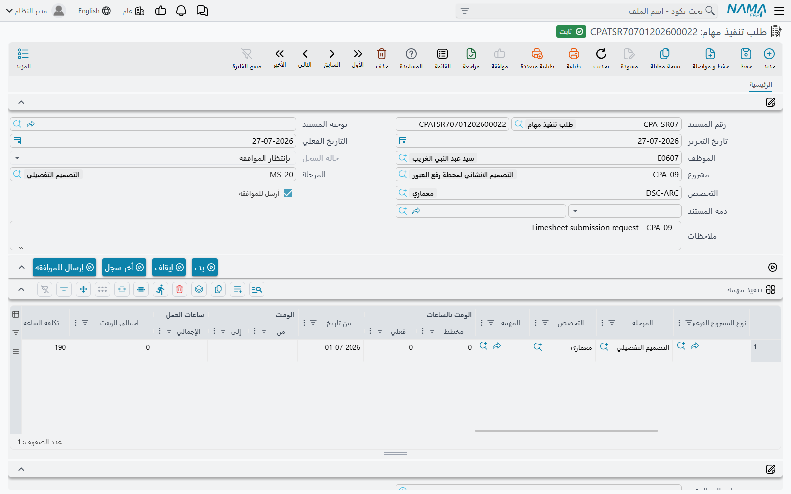
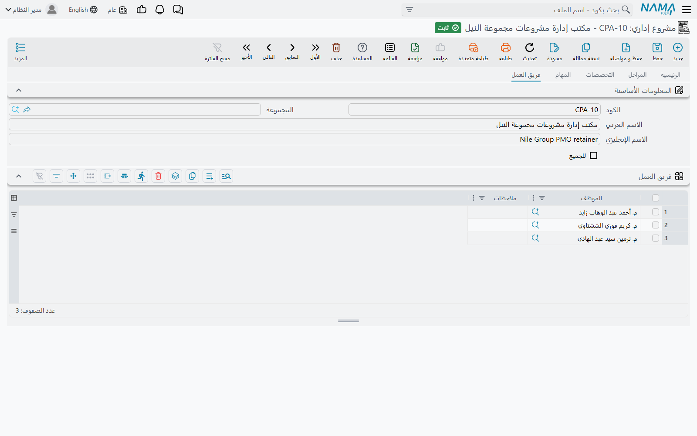
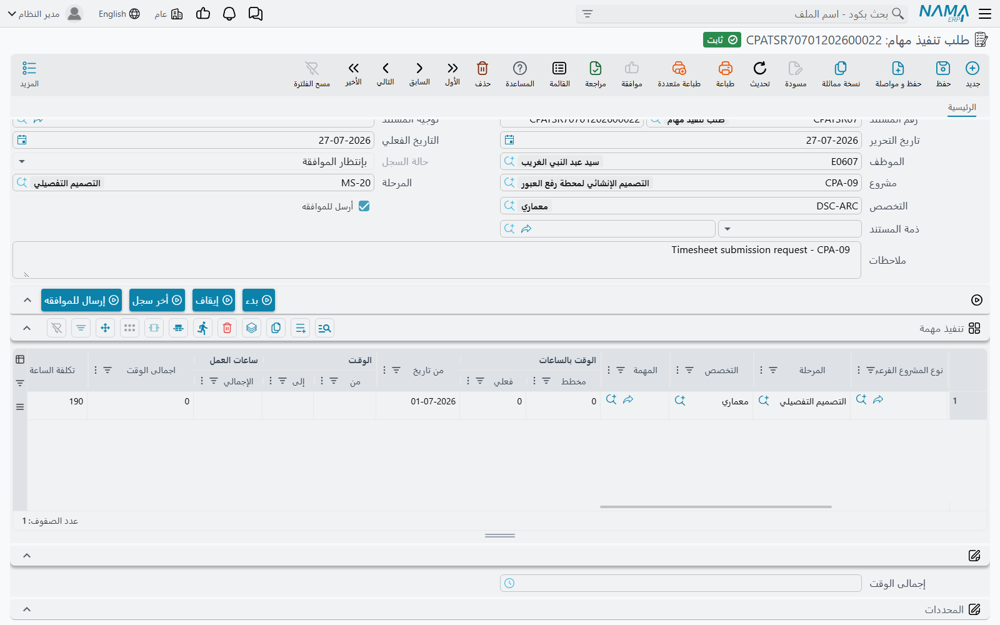

# تسجيل أوقات تنفيذ المهام

كل ما تبيعه منشأة خدمات مهنية يمرّ عبر هذه الشاشة. **تنفيذ مهام** هي الموضع الذي يكتب فيه الموظف ما فعله فعلاً — هذه المهمة من التاسعة إلى الواحدة، ثم تلك من الثانية إلى الخامسة والنصف — وهي النقطة التي تكفّ عندها الساعات عن كونها خطة وتصير رقماً تستطيع المنشأة أن تكلّفه وتوافق عليه وتطالِب به.

تجدها في **ادارة المشاريع > تنفيذ / الموافقة على المهام > تنفيذ مهام**، وتحتاج ترخيص `ecpa`.

وبخلاف [المهمة](/ar/modules/ecpa/tasks/ecpa-tasks) التي هي ملف رئيسي يُعدَّل في مكانه، هذا **مستند**: له دفتر وكود وتاريخ تحرير وتاريخ فعلي، واعتمادُه يُنتج آثاراً. ثلاثة بالضبط — يدفع الساعات إلى المهمة، وينقل المهمة والمشروع إلى *قيد التنفيذ*، ويرفع قيد تكلفة عمالة في الأستاذ. أما ما لا يفعله فهو إتمام القصة. فالساعات المسجَّلة تحطّ في خانة *الوقت المسجل* على المهمة، وهي كلمة الوحدة للتعبير عن «مُدَّعى ولم يُقبل بعد»؛ وتحويلها إلى عمل فعلي مهمة صفحة [الموافقة على أوقات التنفيذ](/ar/modules/ecpa/task-execution/ecpa-timesheet-approval).



## الترويسة — موظف واحد، يوم واحد

يغطي مستند التنفيذ عادةً **موظفاً واحداً في تاريخ فعلي واحد**. والترويسة تضبط الافتراضيات التي يرثها كل سطر، وحقلان منها يؤديان عملاً حقيقياً لا مجرد التعريف بالمستند.

| الحقل | ملاحظات |
|---|---|
| **رقم المستند** (الدفتر والكود) و**تاريخ التحرير** | هوية المستند المعتادة |
| **التاريخ الفعلي** | **الحقل الذي يحدد اليوم.** فتاريخ «اليوم» على كل سطر يُضبَط على التاريخ الفعلي للمستند مع كل حفظ — ولا تؤرَّخ السطور فرادى |
| **توجيه المستند** | اختياري، لكنه موضع كل السلوك القابل للضبط: الحسابات التي تُقيَّد عليها تكلفة العمالة، ومجموعة الاجراءات، ودفتر وتوجيه طلب المصروف المتولّد. والمستند المحفوظ بلا توجيه سجلّ إحصائي بحت |
| **الموظف** | يأتي افتراضياً موظفَ المستخدم المسجَّل دخوله على مستند جديد. وتغييره يختم ذلك الموظف على كل سطر موجود في الجدول |
| **مشروع** و**المرحلة** و**التخصص** | افتراضيات الترويسة؛ والسطر الذي يتركها فارغة يرجع إليها |
| **حالة السجل** | يديرها النظام — *لم يرسل بعد*، *بإنتظار الموافقة*، *مقبول*، *مرفوض* |
| **أرسل للموافقه** | يضبطه زر **إرسال للموافقه** لا يدك |
| **ذمة المستند** | الحساب الذي تُحمَّل عليه تكلفة هذا المستند؛ ويقبل سجل تكلفة إضافية أو مشروعاً أو عميلاً |
| **ملاحظات** | نص حر، ويصير بيان القيد في الأستاذ |

وتُختتم الشاشة بمجموعة **المحددات** — الشركة والمجموعة التحليلية والفرع والقطاع والإدارة — ولكل سطر أن يتجاوزها فرادى. فحيث يحمل السطر محدِّده الخاص فالسطر هو الغالب؛ وما يتركه السطر فارغاً يرجع إلى الترويسة.

## من يجوز له تسجيل وقت على ماذا

مرشّحان يحددان ما يستطيع الموظف اختياره، وهما بينهما يفسّران تقريباً كل اتصال دعم عنوانه «المهمة ليست في القائمة».

قائمة **المشروع** تعرض المشاريع التي ينتمي إليها الموظف فعلاً، وتتجاوز المشاريع المنتهية. والمشروع يبني تلك القائمة من مديره ونائب مديره ومن يُسمَّون في صفحة **فريق العمل** فيه، إضافةً إلى كل من يظهر في جدول منفذي أي مهمة من مهامه.



ثم تضيّق قائمة **المهمة** ذلك إلى مهام المشروع المختار التي حالتها *لم تبدأ* أو *قيد التنفيذ*، والتي يظهر هذا الموظف في جدول منفذيها. والحفظ يفحص ذلك مرة أخرى: فالموظف الذي ليس منفذاً للمهمة التي سمّاها يُرفض، وكذلك من وُسم سطر تنفيذه بـ**إنتهى من العمل**، وكذلك من لا تحتوي نافذةُ تاريخَي سطره التاريخَ الفعلي للمستند.

فترتيب إدخال شخص على عمل ما هو نفسه دائماً: أضفه إلى جدول منفذي المهمة، و**احفظ المهمة**، وعندها فقط يستطيع تسجيل وقت.

## السطر كتلة زمن

كل سطر في جدول **تنفيذ المهام** كتلة عمل متصلة: مهمة، ووقت بداية، ووقت نهاية. وسطران للشخص نفسه في اليوم نفسه يتداخل وقتاهما مرفوضان، فيُقرأ الجدول خطاً زمنياً حقيقياً لا مجموعةَ ادّعاءات متداخلة.

النصف الأول من الجدول يقول *على ماذا عُمل*:

| العمود | ملاحظات |
|---|---|
| **الموظف** | **إجباري**؛ ولا يُعرض إلا منفذو المهمة المختارة |
| **مشروع** و**العميل** و**نوع المشروع الفرعى** | المشروع يُختار أو يُورَث من الترويسة؛ والعميل والنوع الفرعي يتبعانه |
| **المرحلة** (Project Milestone) و**التخصص** | محصوران في مراحل المشروع وتخصصاته؛ ويرجعان إلى الترويسة |
| **المهمة** | **مرساة السطر.** فكل ما يليه — الوقت المسجل والموافقة والفاتورة — معلَّق بها |
| **الوقت بالساعات ǀ مخطط** و**ǀ فعلي** | **رقمان مرجعيان للقراءة فقط**، يُحدَّثان من سطر منفذ المهمة مع كل حفظ. يُريانك موازنة الشخص وإجماليه الموافق عليه على تلك المهمة، فترى السقف الذي تقترب منه وأنت تكتب |
| **اليوم** | يُفرَض عليه التاريخ الفعلي للمستند |
| **الوقـت ǀ من** و**الوقـت ǀ إلى** | **كلاهما إجباري.** ولا يجوز أن يكون وقت البداية بعد وقت النهاية |
| **نسبة الإتمام** | كم يعتبر الموظف المهمة مكتملة بعد كتلة العمل هذه؛ وكتابتها تملأ **النسبة المتبقية** بالفرق عن 100 |
| **الاجراء** و**الاجراء القادم** و**تاريخ الاجراء القادم** | انظر *الاجراءات المتولّدة عن السطر* أدناه |
| **ملاحظات** | ملاحظة الموظف نفسه. وهي تنتقل إلى مستند الموافقة حيث يراها المدير باسم *ملاحظات الموظف* |
| **مصروف داخلى** | يَسِم العمل بأنه داخلي — لا يُحمَّل على العميل |
| **مرفق** و**ذمة السطر** | ملف داعم والحساب الذي يُحمَّل عليه السطر |

والنصف الثاني هو المال.



| العمود | ملاحظات |
|---|---|
| **ساعات العمل ǀ الإجمالي** | وقت النهاية ناقص وقت البداية، كقيمة زمنية. محسوب |
| **اجمالى الوقت** | الرقم نفسه بالساعات العشرية — 3:30 تصير 3.50. وهذا هو الرقم الذي تستعمله كل الحسابات التالية |
| **تكلفة الساعة** | كم تكلّف المنشأةَ ساعةٌ من هذا الشخص. انظر أدناه |
| **اجمالى التكلفة** | صافي الساعات العشرية × تكلفة الساعة |
| **العملة** و**المعدل** و**المبلغ محلي** | العملة والمعدل من حساب المشروع؛ والمبلغ المحلي هو اجمالى التكلفة محوَّلاً |
| **الفاتورة** | **للقراءة فقط.** تُختم بفاتورة المشروع التي طالبت بهذا السطر، ووجودها هو ما يمنع المطالبة به مرة ثانية |

وحقل **إجمالى الوقت** تحت الجدول يجمع صوافي الأوقات، وهو الرقم الذي يقارنه الموظف بيومه قبل أن يضغط حفظ.

### من أين تأتي تكلفة الساعة

هذا هو الأجر الذي يستعمله **الأستاذ**، وهو ليس الأجر المكتوب على المهمة. فحين يكون خيار **تحديث تكلفة الساعة في تنفيذ المهمه من الرواتب** موضوعاً على شاشة [إعدادات ادارة المشاريع](/ar/modules/ecpa/ecpa-configuration) ويكون **عدد الساعات المعيارية شهرياً** غير صفر، يُعاد حسابها مع كل حفظ:

```text
تكلفة الساعة   =  إجمالي الراتب الثابت للموظف في شئون العاملين  ÷  عدد الساعات المعيارية شهرياً
اجمالى التكلفة =  صافي الساعات العشرية  ×  تكلفة الساعة
```

وحين يكون الخيار مرفوعاً، فتكلفة الساعة لك أن تكتبها، ومعها اجمالى التكلفة. ويهمّ أن تكتبهما فعلاً، لأن اجمالى التكلفة هو المبلغ الذي يحمله قيد الأستاذ والمبلغ الذي تطالِب به الفاتورة حين تجمّع التنفيذات — والسطر المتروك على صفر لا يقيّد شيئاً ولا يُطالَب بشيء.

ولا تخلط بين هذا وبين **أجر الساعة** على سطر منفذ المهمة، فذاك هو الذي يقود التكلفة المخططة والفعلية للمهمة نفسها. وصفحة [مهام المشروع](/ar/modules/ecpa/tasks/ecpa-tasks) تضع الاثنين جنباً إلى جنب؛ وخلاصتها أن أجر المهمة هو ما يساويه العمل للمشروع، وتكلفة الساعة هي ما تدفعه المنشأة راتباً عنه.

## المؤقّت

أربعة أزرار تجلس بين الترويسة والجدول، وأولها اثنان يحوّلان الشاشة إلى مؤقّت لمن يسجّلون العمل وهم يؤدونه لا في آخر اليوم.

**بدء** ينظر إلى آخر سطر في الجدول. فإن كان مكتملاً أضاف سطراً جديداً — ناسخاً منه الموظف والمشروع والمهمة — بتاريخ اليوم والوقت الحالي وقتَ بداية. وإن كان آخر سطر نصف مملوء أكمل ما ينقصه من تاريخ البداية أو وقتها. وفي الحالين تحصل على كتلة جارية بلا نهاية.

**إيقاف** يغلق تلك الكتلة: يُضبَط تاريخ النهاية على تاريخ بداية السطر، ووقت النهاية على الوقت الحالي، ويُعاد فوراً حساب صافي وقت السطر وإجمالي وقت المستند.

**أخر سجل** يفتح آخر مستند تنفيذ خاص بك، وهكذا يبدأ أكثر الناس يومهم — يفتح مستند الأمس، ويلقي عليه نظرة، ثم يضغط جديد.

**إرسال للموافقه** يسلّم المستند إلى المدير. ويجب حفظ المستند أولاً؛ وضغطُه يَسِم المستند بأنه أُرسل للموافقة ويعيد اعتماده، فينتقل هو وكل سطر فيه إلى **بإنتظار الموافقة**. وقبل ذلك يبقى المستند على *لم يرسل بعد* ولا يراه أي مستند موافقة.

## ماذا يفعل اعتماد مستند التنفيذ

احفظ المستند فتتبعه أربعة أمور.

1. **يبدأ العمل رسمياً.** فكل مهمة سُمّيت على سطر، ومشروعُ الترويسة، تنتقل من *لم تبدأ* إلى *قيد التنفيذ* إن كانت هناك.
2. **تحطّ الساعات على المهمة.** فلكل سطر يزيد **الوقت المسجل** على سطر المنفذ المطابق بمقدار صافي ساعات السطر العشرية. أما الوقت الفعلي فلا يتحرك — فلا شيء هنا موافَق عليه بعد.
3. **يُرفع قيد تكلفة في الأستاذ** — وله قسم مستقل أدناه.
4. **تُنشأ الاجراءات** من أي سطر يحمل نص إجراء قادم، بشرط أن يسمّي توجيه المستند مجموعة اجراءات.

ويسبق ذلك كله فحصان. فسقفا اليوم والشهر على سطر المنفذ يُقاسان على كل ما سجّله هذا الموظف من قبل على تلك المهمة في اليوم نفسه والشهر الميلادي نفسه، و — عند أول اعتماد للمستند — تُقارَن ساعات المهمة الفعلية مضافاً إليها ساعات هذا المستند بالساعات المخططة على سطر المنفذ. وتجاوز أي منهما مرفوض برسالة تسمّي المهمة.

::: info الساعات المخططة تُفحص من الطرفين
سطر المنفذ يرفض الحفظ حين يتجاوز الفعلي مضافاً إليه المسجل المخططَ، وكذلك يفعل مستند التنفيذ. وإن كان التوجيه موضوعاً عليه **الأخذ في الاعتبار الوقت المسجل مع الحفظ** حسب المستندُ الساعاتِ المعلّقة في تلك المقارنة أيضاً — وهو الأشدّ وغالباً الأصوب على مشروع مزدحم، لأنه يمنع الفريق من تجاوز موازنة المهمة جماعياً بينما الموافقات ما زالت في الطابور.
:::

### يوم سارة

استكمالاً للمثال من [مهام المشروع](/ar/modules/ecpa/tasks/ecpa-tasks): وضع المكتب علامة على *تحديث تكلفة الساعة في تنفيذ المهمه من الرواتب*، وضبط *عدد الساعات المعيارية شهرياً* على **176**. وراتب سارة الثابت 12 000، فتصير تكلفة ساعتها **68.18**.

تفتح مستند تنفيذ بتاريخ فعلي 05/03 والموظف EMP-115، وتسجّل كتلتين على المهمة CPAT-0207:

| # | المهمة | الوقـت ǀ من | الوقـت ǀ إلى | الإجمالي | تكلفة الساعة | اجمالى التكلفة |
|---|---|---|---|---|---|---|
| 1 | CPAT-0207 | 09:00 | 13:00 | 4:00 | 68.18 | 272.72 |
| 2 | CPAT-0207 | 14:00 | 17:30 | 3:30 | 68.18 | 238.63 |

فيقرأ **إجمالى الوقت** 7:30 — أي 7.50 ساعة، وهي مريحة داخل سقف الساعات الثماني اليومي على سطر منفذها. تحفظ، فـ:

- تنتقل المهمة CPAT-0207 والمشروع PRJ-014 إلى **قيد التنفيذ**؛
- يُظهر سطر سارة على المهمة **الوقت المسجل 7.50** و**الفعلي 0.00**؛
- ويُصطفّ قيد في الأستاذ بمبلغ **511.35**.

ثم تضغط **إرسال للموافقه**. فينتقل المستند وسطراه إلى **بإنتظار الموافقة**، ومن تلك اللحظة يراه مدير مشروعها.

## التأثير المحاسبي

يقيّد مستند التنفيذ تكلفة عمالة، ولا يفعل ذلك **إلا إذا كان للمستند توجيه مضبوط فيه جانبا المدين والدائن معاً**. فإن غاب أحد الجانبين لم يُنتَج قيد أصلاً — ويبقى المستند سجلّ ساعات إحصائياً بحتاً.

وحين يُضبَط الجانبان يُنتج المستند **سطر أستاذ واحداً لكل سطر تنفيذ**، بقيمة **اجمالى التكلفة** لذلك السطر، بعملة السطر وبمعدله. والسطور التي قيمتها صفر تُسقَط. والحسابات على كل جانب تأتي من التوجيه بالطريقة المعتادة، والمستند يعرض على ضبط الجانبين ثلاث ذمم للاختيار — **موظف** السطر، و**إدارة** ذلك الموظف، و**مشروع** السطر — إلى جانب ذمة المستند وذمة السطر. والمحددات تأتي من السطر حيث يحملها ومن الترويسة فيما عدا ذلك، وملاحظات المستند تصير بيان القيد. وفي الضبط المعتاد يُجعل القيد مديناً لحساب تكلفة عمالة أو إنتاج تحت التشغيل ودائناً لحساب استحقاق رواتب.

ولا يُكتب القيد لحظة ضغطك حفظ. فاعتماد المستند يرفع **طلب أعمال**، ويُعالَج الطلب في الخلفية — فالحفظ فوري، وفشل المعالجة يظهر في شاشة قائمة طلبات الأعمال حيث يمكن إعادة المحاولة من قائمة الإجراءات الإضافية.

::: tip قيد التكلفة بعد توقيع المدير فقط
ضع علامة على **عمل تأثير محاسبي للسطور الموافق عليها فقط** في توجيه مستند التنفيذ فلا تُحوَّل إلى سطور أستاذ إلا السطور التي وافق عليها مدير. وهذا وحده يعني ألا يُقيَّد شيء أبداً، لأن الموافقة تأتي بعد اعتماد مستند التنفيذ — فاقرنه بخيار **إعادة اصدار التأثير المحاسبي لسندات التنفيذ** في توجيه مستند **الموافقة**، وهو يعيد إصدار قيد مستند التنفيذ بعد أن تُتَّخذ القرارات. والخياران معاً هما طريقة المنشأة في إبقاء الادّعاءات غير الموافق عليها خارج الحسابات.
:::

## الاجراءات المتولّدة عن السطر

كثيراً ما يعرف الموظف عند إنهاء كتلة عمل ما الذي يجب أن يحدث بعدها. وكتابة ذلك في **الاجراء القادم** على السطر — مع تاريخ في **تاريخ الاجراء القادم** — تُنشئ سجل [إجراء](/ar/modules/ecpa/projects/ecpa-procedures) عند اعتماد المستند، مسمّى بذلك النص وحاملاً الموظف والعميل والمشروع والمهمة من السطر. ويُكتب السجل المنشأ في عمود **الاجراء المنشأ** على السطر فتفتحه من المستند مباشرة.

ولا يحدث هذا إلا إذا سمّى توجيه المستند **مجموعة الاجراءات**؛ فبلا مجموعة مضبوطة يبقى نص الإجراء القادم مجرد نص. وإلغاء مستند التنفيذ يحذف الاجراءات التي أنشأها.

## المصاريف المسجَّلة على سطر التنفيذ

يستطيع سطر التنفيذ أن يحمل أيضاً **بند مصروف** وقيمةً — أجرة الانتقال إلى الموقع، فاتورة الطباعة — فيسجّل الموظف ساعاته ومصروفه من جيبه في موضع واحد. وحين يُعتمد مستند موافقة على المستند يرفع النظام تلقائياً [طلب مصروف مشروع](/ar/modules/ecpa/expenses/ecpa-project-expenses) في **دفتر المستند** و**توجيه المستند** المسمَّيين في توجيه مستند التنفيذ، بسطر طلب لكل سطر مصروف يحمل المشروع والمهمة وبند المصروف والقيمة والموظف وعلامة *مصروف داخلى*. وإلغاء مستند التنفيذ يحذف الطلب المتولّد.

وهذان العمودان ليسا ضمن جدول تنفيذ المهام القياسي؛ فالمنشأة التي تريد تسجيل المصروف بهذه الطريقة تضيفهما إلى الجدول بتعديل تخطيط الشاشة أولاً. والبديل، وهو الأشيع، أن يُرفع طلب المصروف مباشرة على شاشته الخاصة.

## تعديل المستند بعد إرساله

متى وافق مدير على سطر تجمّد ذلك السطر. فلا يجوز تغيير موظفه ولا مشروعه ولا مهمته ولا تاريخه ولا وقتيه ولا ملاحظاته، ولا يجوز حذفه؛ ولا يجوز حذف المستند كله ما دام فيه سطر موافَق عليه. فتصحيح عمل موافَق عليه يبدأ من مستند الموافقة لا من مستند التنفيذ.

أما السطور المرفوضة أو التي ما زالت تنتظر فتبقى قابلة للتعديل. وإعادة اعتماد المستند تعيد آثاره نظيفة: تُطرح ساعات السطور القديمة المسجَّلة من المهمة وتُضاف الجديدة، ويُعاد إصدار قيد الأستاذ.

## طلب تنفيذ مهام

تحمل القائمة شاشة ثانية شبه مطابقة: **طلب تنفيذ مهام**، في **ادارة المشاريع > تنفيذ / الموافقة على المهام > طلب تنفيذ مهام**. وهي سجلّ **عمل مزمَع أو مُدَّعى** — الترويسة نفسها، والجدول نفسه، وصنف توجيه المستند نفسه، مع رفع أكثر تحقّقات مستند التنفيذ.

| | تنفيذ مهام | طلب تنفيذ مهام |
|---|---|---|
| الوقت من والوقت إلى | إجباريان | غير إجباريين |
| تداخل الكتل في اليوم نفسه | مرفوض | مسموح |
| اشتراط أن يكون الموظف منفذاً للمهمة | مفحوص | غير مفحوص |
| الساعات الفعلية مقابل ساعات المنفذ المخططة | مفحوصة | غير مفحوصة |
| تاريخ «اليوم» على السطر | يُفرَض دائماً من التاريخ الفعلي | يُملأ افتراضياً من التاريخ الفعلي عند فراغه فقط |
| إضافة الساعات إلى الوقت المسجل على المهمة | نعم | لا |
| قيد الأستاذ من توجيه المستند | نعم | نعم |

اقرأ السطر الأخير مرتين، فهو مغزى الشاشة والأمر الذي يفاجئ الناس: **الطلب المعتمَد يقيّد تكلفته في الأستاذ تماماً كما يفعل مستند التنفيذ**، عبر التوجيه نفسه، بالتقييم نفسه، وبالمعالجة نفسها. أما ما لا يفعله فهو مسّ المهمة. فالوقت المسجل يبقى كما كان، ولا تُستشار سقوف الساعات المخططة، ولا تتغير حالة المهمة.

وهذا المزيج يجعله مفيداً في التقاط العمل على نحو مرن — ساعات مُدَّعاة عن فترة قبل أن يقرر أحد إلى أي مهمة تنتمي، أو عمل أشخاص لم يدخلوا بعد جدول منفذي المهمة — مع إيصال التكلفة إلى الدفاتر رغم ذلك. أما الموافقة والمطالبة فتجريان على مستند تنفيذ المهام، فالمنشأة التي تحتاج أن تُعتمد ساعاتها ويُطالَب بها تسجّلها هناك.

## ماذا بعد

متى صار المستند على *بإنتظار الموافقة* تسلّم المدير الأمر — انظر [الموافقة على أوقات التنفيذ](/ar/modules/ecpa/task-execution/ecpa-timesheet-approval)، وهي موضع تحوّل الوقت المسجل إلى وقت فعلي وتحرّك تكلفة المهمة أخيراً. ثم تتبعها المطالبة على [فاتورة المشروع](/ar/modules/ecpa/invoicing/ecpa-project-invoice)، التي تسعّر العمل إما من اجمالى تكلفة هذه السطور وإما من الساعات الموافق عليها بأجر الساعة على المهمة. وصفحة الفاتورة تشرح أي الطريقين تختار؛ والمهم من هنا أن السطر الذي طولب به مرة يحمل ختم الفاتورة ولا يُجمَّع ثانية.
