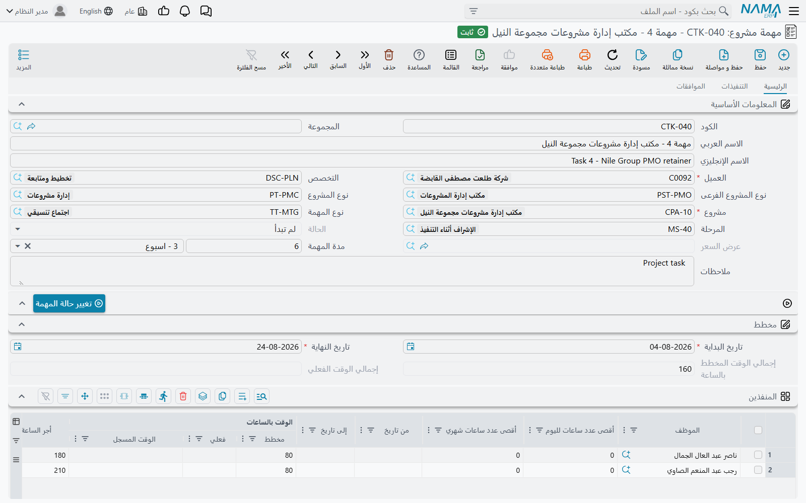
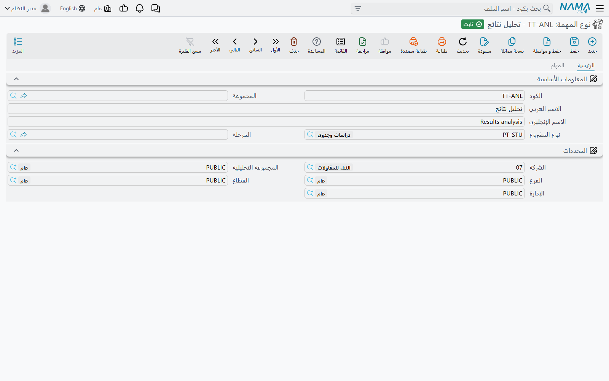
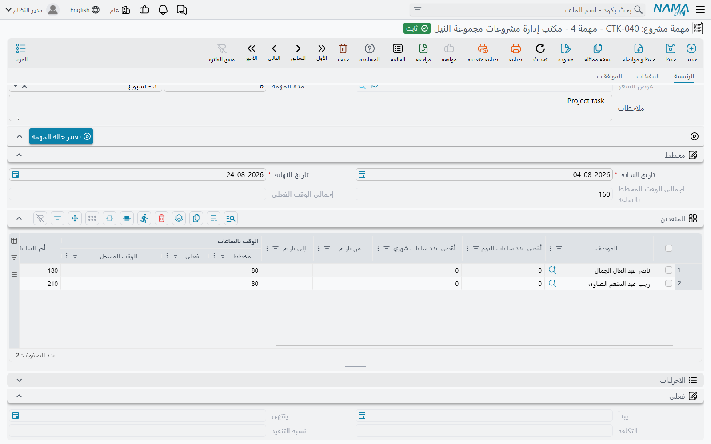

# مهام المشروع

المشروع في وحدة **ادارة المشاريع (ECPA)** وعاء: عميل، ومجموعة مراحل، ومجموعة تخصصات. وهو لا يحمل عملاً بذاته. أما **المهمة** فهي موضع العمل — «رسومات إنشائية للمرحلة الثانية»، «رفع مساحي»، «مستندات الطرح» — والأهم أنها موضع **الأشخاص**. فالمهمة تسمّي الموظفين الذين سينفّذونها، وكم ساعة خُصّصت لكل واحد منهم، وبكم تُحسب ساعة كل واحد. هذا الجدول الواحد هو موازنة العمالة في الوحدة، وهو في الوقت نفسه المؤشر الجاري: فكلما سُجّلت الساعات ووُوفق عليها تراكمت على السطور نفسها، بجوار الأرقام المخططة، فيرى مدير المشروع تجاوز كل شخص على حدة بنظرة واحدة دون أن يفتح تقريراً.

تجدها في **ادارة المشاريع > المهام > مهمة مشروع**، وتحتاج ترخيص `ecpa`.

## موضع المهمة من السلسلة

ثلاث شاشات تحمل جانب العمالة في الوحدة، ولا معنى لأي منها بمعزل عن الأخريين. والمهمة أولاهنّ.

```text
  مهمة مشروع            تنفيذ مهام              موافقة على تنفيذ مهمة       فاتورة المشروع
  (ملف رئيسي)           (مستند)                 (مستند)                    (مستند)

  من سينفّذ،       ◄──   ما نُفّذ فعلاً،     ◄──   ما وافق عليه          ◄──   ما يُطالَب به
  وكم ساعة،              ساعةً بساعة              المدير                      العميل
  وبأي أجر

  ساعات مخططة            الوقت المسجل             الوقت الفعلي                سطور الفاتورة
  تكلفة مخططة            + قيد تكلفة في           + التكلفة الفعلية
                           الأستاذ                 + تحديث إجماليات
                                                     المشروع
```

اقرأ العمود الأوسط بتأنٍّ، فهو الفكرة التي تفوت أكثر الناس أول مرة. الساعات المسجَّلة على مستند تنفيذ المهام هي **وقت مسجَّل** — مُقدَّم، معلّق، مُدّعى. وهي لا تُحتسب عملاً منجزاً ولا تنتج تكلفة على المهمة. ولا يحوّل الوقت المسجَّل إلى **وقت فعلي** إلا موافقة مدير، وعندها فقط تتحرك التكلفة الفعلية للمهمة. والخانتان تجلسان جنباً إلى جنب في جدول المنفذين، ولهذا كان ذلك الجدول محور هذه الصفحة.

والمهمة نفسها **ملف رئيسي** لا مستند: لا دفتر لها ولا توجيه ولا تأثير محاسبي خاص بها، تُنشأ مرة وتُعدَّل في مكانها ما دام العمل قائماً. لكن لا تقرأ «ملف رئيسي» على أنها «ساكنة»، فـ**حفظ المهمة هو ما يحدّث إجماليات المشروع الأب** — وهذا أهم مما يبدو. فالوقت المخطط والوقت الفعلي والتكلفة ونسبة الإتمام على شاشة المشروع كلها مجاميع على مهامه، تُخزَّن عند حفظ المهمة. أما حفظ **المشروع** نفسه فلا يعيد احتسابها.



## الترويسة — إلى أي شيء تنتمي المهمة

أعلى الشاشة يجيب عن سؤال «أي جزء من أي مشروع هذا؟».

| الحقل | ماذا يفعل |
|---|---|
| **الكود** و**الاسم العربي** و**الاسم الإنجليزي** و**المجموعة** | هوية الملف الرئيسي المعتادة |
| **مشروع** | **إجباري**، وهو الحقل الذي يقود كل ما عداه. فاختياره ينسخ إلى المهمة شركةَ المشروع وقطاعه وفرعه وإدارته ومجموعته التحليلية وعميله |
| **العميل** | **إجباري**، لكنك نادراً ما تكتبه — يأتي من المشروع، ويرفض الحفظ إن اختلف الاثنان |
| **المرحلة** (Project Milestone) | أي مرحلة من مراحل المشروع تخصّ هذه المهمة. وإن كان للمشروع مراحل أصلاً صارت إجبارية. واختيار المرحلة أولاً يملأ لك المشروع |
| **التخصص** | التخصص المهني المنفِّذ — إنشائي، معماري، كهربائي |
| **نوع المهمة** | التصنيف الموصوف بعد قليل |
| **نوع المشروع** و**نوع المشروع الفرعى** | موروثان من المشروع؛ وأي شيء تكتبه فيهما يُستبدل من المشروع مع كل حفظ |
| **الحالة** | يديرها النظام وزر تغيير الحالة، ولا تُكتب |
| **عرض السعر** | يُملأ لك حين تكون المهمة قد تولّدت عن [عرض أسعار المشروع](/ar/modules/ecpa/projects/ecpa-sales-quotation) |
| **مدة المهمة** | قيمة ووحدة — «10 · يوم». اكتبها فيُحسب تاريخ النهاية من تاريخ البداية؛ وغيّر أياً من التاريخين فتتبعهما المدة |
| **ملاحظات** | نص حر |

وتحتها مجموعة **مخطط**: **تاريخ البداية** و**تاريخ النهاية**، ويجب أن يقعا داخل النافذة المخططة للمشروع نفسه، ثم **إجمالي الوقت المخطط بالساعة** و**إجمالي الوقت الفعلي**، وكلاهما مجموع على جدول المنفذين.

وفي أسفل الصفحة تعرض مجموعة **فعلي** ما أنتجته الموافقات: **يبدأ** (يُسحب إلى أول يوم عمل ووفق عليه)، و**التكلفة**، و**نسبة التنفيذ**. الثلاثة للقراءة فقط، ولا شيء في هذه المجموعة يُكتب باليد.

### نوع المهمة

نوع المهمة قائمة قصيرة تُعدّها المنشأة مرة واحدة — «تصميم»، «إشراف موقعي»، «إعداد تقارير» — وضبطه الحقيقي الوحيد هو **نوع المشروع** الذي يسمّيه.



وهذا الحقل يفعل شيئين. فقائمة اختيار نوع المهمة على المهمة لا تعرض إلا الأنواع التي يطابق نوعُ مشروعها المشروعَ الذي اخترته، فلا يرى مشروعُ مكتب هندسي نوعَ مهمة موضوعاً لإدارة المرافق. والقاعدة نفسها تُفحص ثانية عند الحفظ: إن اختلف نوع مشروع نوعِ المهمة عن نوع مشروع المشروع رُفض الحفظ.

## جدول المنفذين — قلب المهمة

سطر لكل شخص. وكل سطر في آن واحد سطر موازنة («لسارة ستون ساعة على هذه المهمة»)، وبطاقة أجر («ساعتها بتسعين»)، وصلاحية («يجوز لها تسجيل وقت على هذه المهمة، بين هذين التاريخين، بحد ثماني ساعات يومياً»)، ومؤشر جارٍ («أنجزت سبعاً منها، ونصف ساعة ما زال ينتظر قراراً»).



| العمود | لماذا |
|---|---|
| **الموظف** | **إجباري**. واختيار شخص ينسخ أجر الساعة من ملف الموظف نفسه إلى **أجر الساعة** |
| **من تاريخ** / **إلى تاريخ** | النافذة التي يجوز داخلها لهذا الشخص تسجيل وقت على هذه المهمة. ومستند التنفيذ المؤرَّخ خارجها يُرفض |
| **أقصى عدد ساعات لليوم الواحد** | سقف الساعات التي يسجّلها هذا الشخص على هذه المهمة في يوم واحد |
| **أقصى عدد ساعات شهري** | السقف نفسه على مدى الشهر الميلادي |
| **الوقت بالساعات ǀ مخطط** | الموازنة — كم ساعة أُعطيت لهذا الشخص |
| **الوقت بالساعات ǀ الوقت المسجل** | **يديره النظام.** الساعات المقدَّمة على مستندات التنفيذ ولم يُبتّ فيها بعد |
| **الوقت بالساعات ǀ فعلي** | **يديره النظام.** الساعات التي وافق عليها مدير. ولا يحرّك هذا الرقم إلا مستند الموافقة |
| **أجر الساعة** | الأجر الذي تُحسب به هذه المهمة على هذا الشخص. يأتي افتراضياً من ملف الموظف، ويظل قابلاً للتعديل بعدها |
| **التكلفة ǀ المخططة** | أجر الساعة × الساعات المخططة، ويُعاد حسابها كلما كتبت أياً منهما |
| **التكلفة ǀ الفعلية** | **للقراءة فقط.** أجر الساعة × الساعات الفعلية |
| **نسبة التنفيذ** | **للقراءة فقط.** الساعات الفعلية ÷ الساعات المخططة لهذا السطر |
| **إنتهى من العمل** | ضع العلامة حين ينتهي هذا الشخص. عندها لا يعود يسجّل وقتاً على المهمة، ويسقط من قائمة من تعرضهم المهمة |
| **تاريخ البداية** / **تاريخ النهاية** | شريحة هذا الشخص من جدول المهمة الزمني؛ ويجب أن يقعا داخل تاريخي المهمة المخططين |

::: info الساعات المخططة سقف لا مجرد هدف
الحفظ يفحص كل سطر: **الوقت الفعلي مضافاً إليه الوقت المسجل لا يجوز أن يتجاوز الوقت المخطط**. فالسطر الموازَن بستين ساعة لن يقبل الساعة الحادية والستين، والعلاج أن ترفع الرقم المخطط عن قصد لا أن تتركه ينحرف. وهذا أقرب ما في الوحدة إلى الإلزام — أما أرقام التكلفة التقديرية في مواضع ادارة المشاريع الأخرى فلا تُلزم بشيء.
:::

### مهمة مملوءة

خذ مكتباً معمارياً ينفّذ المشروع **PRJ-014 «برج النخيل»** للعميل **CUS-0032 نخيل للتطوير**. تحتاج المرحلة **M2 – التصميم التفصيلي** رسومات إنشائية، فيرفع المكتب المهمة **CPAT-0207 «رسومات إنشائية للمرحلة M2»**، تخصص إنشائي، مخطط لها 01/03 ← 31/03، ويضع عليها شخصين:

| الموظف | ساعات مخططة | أجر الساعة | التكلفة ǀ المخططة | أقصى/يوم | أقصى/شهر | من – إلى |
|---|---|---|---|---|---|---|
| EMP-115 سارة | 60 | 90.00 | 5 400.00 | 8 | 120 | 01/03 – 31/03 |
| EMP-122 عمر | 40 | 75.00 | 3 000.00 | 8 | 120 | 01/03 – 31/03 |

فتساوي المهمة **8 400.00** من العمالة المخططة، وحالتها **لم تبدأ**. والوقت المسجل والوقت الفعلي صفران على السطرين، وسيظلان كذلك حتى يسجّل أحدهم وقتاً — وذلك موضوع صفحة [تسجيل أوقات تنفيذ المهام](/ar/modules/ecpa/task-execution/ecpa-timesheets).

## أجران للساعة، ولماذا يختلفان

هذا أكثر مصادر اللبس شيوعاً في الوحدة، فلنقلها صريحة: **هناك أجران للساعة، مصدرهما مختلف، ويجيبان عن سؤالين مختلفين.** ولا أحدهما خطأ حين يختلفان.

| | **أجر الساعة** (على سطر المنفذ) | **تكلفة الساعة** (على سطر مستند التنفيذ) |
|---|---|---|
| أين تراه | جدول المنفذين على المهمة | كل سطر من مستند تنفيذ مهام |
| من أين يأتي الرقم | أجر الساعة المحفوظ على ملف الموظف نفسه، يُنسخ حين تختاره — ويبقى قابلاً للتعديل على السطر | إجمالي الراتب الثابت للموظف في شئون العاملين مقسوماً على **عدد الساعات المعيارية شهرياً** من إعدادات الوحدة، ويُعاد حسابه مع كل حفظ |
| من يتحكم فيه | مدير المشروع، لكل مهمة | الرواتب وإعدادات الوحدة، على مستوى النظام كله |
| ماذا ينتج | **التكلفة ǀ المخططة** و**التكلفة ǀ الفعلية** على المهمة، وهما يتجمعان في إجمالي تكلفة المشروع | **اجمالى التكلفة** على سطر التنفيذ، وهو المبلغ الذي يصل إلى الأستاذ العام |
| من يقرؤه أيضاً | فاتورة المشروع حين تُطالِب بالساعات الموافق عليها | فاتورة المشروع حين تجمّع التنفيذات |

في المثال أجر ساعة سارة **90.00**، بينما ستكلّف سطور تنفيذها **68.18** للساعة — راتبها 12 000 مقسوماً على 176 ساعة معيارية شهرياً. فحين تسجّل 7.50 ساعة ويوافق المدير على 7.00 منها، ترتفع التكلفة الفعلية للمهمة بمقدار 7.00 × 90.00 = **630.00** بينما يحمل الأستاذ 7.50 × 68.18 = **511.35**. والرقمان صحيحان معاً. فالمهمة تخبرك بما يساويه العمل *للمشروع بالأجر الذي التزم به المدير*؛ والأستاذ يخبرك بما دفعته المنشأة *فعلاً رواتبَ* عن الساعات التي أُنفقت.

::: tip أيهما أغيّر؟
إن بدا المشروع متجاوزاً للموازنة على الورق بينما الحسابات سليمة، فأنت تنظر إلى أجر الساعة على المهمة. وإن بدت تكلفة العمالة في الأستاذ خاطئة للجميع دفعة واحدة، فأنت تنظر إلى عدد الساعات المعيارية شهرياً وإلى خيار *تحديث تكلفة الساعة في تنفيذ المهمه من الرواتب* — وكلاهما على شاشة [إعدادات ادارة المشاريع](/ar/modules/ecpa/ecpa-configuration).
:::

## ملء الجدول بسرعة

إجراءان على **شاشة قائمة** المهام يعملان على عدة مهام دفعة واحدة، وهكذا تُجهَّز مهام مرحلة كاملة في جولة واحدة. حدّد المهام ثم افتح قائمة الإجراءات الإضافية.

**إضافة منفذين** يسألك عن ستة موظفين على الأكثر ويضيف كلاً منهم سطراً جديداً على كل مهمة حدّدتها، ويختم أجر الساعة من ملف كل موظف أثناء ذلك. والموظفون الموجودون أصلاً على مهمة يُتجاوَزون، فتشغيله مرتين لا يضر.

**إعادة حساب أجر الساعة** يعيد قراءة أجر كل سطر منفذ من ملف الموظف ويحفظ. وهو زر المراجعة السنوية: غيّر الأجور على ملفات الموظفين، وحدّد المهام القائمة، وشغّله مرة.

::: warning إعادة الحساب تكتب فوق الأجور التي عدّلتها يدوياً
يكتب **إعادة حساب أجر الساعة** فوق **كل** سطر منفذ في كل مهمة محدَّدة بأجر ملف الموظف الحالي. فأي أجر ضبطته بيدك لمهمة بعينها يُفقَد. فحدِّد عن قصد.
:::

ولاحظ أن الإجراءين لا يمسّان ساعات سُجّلت. فالتكلفة المخططة يُعاد حسابها بالأجر الجديد، والتكلفة الفعلية تتبعها عند الحفظ التالي.

## حالة المهمة

تحمل المهمة إحدى ست حالات — **لم تبدأ**، **قيد التنفيذ**، **منتهي**، **مغلقة**، **مؤجل**، **ملغي** — ولا تتغير من تلقاء نفسها إلا الأوليان. فالمهمة الجديدة تفتح على *لم تبدأ*، وفي اللحظة التي يُعتمد فيها أول مستند تنفيذ يسمّيها تصير **قيد التنفيذ** (ويقفز المشروع الأب القفزة نفسها في اللحظة نفسها). وكل ما بعد ذلك قرار بشري، يُتَّخذ بزر **تغيير حالة المهمة** على الشاشة، أو بـ**تغيير الحالة** على شاشة القائمة لدفعة مهام معاً.

والزران يتصرفان تصرفين مختلفين قليلاً، ويُحسن بك معرفة أيهما ضغطت. فعلى شاشة التحرير يكتب «تغيير حالة المهمة» اختيارك على النموذج المفتوح ويتركه هناك — و**عليك أنت أن تحفظ**. أما على شاشة القائمة فيُطبَّق الاختيار ويُحفظ على كل مهمة محدَّدة فوراً.

والحالة عنوان له سنٌّ واحدة: فالمهمة الموسومة **منتهي** لا تقبل سطور تنفيذ جديدة، وقائمة اختيار المهمة على مستند التنفيذ لا تعرض إلا مهامّ *لم تبدأ* أو *قيد التنفيذ*. فإقفال مرحلة بالمرور على مهامها حتى «منتهي» ضبطٌ حقيقي لا مجرد ترتيب.

::: info لا ارتباط بين المهام
لا شيء في الوحدة يقول «المهمة ب تبدأ حين تنتهي المهمة أ». فالتتابع يُعبَّر عنه بالمراحل والتواريخ المخططة فقط — لا حقل سابق، ولا مسار حرج، ولا مخطط جانت.
:::

## ما الذي يغيّره حفظ المهمة

الحفظ هادئ لكنه ذو أثر. فمع كل حفظ:

1. يُعاد نسخ نوع المشروع ونوعه الفرعي من المشروع؛
2. تُعاد حوسبة التكلفة المخططة لكل سطر من الأجر × الساعات المخططة، والتكلفة الفعلية ونسبة التنفيذ لكل سطر من الساعات الموافق عليها؛
3. تتجمّع تلك في **التكلفة** الفعلية للمهمة و**إجمالي الوقت المخطط بالساعة** و**إجمالي الوقت الفعلي** و**نسبة التنفيذ**؛
4. **تُحدَّث إجماليات المشروع الأب** — وقته المخطط والفعلي ورقم تكلفته ونسبة إتمامه؛
5. تُعاد بناء قائمة الموظفين المسموح لهم بتسجيل وقت على هذه المهمة وعلى هذا المشروع.

والنقطة الخامسة تستحق جملة مستقلة، لأنها جواب سؤال «لماذا لا يجد الموظف المهمة على مستند تنفيذه؟». فالموظف لا يظهر في قائمة اختيار مهمة إلا إذا كان على جدول منفذي تلك المهمة ولم يكن سطره موسوماً بـ«إنتهى من العمل» — والمهمة لا تُعرض إلا داخل مشروع ينتمي إليه الموظف، وهو ما يبنيه المشروع من مديره ونائب مديره وصفحة [فريق العمل](/ar/modules/ecpa/projects/ecpa-managed-project). أضف شخصاً إلى مهمة واحفظها، فيسجّل وقتاً عليها بعد لحظة. وانسَ الحفظ، فلا يستطيع.

## قواعد توقف الحفظ

إلى جانب سقف الساعات المخططة الموصوف أعلاه، ترفض المهمة الحفظ حين:

- لا يكون عميل المهمة هو عميل المشروع؛
- يكون للمشروع مراحل ولم تُختر مرحلة؛
- لا يطابق نوعُ مشروعِ نوعِ المهمة نوعَ مشروعِ المشروع؛
- تقع تواريخ المهمة المخططة خارج نافذة المشروع المخططة، أو تقع تواريخ سطر منفذ خارج تواريخ المهمة؛
- تحذف سطر منفذ يحمل بالفعل ساعات موافقاً عليها، أو تغيّر الموظف على سطر كهذا — فالعمل الموافق عليه لا يُعاد إسناده في صمت؛
- يظهر الموظف نفسه على سطرين تتداخل نافذتا تاريخيهما.

## صفحتا التنفيذات والموافقات

الصفحتان الثانية والثالثة على شاشة المهمة نافذتان للقراءة فقط على المستندين التاليين لها، وهما توفّران بحثاً كثيراً.

**التنفيذات** تسرد كل سطر تنفيذ رُفع على هذه المهمة — الموظف والتواريخ والوقت من وإلى ونسبة الإتمام التي أقرّ بها الموظف. وهي أثر التدقيق لسؤال «من عمل على هذه ومتى».

**الموافقات** تسرد كل سطر موافقة على المهمة — المشروع والموظف وهل ووفق عليه والوقت الموافق عليه ونسبتا الإتمام والمتبقي. وهي أثر التدقيق لسؤال «ما الذي قُبل فعلاً».

## الاجراءات على المهمة

تُختتم الصفحة الرئيسية بقائمة [الاجراءات](/ar/modules/ecpa/projects/ecpa-procedures) المسجَّلة على هذه المهمة — ملاحظات متابعة لها مسؤول وتاريخ وحالة. ترفعها بيدك، وتُنشأ لك أيضاً من سطر تنفيذ كلما كتب الموظف شيئاً في *الاجراء القادم* وكان توجيه مستند التنفيذ يسمّي مجموعة اجراءات. وهي سجل «ماذا بعد» في الوحدة، معلَّقاً على المهمة التي يخصّها.
