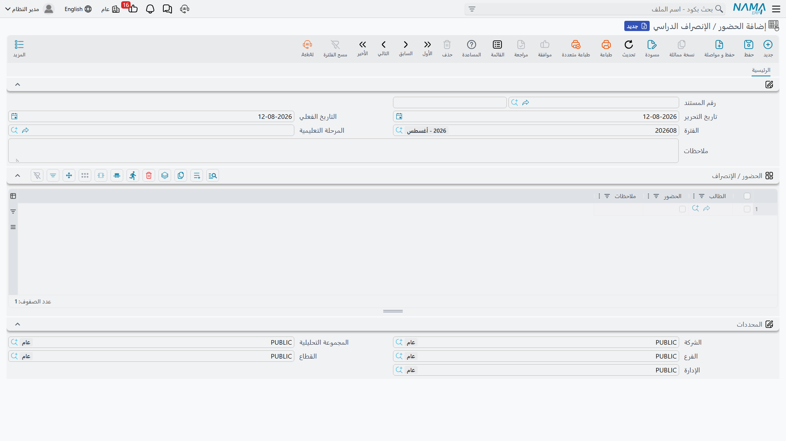
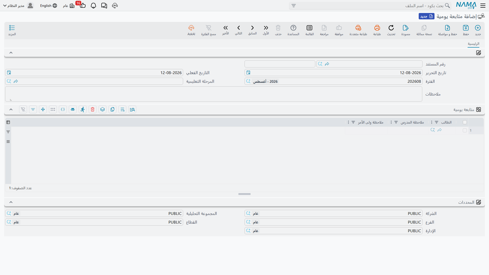
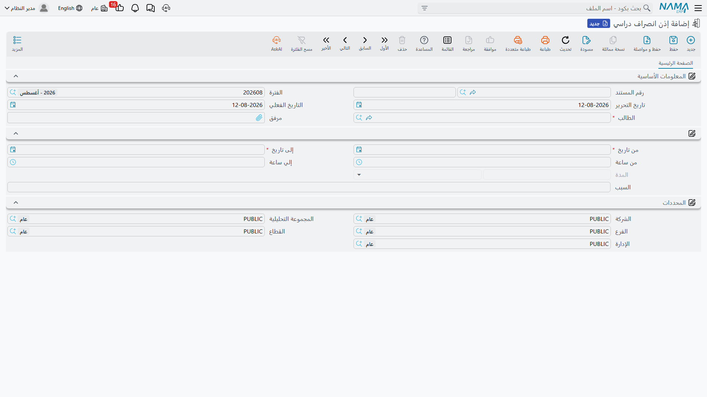
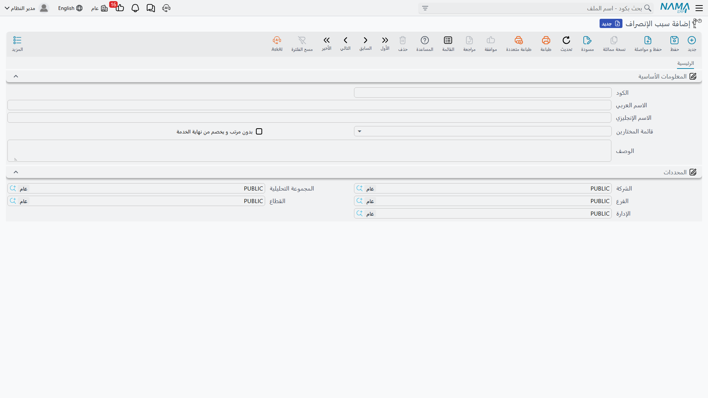

# الحضور والمتابعة اليومية وأذون الانصراف

ثلاث شاشات تحمل الحياة اليومية للمدرسة: من حضر الصفّ هذا الصباح، وماذا قال المدرسون وأولياء الأمور
عن الطالب، ومن أُذن له بالانصراف مبكراً. وهذه الشاشات في النظام هي **الحضور / الإنصراف الدراسي**
(Education Attendance) و**المتابعة اليومية** (Daily Monitoring) و**إذن الانصراف الدراسي**
(Education Leave Permission)، وهي من أكثر شاشات المنظومة استعمالاً — فاليوم الدراسي الواحد يُنتج
منها عدة مستندات، كل يوم، طوال العام.

يقع **الحضور / الإنصراف الدراسي** و**إذن الانصراف الدراسي** تحت **التعليم ← الحضور / الإنصراف**
(Education → Time Attendance)، ومعهما قائمة **سبب الإنصراف** (Education Leave Reason). أما
**المتابعة اليومية** فتصل إليها من **التعليم ← الملفات ← متابعة يومية**.

## الحضور / الإنصراف الدراسي (Education Attendance) — كشف واحد لكل مرحلة في اليوم

أول ما ينبغي فهمه عن الحضور في النظام هو حجم الوحدة التي يسجّلها. فالمستند الواحد من الحضور /
الإنصراف الدراسي يغطّي **مرحلة تعليمية واحدة في يوم واحد** — لا حصةً واحدة، ولا مادةً واحدة، ولا
فترة مدرّس بعينه. فلا جدول حصص خلفه ولا حصة يرتبط بها. والسؤال الذي يجيب عنه هو سؤال كشف الغياب
الذي تسأله المدرسة مرة واحدة في أول اليوم: هل كان هذا الطالب في المدرسة اليوم؟

ورأس المستند هو ما يثبّت ذلك. فإلى جانب كود المستند و**تاريخ التحرير** (Issue Date)، الحقول المهمة
هي:

- **التاريخ الفعلي** (Value Date) — **اليوم الدراسي محل التسجيل**، وهو ما يميّز كشفاً عن الذي يليه؛
- **المرحلة التعليمية** (Educational Stage) — المرحلة التي يغطّي هذا الكشف طلابها، كما هي موصوفة في
  [الطلاب وأولياء الأمور والهيكل الدراسي](./education-master-files)؛
- **الفترة** (Fiscal Period)، و**ملاحظات** (Description) لما يحتاج الكشف كله إلى قوله — «انصرفت
  المدرسة في الحادية عشرة بسبب العاصفة الترابية».

ثم جدول واحد باسم **الحضور / الإنصراف** (Time Attendance)، بسطر لكل طالب:

| العمود | ما يُكتب فيه |
|---|---|
| **الطالب** (student) | الطالب الذي يخصّه هذا السطر |
| **الحضور** (Attendance) | علامة تأشير. المؤشَّر يعني حاضراً؛ وإذا تُرك بلا تأشير سجّل السطر غياباً |
| **ملاحظات** (Notation) | نص حر لهذا الطالب وحده — «حضر 8:40»، «إذن مرضي من ولي الأمر»، «انصرفت مع والدتها قبل الطابور» |

### الإيقاع اليومي

تصوّر مدرسة بثلاث مراحل: ابتدائي وإعدادي وثانوي. فهي تُنتج كل صباح **ثلاثة** مستندات حضور، واحداً
لكل مرحلة، كلٌّ منها بتاريخ ذلك اليوم. وكشف الابتدائي فيه ثلاثون سطراً بعدد طلابه: سبعة وعشرون
مؤشَّرة، وثلاثة متروكة بلا تأشير، وملاحظة أمام اثنين منها تبيّن السبب. وفي الغد تُنشأ الكشوف الثلاثة
نفسها بتاريخ الغد الفعلي. وعلى مدى أسبوع من خمسة أيام يصير ذلك خمسة عشر مستنداً، وحضور المدرسة كلها
في الترم هو ببساطة مجموع هذه المستندات.

ولأن المرحلة في الرأس واليوم في الرأس، فهذان هما ما تبحث به بعد ذلك. فـ«الإعدادي في الثالث من مارس»
مستند واحد، أما «ترم أحمد كله» فبحث في الأسطر.

### أنت من يختار الطلاب في الكشف

هذه هي النقطة التي تفاجئ القادمين من أنظمة أخرى، ولذلك يحسن قولها صراحة: **الجدول لا يملأ نفسه**.
فليس في منظومة التعليم في النظام مستند قيد أو تسجيل — لا شيء يقيّد الطالب في دورة أو فصل أو شعبة
باعتباره حركة — فلا توجد قائمة قيد يُبنى منها الكشف. أنت من يضيف الأسطر ويختار كل **طالب** بنفسه.

وهذا عملياً أقل جهداً مما يبدو، لأن كشف اليوم هو نفس قائمة طلاب الأمس. والعادة الناجحة أن تبني كشف
كل مرحلة مرة واحدة بعناية، ثم تستخدم عليه كل صباح إجراء **نسخة مماثلة** (duplicate) المعتاد: فتأتي
النسخة بالمرحلة نفسها وبالطلاب الثلاثين أنفسهم، ولا يبقى على رائد الفصل إلا ضبط التاريخ الفعلي
وتصحيح علامات التأشير. فكشف المرحلة يُكتب كاملاً مرة واحدة ثم يُصان بعدها — يُضاف الملتحقون الجدد
عند التحاقهم، ويُحذف المنقطعون عند انصرافهم.

::: tip الحضور هنا للطلاب لا للموظفين
الحضور / الإنصراف الدراسي هو كشف الطلاب، وهو قائم بذاته تماماً. أما حضور الموظفين وأجهزة البصمة
والبطاقات والورديات والوقت الإضافي فتخصّ جانب الموارد البشرية من النظام وتُسجَّل هناك على ملفات
الموظفين. وتأشير حضور الطلاب يُملأ يدوياً، بيد من يأخذ كشف الغياب.
:::

## المتابعة اليومية (Daily Monitoring) — دفتر المتابعة

المتابعة اليومية لها شكل الحضور نفسه تماماً — كود المستند نفسه، و**تاريخ التحرير**، و**التاريخ
الفعلي**، و**الفترة**، و**المرحلة التعليمية**، و**ملاحظات**، وجدول طلاب تحتها — لكن ما تحمله مختلف
كل الاختلاف. فليس عليها تأشير حضور البتة، وإنما يحمل كل سطر نصّين مكتوبين:

| العمود | ما يُكتب فيه |
|---|---|
| **الطالب** (student) | الطالب محل المتابعة |
| **ملاحظة المدرس** (Teacher Monitoring) | ما لاحظه المدرس — **إلزامي** |
| **ملاحظة ولى الأمر** (Guardian Monitoring) | ما قاله ولي الأمر، أو ما أُبلغ به — **إلزامي** |

والملاحظتان كلتاهما إلزاميتان، وهذا الإلزام يدلّك على الطريقة التي صُمّمت الشاشة لها. فالسطر لا
يكتمل إلا حين يكون لدى المدرسة طرفا الحوار معاً: الملاحظة *ورد* الأسرة عليها. ولذلك فمستند المتابعة
اليومية ليس كشفاً كاملاً بالفصل — بل يحمل النفر القليل من الطلاب الذين احتاجوا فعلاً إلى متابعة في
ذلك اليوم.

والشاشتان تعملان معاً. فالحضور يجيب عن *هل كان الطالب هنا*، والمتابعة اليومية تجيب عن *كيف مرّ
اليوم، وماذا قلنا للأسرة عنه*. فقد يحمل كشف الابتدائي في الثالث من مارس ثلاثين سطراً مؤشَّراً، بينما
تحمل متابعة اليوم نفسه أربعة أسطر: طالب لزم الصمت منذ بدء الترم، ومعه ردّ الأم بعد المكالمة؛ وآخر لم
يسلّم مشروع العلوم، ومعه وعد الأب بمتابعته؛ واثنان تشاجرا في الفناء، مع الملاحظة التي ذهبت إلى كل
بيت. والمتابعة التالية تبدأ بقراءة هذه الأسطر.

والمدارس التي تحتفظ بسجل مكتوب لتواصلها مع الأسر، أو التي تحتاج إلى إظهار نمط من التواصل قبل اتخاذ
خطوة مع طالب، تجد هذا السجل في هذه الشاشة. ولأن التاريخ الفعلي في الرأس، فدفتر المرحلة عبر الترم هو
تسلسل مستنداتها بترتيبها.

## إذن الانصراف الدراسي (Education Leave Permission) — الطالب الذي انصرف مبكراً

إذن الانصراف هو الورقة: مستند واحد، وطالب واحد، وغياب واحد أذن به أحد. فبينما يقول سطر الحضور إن
الطالب لم يكن موجوداً فحسب، يقول الإذن كم دام الغياب ولماذا.

ويسمّي المستند **الطالب** (student) والمدة، إلى جانب كود المستند و**تاريخ التحرير** و**التاريخ
الفعلي** و**الفترة**:

| الحقل | ما يُكتب فيه |
|---|---|
| **من تاريخ** (From Date) | أول أيام الغياب — إلزامي |
| **إلى تاريخ** (To Date) | آخر أيام الغياب — إلزامي |
| **من ساعة** (From Hour) / **إلي ساعة** (To Hour) | التوقيتان، حين يكون الغياب جزءاً من يوم لا أياماً كاملة |
| **السبب** (Reason) | **نص حر** — تكتب السبب على المستند بكلماتك أنت |
| **مرفق** (Attachment) | ملف واحد: الطلب الممسوح ضوئياً، أو التقرير الطبي، أو خطاب ولي الأمر |

والحالتان الأكثر شيوعاً تتّسع لهما الشاشة بيسر. فالطالب الذي يُصطحب ظهراً لموعد أسنان يأخذ «من
تاريخ» و«إلى تاريخ» كليهما الثالث من مارس، و«من ساعة» 12:00 و«إلي ساعة» 14:30، ويُكتب السبب «اصطحبه
والده 12:15، موعد أسنان»، وتُرفق بطاقة الموعد. والأسرة المسافرة في عزاء تأخذ «من تاريخ» الثالث
و«إلى تاريخ» السادس، دون ساعات، ويُكتب السبب، ويُرفق خطاب ولي الأمر.

ولأن السبب نص حر، فهو يقول ما جرى بالضبط بدل انتقاء أقرب بند من قائمة — وهذا هو المطلوب في ورقة قد
يطلب ولي الأمر الاطلاع عليها لاحقاً. وهو يعني كذلك أن الصياغة هي ما كتبه من على المكتب، ولذلك تتفق
المدارس التي تعنيها الاتساق على صياغة موحّدة له.

### سبب الإنصراف (Education Leave Reason) — قائمة المدرسة المعتمدة

يقع **سبب الإنصراف** في مجموعة قائمة **الحضور / الإنصراف** نفسها، وفيه تدوّن المدرسة قائمتها
المعتمدة بالأسباب: كود، والاسم العربي والاسم الإنجليزي، و**الوصف** (Description) الذي يبيّن ما
يغطّيه السبب.

وهو قائمة المدرسة المرجعية — المفردات المتفق عليها، محفوظة في مكان واحد حتى يكون لـ«موعد طبي»
و«سفر عائلي» و«مناسبة دينية» و«اصطحاب مبكر من ولي الأمر» المعنى نفسه لدى الجميع والصياغة نفسها في
كل ورقة. فيرجع إليها الموظفون ويكتبون الصياغة المتفق عليها في حقل السبب على الإذن.

## الثلاثة تسجّل معلومات فقط

قُل هذا مرة واحدة يتّضح لك كثير من حرية استعمال هذه الشاشات.

فالحضور / الإنصراف الدراسي والمتابعة اليومية وإذن الانصراف الدراسي **سجلات**. وحفظها لا ينشئ **أي
قيد محاسبي** ولا **أي حركة مخزنية**، و**لا شيء لاحق يستهلكها** — فالتأشير لا يخصم رسماً، وإذن
الانصراف لا يكتب غياباً في كشف الحضور ولا يغيّر شيئاً في العقد، وملاحظة المتابعة لا تصل إلى أي مستند
آخر. والمال في منظومة التعليم لا يمرّ إلا عبر [عقد الدورة التدريبية](./education-course-contracts)
و[جدول أقساطه](./education-payment-schedules)؛ أما الكشف فلا يمسّه. والدرجات كذلك تعيش على مستندها
الخاص وحدها — انظر [رصد الدرجات](./education-marks).

وهذا الاستقلال هو المغزى العملي. فيستطيع رائد الفصل أن يُدخل كشف يوم أو ملاحظة أو إذناً ويصحّحه
ويعيد إدخاله دون أدنى خطر على رصيد أو مديونية أو قسط، ودون انتظار للإدارة المالية. وما تمنحه هذه
الشاشات الثلاث للمدرسة هو التاريخ المكتوب: من حضر، وكيف مرّ كل يوم، ومن أُذن له بالانصراف — محفوظاً
لكل مرحلة، ولكل يوم، ممتداً إلى أبعد نقطة بدأت المدرسة تسجّل منها.
