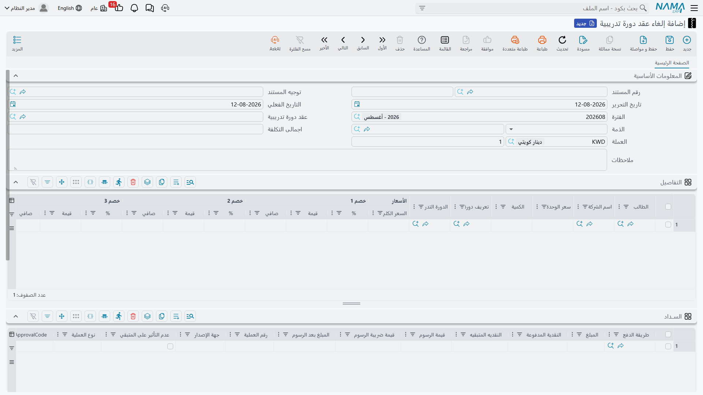
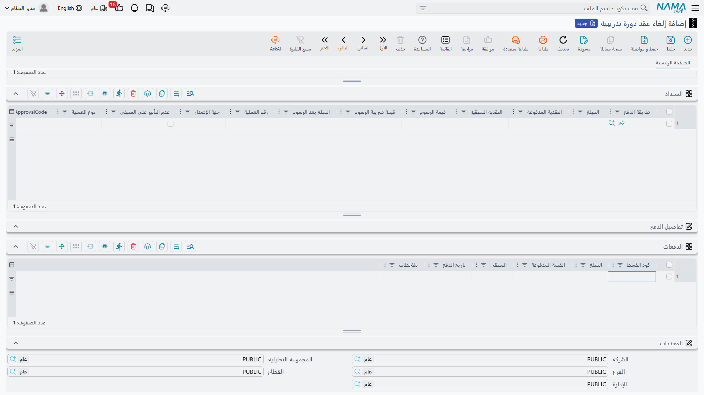

# إلغاء عقد دورة تدريبية

عقد يُوقَّع لبرنامج تدريبي كامل، ثم ينسحب المتدرب بعد ثلاثة أشهر. الرسوم الخاصة بالأشهر التي لن
تُدرَّس يجب أن تتوقف عن كونها مستحقة، والقيد الذي حمَّلها على حساب الجهة الدافعة يجب أن يُعكَس، وربما
يلزم إعادة ما حُصِّل مقدمًا. كل ذلك يتم بمستند واحد: **إلغاء عقد دورة تدريبية**
(Course Contract Cancel)، الموجود في **التعليم ← الملفات** بجوار العقد نفسه.

وهو مستند قائم بذاته لا زر على العقد: له دفتره وكوده، وتاريخ تحريره وتاريخه الفعلي وفترته المالية،
وعملته ومعدلها، والأهم من ذلك كله — **توجيه المستند الخاص به**.

## يبدأ كنسخة من العقد

الحقل الوحيد الذي تملؤه فعليًا هو **عقد دورة تدريبية** في رأس المستند. وباختياره يُسحَب العقد إلى
داخل هذا المستند: **الذمة** (الجهة الدافعة)، والملاحظات، وكل سطر في جدول **التفاصيل** بطالبه وكميته
وسعر وحدته وخصوماته وضرائبه، وكل سطر من سطور طرق الدفع، وكل قسط من جدول أقساط العقد. ويصل كل سطر
منسوخ كسطر جديد على مستند الإلغاء.

بمعنى أن المستند الذي أمامك — إن لم تلمس فيه شيئًا آخر — يصف إلغاء **العقد بالكامل**. هذا هو الوضع
الافتراضي، وهو مقصود: الإلغاء الكامل هو الحالة الشائعة، فجعلوه يكلفك حقلًا واحدًا.

::: tip الإلغاء الجزئي طرح لا نسبة
لا يوجد على الشاشة حقل «ألغِ ٤٠٪». تُلغي جزءًا من العقد بأن تُعدِّل النسخة حتى تصبح هي الجزء الذي
تلغيه فعلًا: احذف سطور التفاصيل الخاصة بالمتدربين الباقين، وأنقص الكمية أو سعر الوحدة في السطر
الذي يُلغى جزئيًا، واحذف سطور الأقساط التي لن تُحرَّر. وما يبقى على الشاشة عند الاعتماد هو ما يُلغى.
:::

## الجدولان اللذان تعمل عليهما

**التفاصيل** (Details) يحمل سطرًا لكل متدرب، بالأعمدة نفسها الموجودة على العقد — الطالب، وتعريف
الدورة، والدورة التدريبية، وسعر الوحدة، والكمية، وأعمدة الخصومات والضرائب، والمحددات التحليلية، وذمة
السطر. ويعرض عمودًا واحدًا لا يعرضه جدول العقد: **الأسعار | السعر الكلي**، أي إجمالي السطر قبل
الخصم والضريبة. راقب هذا الرقم، فهو الرقم الذي يُتحقَّق من المستند على أساسه.

**الدفعات** (Payments) يحمل الأقساط التي تُحرَّر. ومعظم أعمدة هذا الجدول هنا غير قابلة للتعديل:
**المبلغ** و**تاريخ الدفع** يصلان معطَّلين ويُؤخذان من العقد، فلا يمكن إعادة كتابة الخطة الأصلية من
هنا. والعمودان اللذان تملؤهما هما:

- **كود القسط** — أي قسط على العقد يسدده هذا السطر. ويعرض الحقل أكواد أقساط العقد نفسه كقائمة
  اقتراحات، فتختار بدل أن تكتب.
- **القيمة المدفوعة** — المبلغ الذي يحرره هذا الإلغاء من ذلك القسط.

::: warning يجب أن يتطابق الإجماليان قبل الاعتماد
مجموع **الأسعار | السعر الكلي** في سطور التفاصيل يجب أن يساوي مجموع **القيمة المدفوعة** في سطور
الأقساط، وإلا رُفض المستند برسالة *«إجمالي التفاصيل … يجب أن يساوي إجمالي سطور الدفعات …»*. وهناك
ثلاثة فحوص أخرى تحرس جانب الأقساط: كود قسط غير موجود على العقد المُشار إليه يُرفض، ولا يمكن لمستندَي
إلغاء أن يسددا القسط نفسه، ولا يمكن أن تتجاوز المبالغ المسددة على قسط قيمته.
:::

### مثال عملي

عقد لمتدرب واحد بقيمة ٢٤٬٠٠٠ على ثمانية أقساط شهرية قيمة كل منها ٣٬٠٠٠. حُصِّلت ثلاثة أقساط ثم
انسحب المتدرب، فبقي ١٥٬٠٠٠ موزعة على خمسة أقساط يجب إلغاؤها.

1. أنشئ مستند إلغاء عقد دورة تدريبية واختر العقد. فيُنسخ كل شيء: سطر تفاصيل بـ ٢٤٬٠٠٠ وثمانية سطور
   أقساط.
2. في سطر التفاصيل، أنقص سعر الوحدة إلى ١٥٬٠٠٠ — فهذا هو الجزء الذي يُلغى.
3. احذف سطور الأقساط الثلاثة التي حُصِّلت. وفي كل سطر من الخمسة الباقية اكتب **القيمة المدفوعة**
   ٣٬٠٠٠.
4. إجمالي التفاصيل ١٥٬٠٠٠، وإجمالي الأقساط ١٥٬٠٠٠، فيُعتمد المستند.

## ماذا يحدث عند المعالجة

حفظ المستند يُنشئ آثاره في الخلفية كطلب أعمال، فالحفظ نفسه فوري. ثم يحدث أمران منفصلان، وثانيهما هو
ما يبحث عنه الناس عادةً.

### يسجل صورة معكوسة من قيد العقد

ينتج الإلغاء قيدًا في دفتر الأستاذ من خلال **توجيهه هو** لا توجيه العقد. والتوجيهان يُضبطان على
الشاشة نفسها، لكن الجانبين معكوسان: ما يضعه توجيه العقد في الجانب المدين يضعه توجيه الإلغاء في
الجانب الدائن والعكس. فالعقد الذي جعل ذمة المتدرب مدينة وإيراد الرسوم دائنًا يُنقَض بإلغاء يجعل
إيراد الرسوم مدينًا وذمة المتدرب دائنة. وتفاصيل ضبط التوجيهين وقاعدة العكس كاملةً في صفحة
[توجيهات المستندات](./education-document-terms).

### يسدد أقساط العقد الأصلي

هذه هي النقطة التي تفاجئ الناس، فلنقلها صراحة: مستند الإلغاء لا يحذف الأقساط من العقد الأصلي ولا
يضعها في حالة «ملغاة». بل يسجل نفسه **مسدِّدًا** لها.

كل سطر قسط ملأته يكتب قيد سداد على القسط المقابل في العقد. وعلى جدول أقساط العقد يرتفع **المحصل
نظاميًا** لذلك القسط بالمبلغ الذي أدخلته وينخفض **المتبقي** بالقدر نفسه — تمامًا كما لو أن سند قبض
جاء وسدده. خذ المثال السابق: الأقساط الخمسة المفتوحة على العقد قيمة كل منها ٣٬٠٠٠ ينتقل متبقيها من
٣٬٠٠٠ إلى صفر، ويصبح العقد كله محصَّلًا بالكامل، لأن الجزء الملغى سُوِّي بدل أن يظل معلَّقًا.

فبعد الإلغاء يرتفع **المسدَّد** على العقد وينخفض **المتبقي**. وهذه هي القراءة المقصودة: لم يعد على
العقد شيء مستحق، لأن الجزء الذي لم يكن سيُحصَّل أُغلق بمستند الإلغاء. ويمكنك أن ترى بالضبط أي القيود
فعلت ذلك من العقد نفسه — فزر **سندات سداد الدفعات** (Installment Payments) في شريط الأدوات يعرض كل
قيد سداد قائم على أقساط ذلك العقد، ويظهر مستند الإلغاء بينها. والمزيد عن بناء الجدول وقراءته في صفحة
[جداول الأقساط والتحصيل](./education-payment-schedules).

::: info لا يُنتَج أي مستند استرداد
لا يولّد الإلغاء شيئًا — لا سند صرف ولا سند قبض ولا إشعار مدين ولا أي مستند مرتجع. وإذا لزم أن يعود
المال فعليًا إلى الجهة الدافعة فأنت تسجله في جدول **الســداد** (Payment Lines) على مستند الإلغاء
نفسه، تمامًا كما يُسجَّل التحصيل الوارد على العقد. كل سطر يحدد طريقة دفع ومبلغًا، ويُرحَّل إلى حساب
تلك الطريقة — على الجانب المقابل من دفتر الأستاذ، لأن هذا المستند يسير في الاتجاه المعاكس. فالمال
الخارج سطر على هذا المستند لا مستند منفصل.
:::

وإذا فشلت المعالجة في الخلفية — لفترة مالية مقفلة، أو حساب لا يستطيع التوجيه الوصول إليه — يظل
المستند محفوظًا وتوضح حالة المعالجة ذلك. ويعيد المستخدمون المتقدمون المحاولة من شاشة **طلبات
الأعمال**: يفلترون السطور الفاشلة، ويحددونها، ثم يستخدمون قائمة المزيد لإعادة المعالجة.

## التراجع عن الإلغاء

مستند الإلغاء قابل للتراجع بالطريقة المعتادة. فإلغاء اعتماده أو حذفه يزيل قيده المحاسبي ويزيل كل قيد
سداد كتبه، فتعود أقساط العقد الأصلي إلى ما كانت عليه — تنخفض قيم **المحصل نظاميًا** وتعود قيم
**المتبقي**. ولا شيء يحتاج إلى إصلاح يدوي على العقد.

وللاطلاع على المستند الذي يجري إلغاؤه، وكيف تُسجَّل رسومه وطلابه وتحصيلاته ابتداءً، انظر
[عقود الدورات التدريبية](./education-course-contracts).
