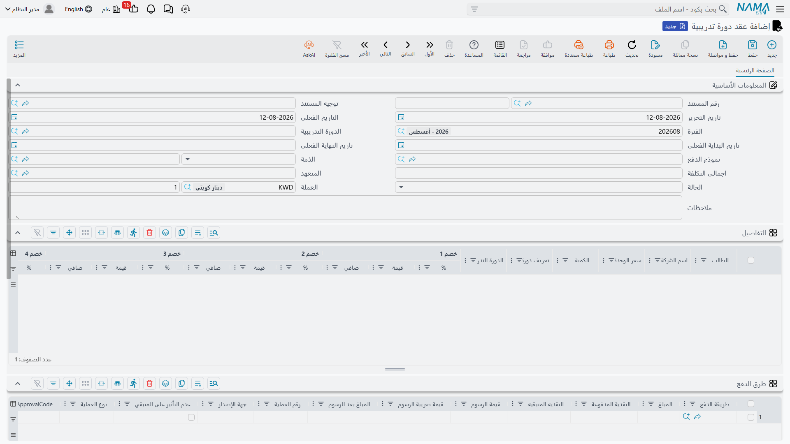
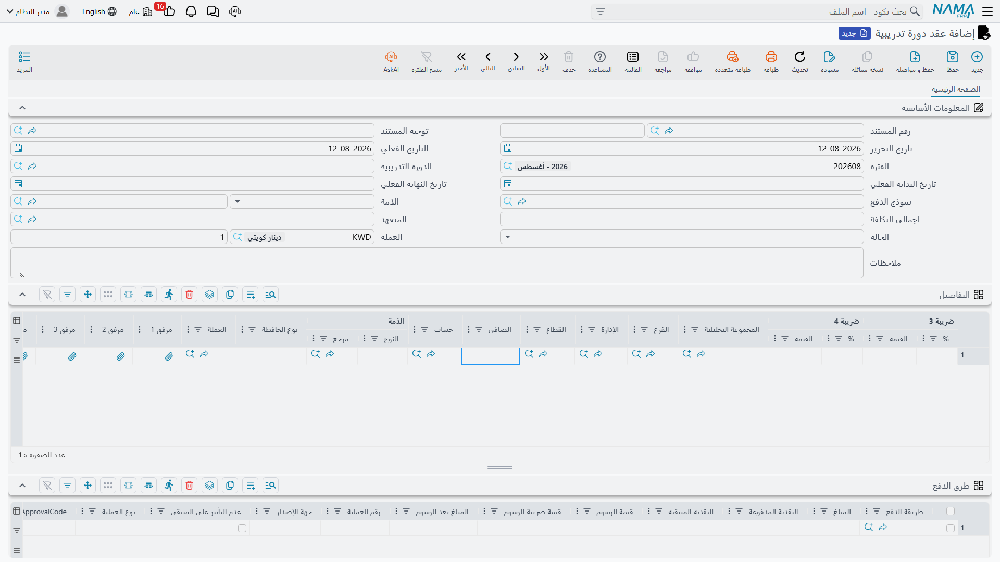

# عقود الدورات التدريبية

معظم شاشات وحدة التعليم تسجّل معلومات لا أموالًا: مَن المقيَّد، ومَن حضر، وما الدرجات التي أُحرزت،
وأيّ حافلة يركبها الطالب. أمّا **عقد الدورة التدريبية (Course Contract)** فهو الموضع الذي تتحدّث فيه
الوحدة عن المال أخيرًا. هو الاتفاق الذي يقول: *هؤلاء الطلاب ينضمّون إلى هذه الدورة، وهذا ما سيُحاسبون
عليه، وهذه طريقة سدادهم* — وهو، مع [مستند الإلغاء](./education-contract-cancellation)، الموضع الوحيد
في التعليم الذي يصل إلى دفتر الأستاذ العام.

تجده في **التعليم ← الملفات ← عقد دورة تدريبية**.

## أطراف العقد

للعقد طرفان، ويحسن توضيحهما قبل تعبئة أيّ شيء.

في جانب هناك **الطالب**. يظهر الطلاب في جدول **التفاصيل** بالعقد — سطر لكلّ طالب مقيَّد — ويستطيع العقد
الواحد أن يحمل مجموعة كاملة. فالشركة التي تُلحق خمسة من موظفيها بدورة تدريبية واحدة هي عقد واحد بخمسة
أسطر طلاب، لا خمسة عقود.

وفي الجانب الآخر هناك **من يتحمّل السداد فعلًا**، وليس هو الطالب دائمًا. حقل **الذمة** في رأس المستند هو
موضع تسمية الطرف الدافع، وهو يقبل **طالبًا** أو **وليّ أمر** أو **عميلًا**. ففي دورة مهنية لبالغ يدفع
الطالب عن نفسه، وفي حالة الطفل يحمل وليّ الأمر المديونية، وفي التدريب المؤسسي يحملها حساب العميل.

وهناك احتمال ثالث يُغنيك عن تسمية الدافع أصلًا. فلأنّ [الطلاب وأولياء الأمور ذمم محاسبية](./education-master-files)
بذاتهم، يمكن توجيه المستند أن يأخذ الطرف **من سطر الطالب نفسه** — إمّا الطالب المذكور في السطر، وإمّا
*وليّ أمر ذلك الطالب*. وفي عقد يقيّد ثمانية أطفال من ثماني أسر مختلفة، هذا هو ما يُنزل حصّة كل أسرة على
حسابها دون أن يكتب أحد ثمانية دافعين يدويًا. وطريقة ضبط ذلك موضّحة في صفحة
[توجيهات المستندات](./education-document-terms).

كما يحمل رأس المستند حقل **المتعهد**، ولكلّ سطر طالب متعهّده الخاص — وهو مفيد حين يأتي القيد عن طريق
وكالة أو جهة راعية.

## تعبئة العقد

كتلة **البيانات الأساسية** أرض مألوفة لأيّ مستند: **رقم المستند** (دفتره وكوده)، و**توجيه المستند**،
و**تاريخ التحرير**، و**التاريخ الفعلي**، و**الفترة**. واثنان منها أهمّ ممّا يبدوان:

- **توجيه المستند** ليس إجراءً شكليًا. هو الشيء الوحيد الذي يقرّر أيّ الحسابات سيدين العقد وأيّها
  سيدائن. والعقد المحفوظ بتوجيه خاطئ يقيّد في الموضع الخاطئ.
- **التاريخ الفعلي** هو تاريخ الأساس لجدول الأقساط. فحين يولّد النظام الدفعات يعدّ الفترات تقدّمًا من
  هذا التاريخ، ومن ثمّ فإنّ عقدًا بتاريخ فعلي خاطئ ينتج جدولًا بمواعيد استحقاق خاطئة كلّها.

ثم يأتي حقل **الدورة التدريبية** — الدورة المُباعة، وتُختار من ملف [المادة الدراسية](./education-courses).
واختيارها يؤدّي عملًا حقيقيًا كما يوضّح القسم التالي. ويقف إلى جانبها **تاريخ البداية الفعلي** و**تاريخ
النهاية الفعلي** كتاريخين مرجعيّين تسجّلهما للقيد، بينما **نموذج الدفع** هو الاختصار الذي يبني لك خطة
الأقساط كاملة (انظر [جداول الأقساط والتحصيل](./education-payment-schedules)).

## أسطر الطلاب ومن أين يأتي السعر

كل سطر في جدول **التفاصيل** يذكر **الطالب** و**الكمية** و**سعر الوحدة**، وقيمة السطر هي ببساطة الكمية ×
سعر الوحدة. والسطر الذي تُرك فيه حقل الكمية فارغًا لا يضيف شيئًا، فيحسن أن تمرّ بعينك على ذلك العمود قبل
الاعتماد.

ولا تكتب سعر الوحدة عادةً. **فحين تختار الدورة التدريبية في رأس المستند ينسخ النظام سعر بيع تلك الدورة
إلى سعر الوحدة في أسطر التفاصيل.** ومن ثمّ فإنّ ملف المادة الدراسية هو قائمة أسعار التدريب: تضبط الرسم
مرّة واحدة على الدورة، فيتّسق تسعير كل عقد يُكتب عليها. ويظلّ بإمكانك تعديل سطر بعد ذلك — فالطالب صاحب
المنحة أو السعر المؤسسي المتفاوَض عليه ليس إلّا سعر وحدة معدَّلًا — لكنّ القيمة الافتراضية تأتي من الدورة.

وإلى جانب السعر والكمية، يستطيع السطر أن يحمل **تعريف دورة** و**دورة تدريبية** خاصّين به (وهو مفيد حين
يغطّي العقد الواحد أكثر من عرض تدريبي)، وحتى ثمانية أعمدة **خصم** لكلٍّ منها نسبة أو قيمة، وأربعة أعمدة
**ضريبة**، والمحدّدات المعتادة — المجموعة التحليلية والفرع والإدارة والقطاع — كي ينزل الإيراد في السلّة
التحليلية الصحيحة. والضرائب هنا هي بالضبط ما تكتبه في الجدول: يأخذ النظام النِّسب والقيم التي تُدخلها ولا
يحسبها عنك. أمّا عمود **الصافي** فيُحسب لك من السعر بعد الخصومات.

ولكلّ سطر كذلك حقل **الذمة** الخاص به، وهو «ذمة السطر» التي يمكن توجيه المستند أن يشير إليها حين يختلف
الدافع من سطر إلى آخر.

## العملة والمعدل

يحمل رأس المستند **العملة** و**معدل العملة**. فإن تركتهما كما هما أخذ العقد عملة الشركة نفسها بمعدّل 1،
وهو ما تريده معظم المدارس ومراكز التدريب. واملأهما حين يكون العقد مسعَّرًا فعلًا بعملة أجنبية — فالمعدل
الذي تضعه هنا هو الذي يُترجَم به قيد دفتر الأستاذ، أي أنّه يثبت لحظة المعالجة ولا يُعاد قراءته بعد ذلك.

## ماذا يفعل اعتماد العقد فعليًا

هذا هو الجزء الجدير بقراءتين، لأنّ عقد الدورة التدريبية لا يتصرّف تصرّف فاتورة المبيعات.

**يكتب قيود دفتر الأستاذ مباشرةً.** فلا فاتورة تُنشأ ولا سند قبض ولا سند صرف خلف الكواليس. ولا يُحجز شيء
ولا يُصرف ولا يتحرّك في أيّ مخزن — فليس في وحدة التعليم أثر مخزني من أيّ نوع. وما ينتجه العقد قيدٌ في دفتر
الأستاذ العام، لا غير.

**وتوجيه المستند هو الذي يقرّر جانبَي ذلك القيد.** فالتوجيه يحمل جانب **مدين** وجانب **دائن**، ويحدّد كلٌّ
منهما أيّ حساب يُستعمل ومن أين يُجلب. وفي العقد العادي يكون المدين هو جانب الطرف — المديونية على الطالب أو
وليّ الأمر أو العميل — ويكون الدائن هو جانب الشركة، أي حساب إيراد التدريب لديك. أمّا
[مستند الإلغاء](./education-contract-cancellation) فيستعمل توجيهه الخاص ويعكس هذين الدورين.

**ويُحدَّد جانب الطرف لحظة المعالجة** من المصدر الذي يسمّيه التوجيه:

| مصدر الحساب في التوجيه يشير إلى | يستعمل النظام |
|---|---|
| الطالب (Student) | الطالب المذكور في السطر |
| وليّ الأمر (Guardian) | وليّ أمر الطالب المذكور في السطر |
| ذمة المستند (Document Subsidiary) | حقل **الذمة** في رأس العقد |
| ذمة السطر (Line Subsidiary) | حقل **الذمة** في ذلك السطر |

وللخصومات والضرائب وأيّ نقدية تُدفع عند التوقيع جوانبها الخاصة في التوجيه، فيمكن أن يُقيَّد الخصم على حساب
خصومات بدل أن يقلّص الإيراد وحسب. ويُضبط ذلك كلّه مرّة واحدة لكل توجيه مستند ثم ينطبق على كل عقد يُكتب
تحته؛ وصفحة [توجيهات المستندات](./education-document-terms) تمرّ على هذه الشاشات.

::: tip لا شيء مثبّت في النظام
لا تشحن وحدة التعليم شاشة إعدادات خاصة بها. فإن كان العقد يُقيَّد على الحساب الخاطئ، فالجواب دائمًا في
توجيه المستند الذي حُفظ تحته — لا في خيار في مكان ما داخل الوحدة.
:::

## متابعة نزول الأثر

الحفظ فوري، لأنّ الأثر المحاسبي لا يُكتب سطرًا سطرًا وأنت تنتظر. فالعقد يُنشئ **طلب أعمال** يُعالَج في
الخلفية، ويحمل المستند **حالة معالجة** تخبرك كيف انتهى ذلك.

وفي الغالب الأعمّ ينجح الطلب ولا شيء عليك. وحين لا ينجح — فترة مالية مقفلة، أو حساب ناقص في التوجيه، أو
طرف لم تُضبط له حسابات — يبقى الطلب في حالة إخفاق ويمكن إعادة محاولته دون إعادة إدخال أيّ شيء. ويفعل ذلك
المستخدمون المتمكّنون من شاشة قائمة **طلبات الأعمال**: يفلترون بحالة المعالجة، ويختارون الأسطر المتعثّرة،
ثم يستعملون قائمة **المزيد** لإعادة معالجتها. وتفاصيل الآلية، وكيفية قراءة حالة المعالجة، في صفحة
[كيف تُعالَج المستندات إلى أثر محاسبي](/ar/modules/accounting/support/accounting-request-processing).

وهناك كذلك إجراء **إعادة توليد الأثر المحاسبي** في شريط أدوات العقد. استعمله بعد تصحيح توجيه مستند: فهو
يُعيد إصدار القيد بحسب التوجيه كما صار، ويحذف القيد كلّيًا إن لم يعد للتوجيه جانب مدين ولا دائن.

## ما يتحقّق منه النظام قبل أن يسمح بالاعتماد

هناك قواعد قليلة توقف الحفظ، ومعرفتها توفّر كثيرًا من التخمين:

- **لا بدّ للعقد من سطر طالب واحد على الأقل.** وجدول التفاصيل الفارغ مرفوض تمامًا.
- **يجب أن يستقيم مجموع خطة الأقساط.** فإن كان للعقد جدول دفعات، وجب أن يساوي مجموع الأقساط المجدولة ما
  يتبقّى على العقد سداده. وهذه أكثر الرسائل شيوعًا، وهي مشروحة بأرقام محسوبة في صفحة
  [جداول الأقساط والتحصيل](./education-payment-schedules).
- **لا يجوز أن يتجاوز المُحصَّل قيمة العقد.** فتسجيل مبلغ أكبر ممّا يساويه العقد يُعامَل خطأً لا سدادًا
  زائدًا.
- **لا يجوز أن يكون سعر الوحدة أو قيمة الخصم بالسالب.** فإن أردت تخفيض رسم فاستعمل عمود خصم، وإن أردت
  نقض قيد فاستعمل مستند الإلغاء.
- **لا يجوز أن يشترك قسطان في كود واحد.** والأكواد تُملأ تلقائيًا عند الحفظ، فلا تظهر هذه الرسالة عادةً
  إلّا حين يكتبها أحدهم يدويًا.

## إلى أين بعد ذلك

بعد اعتماد العقد تدور حياته العملية حول المال الوارد عليه، وهو موضوع صفحة
[جداول الأقساط والتحصيل](./education-payment-schedules). وإن تعثّر القيد نُقض العقد بمستند مستقل لا
بتعديله — انظر [إلغاء عقد دورة تدريبية](./education-contract-cancellation). وإن كانت القيود تنزل على
حسابات خاطئة، فالإعدادات التي تقودها في صفحة [توجيهات المستندات](./education-document-terms).
