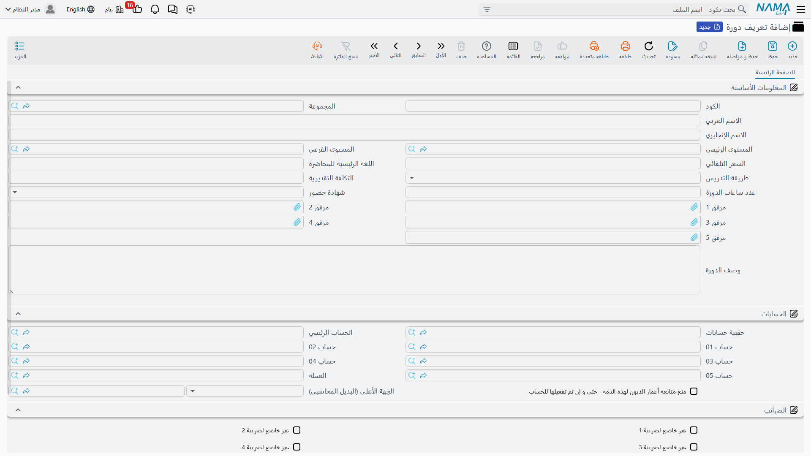
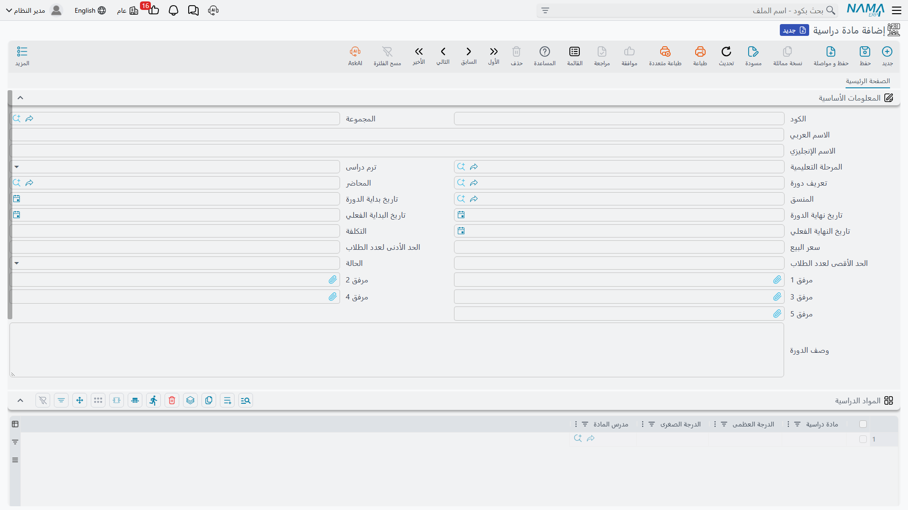

# تعريفات الدورات والمواد الدراسية

كُتيّب مركز التدريب يذكر دورة **الإكسل المتقدم للمحاسبين** مرة واحدة: ثلاثون ساعة، تُدرَّس بالإنجليزية،
داخل القاعة، موجَّهة إلى المستوى المتوسط في المحاسبة، وتنتهي بشهادة حضور. هذا السطر في الكُتيّب لا
يتغيّر.

الذي يتغيّر هو تنفيذها. دفعة الربيع تبدأ في الأول من مارس، تُدرِّسها سارة منصور وينسّقها أحمد فؤاد،
وتُباع بـ 1,800 للطالب الواحد. ودفعة الخريف تبدأ في 15 سبتمبر بمحاضر آخر وسعر آخر. سطر واحد في
الكُتيّب، وشيئان مختلفان تماماً من حيث التنظيم، ومجموعتان مختلفتان من الدرجات.

وهذا بالضبط هو الفصل الذي يقوم عليه النظام: **تعريف الدورة** هو سطر الكُتيّب، أي بطاقة الكتالوج.
و**المادة الدراسية** هي الدورة التي تُنفِّذها فعلاً، وهي السجل الذي تتعلّق به الرسوم والمحاضرون
والتواريخ ودرجات المواد.

## تعريف الدورة — بطاقة الكتالوج

تُنشئه من **التعليم ← الملفات ← تعريف دورة**.

وإلى جانب الكود والمجموعة والاسمين العربي والإنجليزي المعتادة، تجيب البطاقة عن الأسئلة التي يجيب عنها
دليل الدورات:

| الحقل | ما الذي يقوله |
|---|---|
| **المستوى الرئيسي** (Main Level) / **المستوى الفرعي** (Sub Level) | المستوى الأكاديمي الذي تقع فيه الدورة — «متوسط»، وتحته «متوسط – مالي» |
| **اللغة الرئيسية للمحاضرة** (Lecture Main Language) | نص حر: `إنجليزي`، `عربي`، `عربي بمادة إنجليزية` — كما يقول دليلك تماماً |
| **طريقة التدريس** (Teaching Method) | **Online** أو **الحضور** (Attendance) — عبر الإنترنت، أو داخل قاعة |
| **عدد ساعات الدورة** (Session Total Hours) | عدد الساعات التدريسية التي تعادلها الدورة — الثلاثون في «دورة من ثلاثين ساعة» |
| **التكلفة التقديرية** (Estimated Cost) و**السعر التلقائي** (Automatic Price) | أرقام تخطيطية تُسجّلها على البطاقة للاسترشاد |
| **شهادة حضور** (Attendance Certificate) | **نعم** أو **لا** — هل يستحق من أتمّ الدورة شهادة حضور؟ |
| **وصف الدورة** (Course Description) | النص المطوّل الذي تضعه في الكُتيّب |
| **مرفق 1..5** (Attachment 1..5) | المنهج، وخطاب الاعتماد، ونموذج المادة العلمية |

### المستوى الرئيسي والمستوى الفرعي يصنّفان الدورات لا الطلاب

كلاهما ملف رئيسي قائم بذاته — **التعليم ← الملفات ← المستوى الرئيسي** و**← المستوى الفرعي** — ولا
يحمل سوى كود واسم. ومن المهم توضيح الغرض منهما لأن اسميهما يغريان بالتخمين الخاطئ: هما تصنيف
**كتالوج الدورات** على مستويين. ولا علاقة لهما بهيكل المرحلة التعليمية والفصل والصف الذي ينتمي إليه
الطلاب، وهو الهيكل الموصوف في
[الطلاب وأولياء الأمور والهيكل الدراسي](./education-master-files). فالطالب لا يوضع أبداً على مستوى
رئيسي، وإنما يوضع عليه تعريف الدورة.

## المادة الدراسية — الدورة التي تُنفِّذها

تُنشئها من **التعليم ← الملفات ← مادة دراسية**.

::: info سجلّان، والمسمّيات متداخلة
الشاشة التي أمامك اسمها **مادة دراسية** (Course)، وكذلك اسم الجدول بداخلها واسم كل سطر من أسطره.
اقرأها هكذا: **السجل** هو الدورة التي تُنفِّذها، و**أسطر الجدول** هي المواد التي تتكوّن منها. وبقية
هذه الصفحة تقول «الدورة» للسجل و«المادة» للأسطر.
:::

| الحقل | ما الذي يقوله |
|---|---|
| **المرحلة التعليمية** (Educational Stage) | المرحلة التي تنتمي إليها هذه الدورة |
| **ترم دراسى** (Semester) | الاول، الثاني، الثالث، الرابع أو سنوى |
| **تعريف دورة** (Course Definition) | بطاقة الكتالوج التي تُعدّ هذه الدورة تنفيذاً لها |
| **المحاضر** (Lecturer) | من يُدرّسها |
| **المنسق** (Coordinator) | من يتولّى تنظيمها إدارياً |
| **تاريخ بداية الدورة** (Course Start Date) و**تاريخ نهاية الدورة** (Course End Date) | الخطة |
| **تاريخ البداية الفعلي** (Actual Start Date) و**تاريخ النهاية الفعلي** (Actual End Date) | ما حدث فعلاً، يُكتب عند حدوثه |
| **التكلفة** (Cost) | ما يُتوقَّع أن يكلّفك تشغيل هذه الدفعة — رقم تُسجّله |
| **سعر البيع** (Sales Price) | ما يدفعه الطالب الواحد. وهذا الحقل هو الذي ينتقل — انظر أدناه |
| **الحد الأدنى / الأقصى لعدد الطلاب** (Minimum / Maximum Number Of Students) | حجم الدفعة الذي تخطّط له، مكتوباً على البطاقة لمن ينظّمون الدورة |
| **وصف الدورة** (Course Description) و**مرفق 1..5** (Attachment 1..5) | كما في تعريف الدورة |

ويستحق حقلا **المحاضر** و**المنسق** وقفة ثانية، فهما أكثر ما يلتبس على القارئ في هذه الشاشة.
فالمحاضر في النظام ملف رئيسي قائم بذاته، له بيانات اتصاله وأساس أجره — وهو **ليس** ملف موظف، وإنشاء
محاضر لا يُنشئ موظفاً. أما المنسق بجواره فهو **موظف** عادي. ومن ثمّ فمن يُدرّس الدورة ويتولّى تنسيقها
معاً يحتاج إلى سجل على كل من الجانبين. والملفان مشروحان في
[الطلاب وأولياء الأمور والهيكل الدراسي](./education-master-files).

وأسفل المعلومات الأساسية تحمل الشاشة مجموعات **الحسابات** و**الضرائب** و**المحددات** المعتادة التي
تشترك فيها الملفات الرئيسية في النظام.

### اختيار تعريف الدورة لا ينقل شيئاً

هذه هي النقطة التي تفاجئ الجميع، ولذلك يحسن قولها صراحةً: اختيار تعريف الدورة على المادة الدراسية
**ربطٌ ولا شيء غير الربط**. لا يُنقل منه شيء إلى الأسفل — لا المستوى، ولا لغة المحاضرة، ولا طريقة
التدريس، ولا عدد الساعات، ولا التكلفة التقديرية، ولا حقل شهادة الحضور.

ومن ثمّ فالمادة الدراسية تُملأ بالكامل بذاتها. والتعريف الذي تشير إليه يخبر من يقرأ السجل بأي سطر من
الكتالوج ترتبط هذه الدفعة، ويتيح لك استعراض كل دفعات *الإكسل المتقدم للمحاسبين* جنباً إلى جنب — أما
التواريخ والمحاضر والسعر والمواد فأنت من يكتبها على المادة الدراسية نفسها. وحين تفتح ترماً جديداً
لدورة سبق أن نفّذتها، فإن إجراء **نسخة مماثلة** (Duplicate) على الدفعة السابقة أسرع بداية: فهو يأتي
معه بجدول المواد، ولا يبقى إلا تصحيح التواريخ والمحاضر والسعر.

### جدول المواد

الجدول أسفل المادة الدراسية يقسّم الدورة إلى الأجزاء التي يُقيَّم فيها الطالب. وكل سطر يسمّي مادة
واحدة والدرجتين المرتبطتين بها:

| العمود | ما الذي يحمله |
|---|---|
| **مادة دراسية** (Course) | اسم المادة — **نص حر** يُكتب باليد، وليس مرجعاً إلى سجل آخر |
| **الدرجة العظمى** (Up Mark) | الدرجة القصوى التي تُحسب المادة منها |
| **الدرجة الصغرى** (Down Mark) | درجة النجاح — أقل درجة تُعدّ نجاحاً |
| **مدرس المادة** (Staff) | الموظف الذي يُدرّس تلك المادة |

وفي دفعة الإكسل قد يقرأ الجدول هكذا: *المعادلات والدوال* من 40 والنجاح عند 20، و*الجداول المحورية
ولوحات المعلومات* من 30 والنجاح عند 15، و*النمذجة المالية* من 30 والنجاح عند 15 — أي 100 درجة موزَّعة
على ثلاث مواد.

ولأن أسماء المواد نص حر، فهي حرفياً ما تكتبه أنت. فاكتبها بالصيغة التي تريد أن تظهر بها في كشف درجات
كل طالب، لأن هذا بالضبط هو مصيرها: [رصد الدرجات](./education-marks) ينقل هذا الجدول كما هو إلى كشف
الطالب، بأسماء المواد وبالدرجتين معاً.

## من أين يدخل المال: سعر البيع

لوحدة التعليم نصف أكاديمي ونصف مالي، وحقل **سعر البيع** على المادة الدراسية هو الحقل الوحيد الذي
يصل بينهما.

فحين تُحرّر [عقد دورة تدريبية](./education-course-contracts) وتختار الدورة عليه، يُكتب سعر بيع تلك
الدورة في **سعر الوحدة** (Unit Price) في أسطر الطلاب على العقد. فتصير الـ 1,800 عندنا 1,800 لكل
طالب؛ واثنا عشر طالباً على عقد واحد بكمية 1 لكل منهم تعطي 21,600 تُجدوَل وتُحصَّل. ومن تلك اللحظة
تنتقل القيادة إلى العقد — فالخصومات والضرائب والأقساط والتحصيل كلها تعيش عليه، والعقد لا الدورة هو
الذي يصل إلى دفتر الأستاذ.

::: tip اضبط السعر قبل التعاقد لا بعده
ينتقل السعر في لحظة اختيارك للدورة على العقد. وتغيير سعر البيع على المادة الدراسية لاحقاً لا يرتدّ
إلى العقود المحرَّرة من قبل — فهي تحتفظ بسعر الوحدة الذي أُعطي لها، وهو المطلوب عادةً، إذ لا ينبغي
لاتفاق موقَّع أن يتحرّك من تلقاء نفسه. لكن هذا يعني أن السعر على المادة الدراسية يُستحسن أن يكون
صحيحاً **قبل** تحرير أول عقد في الدفعة. أما على عقد محرَّر بالفعل، فصحِّح سعر الوحدة على سطر الطالب
يدوياً.
:::

وما يفعله الجانب المالي بعد ذلك — من يدفع، وخطة الأقساط، والتحصيل، والإلغاء — مشروح في
[عقود الدورات التدريبية](./education-course-contracts) و[جداول الأقساط والتحصيل](./education-payment-schedules)
و[إلغاء عقد دورة تدريبية](./education-contract-cancellation).

وحفظ المادة الدراسية أو تعريف الدورة لا يُنشئ بذاته أي قيد محاسبي ولا أي حركة مخزنية. فهما سجلّا
كتالوج وتخطيط؛ ولا يسمع دفتر الأستاذ إلا من العقد.
