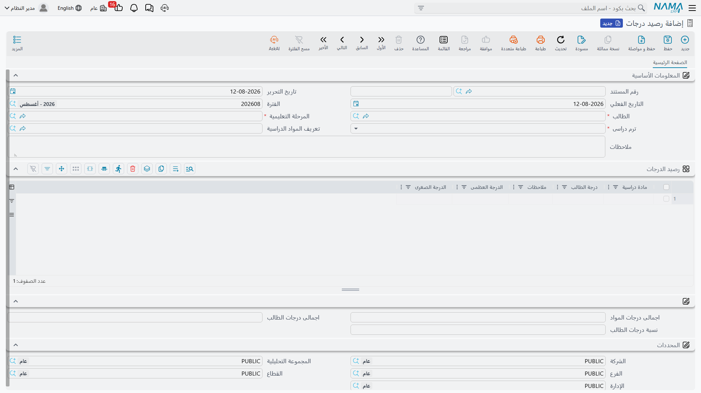

# رصد الدرجات

في نهاية الترم لا بدّ أن يسجّل أحدهم ما حصل عليه كل طالب في كل مادة. وهذا السجل في النظام هو
**رصيد الدرجات**، والمستند الواحد منه يغطّي طالباً واحداً، في دورة واحدة، في ترم واحد.

تصل إليه من **التعليم ← الملفات ← رصيد درجات**.

## ما الذي يغطّيه رصيد الدرجات الواحد

اعتبره كشف درجات طالب واحد عن ترم واحد. فإذا كان في المرحلة ثلاثون طالباً، أنتجت نهاية الترم ثلاثين
رصيد درجات — واحداً لكل طالب. وإذا درس الطالب نفسه دورة ثانية في الترم ذاته، فذلك مستند إضافي.

وهو مستند عادي في النظام، فيأخذ **دفتراً** وكوداً و**تاريخ تحرير** (Issue Date) و**تاريخاً فعلياً**
(Value Date) و**فترة** (Fiscal Period). وخلافاً لأغلب المستندات، لا يحتاج إلى
[توجيه مستند](./education-document-terms) — فلا حقل توجيه على الشاشة، ولا يُطلب منك عند الحفظ.

وأربعة عناصر تحدّد هوية الكشف، وأول ثلاثة منها إلزامية:

- **الطالب** (Student) صاحب هذه الدرجات؛
- **المرحلة التعليمية** (Educational Stage) التي درس فيها؛
- **ترم دراسى** (Semester) — الاول أو الثاني أو الثالث أو الرابع أو سنوى؛
- والدورة، وتُختار في حقل **تعريف المواد الدراسية** (Course Definition) — وفيه تختار الدفعة التي
  حضرها الطالب فعلاً، الموصوفة في
  [تعريفات الدورات والمواد الدراسية](./education-courses).

وحقل **ملاحظات** (Description) في نهاية المجموعة يستوعب ما يحتاج الكشف كله إلى قوله.

## أسطر المواد تأتي من الدورة

اختيار الدورة هو الخطوة التي تقوم بالعمل. فبمجرد اختيارها يقرأ النظام جدول المواد في تلك الدورة
ويبني هنا سطراً لكل مادة فيه، ناقلاً اسم المادة ودرجتيها معاً:

| العمود | من أين يأتي |
|---|---|
| **مادة دراسية** (Course) | اسم المادة منقولاً من الدورة. وهو نص حر هناك ونص حر هنا |
| **الدرجة العظمى** (Up Mark) | الدرجة القصوى التي تُحسب منها المادة، منقولة من الدورة |
| **الدرجة الصغرى** (Down Mark) | درجة النجاح، منقولة من الدورة |
| **درجة الطالب** (Student Mark) | **العمود الوحيد الذي تكتبه** — ما حصل عليه هذا الطالب فعلاً |
| **ملاحظات** (Notation) | نص حر لكل مادة: «غاب عن الامتحان التكميلي»، «سلّم المشروع متأخراً» |

فيصلك الكشف جاهزاً للتعبئة. وبأخذ دفعة الإكسل من صفحة الدورات — *المعادلات والدوال* من 40 والنجاح
عند 20، و*الجداول المحورية ولوحات المعلومات* من 30 والنجاح عند 15، و*النمذجة المالية* من 30 والنجاح
عند 15 — تختار الدورة، فتظهر ثلاثة أسطر بهذه الأرقام الستة في مواضعها، ولا تكتب أنت إلا 34 و22 و19.

ووجود درجة النجاح على السطر بجوار الدرجة التي تكتبها هو الغاية من نقلها: فمن يرصد الدرجات، ومن يقرأ
الكشف بعده، يرى بنظرة واحدة موقع كل مادة من الحدّ الذي وضعته الدورة.

::: warning اختيار الدورة يعيد بناء الجدول
تُسحب الأسطر من الدورة من جديد في كل مرة تختار فيها دورة، وهي **تحلّ محلّ** ما في الجدول. فإن كنت قد
كتبت درجات ثم غيّرت الدورة على المستند، ذهبت تلك الدرجات مع الأسطر القديمة. فاستقرّ على الطالب
والدورة أولاً، ثم ارصد الدرجات.
:::

ولأن أسماء المواد نص عادي منقول من الدورة، فهي تُقرأ تماماً كما كُتبت هناك — وتبقى كما كانت يوم
إعداد الكشف. فإعادة تسمية مادة على الدورة لاحقاً لا تعيد كتابة كشوف صدرت من قبل، وهو المطلوب: كشوف
الترم الماضي ينبغي أن تحتفظ بصياغة الترم الماضي.

## رصيد الدرجات يرصد الدرجات ولا شيء غيرها

يحسن قول هذا صراحةً، لأن المستند يقع في وحدة تتعامل أيضاً مع المال.

رصيد الدرجات سجلٌّ فحسب. فحفظه واعتماده لا يُنشئ **أي قيد محاسبي** ولا **أي حركة مخزنية**، ولا يغذّي
**أي مستند آخر** — لا عقد دورة، ولا رسوماً، ولا قسطاً، ولا حضوراً. ولا يقرؤه شيء في الوحدة بعد ذلك.
فالدرجات والمال لا يلتقيان: الجانب المالي في التعليم يجري بالكامل عبر
[عقد الدورة التدريبية](./education-course-contracts) و[جدول أقساطه](./education-payment-schedules).

وهذا الاستقلال مريح عملياً. فبإمكان الهيئة الأكاديمية رصد الدرجات وتصحيحها وإعادة إدخالها في نهاية
الترم دون أي خطر على عقد أو رصيد أو مديونية — ويوجد كشف درجات الطالب سواءً اكتمل تحصيل الرسوم أم لم
يكتمل.
