# الطلاب وأولياء الأمور والهيكل الدراسي

لا تستطيع المدرسة أن تسجل يوم حضور واحداً، ولا أن تطبع كشف درجات، ولا أن توقّع عقد دورة تدريبية،
قبل أن تُعرِّف نفسها للنظام: ما المراحل التي تدرّسها، وكيف تنقسم هذه المراحل، ومن هم الطلاب، ومن
المسؤول عنهم. هذا التعريف كله يعيش في **التعليم ← الملفات**، وهو أول ما تبنيه في هذه الوحدة.

كل ما في هذه الصفحة سجلات معلومات. هذه السجلات تحمل البيانات وتوفّر الأطراف والتصنيفات التي تشير
إليها بقية الوحدة — وهي لا تنشئ أي قيود محاسبية ولا أي حركة مخزنية على الإطلاق. المكان الوحيد في
التعليم الذي تصل فيه الأموال إلى الحسابات هو [عقد الدورة التدريبية](./education-course-contracts).

## الهيكل الدراسي من أعلى إلى أسفل

تخيّل مدرسة اسمها «النور». تدرّس ثلاث مراحل: الابتدائية والإعدادية والثانوية. الابتدائية مقسّمة إلى
ستة فصول، فصل لكل سنة دراسية، وكل فصل مقسّم إلى صفّين أو ثلاثة، في كل صف نحو ثلاثين طالباً. ونظام
نما يمثّل هذا الشكل بالضبط عبر أربعة ملفات.

### نوع مرحلة (Stage Type)

**نوع المرحلة** قائمة بسيطة: كود واسمان، لا أكثر. وهو يصنّف المراحل نفسها — فقد تنشئ أنواعاً مثل
«عام» و«فني» و«لغات»، أو «أساسي» و«عالٍ». لا يستخدمه شيء آخر في الوحدة، فاجعل القائمة قصيرة ومعبّرة؛
هي موجودة لتتمكن مدرسة ذات مراحل كثيرة من تجميعها.

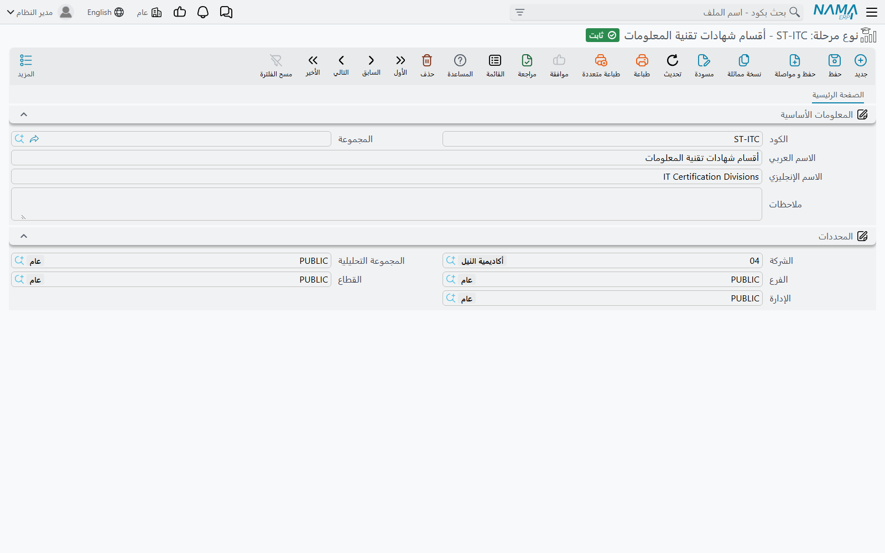

### مرحلة تعليمية (Educational Stage)

**المرحلة التعليمية** هي العمود الفقري للوحدة كلها. هي السجل الذي تنشئه لـ«الابتدائية»
و«الإعدادية» و«الثانوية» — أو في مركز تدريب لـ«مبتدئ» و«متوسط» و«متقدم». وإلى جانب الكود والاسمين
تحمل **نوع المرحلة** وملاحظات حرة وجدول **الفصول** الذي يسرد الفصول التي تتكوّن منها المرحلة.

المراحل تتداخل. يمكن أن تقع مرحلة تحت مرحلة أخرى، فتستطيع مدرسة كبيرة أن تمثّل «الابتدائية ← الحلقة
الأولى / الحلقة الثانية» بدلاً من تسطيح كل شيء في قائمة واحدة. وهذا التداخل ليس حقلاً في الشاشة القياسية؛
بل يُدار من شاشة القائمة الشجرية للمرحلة التعليمية، حيث تظهر المراحل كشجرة قابلة للفتح والطي.

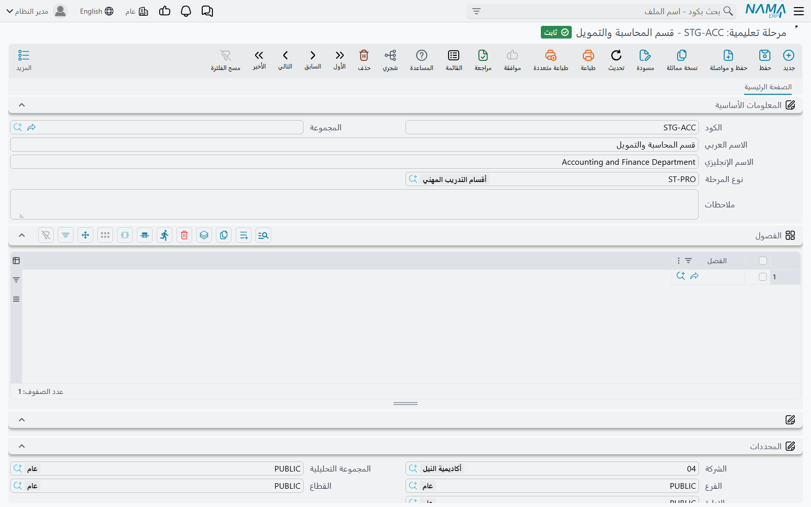

::: tip السجل الأكثر استخداماً في التعليم
تظهر المرحلة التعليمية في كل مكان تقريباً: على الطلاب والفصول والصفوف والمواد الدراسية وكشوف الحضور
والمتابعة اليومية وكشوف الدرجات وقائمة المصاريف المعلنة. فإذا كانت قائمة المراحل خاطئة ورثت كل شاشة
لاحقة الخطأ نفسه — لذلك اتفق على قائمة المراحل مع المدرسة قبل إدخال أي شيء آخر.
:::

### فصل (Class Room)

**الفصل** هو أحد أقسام المرحلة — الصف الرابع في الابتدائية، أو مجموعة «المبتدئين المسائية» في مركز
تدريب. ويحمل سجله كوداً واسمين، و**المرحلة التعليمية** التي ينتمي إليها، وملاحظات، وجدول **الصفوف**
الذي يسرد الصفوف داخله.

والارتباط مسجَّل من الطرفين: الفصل يسمّي مرحلته، والمرحلة تسرد الفصل في جدولها. املأ الطرف الذي تقف
عنده — فهما رؤيتان لهيكل واحد، والمدرسة تبني الشجرة عادةً من المرحلة نزولاً.

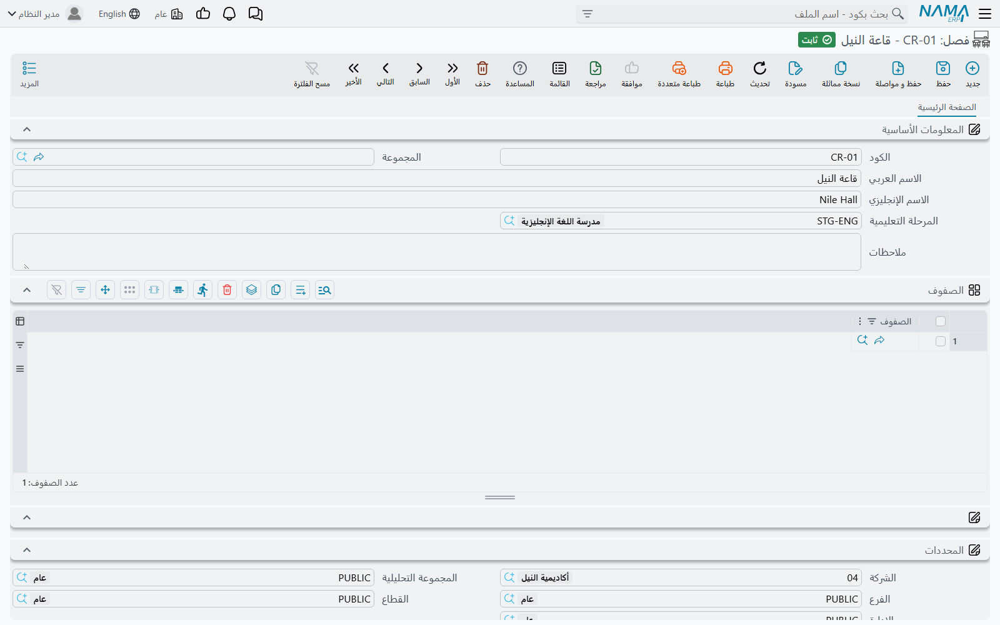

### صف (Rank)

**الصف** هو أصغر تجميعة لها اسم — الصفوف 4/أ و4/ب و4/ج داخل الفصل الرابع. وهو يسمّي **الفصل** الذي
ينتمي إليه، ويحمل حقل **عدد الطلاب** الذي تسجّل فيه العدد الذي يُفترض أن يستوعبه هذا الصف، وجدول
**الطلاب** — وهو المكان الذي يوضع فيه كل طالب في صفه فعلياً.

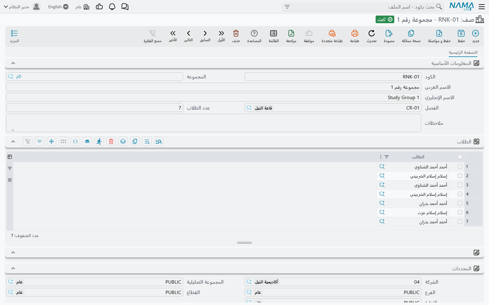

::: info عدد الطلاب رقم مسجَّل
الرقم الذي تكتبه هناك توثيق تخطيطي لمن يقرأ السجل — ملاحظة بأن الصف 4/أ صف من ثلاثين طالباً — وهو
لك تستخدمه في تقاريرك وفي تخطيط الطاقة الاستيعابية.
:::

## أين يقع الطالب من هذا الهيكل

الهيكل يُبنى من أعلى إلى أسفل، وكل مستوى يسرد المستوى الذي تحته: المرحلة تسرد فصولها، والفصل يسرد
صفوفه، والصف يسرد طلابه. فـ«الابتدائية» تسمّي الفصول من الأول إلى السادس، والفصل الرابع يسمّي الصفوف
4/أ و4/ب و4/ج، والصف 4/أ يسمّي الثلاثين طالباً الذين فيه.

**ويُوضع الطالب بإضافته إلى جدول الطلاب في صفه**، لا من ملف الطالب. أما ملف الطالب نفسه فلا يحمل
سوى رابط دراسي واحد هو **المرحلة التعليمية** — وهي مرحلة الطالب لا صفّه. وكلاهما مهم، وكلٌّ منهما
يجيب عن سؤال مختلف.

وهذا الفصل يتبع الطريقة التي تسأل بها بقية الوحدة أسئلتها. فكشوف الحضور والمتابعة اليومية وكشوف
الدرجات تُؤخذ كلها **لكل مرحلة** ثم تسرد الطلاب فيها، أي أن المرحلة الموجودة على ملف الطالب هي
التصنيف الذي تقرأه تلك الشاشات. وجدول الطلاب في الصف هو موضع التوزيع الأدق — في أي صف يجلس الطالب،
وكم امتلأ ذلك الصف مقارنةً بـ**عدد الطلاب** الذي سجّلته عليه.

## ملف الطالب (Student)

**ملف الطالب** هو هوية الطالب أو المتدرب في النظام، وهو في الوقت نفسه ذمة تستطيع المدرسة أن تحمّلها
المصاريف. تبدأ الشاشة بمجموعة «المعلومات الأساسية»:

| الحقل | ما يحمله |
|---|---|
| الكود، المجموعة (Code, Group) | رقم الطالب وتجميعة اختيارية من عندك |
| الاسم العربي / الاسم الإنجليزي (Name1 / Name2) | اسم الطالب بالعربية وبالإنجليزية |
| المرحلة التعليمية (Educational Stage) | المرحلة المقيَّد بها الطالب |
| ولى الامر (Guardian) | ولي الأمر أو الكفيل المسؤول عن الطالب |
| تاريخ الميلاد، تاريخ الإلتحاق (Birth date, Joining Date) | تاريخ الميلاد وتاريخ الالتحاق بالمدرسة |
| حالة القيد (Enrollment State) | مستجد، منقول، مقيد، إعادة تسجيل، أو ثلاث قيم إضافية |
| الديانة، الجنسية (Religion, Nationality) | قوائم قياسية مشتركة مع بقية النظام |
| نوع العقد (Contract Type) | هيئة أو خاص، بالإضافة إلى ثلاث قيم إضافية |
| نوع البرنامج (Program Type) | البرنامج الصباحي، البرنامج المسائي، أنشطة رياضية، وثلاث قيم إضافية |
| صورة، مرفق 1..5 (Picture, Attachment 1..5) | صورة الطالب وحتى خمسة مستندات ممسوحة ضوئياً |
| ملاحظات (Description) | ملاحظات حرة |

ويستحق **نوع العقد** جملة خاصة، لأنه يحدّد كيف تقرأ المدرسة كشوفها: الطالب «هيئة» هو من تتحمل
مصاريفه وزارة أو شركة أو جهة راعية أخرى، بينما الطالب «خاص» يدفع بصفته الشخصية. وحين تتحمل المصاريف
جهة خارجية بالفعل، تُسمَّى تلك الجهة في العقد بوصفها **المتعهد**، كما هو موضح لاحقاً في هذه الصفحة.

وتحت ذلك تأتي مجموعة **العنوان** كاملة — الدولة والمدينة والولاية والمنطقة والشارع ورقم المبنى
والرمز البريدي والحي ورقم قطعة الأرض وسطران حران للعنوان وموقع على الخريطة — يليها مجموعات
**الحسابات** و**الضرائب** و**المحددات** الموصوفة في القسم التالي.

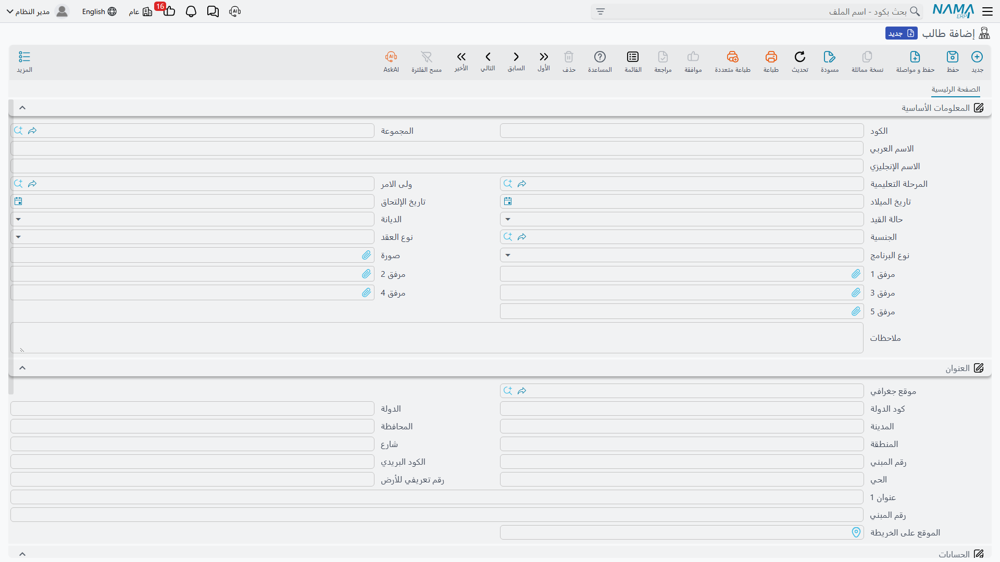

## أولياء الأمور، وكيف يُربط الطالب بولي أمره

**ولي الأمر** هو الأب أو الأم أو الكفيل الذي يجيب عن طالب أو أكثر. ويحمل السجل كوداً واسمين،
و**الوظيفة الحالية** لولي الأمر، ورقم **هاتف محمول** و**بريد إلكترونى** للتواصل السريع، وملاحظات.
وفي صفحة ثانية باسم **معلومات الاتصال** تجد كتلتي اتصال كاملتين: واحدة لمكان إقامة الأسرة الآن،
وأخرى بعنوان «معلومات الأتصال في البلد الأصلي» لبلد المنشأ — وهي الثنائية التي تحتاجها المدارس ذات
الأسر الوافدة. وكل كتلة تحمل عنواناً كاملاً بالإضافة إلى هاتفين ومحمول وفاكس وبريد إلكتروني وموقع
إلكتروني.

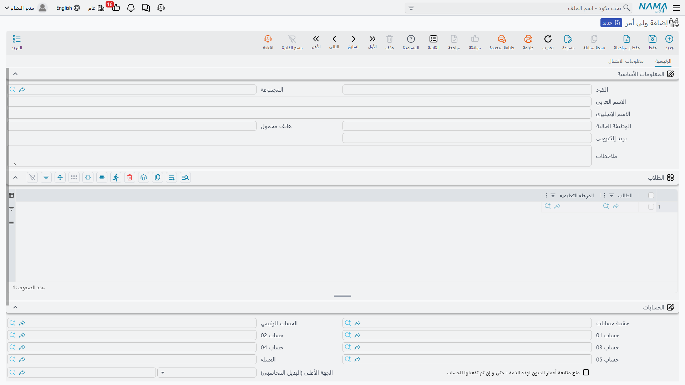

::: info محمولان وبريدان
الهاتف المحمول والبريد الإلكتروني في الصفحة الأولى، والمحمول والبريد داخل كتلة معلومات الاتصال،
حقول منفصلة تخدم عادتين مختلفتين: تواصل سريع في الواجهة الأولى، وسجل بريدي كامل في الصفحة الثانية.
اتفقوا كمدرسة على أيهما سيعتمده الموظفون، واملأوه باستمرار.
:::

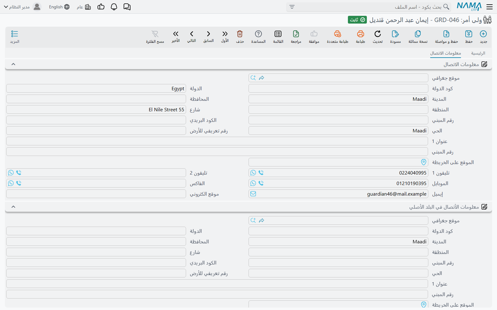

أما الربط بين الشخصين فيتم **في ملف الطالب**: تفتح الطالب وتختار ولي الأمر في حقل «ولى الامر».
ويمكن أن يشير إلى ولي الأمر الواحد أي عدد من الطلاب، وهكذا تنتهي أسرة من ثلاثة إخوة إلى حساب واحد.
وإذا تغيّر أبناء ولي الأمر — خرج طالب أو التحق أخ أصغر — فأنت تعدّل ملفات الطلاب، لا ملف ولي الأمر.

## الطلاب وأولياء الأمور ذمم محاسبية

يحمل كل من ملف الطالب وملف ولي الأمر مجموعة **الحسابات**، وهي ليست زينة: فبلغة نظام نما كلٌّ منهما
**ذمة** — طرف تستطيع الحسابات أن تحتفظ له برصيد في دفتر الأستاذ، تماماً كالعميل أو المورد.

تمنحك مجموعة الحسابات **حقيبة حسابات** و**الحساب الرئيسي** وخمس خانات حسابات إضافية («حساب 01» حتى
«حساب 05») و**العملة** الخاصة بالطرف، ومفتاحاً لاستثناء هذا الطرف تحديداً من متابعة أعمار الديون.
وعلى ملف الطالب تستطيع كذلك أن تحدد **الجهة الأعلي (البديل المحاسبي)** — عميل أو مورد أو موظف أو
طرف آخر — فتُوجَّه قيود هذا الطالب إليها، وبهذا تفوتر المدرسة شركةً عن اثني عشر طالباً ترعاهم مع
الاحتفاظ باثني عشر ملف طالب منفصلاً. أما مجموعة **الضرائب** المجاورة فتحدّد إعفاء الطرف من أي من
خانات الضرائب الأربع.

ويترتب على ذلك أمران، وهما سبب وجود هذا التصميم من الأساس:

1. **يمكن تحرير عقد الدورة على الطالب أو على ولي الأمر أو على عميل عادي.** فحقل الطرف في العقد يقبل
   الثلاثة، فتقع المصاريف على الحساب الذي تحصّل منه المدرسة فعلاً. راجع
   [عقود الدورات التدريبية](./education-course-contracts).
2. **يستطيع الطالب أو ولي الأمر أن يغذّي محدداً محاسبياً.** فكلاهما مسجَّل كمصدر للمحددات، أي أن سطر
   المستند يستطيع أن يأخذ محدده من الطالب أو من ولي الأمر الموجود عليه — وهو أمر مفيد حين تريد
   المدرسة تحليل إيراداتها حسب المرحلة أو الفرع أو الجهة الراعية دون بناء نظام ترميز مواز.

وأخيراً، تظهر مجموعة **المحددات** القياسية (الشركة والمجموعة التحليلية والفرع والقطاع والإدارة) على
كل ملف في هذه الوحدة، بما فيها الطلاب وأولياء الأمور.

## المحاضرون والموظفون والمتعهدون

### المحاضر ليس سجل موظف

هذه هي نقطة التصميم التي تربك الناس أكثر من غيرها، فيحسن قولها صراحة: **ملف المحاضر ليس ملف الموظف
في وحدة الموارد البشرية.** فالمحاضر يُنشأ من التعليم ← الملفات ← **المحاضر**، ولا علاقة للسجل
بالرواتب.

يحمل السجل الكود والاسمين، و**تاريخ بدء التعاقد**، وحقل **الأوقات المفضلة** الحر الذي تدوّن فيه
الفترات التي يقبلها المدرّس («صباح الأحد والثلاثاء، ولا شيء يوم الخميس»)، وحتى خمسة مرفقات للشهادات
والعقود، وكتلة معلومات اتصال كاملة، والمحددات. ثم يُسمَّى المحاضرون على
[المواد الدراسية](./education-courses).

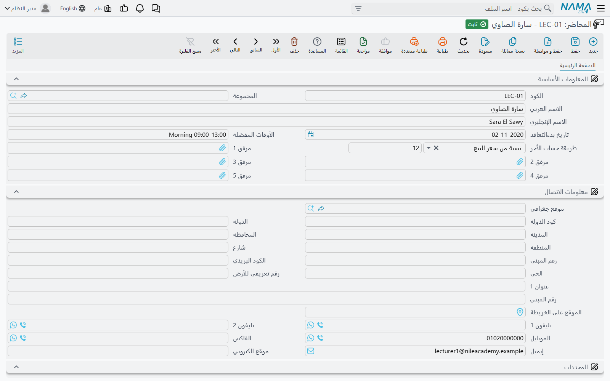

وإذا كان الشخص نفسه موظفاً على رأس العمل بالمدرسة، فهو موجود مرتين: مرة كموظف في الموارد البشرية
حيث يُحسب راتبه، ومرة كمحاضر هنا حيث يُسجَّل تكليفه بالتدريس.

### الموظفون والكفلاء في المجموعة نفسها

للتيسير، وُضعت شاشتا **موظف** و**كفيل** العاديتان داخل مجموعة قائمة التعليم ← الملفات. وهما السجلان
نفسهما اللذان يستخدمهما بقية النظام — ولا يحدث لهما شيء خاص بالتعليم. وأنت تحتاجهما لأن المادة
الدراسية تسمّي موظفاً بوصفه **منسقاً** لها، ولأن الحافلة تسمّي موظفاً بوصفه مشرفاً عليها، فيوفّر
وجودهما هنا رحلة إلى قائمة أخرى.

### المتعهد (Education Contractor)

**المتعهد** هو الجهة الخارجية التي توفّر أو ترعى دفعة من المتدربين — وزارة أو وحدة عسكرية أو شركة
ترسل عشرين موظفاً إلى دورة لغة. والسجل مختصر عن قصد: كود ومجموعة واسمان. هو سجل تسمية، يُستخدم على
[عقد الدورة التدريبية](./education-course-contracts) ككل وعلى كل سطر طالب داخله، فتستطيع أن تجيب عن
سؤال: «أي متدربي هذا العقد جاءوا من أي جهة؟».

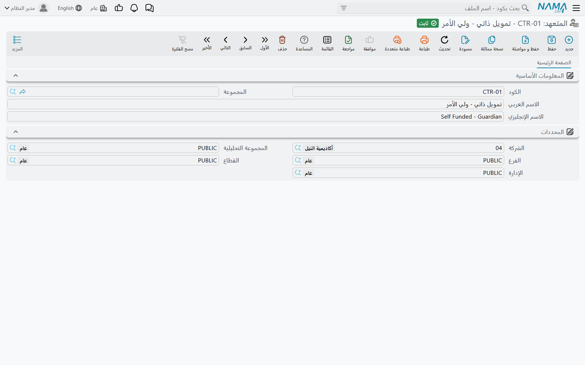

ولاحظ أن المتعهد وصف لا حساب. أما ممن تُحصَّل الأموال فقرار منفصل يُتخذ في العقد نفسه، حيث يكون
الطرف طالباً أو ولي أمر أو عميلاً.

## المستوى الرئيسي والمستوى الفرعي يصنّفان المواد لا الطلاب

يقع **المستوى الرئيسي** و**المستوى الفرعي** في مجموعة قائمة «الملفات» نفسها إلى جوار المرحلة
التعليمية والفصل والصف، ويغريك اسماهما بقراءتهما كطبقة أخرى من الهيكل الدراسي. وهما ليسا كذلك.
كلاهما قائمة بسيطة من كود واسمين، واستخدامهما الوحيد على سجل **تعريف الدورة**، حيث يصنّفان كتالوج
الدورات — «لغات ← إنجليزي»، «لغات ← فرنسي»، «حاسب ← شبكات».

وهما لا يظهران أبداً على طالب أو فصل أو صف. راجع
[تعريفات الدورات والمواد الدراسية](./education-courses) لمعرفة كيفية استخدامهما.

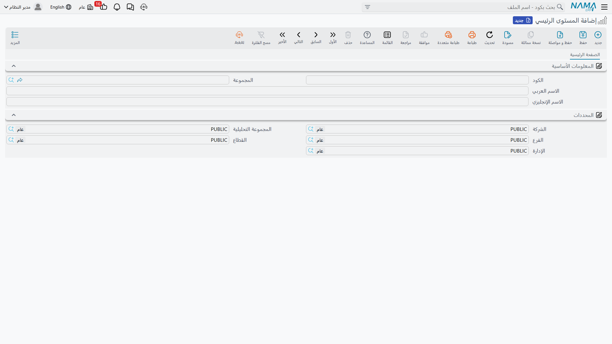

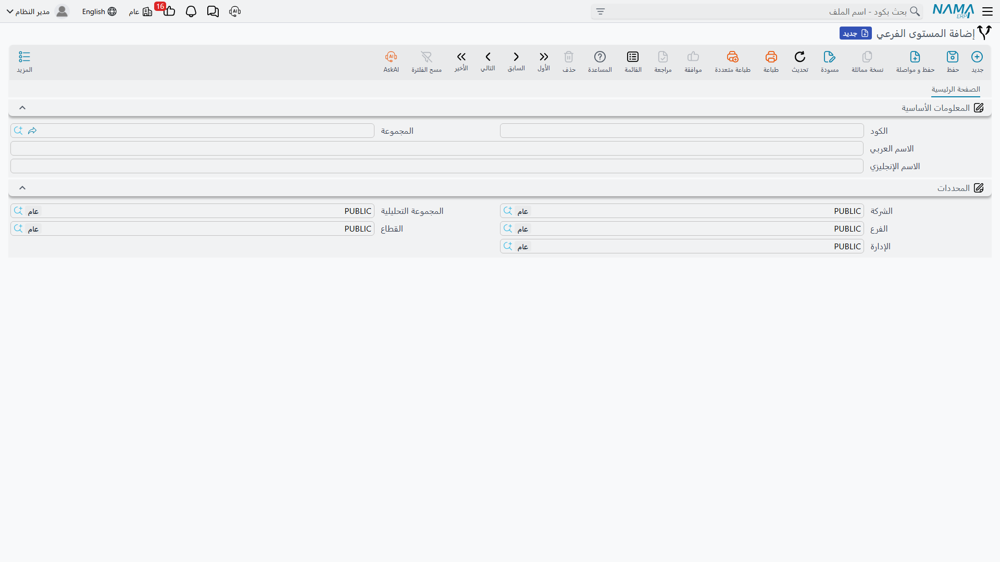

## تعديل بيانات الطالب بمستند «تحديث بيانات الطالب»

ملف الطالب ملف عادي، فيستطيع أي شخص لديه الصلاحية أن يفتحه ويكتب فوقه. وهذا مناسب لتصحيح خطأ
إملائي، لكنه لا يترك أثراً يبيّن **متى** انتقل الطالب من الإعدادية إلى الثانوية، أو **متى** غيّرت
الأسرة عنوانها. ومستند **تحديث بيانات الطالب** موجود لهذه التغييرات تحديداً: فهو مستند مؤرَّخ يحمل
القيم الجديدة، فتنتهي المدرسة إلى تاريخ محفوظ وقابل للمراجعة لكل تغيير، بدلاً من ملف كُتب فوقه في
صمت.

تحرّره كأي مستند آخر — دفتر وتوجيه المستند وتاريخ تحرير وتاريخ فعلي وفترة — ثم تختار **طالباً
واحداً** وتملأ فقط الحقول التي تغيّرها. وعند الاعتماد ينسخ المستند قيمه إلى ملف ذلك الطالب.

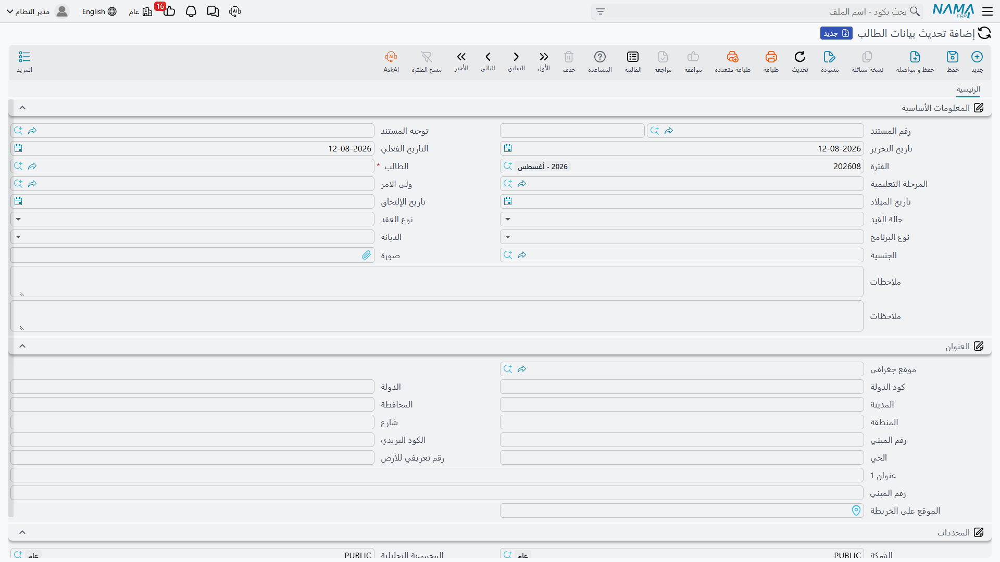

**ما يستطيع تغييره**: المرحلة التعليمية، وولي الأمر، وتاريخ الميلاد، وتاريخ الالتحاق، وحالة القيد،
ونوع العقد، ونوع البرنامج، والديانة، والجنسية، والصورة، وكتلة العنوان كاملة، وحقول الوصف والأرقام
والتواريخ الإضافية للطالب.

**ما لا يستطيع تغييره**: الكود، والاسمين، والمجموعة، والمرفقات، وإعدادات الحسابات وخانات الحسابات.
فهذه تبقى من مسؤولية ملف الطالب نفسه.

::: warning الحقل الفارغ يعني «اتركه كما هو»
كل قيمة ينسخها المستند لا تُنسخ إلا إذا كانت مملوءة. والحقل الذي تتركه فارغاً لا يُنقل بوصفه فراغاً
— بل يحتفظ الطالب بما كان فيه من قبل. وهذا يجعل المستند آمناً لتغيير واحد (تملأ حقلاً واحداً ولا
يتحرك سواه)، لكنه يعني أيضاً أنك لا تستطيع تفريغ قيمة عند الطالب بتحرير تحديث تركت فيه الحقل خالياً.
ولتفريغ حقل، عدّل ملف الطالب مباشرة.
:::

### التحديثات محفوظة بترتيب التاريخ

المستند مؤرَّخ لسبب، والنظام يحمي هذا الترتيب. فقبل الاعتماد يبحث عن أحدث مستند «تحديث بيانات
الطالب» معتمد للطالب نفسه، فإذا كان ذلك المستند مؤرخاً **بعد** المستند الذي تدخله، رُفض الاعتماد
بالرسالة:

> لا يمكن تحديث الطالب {0}, حيث أن هناك تحديث أخر {1} بعد هذا التحديث

وعملياً يعني هذا أنك **لا تستطيع تأريخ تحديث بتاريخ سابق خلف تحديث سبق اعتماده**. فإذا انتقل طالب
بين المراحل في سبتمبر ولم تدخل ذلك إلا في نوفمبر — بعد أن غيّر مستند أكتوبر المعتمد عنوانه بالفعل —
فسيُرفض إدخال سبتمبر، لأن السماح به يعني الكتابة فوق بيانات نوفمبر ببيانات سبتمبر. وإذا تساوى
التاريخ الفعلي لتحديثين، عُدَّ الذي أُدخل أولاً هو الأسبق منهما.

ولذلك تكون العادة السليمة هي إدخال كل تغيير حين يقع، وبالترتيب الذي وقع به. وإذا اضطررت إلى تصحيح
الماضي، فصحّح أحدث مستند بدلاً من إقحام مستند قديم خلفه.

## قائمة «مصاريف دراسية» — المصاريف المعلنة لكل مرحلة وترم

**مصاريف دراسية** هي قائمة الأسعار المعلنة للمدرسة. وهي ملف يحمل كوداً واسمين وجدولاً واحداً، يسمّي
كل سطر فيه **المرحلة التعليمية** و**الترم الدراسى** (الأول أو الثاني أو الثالث أو الرابع أو سنوى)
وقيمة **المصروفات** لهذه التركيبة — ابتدائي / الأول / 12,000، وابتدائي / الثاني / 12,000، وثانوي /
سنوى / 30,000، وهكذا.

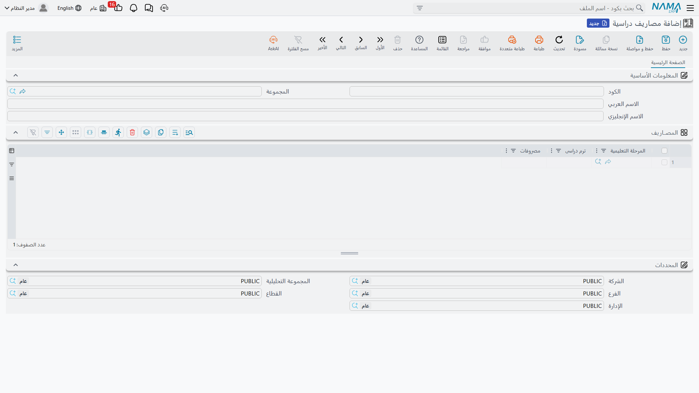

وهي قائمة مرجعية، محفوظة على حدة عمّا يحمّله أي عقد بعينه. فحين يُحرَّر عقد، تُدخل مبالغه على سطوره
وجدول أقساطه هو، مسعَّرة من المادة الدراسية ومن الاتفاق الذي عُقد مع تلك الأسرة؛ أما شاشة المصاريف
الدراسية فهي المكان الذي يُكتب فيه الرقم المعلن رسمياً لكل مرحلة وترم حتى يرجع إليه الموظفون
ويقتبسوه باتساق. وفصل الاثنين هو ما يتيح للمدرسة أن تحتفظ بقائمة أسعار معلنة واحدة بينما توقّع
عقوداً فيها خصومات وترتيبات تقسيط واستثناءات ممولة من جهات راعية. ولمعرفة ما يحمّله العقد فعلاً،
راجع [عقود الدورات التدريبية](./education-course-contracts) و
[جداول الأقساط والتحصيل](./education-payment-schedules).
