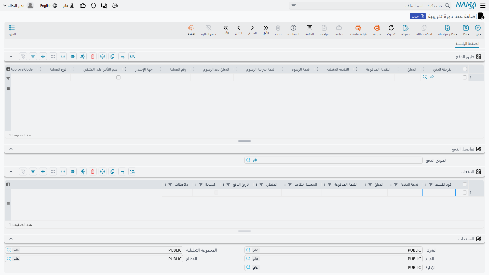

# جداول الأقساط والتحصيل

قليلة هي الأسر التي تسدّد رسوم سنة كاملة دفعة واحدة، وقليلة هي الشركات التي تدفع ثمن برنامج تدريبي
مقدَّمًا. لذلك يحمل [عقد الدورة التدريبية](./education-course-contracts) جدولين آخرين إلى جانب أسطر
الطلاب: **الدفعات**، وهو الوعد — أي خطة الأقساط التي اتّفق عليها الطرفان — و**طرق الدفع**، وهو الواقع —
أي المال الذي ورد بالفعل.

والفصل بين الاثنين هو جوهر الفكرة. فالجدول يقول ما المستحق ومتى، وأسطر الدفع تقول ما الذي وصل وكيف.
وهذه الصفحة تتناولهما معًا.

## ثلاث طرق لنشأة الجدول

تستطيع أن تبني الخطة بيدك، أو تدع نموذجًا محفوظًا يبنيها، أو تدع مربّع حوار يبنيها. والطرق الثلاث تنتهي
جميعًا إلى كتابة أسطر في جدول **الدفعات** نفسه.

### كتابة الأسطر بيدك

الجدول قابل للتحرير بالكامل. أضف سطرًا، وأعطه **المبلغ** و**تاريخ الدفع**، فيكون قسطًا صحيحًا. ويمكنك
ترك **كود القسط** فارغًا — فالنظام يملؤه عند الحفظ (انظر أدناه).

وهذا هو المسلك الصحيح في الحالات غير المنتظمة: أسرة تدفع نصف الرسوم في سبتمبر ونصفها في فبراير، أو شركة
تصرّ على السداد مقابل مراحل إنجاز، أو خطة تفاوَض عليها سطرًا سطرًا. وهو كذلك أبطأ الطرق، ولذلك وُجدت
الطريقتان الأخريان.

### اختيار نموذج دفع

حقل **نموذج الدفع** في رأس المستند يشير إلى خطة محفوظة — «أربعة أقساط شهرية متساوية بعد دفعة مقدّمة 20%»
مثلًا — أعدّتها مؤسستك مرّة واحدة وتعيد استعمالها في كل عقد. واختيار أحدها في العقد يبني الجدول فورًا.

ويعمل النموذج على خطوتين. أولًا يطبّق **الدفعة المقدّمة**، إمّا مبلغًا ثابتًا وإمّا نسبة؛ ويُفرَز ذلك
المبلغ باعتباره مدفوعًا عند التوقيع ويُخصم من الأعلى. ثم يوزّع ما تبقّى:

- نموذج **الدفعات المتساوية** ينتج عدد الأقساط الذي يحدّده، قيمة كلٍّ منها هي الرصيد مقسومًا على ذلك
  العدد، وتتقدّم التواريخ فترةً فترة. ويُعالَج التقريب بأن يستوعب **القسط الأخير** الفرق، فتظلّ الأسطر
  تجمع إلى الرصيد بدقّة. والنموذج هو الذي يقرّر هل يقع القسط الأول على التاريخ الفعلي للعقد أم بعده بفترة
  كاملة.
- نموذج **الدفعات المتغيّرة** ينتج قسطًا لكل سطر في النموذج، كلٌّ منها إمّا مبلغ ثابت وإمّا نسبة من
  الرصيد، بفاصله الزمني الخاص وبوصفه الخاص المنقول إلى القسط.

وإن حدّد النموذج تقريبًا، قُرِّب كل قسط عدا الأخير إلى مضاعف ذلك التقريب وأخذ الأخير الرصيد — وهو ما يُبقي
الخطة مرتّبة دون ضياع قرش.

::: warning اختيار نموذج يستبدل الجدول
النموذج لا يندمج مع ما في جدول الدفعات، بل **يعيد بناءه**. فكل ما كتبته هناك بيدك يزول. لذا اضبط النموذج
أولًا ثم عدّل يدويًا بعده — لا العكس.
:::

ونماذج الدفع ميزة على مستوى المنصّة كلّها وتُضبط خارج قائمة التعليم؛ ويتناول
[دليل المستخدم لجداول الدفع](/ar/modules/invoicing/payment-schedules-user-guide) طريقة بنائها.

### زر «أنشئ الدفعات»

حين تكون الخطة حالة منفردة لا تستحقّ نموذجًا محفوظًا، استعمل زر **أنشئ الدفعات** في شريط أدوات العقد. فهو
يطرح الأسئلة نفسها التي يجيب عنها النموذج، لكنه يطرحها الآن:

- **عدد الأقساط** المطلوب إنتاجها.
- **الفترة بينها** — رقم مع وحدة (يوم، أسبوع، شهر، سنة؛ والشهر هو الافتراضي). فـ«1 شهر» يعطي أقساطًا
  شهرية، و«3 شهر» يعطي أقساطًا ربع سنوية.
- **من أين تبدأ** — التاريخ الذي يُقاس منه القسط الأول — مع **فترة سماح** اختيارية، رقمًا ووحدةً كذلك،
  تؤخّر أول موعد استحقاق قبل أن يبدأ العدّ. ففترة سماح شهر في دورة تبدأ في سبتمبر تجعل القسط الأول يقع في
  أكتوبر.
- **التقريب** — المقدار الذي يُقرَّب إليه كل قسط، وهل يكون التقريب لأعلى أم لأدنى أم إلى الأقرب.
- **دفعة مقدّمة** اختيارية، وقيم اختيارية للقسط **الأول** و**الثاني** و**الأخير** حين يلزم أن تختلف عن
  البقية.
- **يوم من أيام الأسبوع** تُحاذى عليه مواعيد الاستحقاق، حين تجري جولة التحصيل في يوم ثابت.

ويحتاج «أنشئ الدفعات» أن يكون للعقد قيمة أولًا — فهو يرفض العمل على عقد لم تُملأ أسطره.

## مثال محسوب

خذ دورة تدريبية مهنية تُباع بـ**24,000**، تُسدَّد على **ثمانية أقساط شهرية بعد دفعة مقدّمة 4,000**، في عقد
تاريخه الفعلي أول سبتمبر.

تُخصم الدفعة المقدّمة 4,000 من الأعلى، فيتبقّى **20,000** للجدولة. فتُكتب ثمانية أقساط متساوية قيمة كلٍّ
منها **2,500** في جدول الدفعات، بفارق شهر بينها — أول أكتوبر، ثم أول نوفمبر، وهكذا حتى أول مايو. ومجموع
الأسطر الثمانية يساوي بالضبط 20,000 المتبقّية، وهو ما يتحقّق منه النظام عند الاعتماد.

والآن اجعل المثال أقلّ انتظامًا. افترض أنّ الرسم كان **24,500** بدلًا من ذلك. فبعد الدفعة المقدّمة نفسها
4,000 يصير الرصيد 20,500، و20,500 ÷ 8 تساوي 2,562.50. فيكتب النظام سبعة أسطر بـ2,562.50 ويترك **الثامن**
يستوعب الباقي، فيظلّ مجموع الخطة 20,500 بالضبط.

أضف تقريبًا إلى مضاعفات 100 لأدنى، فتزداد الخطة ترتيبًا: سبعة أقساط بـ2,500 وقسط أخير بـ3,000
(20,500 − 7 × 2,500). أقساط بأرقام مستديرة للأسرة، ومجموع دقيق لدفتر الأستاذ.

::: tip حين لا تتطابق المجاميع
رسالة «مجموع الدفعات لا يساوي المتبقي» تعني أنّ الجدول والعقد غير متّفقين. ويحدث ذلك في الغالب لأنّ أحدهم
عدّل سطر طالب — غيّر سعرًا، أو أضاف طالبًا، أو طبّق خصمًا — **بعد** توليد الجدول. فأعد توليد الجدول، أو
عدّل سطرًا بيدك، حتى تعود الأقساط تجمع إلى ما تبقّى سداده.
:::

## أكواد الأقساط

يحمل كل قسط **كود قسط**، ولا بدّ أن يكون فريدًا داخل العقد. وقلّما تكتبه بنفسك: **فعند الحفظ يملأ النظام
كل كود تُرك فارغًا.** وطريقة تكوينه إعداد على مستوى النظام كلّه، فتتصرّف كل المستندات في تركيبك التصرّف
نفسه. وفي الوضع الافتراضي يكون الكود هو التاريخ الفعلي للعقد متبوعًا برقم سطر من خانتين — فعقد تاريخه أول
سبتمبر 2026 ينتج `2026090101` و`2026090102` وهكذا. وتستطيع التركيبات تحويل ذلك إلى كود المستند مع رقم
السطر، أو إلى صيغة من عندها.

وهذه الأكواد أهمّ ممّا تبدو، لأنّها هي الطريقة التي يشير بها أيّ شيء آخر إلى قسط بعينه:
فـ[مستند الإلغاء](./education-contract-cancellation) يسوّي الأقساط بالكود، وكذلك يفعل أيّ مستند سداد
يُقفل قسطًا.

## قراءة جدول الدفعات

| العمود | ماذا يخبرك |
|---|---|
| **كود القسط** | مرجع القسط الفريد داخل العقد |
| **نسبة الدفعة** | حصّة القسط من الخطة، حين تُبنى الخطة بالنِّسب |
| **المبلغ** | المستحق |
| **القيمة المدفوعة** | ما تسجّله أنت مسدَّدًا عليه يدويًا |
| **المحصل نظاميا** | ما سوّاه النظام عليه من مستندات أخرى |
| **المتبقي** | ما زال مستحقًّا على هذا القسط — المبلغ ناقص العمودين السابقين |
| **تاريخ الدفع** | موعد الاستحقاق |
| **مُسددة** | يؤشّرها النظام حين لا يبقى شيء |
| **ملاحظات** | نصّ حر، يُنقل من نموذج دفعات متغيّرة |

عمودا **المتبقي** و**مُسددة** يحافظ عليهما النظام، وهما ما تنظر إليه حين يسأل أحدهم هل سُوّي القسط. أمّا
**المحصل نظاميا** فهو العمود اللافت: يرتفع كلّما سوّى مستند آخر هذا القسط، وزر **سندات سداد الدفعات** في
شريط أدوات العقد يفتح قائمة بالمستندات التي فعلت ذلك وبكم. وتلك القائمة هي الجواب عن سؤال: «من سدّد هذا،
ومتى؟».

وإن كان توجيه المستند مفعَّلًا فيه خيار **دفع الأقساط بالترتيب**، وجب تسوية الأقساط من الأقدم فالأقدم —
وهو احتراز مفيد يمنع أسرة من سداد يونيو ومايو ما زال مفتوحًا.

## تحصيل المال على العقد

يُسجَّل المال الوارد على العقد في العقد نفسه، في جدول **طرق الدفع**. فلا سند قبض يُحرَّر ولا مستند تحصيل
منفصل يُلاحَق: تضيف سطرًا، فيُقيَّد المال ضمن أثر العقد نفسه.

ويسمّي كل سطر **طريقة دفع** — نقدية، أو بنكًا بعينه، أو جهاز بطاقات، أو شيكًا — وهذا الحقل هو الذي يؤدّي
العمل المحاسبي. **فطريقة الدفع تحمل جوانبها المحاسبية الخاصة**، ومن ثمّ فإنّ اختيار «نقدية — الدرج
الرئيسي» يقيّد المال على حساب النقدية، واختيار «تحويل بنكي — بنك الرياض» يقيّده على حساب ذلك البنك، دون
حاجة إلى أن يعرف توجيه المستند شيئًا عن ذلك. ولهذا أيضًا كان عمود طريقة الدفع إلزاميًا: فبدونه لا يجد
النظام موضعًا يضع فيه المال.

وإلى جانب الطريقة، يسجّل السطر:

- **المبلغ** — القيمة الواردة على تلك الطريقة. فالعقد المسدَّد جزئيًا نقدًا وجزئيًا بالبطاقة سطران.
- **النقدية المدفوعة** و**النقديه المتبقيه** — لحالة تسليم النقد وردّ الباقي.
- **قيمة الرسوم** و**قيمة ضريبة الرسوم** و**المبلغ بعد الرسوم** — رسم البطاقة أو التحويل، حتى يظهر في
  السطر الصافي الذي يصلك.
- **رقم العملية** و**جهة الإصدار** — مرجع العملية والبنك المُصدِر، وهما ما سيُطلب منك حين يُنازَع في سداد
  بعد أسابيع.
- **نوع العملية**، ومع أجهزة البطاقات مجموعة حقول للجهاز تملؤها بوابة الدفع بنفسها.
- **عدم التأثير على المتبقي**، للسطر النادر الذي ينبغي تسجيله دون أن يُحسب ضمن ما سُوّي.

::: info قيود الخزينة والورديات
حين ينتمي المستند إلى **وردية مفتوحة**، ينتج التحصيل كذلك قيود خزينة، فيظهر المال في وردية ذلك الخزينجي
وفي تسوية الوردية آخر اليوم. أمّا العقد المُدخل خارج أيّ وردية مفتوحة فيقيّد في دفتر الأستاذ بالطريقة
نفسها تمامًا، لكنه لا ينتج قيود خزينة — إذ لا وردية تنتمي إليها.
:::

وكسائر آثار العقد، يُعالَج التحصيل في الخلفية ضمن طلب أعمال المستند، ويمكن متابعته وإعادة محاولته من شاشة
قائمة **طلبات الأعمال** — انظر
[كيف تُعالَج المستندات إلى أثر محاسبي](/ar/modules/accounting/support/accounting-request-processing).

## حين يجب أن يعود المال

لا تجري الاستردادات على العقد. فالمال المُعاد إلى أسرة يُسجَّل في مستند
[إلغاء عقد دورة تدريبية](./education-contract-cancellation)، الذي يعكس قيد العقد ويسوّي الأقساط القائمة في
حركة واحدة. وأمّا أيّ الحسابات يمسّها كل جانب من ذلك العكس فسؤال — كالعادة — لصفحة
[توجيهات المستندات](./education-document-terms).
