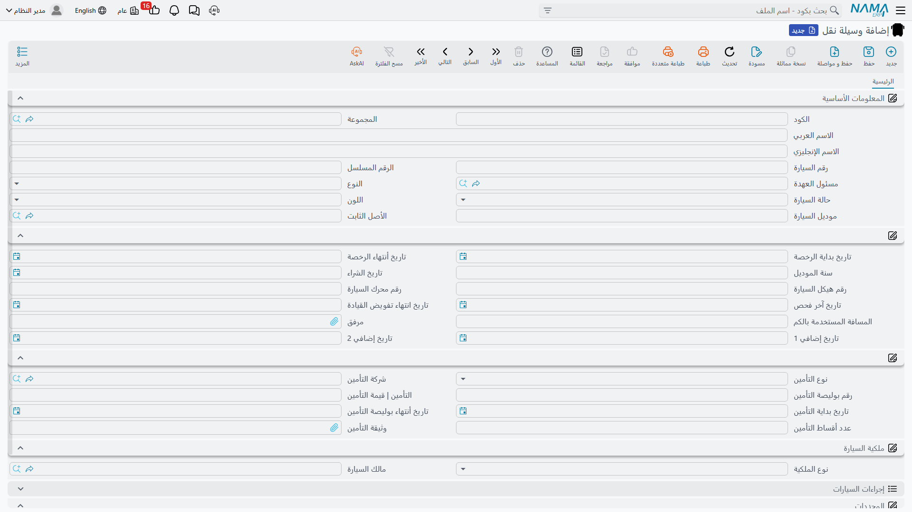
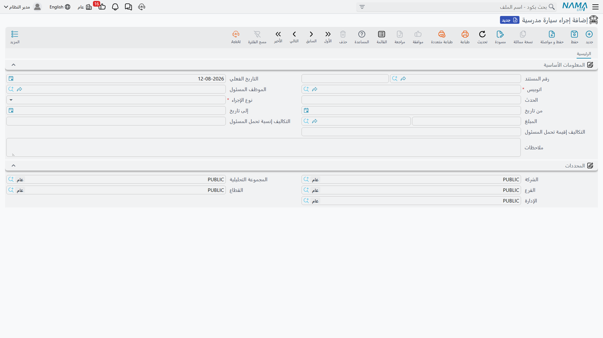
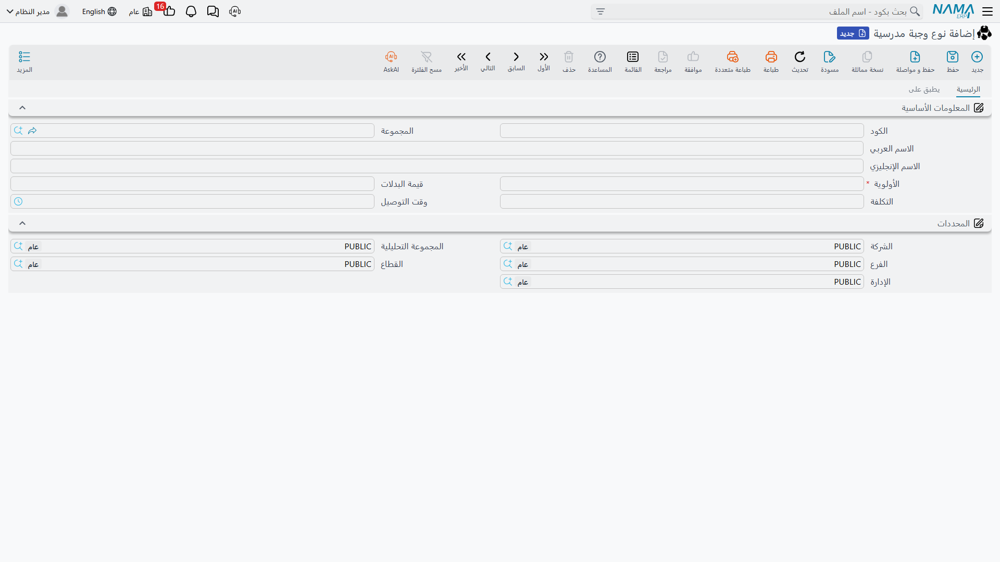
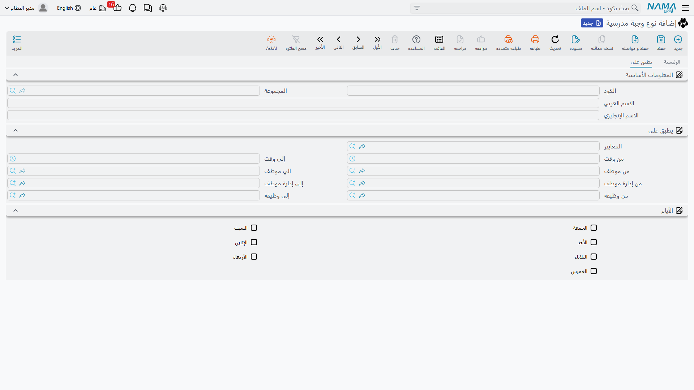
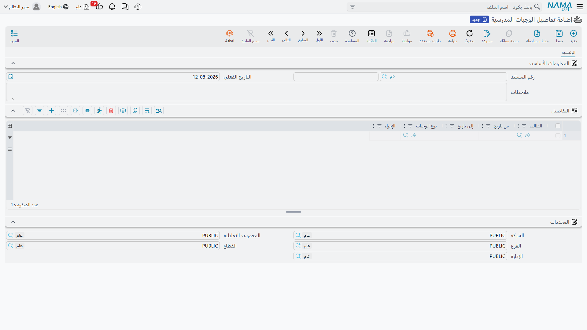
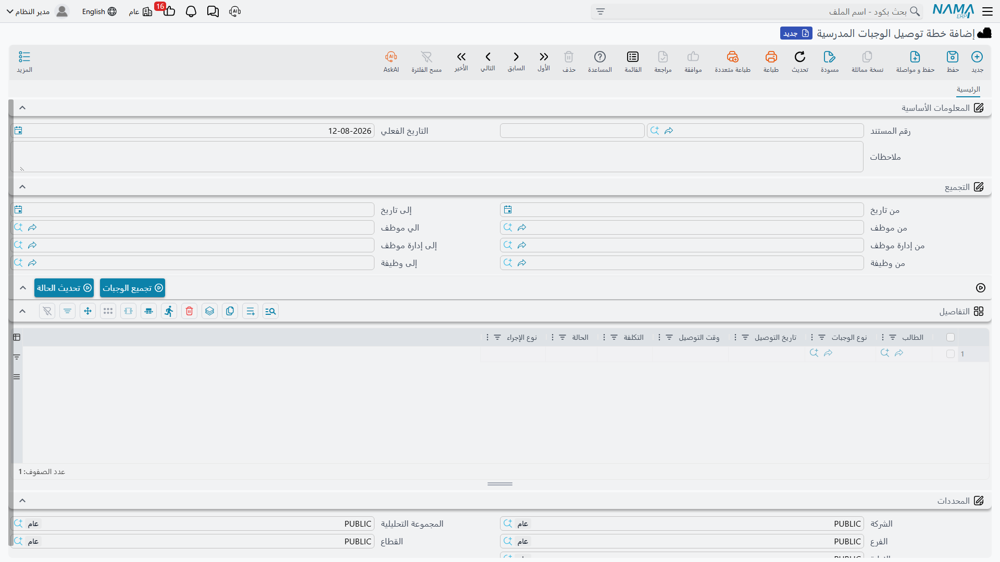
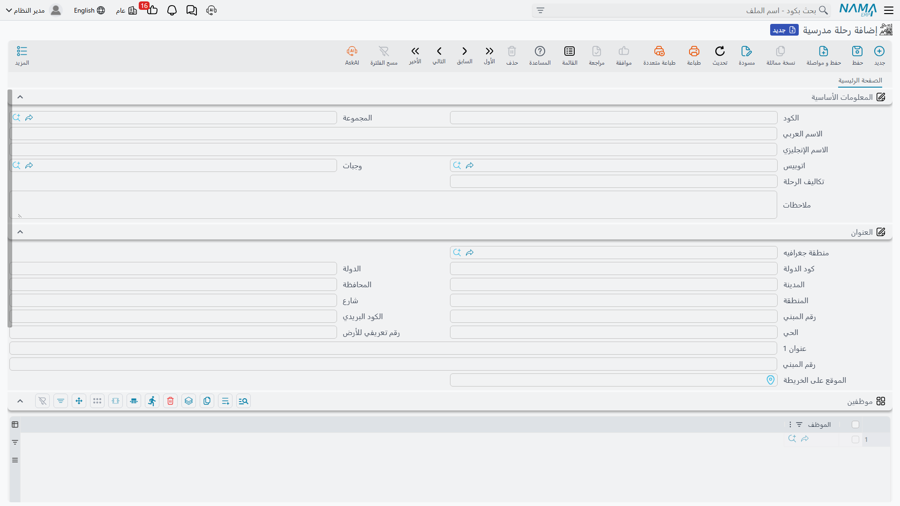

# الحافلات والوجبات والرحلات المدرسية

المدرسة ليست حصصاً ورسوماً فحسب. هي تمتلك سيارات لها رخص تُجدَّد وأعطال تُصلَّح، وتُطعم أبناءها في
منتصف اليوم، وتخرج بهم في رحلات. ولكل واحد من هذه الأمور شاشة في وحدة التعليم، مجموعة في القائمة تحت
**التعليم ← السيارات** و**التعليم ← الوجبات** و**التعليم ← الرحلات**.

وقبل أن تفتح أياً منها، من المفيد أن تعرف بالضبط أي نوع من الشاشات هذه.

::: info هذه الشاشات سجلات
كل ما في هذه الصفحة **يسجّل** ولا **يحرّك**. بطاقة وسيلة النقل تقول ماذا تملك، وإجراء السيارة يقول
ماذا جرى لها وكم كلّف، وخطة الوجبات تقول ماذا قُدّم ولمن، والرحلة المدرسية تقول من ذهب وإلى أين. ولا
تنشئ أي من هذه الشاشات قيداً محاسبياً، ولا تحرّك أي منها مخزوناً. والمبالغ التي تكتبها عليها — تكلفة
إصلاح، تكلفة وجبة، تكاليف رحلة — أرقام تُحفَظ للرجوع إليها وللتقارير؛ لا تصل إلى دفتر الأستاذ، ولا
تتحول إلى مستند مصروفات، ولا تظهر ضمن رسوم الطالب.

في وحدة التعليم يصل المال إلى دفتر الأستاذ من موضع واحد فقط: [عقد الدورة التدريبية](./education-course-contracts)
وإلغاؤه.
:::

وهذا ليس قيداً تحتال عليه، بل هو الغرض من هذه الشاشات. فسكرتير المدرسة الذي يحتاج أن يجيب عن «متى
تنتهي رخصة الحافلة رقم ٤؟» أو «كم كلّفتنا حوادث الفصل الدراسي الماضي؟» أو «أي الأطفال يحصلون على
الوجبة النباتية؟» أو «من رافق رحلة المتحف؟» يجد مكاناً يحفظ فيه هذه المعلومات، وتنطبق عليها أدوات
البحث في شاشات القوائم والتصدير وسجل التدقيق كأي شاشة أخرى في نما.

اثنتان من هذه الشاشات **ملفات رئيسية** (وسيلة نقل، نوع وجبة مدرسية، رحلة مدرسية) — بطاقات دائمة لها
كود واسم تنشئها مرة وتستعملها مراراً. وثلاث منها **مستندات** (إجراء سيارة مدرسية، تفاصيل الوجبات
المدرسية، خطة توصيل الوجبات المدرسية) — تحمل دفتر مستند وكوداً وتاريخاً فعلياً، وتسير في دورة المسودة
ثم الاعتماد المعتادة. وجميعها تحمل مجموعة **المحددات** القياسية (الشركة، المجموعة التحليلية، الفرع،
القطاع، الإدارة)، فتستطيع مدرسة بثلاثة فروع أن تفصل سيارات كل فرع ووجباته وتخرج بتقارير مستقلة لكلٍّ
منها.

## سجل المركبات (Bus)

**التعليم ← السيارات ← وسيلة نقل** بطاقة واحدة لكل مركبة. ورغم أن الحقول تتكلم عن الحافلات، تصلح
البطاقة لأي مركبة تشغّلها المدرسة — حافلة بخمسين مقعداً، أو ميكروباص، أو سيارة المدير.

الجزء التعريفي من البطاقة هو ما تقرؤه على المركبة وفي أوراقها: **الكود** و**المجموعة** للتصنيف،
و**الاسم العربي** و**الاسم الإنجليزي** كما تحب أن تراهما في القوائم المنسدلة (فـ«حافلة ٤ — خط
الصباح» أوضح في حقل مرجع من رقم لوحة)، و**رقم السيارة** (اللوحة)، و**الرقم المسلسل**، و**رقم هيكل
السيارة** و**رقم محرك السيارة**، و**موديل السيارة** و**سنة الموديل**، و**اللون**، و**النوع**
و**حالة السيارة** تختارهما من قائمتين قصيرتين تكيّفهما على أعراف أسطولك.

ثم تأتي الأوراق التي تحتاج فعلاً إلى من يذكّرك بها: **تاريخ الشراء**، و**تاريخ بداية الرخصة**
و**تاريخ انتهاء الرخصة**، و**تاريخ آخر فحص**، و**تاريخ انتهاء تفويض القيادة**، و**المسافة المستخدمة
بالكم** (قراءة العداد)، و**مرفق** لصورة الرخصة أو شهادة الفحص، وتاريخان إضافيان لما تفرضه إدارة
المرور عندك. ولأن هذه حقول عادية، فإن شاشة قائمة مفلترة على تاريخ انتهاء الرخصة خلال ثلاثين يوماً هي
منبّه التجديد الذي تنتهي معظم المدارس إلى بنائه.

ويجاورها قسم التأمين: **نوع التأمين**، و**شركة التأمين** (طرف من ملف الأطراف عندك)، و**رقم بوليصة
التأمين**، و**قيمة التأمين**، و**تاريخ بداية التأمين** و**تاريخ انتهاء بوليصة التأمين**، و**عدد
أقساط التأمين**، وخانة لـ**وثيقة التأمين** نفسها.

### من يحمل العهدة، ومن يملك المركبة

سؤالان مختلفان، وحقلان مختلفان.

**مسئول العهدة** مرجع إلى **موظف** — الشخص الذي عُهدت إليه المركبة، بالمعنى نفسه الذي يستعمله باقي
النظام للعهد. وهو الاسم الذي تتصل به حين لا تكون الحافلة حيث ينبغي.

ويجيب قسم **ملكية السيارة** عن السؤال الثاني: **نوع الملكية** يقول إن المركبة **ملك للشركة** أو
**مؤجرة كلياً** أو **مؤجرة جزئياً**، و**مالك السيارة** مرجع إلى الطرف الذي تستأجرها منه حين لا تكون
لك. فمدرسة تشغّل ثماني حافلات مملوكة واثنتين مستأجرتين لموسم الامتحانات تسجّل ذلك تماماً، وتستطيع
حصر المستأجرتين بنظرة.

### ربط وسيلة النقل بسجل الأصل الثابت

إن كانت المركبة مرسملة، فهي موجودة أيضاً في [الأصول الثابتة](../fixedassets/) كأصل له جدول إهلاك.
ولذلك تحمل بطاقة وسيلة النقل مرجعاً اختيارياً إلى **الأصل الثابت**، فيرتبط السجلان ويستطيع من يطالع
الحافلة أن ينتقل مباشرة إلى الأصل المقابل لها.

والربط للعلم فقط، ويشير في اتجاه واحد: يقول للقارئ «هذه الحافلة هي ذلك الأصل». ولا ينسخ شيئاً بين
السجلين، فاحفظ كل بيان في البطاقة التي تعمل فيها فعلاً — الإهلاك والاستبعاد على الأصل، واللوحات
والرخص والعهدة على وسيلة النقل.

::: tip ابحث عن الحافلة كما يتذكرها موظفوك
تتيح شاشة قائمة وسائل النقل البحث بـ**مسئول العهدة** وبـ**رقم السيارة**، وتعرض مسئول العهدة ورقم
السيارة والموديل واللون كأعمدة. فمن لا يتذكر إلا «البيضاء التي يقودها أحمد» يستطيع أن يصل إلى
السجل.
:::

## تسجيل ما يجري للسيارة (Bus Action)

**التعليم ← السيارات ← إجراء سيارة مدرسية** هو سجل الحوادث والصيانة. كل مستند حدث واحد على سيارة
واحدة، فتاريخ المركبة ببساطة هو قائمة إجراءاتها مفلترة عليها.

**اتوبيس** و**نوع الإجراء** هما ما يجب إدخاله. ونوع الإجراء هو ما جرى:

| نوع الإجراء (Action Type) | الاستعمال المعتاد |
|---|---|
| تجديد رخصة (License Renewal) | تجديد الرخصة السنوية |
| حادثة (Accident) | تعرّض المركبة لحادث |
| مخالفة (Violation) | وصول مخالفة سرعة أو انتظار |
| صيانة دورية (Regular Maintenance) | الصيانة المجدولة عند ١٠٬٠٠٠ كم |
| تصليح (Repair) | عطل جرى إصلاحه |
| أخرى ١ / ٢ / ٣ (Other 1/2/3) | خانات احتياطية لما تتابعه مدرستك سواها |

وحولهما تسجّل الحكاية: **رقم المستند** و**التاريخ الفعلي** اللذان يعرّفان السجل، و**الحدث** نصاً
حراً («انفجار إطار أمامي على الطريق الدائري»)، و**الموظف المسئول**، و**من تاريخ** و**إلى تاريخ**
للأحداث التي تمتد فترة — زيارة ورشة أوقفت الحافلة أربعة أيام، أو رخصة سارية بين تاريخين — و**المبلغ**
و**العملة**، و**ملاحظات** لما لا يجد له حقلاً آخر.

### التكلفة وحصة المسئول

يقع رقمان آخران تحت عنوان التكاليف: **نسبة تحمل المسئول** و**قيمة تحمل المسئول** — أي كم يتحمّل
المسئول من التكلفة.

لنقل إن سائقاً احتكّ ببوابة وكلّف إصلاح الهيكل ٤٬٠٠٠. وقررت المدرسة أن يتحمل السائق ربعها. تسجّل
المبلغ ٤٬٠٠٠، ونسبة تحمل المسئول ٢٥، وقيمة تحمل المسئول ١٬٠٠٠.

::: warning هذه الأرقام مسجّلة لا مُرحَّلة
الرقمان كلاهما تكتبهما بيدك، تماماً كما اتفقت عليهما مع السائق. يحفظهما النظام على سجل الإجراء ويخرج
بهما في التقارير؛ ولا يشتق أحدهما من الآخر، ولا يرحّل أياً منهما. فلا قيد يومية للـ٤٬٠٠٠، ولا التزام
للورشة، ولا خصم في الرواتب للـ١٬٠٠٠ — وإن كانت المدرسة ستسترد هذا المبلغ فعلاً فذلك يجري عبر مستندات
المحاسبة والرواتب المعتادة، ويبقى سجل الإجراء هذا شاهداً على السبب.
:::

والأمر نفسه في تجديد رخصة بـ١٬٢٠٠ أو مخالفة سرعة بـ٣٠٠: إجراء السيارة هو الموضع الذي تدوّن فيه ما
كلّف، وقيمته في التاريخ الذي يتراكم. فبعد سنة تستطيع أن تحصر كل حوادث الأسطول، وتجمع الإصلاحات لكل
سيارة، وترى أي مركبة تكلّفك أكثر.

## دليل الوجبات (Meal Type)

**التعليم ← الوجبات ← نوع وجبة مدرسية** هو حيث تصف الوجبات نفسها، مرة واحدة، لتشير إليها شاشات
التوصيل بالاسم.

يحمل نوع الوجبة **الكود** و**المجموعة** و**الاسم العربي** و**الاسم الإنجليزي** المعتادة — «غداء
ساخن»، «ساندويتش»، «وجبة نباتية»، «وجبة إفطار خفيفة» — إضافة إلى:

| الحقل | ما يحمله |
|---|---|
| الأولوية (Priority) | رقم ترتيب للوجبة، مطلوب في كل نوع وجبة |
| قيمة البدلات (Allowance Value) | القيمة النقدية للوجبة حين تُمنح بدلاً منها |
| التكلفة (Meal Cost) | ما تكلّفه الوجبة المدرسة |
| وقت التوصيل (Time) | وقت تقديم الوجبة من اليوم |

وتصف صفحة ثانية اسمها **يطبق على** متى يُفترض أن تُقدَّم الوجبة: **من وقت** و**إلى وقت**، ومربع
اختيار لكل يوم من أيام الأسبوع السبعة. فغداء ساخن يُقدَّم من ١٢:٠٠ إلى ١٣:٠٠ من الأحد إلى الخميس
يوصَف بنقرات قليلة؛ وتجلس إلى جواره وجبة خفيفة ليوم النشاط السبتي كنوع وجبة مستقل.

هذه القيم تصف الوجبة. وهي بيانات مرجعية لمن يدير المطبخ ولمن يسعّر عقد التغذية — لا حساباً يجريه
النظام. والتكلفة التي تسجّلها هنا لا تُنقَل إلى سطور التوصيل ولا تتحول إلى مبلغ على أحد.

## من يستحق أي وجبة (Education Meals Details)

**التعليم ← الوجبات ← تفاصيل الوجبات المدرسية** هو سجل الاستحقاق — أقرب ما في الوحدة إلى قائمة
اشتراك في الوجبات. وهو مستند بكوده وتاريخه الفعلي وملاحظاته المعتادة، وجدول **التفاصيل** فيه يجيب كل
سطر منه عن سؤال: «لهذا الطالب، خلال هذه الفترة، أي وجبة، وبأي صورة؟»

| العمود | ما تسجّله |
|---|---|
| الطالب (Student) | الطالب صاحب الاستحقاق |
| من تاريخ / إلى تاريخ (From/To Date) | الفترة التي يسري فيها الاستحقاق |
| نوع الوجبات (Meal Type) | أي وجبة من الدليل |
| الإجراء (Allowance Type) | **وجبة** (يُقدَّم للطفل طعام)، أو **بدل وجبة** (تُمنح القيمة بدلاً منها)، أو **غير مطبق** |

والإيقاع الطبيعي مستند واحد لكل فصل دراسي، بسطر لكل طفل مشترك: ١٨٠ طفلاً على الغداء الساخن من أول
يوم دراسي إلى آخره، واثنا عشر على الوجبة النباتية، وقلّة تأخذ أسرهم البدل بدلاً منها. وحين ينضم طفل
في منتصف الفصل، تضيف سطراً تاريخ بدايته ذلك اليوم.

و«الإجراء» هنا بيان عن الترتيب المتفق عليه — طعام أو نقد — يُحفَظ لمن يدير المطبخ ولمن يجيب أسئلة
أولياء الأمور. واختيار **بدل وجبة** يسجّل أن هذه الأسرة تأخذ القيمة لا الطعام؛ ولا ينشئ دفعة ولا
يضيف شيئاً إلى حساب الطالب.

## تسجيل ما سُلِّم فعلاً (Education Meals Delivery Plan)

الاستحقاق شيء، وما خرج من المطبخ في يوم بعينه شيء آخر، و**التعليم ← الوجبات ← خطة توصيل الوجبات
المدرسية** هي حيث يُحفَظ ذلك.

الترويسة ترويسة مستند عادية — **رقم المستند** و**التاريخ الفعلي** و**ملاحظات** — والجوهر في جدول
**التفاصيل**، بسطر لكل وجبة سُلِّمت:

| العمود | ما تسجّله |
|---|---|
| الطالب (Student) | من استلمها |
| نوع الوجبات (Meal Type) | أي وجبة |
| تاريخ التوصيل (Delivery Date) | يوم التسليم |
| وقت التوصيل (Time) | وقت التسليم |
| التكلفة (Cost) | التكلفة التي تريد تسجيلها على هذا التسليم |
| الحالة (Status) | **مخطّطة** أو **مسلمّة** أو **ملغي** |
| نوع الإجراء (Delivery Status) | ما قُدِّم فعلاً: **وجبة** أو **بدل وجبة** أو **ألغيت** |

يجيب عمودا الحالة عن سؤالين مختلفين، ويحسن أن تتفقوا داخلياً على طريقة استعمالهما. فـ**الحالة**
تتابع دورة حياة السطر نفسه — كان مخططاً، ثم سُلِّم، أو انتهى ملغياً. و**نوع الإجراء** يسجّل الصورة
التي استلمها بها الطفل، وهو ما يهمّ حين تأخذ بعض الأسر البدل: فقد يكون السطر «مسلمّة» ونوع إجراءه
«بدل وجبة»، أي «سُوِّي، لكن نقداً لا طعاماً».

ومن الطرق العملية أن تفتح خطة توصيل لكل يوم أو لكل أسبوع: تُدخل سطور الأطفال المتوقعين وتتركها
**مخطّطة**، وبعد انتهاء التقديم تعود فتضع من قُدِّم لهم على **مسلمّة** بنوع الإجراء الصحيح، والغائبين
على **ملغي**. فيكون ما بين يديك سجلاً دقيقاً لخدمة الأسبوع — كم وجبة من كل نوع خرجت فعلاً، ولمن.

وعمود التكلفة يسلك مسلك كل مبلغ في هذه الصفحة: رقم يُحفَظ على السطر للتقارير. لا يسحب مخزوناً من
مستودع، ولا ينشئ شراء، ولا يصل إلى رسوم أي طالب.

## الرحلات المدرسية (School Trip)

**التعليم ← الرحلات ← رحلة مدرسية** تسجّل الرحلات نفسها. وهي ملف رئيسي، فكل رحلة بطاقة باسمها تستطيع
أن تشير إليها من أي موضع يتيح لك النظام فيه مرجعاً.

تبدأ البطاقة بـ**الكود**، و**المجموعة** لتصنيف الرحلات بأنواعها (رحلات يوم، معسكرات، مباريات)،
و**الاسم العربي** و**الاسم الإنجليزي** — و«متحف العلوم، الصف الخامس» اسم يثبت نفعه في قائمة تقرؤها
بعد سنة. ثم:

- **اتوبيس** — المركبة من سجل وسائل النقل التي تحمل المجموعة.
- **وجبات** — نوع الوجبة من الدليل التي ستُقدَّم في اليوم.
- **تكاليف الرحلة** — رقم واحد لما تكلّفه الرحلة، يُسجَّل للرجوع إليه كسائر المبالغ هنا.
- **ملاحظات** — للبرنامج أو خط السير أو ما ينبغي أن يعرفه المرافقون.

ويسجّل قسم **العنوان** إلى أين تذهب الرحلة، بحقول العنوان القياسية — المنطقة الجغرافية والدولة
والمدينة والمحافظة والمنطقة والشارع ورقم المبنى والحي والكود البريدي والموقع على الخريطة — فيصير
المقصد على السجل لا في ذاكرة أحدهم.

وقلب الشاشة هو الجدولان في أسفلها. جدول **الموظفين** يسمّي من ذهب من الطاقم — المعلمون والمشرفون
المرافقون للمجموعة — وجدول **الطلاب** يسمّي الأطفال الذين ذهبوا. وبهما تجيب بطاقة الرحلة عن السؤال
الأهم بعد وقوعها: من كان على متن تلك الحافلة.

ومرجعا الحافلة والوجبة مؤشران يصفان ترتيبات الرحلة. يقولان للقارئ أي مركبة وأي وجبة استعملتها
الرحلة؛ ويبقى سجل وسائل النقل وشاشات الوجبات ممسكة بسجلاتها الخاصة مستقلة، فلا يغيّر فيها شيء مما
تدخله على الرحلة.

::: tip بطاقة الرحلة حصر ستسعد بوجوده
جدول الطلاب هو السجل الذي سيعيدك إليه سؤال ولي أمر أو استفسار تأمين أو تقرير حادث. املأه على وجهه في
يوم الرحلة، من الكشف نفسه الذي استعمله المرافقون عند الباب، وصنّف الرحلات في مجموعات معقولة لتقرأ
رحلات السنة قائمة متماسكة.
:::

## موضع هذا كله من بقية وحدة التعليم

تقف هذه الشاشات إلى جانب النصف الإداري المدرسي من الوحدة. فالطلاب الذين تختارهم في سطر وجبة أو في
رحلة هم أنفسهم في ملف الطلاب الموصوف في
[الطلاب وأولياء الأمور والهيكل الدراسي](./education-master-files)، ومن تسمّيهم مسئولي عهدة أو سائقين
مسئولين أو مرافقي رحلات موظفون عاديون. وأما أين كان الطفل في يوم بعينه فشأن
[الحضور والمتابعة اليومية وأذون الانصراف](./education-attendance) — فبطاقة الرحلة تحصر من ذهب، لا من
رُصد حاضراً.

ونقولها مرة أخيرة لأنها السؤال الذي يتكرر: لا شيء في هذه الصفحة يحمّل أسرةً مبلغاً. فالرسوم تعيش
بكاملها على [عقد الدورة التدريبية](./education-course-contracts) وعلى
[جدول أقساطه](./education-payment-schedules).
