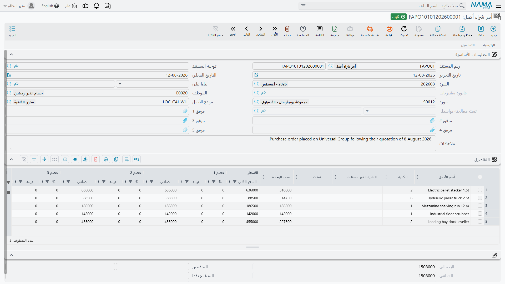
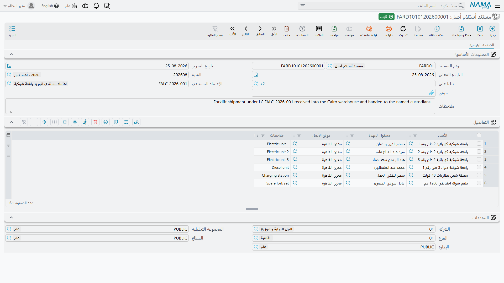

# كيف يُقتنى الأصل

شراء ماكينة ليس حدثاً واحداً. أحدهم يطلبها، وآخر يتفاوض على سعرها، وثالث يوقّع أمر الشراء، ثم تصل
فاتورة المورد بعد حين، وفي يوم ما تقف شاحنة عند البوابة. ووحدة الأصول الثابتة تعطي كل لحظة من هذه
اللحظات مستندها الخاص — لكن **واحداً فقط** منها يكلّف مالاً في الدفاتر، وواحداً فقط هو الذي يحوّل قطعة
المعدات إلى سجل قابل للإهلاك.

إذا استقرت هذه التفرقة في ذهنك صارت السلسلة كلها سهلة. وإذا فاتتك أمضيت أسبوعاً تتساءل لماذا لم يظهر
أمر شراء معتمَد في دفتر الأستاذ.

## السلسلة في صورة واحدة

```text
  طلب شراء أصل                    أوراق — ما نحتاجه
       │
       ├──────────────►  عرض سعر أصل            أوراق — كم يكلّف
       │                       │
       ├──────────────►  أمر شراء أصل           أوراق — بماذا التزمنا
       │                       │
       └──────────────►  سند استلام أصل مبدئي    أوراق — وصل ولم تصل الفاتورة
                               │
                               ▼
                    سند شراء أصل ثابت            ★ المال وسجل الأصول
                               │
                               ▼
                    مستند استلام أصل             من استلمه وأين استقر


  مدخل منفصل، للأصول التي تملكها بالفعل:

                    افتتاح أصل ثابت              التكلفة والإهلاك المتراكم
                               │
                    تعديل افتتاح أصل ثابت         تصحيح ما سبق
```

اقرأ الشكل من أعلى: كل مستند يُبنى على سابقه باختياره في حقل **بناءا على** (From Document). ولا شيء
منها إجباري: فشركة صغيرة قد تذهب مباشرة إلى سند الشراء ولا تحرّر طلب شراء واحداً طوال عمرها. السلسلة
موجودة لتفصل — في المنشآت الأكبر — بين من يطلب ومن يفاوض ومن يلتزم ومن يدفع.

| المستند | الاسم الإنجليزي | هل يُحدث قيداً | ماذا يغيّر |
|---|---|---|---|
| طلب شراء أصل | Fixed Asset Purchase Request | لا | يسجّل الطلب ويتابع ما نُفّذ منه |
| عرض سعر أصل | Fixed Asset Offer | لا | يسجّل عرض المورد بأسعاره وخصوماته وضرائبه |
| أمر شراء أصل | Fixed Asset Purchase Order | لا | يسجّل الالتزام ويخصم من كميات الطلب |
| سند استلام أصل مبدئي | Fixed Asset Initial Receipt | لا | يسجّل وصول البضاعة قبل وصول الفاتورة |
| **سند شراء أصل ثابت** | **Fixed Asset Purchase Document** | **نعم** | **يرسمل الأصل ويُنشئ القيد** |
| مستند استلام أصل | Fixed Asset Receipt Document | لا | يكتب موقع الأصل ويضيف سطراً في سجل عهدته |
| افتتاح أصل ثابت | Fixed Asset Opening Document | نعم | يُدخل أصلاً مملوكاً بالفعل بإهلاكه المتراكم |

كل ما في الجدول عدا سند الشراء وسند الافتتاح هو **أوراق**: يحسب الأسعار والضرائب والإجماليات ليتمكن
الناس من المقارنة والاعتماد، لكنه لا يُنتج قيداً ولا يمسّ سجل الأصول. والأسعار والضرائب على عرض السعر
أو أمر الشراء أو الاستلام المبدئي إنما هي للمقارنة — فلا شيء يُرسمل ولا شيء يُستحق حتى يُرحَّل سند
الشراء.

::: info أين تحدث المحاسبة فعلاً
كلا المستندين الماليين ينشئ قيده على هيئة **طلب أعمال** تتم معالجته في الخلفية، فيُحفظ المستند فوراً
ويظهر القيد بعد لحظة. فإذا غاب قيد، افتح شاشة طلبات الأعمال وفلتِر على الفاشلة، وحدّد السطور، ثم
استخدم **المزيد ← إعادة المعالجة / إعادة الترحيل**.
:::

## أين يولد سجل الأصل

هذا هو السؤال الذي يحدد كيف تُهيَّأ الوحدة، ويستحق إجابة صريحة.

الأصل الثابت في نما **ملف رئيسي** — كود واسم ونوع ومجموعة حسابات. ومستندات هذه السلسلة لا تُنشئ هذا
السجل اعتباطاً؛ فهناك موضعان اثنان لا ثالث لهما يمكن أن يولد فيهما أثناء الاقتناء:

**المسار الأول — السجل موجود سلفاً، والشراء يمنحه قيمته.** ينشئ أحدهم سجل الأصل أولاً (يدوياً، أو — للأصول المرسملة من مشروع مقاولات منتهٍ —
عبر [سند إنشاء الأصول](/ar/modules/fixedassets/master-files/fixedassets-creation-document.md)).
والسجل الجديد يقف في حالة **إبتدائى**: له اسم ونوع، وليس له تكلفة ولا تاريخ بداية إهلاك ولا قسط.
ومنتقي الأصل في سند الشراء لا يعرض إلا الأصول التي في هذه الحالة. فإذا رُحِّل سند الشراء تلقّى السجل
تكلفته وتواريخه وانتقل إلى **جارى الإهلاك**. وهذا هو الوضع الافتراضي وهو ما تعمل به معظم التركيبات،
لأنه يتيح لك ترميز الأصول وتصنيفها وربطها بالحسابات بتأنٍّ، لا في خضم كتابة فاتورة.

**المسار الثاني — سند الشراء ينشئ السجل بنفسه.** شغِّل خيار **إنشاء الأصول إذا لم تكن موجودة** على
[توجيه](/ar/modules/fixedassets/document-terms/fixedassets-terms-acquisition.md) سند الشراء، فلا يعود
السطر بحاجة إلى أصل: يكفي أن يحمل **نوع أصل ثابت**، ويُنشأ السجل لك لحظة ترحيل المستند. والقصة كاملة
— بما فيها إعداد الوحدة الذي يُظهر أعمدة الاسم والرقم المسلسل والتصنيفات على الجريد ليكون هناك ما
يُنشأ الأصل *منه* — تجدها في صفحة
[سند شراء الأصل](/ar/modules/fixedassets/acquisition/fixedassets-purchase-document.md).

أما الاحتمال الثالث فليس من هذه السلسلة أصلاً: الأصول التي كنت تملكها قبل تشغيل نما تُسجَّل يدوياً ثم يقوّمها
[سند الافتتاح](/ar/modules/fixedassets/acquisition/fixedassets-opening-balances.md)، الذي يُدخل
التكلفة الأصلية والإهلاك المأخوذ عليها معاً. وللآلات المستوردة مسار رابع خاص بها هو
[سلسلة الاعتماد المستندي](/ar/modules/fixedassets/letters-of-credit/fixedassets-lc-overview.md)، حيث
لا تُعرف التكلفة إلا بعد توزيع الشحن والجمارك.

## الواحة تشتري ماكينة قص

شركة الواحة للصناعات تدير مصنعاً في الرياض بفترات مالية شهرية. مدير الإنتاج يريد ماكينة قص CNC. وهذه
هي السلسلة كاملة بالأرقام التي تلازم بقية هذا التوثيق.

1. **الطلب.** يحرّر الإنتاج *طلب شراء أصل* باسم «ماكينة قص CNC»، الكمية 1. بلا أسعار وبلا مورد. انظر
   [طلب شراء الأصل](/ar/modules/fixedassets/acquisition/fixedassets-purchase-request.md).

   

2. **العروض.** تجمع المشتريات عرضين. «الخليج لتجارة الآلات» تعرض **240,000**، ومنافس يعرض 252,000.
   ويُسجَّل كل عرض في *عرض سعر أصل* لتتم المقارنة على الورق.

3. **الأمر.** يفوز «الخليج لتجارة الآلات»، فيُحرَّر *أمر شراء أصل* بناءً على الطلب. عندئذ تصبح الكمية
   المنفَّذة في الطلب 1 والكمية غير المستلمة صفراً، فلا يطلب أحد الماكينة مرتين. انظر
   [عروض الأسعار وأوامر الشراء](/ar/modules/fixedassets/acquisition/fixedassets-purchase-offers-and-orders.md).

   

4. **الفاتورة.** تُسلَّم الماكينة ويُصدر المورد فاتورته. فتحرّر المحاسبة *سند شراء أصل ثابت* بناءً على
   الأمر بتاريخ فعلي 1 يناير 2026. ويُختار سجل الأصل `MCH-0007` على السطر، فيأتي العمر الافتراضي
   **60 شهراً** وقيمة الخردة **24,000** من نوع الأصل، ويُضبط تاريخ بداية الإهلاك على 1 يناير 2026.

   وعند الترحيل يحمل `MCH-0007` تكلفة **240,000**، وقسطاً مقداره
   (240,000 − 24,000) ÷ 60 = **3,600** لكل فترة، وتصير حالته «جارى الإهلاك». ويُدان حساب تكلفة الآلات
   ويُدائَن المورد.

   

5. **التسليم.** يسجّل *مستند استلام أصل* أن الماكينة صارت في `LOC-R2 — مصنع الرياض – صالة 2` وأن خالد
   المطيري وقّع باستلامها. ولا يُرحَّل شيء؛ فهذا أثر العهدة والموقع. انظر
   [سندات الاستلام](/ar/modules/fixedassets/acquisition/fixedassets-receipts.md).

   

ومن هنا تصير الماكينة ملكاً للسجل: تُهلَك
[شهرياً](/ar/modules/fixedassets/depreciation/fixedassets-depreciation-document.md)، وتُضاف إليها
[إضافة رأسمالية](/ar/modules/fixedassets/depreciation/fixedassets-additions-and-deductions.md) في
يناير 2027، وتُنقل [إلى صالة أخرى](/ar/modules/fixedassets/movement/fixedassets-transfer-document.md)،
ثم [تُباع](/ar/modules/fixedassets/disposal/fixedassets-disposal.md) في نهاية 2027.

## كيف ترتبط المستندات بعضها ببعض

اختيار مصدر في حقل **بناءا على** يفعل أمرين: ينسخ بيانات الرأس — المورد والموظف والموقع والإدارة
وعنوان الشحن — ويبني لك سطور التفاصيل.

وهناك قاعدة نسخ تفاجئ الناس، فاحفظها الآن. حين يُبنى سند الشراء على أمر شراء **يُفكَّك كل سطر مصدر إلى
سطر لكل وحدة**. فسطر أمر شراء لثلاث رافعات شوكية بـ 100,000 للواحدة يصير ثلاثة سطور شراء كمية كل
منها 1 بـ 100,000. وهذا مقصود: سجل الأصل الثابت شيء مادي واحد له تكلفة واحدة وعمر واحد ورقم مسلسل
واحد، فالرافعات الثلاث لا بد أن تصير ثلاثة سجلات أصول لا سطراً واحداً بثلاث كميات.

كما تترك المستندات اللاحقة أثراً على مصادرها. فأمر الشراء المرحَّل يختم **تمت معالجتة بواسطة** على
الطلب الذي جاء منه، وسند الشراء المرحَّل يختم نفسه على الأمر. وعند اختيار مصدر في سند شراء جديد
تُستبعَد من القائمة الأوامر التي أنتجت سند شراء بالفعل.

::: tip متابعة ما تم تسليمه
عمودا **نفذت** و**الكمية الغير مستلمة** في الطلب، وقيمة **إجمالي الغير مسلم** في رأسه، تتحرك بعرض
السعر أو أمر الشراء أو الاستلام المبدئي المحرَّر **بناءً على الطلب نفسه**. فوجِّه متابعة التنفيذ عبر
هذه المستندات تبقَ العدادات صادقة.
:::

## الأزرار على امتداد السلسلة

معظم هذه السلسلة يُكتب لا يُولَّد، فيحسن أن تعرف مبكراً أين يوجد زر وأين لا يوجد:

| الشاشة | زر خاص بها | ماذا يفعل |
|---|---|---|
| طلب شراء أصل ثابت | لا يوجد | يُلبّى الطلب من حقل **بناءا على** في المستند التالي |
| عرض الشراء وأمر الشراء وسند الاستلام المبدئي | **إنشاء الدفعات** | يوزّع المبلغ المتبقي على جريد جدول الدفعات |
| سند شراء أصل ثابت | **إنشاء الدفعات** | الأمر نفسه، في صفحة *الشحن و الدفع* |
| مستند استلام أصل | لا يوجد | — |

وكل ما عدا ذلك مما يبدو آلياً — تحرّك الكميات المنفَّذة في الطلب، وانفراد أمر الشراء إلى سطر لكل
وحدة، وملء سند الاستلام بمسؤولي العهدة والمواقع — يحدث لحظة اختيارك حقل **بناءا على**، دون ضغط أي زر.

## التراخيص وأين تنقر

كل ما سبق يقع تحت **الأصول > المستندات** ولا يحتاج إلا الترخيص الأساسي `fixedassets` — باستثناء واحد
يستحق الحفظ:

| المستند | الترخيص | مجلد القائمة |
|---|---|---|
| الطلب وعرض السعر والأمر والاستلام المبدئي وسند الشراء وسند الافتتاح وتعديله | `fixedassets` | الأصول > المستندات |
| **مستند استلام أصل** | **`fixedassets-lc`** | الأصول > عهد الأصول |
| سند استلام وتسليم عهد | `fixedassets-custody` | الأصول > عهد الأصول |

ومستند الاستلام يقع خلف ترخيص **الاعتمادات المستندية** لأن رأسه يحمل مرجع اعتماد مستندي — فهو المستند
الذي يوقَّع به على شحنة واردة بموجب اعتماد كما يوقَّع به على شحنة واردة بموجب شراء عادي. فإذا لم يجد
عميل يملك الترخيص الأساسي وحده «مستند استلام أصل» في القائمة فهذا هو السبب.

وآخر مستندات العائلة، وهو
[سند استلام وتسليم العهد](/ar/modules/fixedassets/acquisition/fixedassets-delivery-receipt.md)، ليس
مستند اقتناء في الحقيقة — فهو ينقل أشياء مملوكة بالفعل من موظف إلى آخر — لكنه الموضع الوحيد الذي تجتمع
فيه الأصول الثابتة و[العهد](/ar/modules/fixedassets/custody/fixedassets-custody-overview.md) على جريد
واحد، ولذلك يُوثَّق هنا إلى جوارها.
