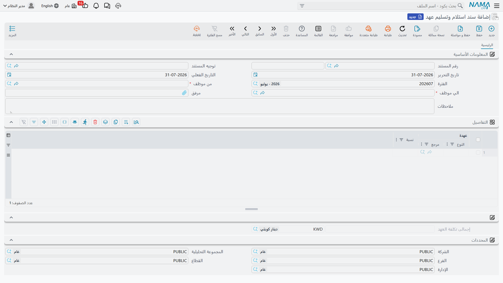

# سند استلام وتسليم عهد

الناس يرحلون. ينتقلون من إدارة إلى إدارة، أو يخرجون في إجازة طويلة، أو يسلّمون مصنعاً إلى خلفٍ لهم.
وحين يفعلون لا بد أن يوقّع أحدهم باستلام كل ما كانوا يحملونه في عهدتهم — الحاسب المحمول، والهاتف، وطقم
المفاتيح، والرافعة الشوكية الواقفة في الخارج.

و**سند استلام وتسليم عهد** هو ذلك التوقيع. موظف يسلّم وآخر يستلم، والمستند يعدّد كل ما ينتقل بينهما في
جريد واحد — [العهد](/ar/modules/fixedassets/custody/fixedassets-custody-overview.md)
و[الأصول الثابتة](/ar/modules/fixedassets/master-files/fixedassets-asset-master.md) جنباً إلى جنب. وهو
الموضع الوحيد في الوحدة الذي يلتقي فيه السجلان على شاشة واحدة.

وهو كذلك — بخلاف معظم أوراق التسليم — **يُرحَّل إلى دفتر الأستاذ**.

القائمة: **الأصول > عهد الأصول > سند استلام وتسليم عهد**، الترخيص **`fixedassets-custody`**.

## الشاشة

| الحقل | الاسم الإنجليزي | ملاحظات |
|---|---|---|
| رقم المستند | Document Code | الدفتر والرقم المسلسل |
| توجيه المستند | Term | التوصيلات المحاسبية |
| تاريخ التحرير / التاريخ الفعلي / الفترة | Issue / Value Date / Period | التاريخ الفعلي هو تاريخ انتقال العهدة |
| **من موظف** | From Employee | **إجباري** — من يسلّم |
| **الي موظف** | To Employee | **إجباري** — من يستلم |
| مرفق | Attachment | ورقة التسليم الموقَّعة |
| ملاحظات | Description | نص حر |

وجريد **التفاصيل** عمودان فقط:

| العمود | الاسم الإنجليزي | ماذا يحمل |
|---|---|---|
| عهدة | Custody | إما سجل عهدة **وإما** أصل ثابت — فالحقل يقبل الاثنين |
| نسبة | Percentage | نسبة العهدة التي يحملها هذا الموظف من الصنف |

وتحته **إجمالى تكلفة العهد** بعملته، يحسبه النظام، ثم محددات المستند.

::: tip دع الشاشة تبني القائمة عنك
اختر **من موظف** فيمتلئ الجريد بكل ما يحمله ذلك الموظف حالياً — كل أصل ثابت وكل عهدة هو مسؤول عهدتها
أو له فيها سطر عهدة مفتوح — مع نقل النسبة من السطر المفتوح. وفي تسليم موظف مغادر يكون ذلك هو المستند
كله بنقرة واحدة؛ ثم تحذف السطور التي تبقى في مكانها.
:::

وقاعدتان تمنعان الترحيل لا ثالثة لهما: ألا يكون الجريد فارغاً، وأن يختلف الموظفان.

## الإجراءات في هذه الشاشة

ليس في شاشة سند تسليم العهد أزرار خاصة بها، ولا شيء تضغطه لبناء المستند. فالجريد يملأ نفسه لحظة
اختيارك **من موظف**، وكل ما يفعله المستند يحدث عند اعتماده. فإن خرجت القائمة على غير ما تريد فغيّر
الموظف أو احذف السطور؛ ولا يوجد زر تجميع تبحث عنه.

## ماذا يفعل الترحيل

يغلق المستند لكل سطر العهدة القديمة ويفتح الجديدة:

- يُغلق سطر العهدة المفتوح للموظف المسلِّم **في اليوم السابق للتاريخ الفعلي للمستند**؛
- ويُفتح سطر عهدة جديد للموظف المستلِم **من التاريخ الفعلي**؛
- ويُضبط حقل **مسئول العهدة** في الصنف على الموظف المستلِم — وفي الأصل الثابت يحدث ذلك حين يكون خيار
  التوجيه **تغيير مسؤول العهدة في الأصل** مفعَّلاً، أو حين لا يكون للأصل مسؤول عهدة أصلاً، أو حين يكون
  مسؤول عهدته الحالي هو الموظف المسلِّم.

وهذه القاعدة الأخيرة هي سبب سلامة سلوك المستند حين يُملأ الجريد آلياً: فكل ما فيه — بحكم التعريف — كان
في عهدة الموظف المسلِّم، فيتبع حقل مسؤول العهدة التسليمَ بلا أي تهيئة. وشغّل خيار التوجيه حين تريد
للحقل أن يتبع المستند بلا شرط.

كما يرتّب المستند وراءه: فسند تسليم أقدم إلى الموظف نفسه يغطي الأصناف نفسها يُعلَّم بأنه سُلِّم إلى
غيره، فيبقى الأثر مقروءاً حين ينتقل صنف بين ثلاثة أشخاص في سنة.

::: info هذا هو المستند الذي يضبط حقل مسئول العهدة
[مستند استلام الأصل](/ar/modules/fixedassets/acquisition/fixedassets-receipts.md) يضيف سطراً إلى سجل
عهدة الأصل ولا يمسّ حقل **مسئول العهدة** في صفحته الرئيسية. أما سند التسليم فهو الذي يكتبه. فإذا بدا
حقل مسؤول العهدة في أصلٍ قديماً فهذا هو المستند الذي يحدّثه.
:::

## ماذا يرحّل

يُنتج المستند قيداً على هيئة طلب أعمال، وقيمته هي **إجمالى تكلفة العهد** — أي مجموع قيمة **العهد**
المذكورة فيه. أما الأصول الثابتة الواردة فيه فتتغير عهدتها دون أن تسهم بقيمة في القيد؛ فتكلفتها قائمة
سلفاً في حسابات الأصول ولا يحرّكها تغيّر مسؤول العهدة.

والتوجيه منظَّم في صفحتين — واحدة لجانب المسلِّم وأخرى لجانب المستلِم — وفي كل منهما حساب مدين وحساب
دائن. وكلها تحمل القيمة نفسها، إجمالي العهد. وفي العمل تهيّئ **الزوج الذي تريده فعلاً** لا غير: عادةً
مدين على حساب عهدة الموظف المستلِم ودائن على حساب عهدة المسلِّم، فتتبع قيمةُ ما يحمله الشخصُ الشخصَ.
أما تهيئة الزوجين معاً فترحّل القيمة مرتين.

ولأن الحسابات تُستخرج لكل جانب على حدة، يستطيع القيد أن يميّز بين الموظفين: فالموظف المستلِم هو الطرف
المقابل للمستند، والموظف المسلِّم متاح للجانب المسلِّم. وهذا ما يتيح لمستند واحد أن ينقل رصيداً من حساب
عهدة شخص إلى حساب عهدة آخر.

::: tip أين تستقر الأرصدة
النتيجة التي تسعى إليها أن يُظهر حساب عهدة كل موظف قيمة ما يحمله الآن. اقرأ هذه الأرصدة من دفتر
الأستاذ؛ أما [سجل العهد](/ar/modules/fixedassets/custody/fixedassets-custody-register.md) فيُظهر
الأصناف نفسها ومن يحمل كلاً منها.
:::

## خالد يسلّم الصالة

كان خالد المطيري مسؤول العهدة في الصالة 2 بمصنع الواحة في الرياض. وهو ينتقل إلى موقع جدة في 1 مارس
2026، وتخلفه سارة الحربي.

وما في عهدة خالد:

| الصنف | ما هو | القيمة |
|---|---|---|
| `MCH-0007` — ماكينة قص CNC | أصل ثابت | تكلفة 240,000 على حسابات الأصول |
| `CDY-0033` — حاسب محمول | عهدة | 6,000 |

يُحرَّر سند استلام وتسليم عهد، **من موظف** خالد المطيري، **الي موظف** سارة الحربي، بتاريخ فعلي
**1 مارس 2026**. واختيار خالد يملأ السطرين آلياً.

ويخرج **إجمالى تكلفة العهد** بمقدار **6,000** — أي الحاسب المحمول. أما ماكينة القص فهي في المستند
وتتغير عهدتها، لكن تكلفتها البالغة 240,000 ليست جزءاً من هذا القيد؛ فهي باقية حيث وضعها سند الشراء
تماماً.

وعند الترحيل:

- `MCH-0007` — يُغلق سطر عهدة خالد في 28 فبراير 2026، ويُفتح سطر جديد لسارة من 1 مارس، ويصير حقل مسؤول
  العهدة في الأصل «سارة» لأن خالداً كان مسؤول العهدة الحالي؛
- `CDY-0033` — المثل، مع نقل النسبة المحمولة؛
- ويُنقل القيد 6,000 بين حسابَي عهدة الموظفَين كما هُيِّئ في التوجيه.

فيمضي خالد إلى جدة ولا شيء عليه، ويحمل حساب عهدة سارة 6,000، وتُظهر الماكينة والحاسب كلاهما أنها
المسؤولة عنهما.

ولو شُطب الحاسب لاحقاً بدل تسليمه لكان ذلك
[تخلصاً من عهدة](/ar/modules/fixedassets/custody/fixedassets-custody-disposal.md)؛ ولو انتقلت الماكينة
نفسها إلى الصالة 3 أو إلى شركة جدة لكان ذلك
[سند نقل](/ar/modules/fixedassets/movement/fixedassets-transfer-document.md). أما هذا المستند فلا يغيّر
إلا توقيع من يتحملهما.
