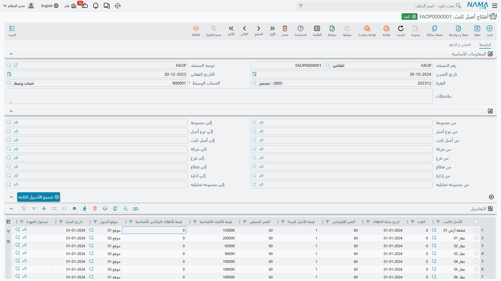
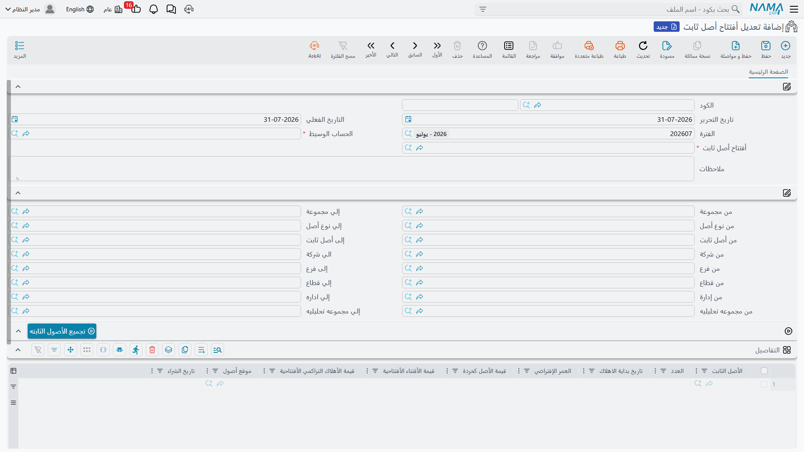

# الأرصدة الافتتاحية للأصول المملوكة سلفاً

ما من أحد تقريباً يبدأ استخدام وحدة الأصول الثابتة يوم يشتري أول ماكينة له. إنما يبدأ وفي ساحته
أربعمائة أصل، نصفها اشتُري قبل سنين ونصفها مهلَك، وجدول قديم لا بد أن يُزرع في نما دون أن يضيع منه رقم
واحد.

وهذه الزراعة هي **سند افتتاح أصل ثابت**. فتذكر لكل أصل ما كلّفه أصلاً، وكم أُخذ عليه من إهلاك، وكم كان
عمره المفترض، وكم سيساوي كخردة، ومتى بدأت ساعة إهلاكه. فيستنتج النظام أين يقف الأصل الآن من عمره،
ويرحّل القيد المقابل على حساب وسيط، ومن الفترة التالية يهلكه كأنه كان هنا منذ البداية.

وهي أكثر مهام بدء التشغيل شيوعاً في هذه الوحدة، فتستحق أن تُؤدى بتأنٍّ ومرة واحدة.

القائمة: **الأصول > المستندات > أفتتاح أصل ثابت**، الترخيص `fixedassets`.

## قبل أن تكتب شيئاً

لا بد من أربعة أمور، ثلاثة منها يسهل نسيانها.

**1. سجلات الأصول موجودة، في الحالة الابتدائية.** فسند الافتتاح يقوّم الأصول ولا يخترعها. أنشئها أولاً
من [شاشة الأصل الثابت](/ar/modules/fixedassets/master-files/fixedassets-asset-master.md) — أو، للأصول
المرسملة من مشروع مقاولات منتهٍ، عبر
[سند الإنشاء](/ar/modules/fixedassets/master-files/fixedassets-creation-document.md) — كلٌّ بكوده
واسمه ونوعه وتصنيفاته وموقعه. ومنتقي الأصل في سند الافتتاح لا يعرض إلا الأصول في الحالة **إبتدائى**.

(وإن شئت فسند الافتتاح قادر على إنشاء السجلات بنفسه: شغّل إعداد الوحدة **إضافة أعمدة إنشاء الأصول إلى
سندات الشراء و الإفتتاح** فيكتسب الجريد أعمدة الاسم والرقم المسلسل والنوع والتصنيف والمجموعة، تماماً
كما في [سند الشراء](/ar/modules/fixedassets/acquisition/fixedassets-purchase-document.md). ولكن في
بدء تشغيل بأي حجم يكون إنشاء الملفات الرئيسية أولاً أنظف عادةً.)

**2. تحتاج فترة مالية افتتاحية.** فافتراضاً لا يُحرَّر سند الافتتاح إلا في فترة مالية من نوع
*افتتاحية* — تلك الفترة صفرية المدة التي تسبق أول فترة نشاط حقيقية. فإن كان تقويم فتراتك لا يعمل هكذا
فإن إعداد الوحدة **السماح بالفترات العادية في افتتاحي الاصول** في
[إعدادات الأصول الثابتة](/ar/modules/fixedassets/fixedassets-configuration.md) يرفع هذا القيد.

**3. تحتاج حساباً وسيطاً.** فحقل **الحساب الوسيط** في الرأس إجباري، ولا بد أن يكون حساباً تفصيلياً.
وهو حساب التسوية الذي يستوعب صافي القيمة الدفترية لكل ما تُدخِله — وعادةً هو نفسه حساب الأرصدة
الافتتاحية الذي يستخدمه بقية بدء التشغيل، فتتقاصّ افتتاحيات الأصول الثابتة مع قيد افتتاح ميزان
المراجعة.

**4. احسم إيقاع فتراتك أولاً.** فالعمر والعمر المتبقي في هذه الوحدة يُعدّان **بالأشهر**، والوحدة تهلك
مرة كل فترة مالية. فهيّئ الفترات الشهرية قبل افتتاح الأصول لا بعده.

## الشاشة

الرأس قصير: دفتر المستند وكوده، وتاريخ التحرير، والتاريخ الفعلي، والفترة، و**الحساب الوسيط**، وتوجيه
اختياري، وملاحظات.

وتحته بلوك حقول **من / إلى** — المجموعة، ونوع الأصل، والأصل الثابت، والشركة، والفرع، والقطاع،
والإدارة، والمجموعة التحليلية — وليست هذه فلاتر على المستند بل معايير زر **تجميع الأصول الثابته**
الواقع معها.

::: tip تجميع الأصول الثابته
اضبط المدى — مثلاً من نوع الأصل `FAT-VEH` إلى `FAT-VEH` — واضغط الزر. فيُضاف إلى الجريد سطر لكل أصل في
الحالة الابتدائية داخل ذلك المدى، ومعه العمر الافتراضي مجلوباً من نوع الأصل. أما الأصول الموجودة في
الجريد فتُتخطى، فيمكنك ضغط الزر مراراً بمديات مختلفة وبناء المستند نوعاً بعد نوع. واكتب قيمة الخردة في
كل سطر بنفسك.
:::

ثم جريد **التفاصيل**، وفيه العمل الحقيقي:

| العمود | الاسم الإنجليزي | ماذا تضع فيه |
|---|---|---|
| الأصل الثابت | Fixed Asset | السجل المفتتَح |
| العدد | Count | للأصول القابلة للعد: كم وحدة يمثّل السجل |
| تاريخ بداية الاهلاك | Depreciation Start Date | التاريخ الذي بدأ فيه الأصل يُهلَك **أصلاً**، في النظام القديم |
| العمر الأفتراضي الأفتتاحي | Useful Life | العمر الكلي **الأصلي** بالأشهر |
| قيمة الأصل كخردة الأفتتاحية | Salvage Value | القيمة المتبقية |
| العمر المتبقي | Remaining Life | يُترك عادةً ليحسبه النظام |
| قيمة الأقتناء الأفتتاحية | Acquire opening value | **التكلفة الأصلية**، لا القيمة الدفترية |
| قيمة الأهلاك التراكمي الأفتتاحية | Acc. Depreciation opening value | الإهلاك **المأخوذ بالفعل** قبل بدء التشغيل |
| تاريخ الشراء | Purchase date | متى اشتُري |
| موقع أصول | Asset Location | أين يقف |
| مسئول العهدة | Custodian | من يحمله في عهدته |
| الشركة، الفرع، المجموعة التحليلية، الإدارة، القطاع | المحددات | محددات الأصل |

ومجموعة **الإجماليات** تحت الجريد تجمع لك عمودَي الاقتناء والإهلاك المتراكم، أما الصفحة الثانية فتحمل
العناوين وجدول الدفعات للحالة النادرة التي يكون فيها الافتتاح شراءً يُسدَّد كذلك.

وأهم عمودين هما عمودا القيمة، فلنقلها مرة أخرى صراحة: **قيمة الأقتناء الأفتتاحية هي التكلفة الأصلية
للأصل، وقيمة الأهلاك التراكمي الأفتتاحية هي كل ما أُهلك عليه حتى الآن.** فلا تُدخل القيمة الدفترية في
العمود الأول. فالنظام يحتاج الرقمين منفصلين لأنه يرحّلهما إلى حسابين مختلفين ويهلك من الفرق بينهما.

## مثال محلول: شاحنة اشتُريت في 2023 وأُدخلت في 2026

تبدأ شركة الواحة للصناعات التشغيل في **1 يناير 2026**، بفترات مالية شهرية وفترة افتتاحية `2026-OPEN`.
ومن الأصول الواجب إدخالها سيارة نقل:

| | |
|---|---|
| الأصل | `VEH-0002 — تويوتا هايلكس` |
| اشتُريت | 1 يوليو 2023 بـ **250,000** |
| العمر الافتراضي | **60 شهراً** |
| قيمة الخردة | **10,000** |
| أُهلكت في النظام القديم | حتى 31 ديسمبر 2025 — 30 شهراً × 4,000 = **120,000** |

والحساب الوسيط هو `299900 — تسوية أرصدة افتتاحية`.

### السطر

`الأصل الثابت = VEH-0002`، وتاريخ بداية الاهلاك **1 يوليو 2023**، وتاريخ الشراء 1 يوليو 2023، والعمر
الافتراضي **60**، وقيمة الخردة **10,000**، وقيمة الاقتناء الافتتاحية **250,000**، وقيمة الإهلاك
التراكمي الافتتاحية **120,000**.

### ما يحسبه النظام عند الحفظ

**العمر المتبقي.** من تاريخ بداية الإهلاك ينتهي عمر الأصل في 1 يوليو 2028. والافتتاح يسري في 1 يناير
2026. والفرق بينهما **30 شهراً** — وهو الصواب تماماً، إذ استُهلك 30 شهراً من الستين قبل بدء التشغيل.
فيملأ عمود العمر المتبقي نفسه.

**إجماليات الرأس.** قيمة الاقتناء الافتتاحية 250,000، وقيمة الإهلاك التراكمي الافتتاحية 120,000.

### ما يفحصه النظام عند الترحيل

الفحص الذي يتعثر فيه الناس هو هذا: **الإهلاك المتراكم لا يجوز أن يتجاوز التكلفة ناقص قيمة الخردة.**
وهنا 120,000 ≤ 250,000 − 10,000 = 240,000، فيمر. أما الأصل الذي سجّل النظام القديم إهلاكه المتراكم
نزولاً إلى الصفر لا إلى قيمة خردته فسيسقط في هذا الفحص، وعلاجه تصحيح قيمة الخردة لا الإهلاك.

كما يشترط أن يكون لكل سطر قابل للإهلاك تاريخ بداية إهلاك وعمر افتراضي وقيمة اقتناء؛ وألا يتكرر أصل
مرتين؛ وأن تبلغ قيمة الخردة **أقل قيمة للخردة** في إعدادات الوحدة وألا تساوي قيمة الاقتناء؛ وأن تكون
كل الأصول ما زالت في الحالة الابتدائية؛ وأن تكون الفترة افتتاحية ما لم تقل الإعدادات غير ذلك.

### كيف يبدو الأصل بعدها

| الحقل في `VEH-0002` | القيمة |
|---|---|
| قيمة الاقتناء | **250,000** |
| الإهلاك المتراكم | **120,000** |
| القيمة الدفترية | **130,000** |
| تاريخ بداية الإهلاك | 1 يوليو 2023 |
| العمر المتبقي | **30** فترة |
| قيمة الخردة | 10,000 |
| القسط الحالي | (250,000 − 120,000 − 10,000) ÷ 30 = **4,000** |
| الحالة | جارى الإهلاك |

ولاحظ أن القسط خرج مساوياً تماماً للـ 4,000 التي كان النظام القديم يحمّلها. وليست مصادفة — إنما هي
معادلة الوحدة القياسية، **(القيمة الحالية − الخردة) ÷ العمر المتبقي**، مطبَّقة على أصل قطع 30 شهراً من
عمر ستيني. فإذا لم يطابق قسطك المعاد حسابه ما كان النظام القديم يحمّله فأحد الأرقام الخمسة التي كتبتها
خطأ، وهذا أسرع موضع لالتقاطه. وانظر
[مفاهيم الإهلاك](/ar/modules/fixedassets/depreciation/fixedassets-depreciation-concepts.md) للمعادلة
كاملة.

### القيد

| | مدين | دائن |
|---|---|---|
| حساب تكلفة السيارات (من `VEH-0002`) | 250,000 | |
| حساب مجمع الإهلاك (من `VEH-0002`) | | 120,000 |
| `299900 — تسوية أرصدة افتتاحية` | | 130,000 |
| **الإجمالي** | **250,000** | **250,000** |

وحسابا جانب الأصل يأتيان من سجل الأصل نفسه — حسابه الرئيسي للتكلفة وحسابه الثاني لمجمع الإهلاك — ولهذا
لا يحمل توجيه سند الافتتاح حقول حسابات البتة. فلا يُختار إلا الحساب الوسيط، ويُختار في المستند. ويُنشأ
القيد على هيئة طلب أعمال يُعالَج في الخلفية.

### من أين يلتقط الإهلاك الخيط

صار الأصل الآن يُعامَل بوصفه **مهلَكاً حتى آخر يوم في الفترة السابقة للفترة الافتتاحية** — أي 31
ديسمبر 2025 هنا. فأول [سند إهلاك](/ar/modules/fixedassets/depreciation/fixedassets-depreciation-document.md)
يجمع هذه الشاحنة هو **يناير 2026** بمبلغ 4,000، ويمضي الجدول حتى يونيو 2028.

ويمكن إزاحة هذا الافتراض. فـ[توجيه](/ar/modules/fixedassets/document-terms/fixedassets-terms-acquisition.md)
سند الافتتاح يعرض أربعة خيارات تغيّر كيفية اشتقاق التواريخ والعمر المتبقي:

| خيار التوجيه | الاسم الإنجليزي | ماذا يغيّر |
|---|---|---|
| جعل تاريخ آخر إهلاك في الأصول المدرجة هو تاريخ نهاية الفترة المختارة في السند | Make Last Depreciation Date Period End Date | يعتبر الأصول مهلَكة حتى **نهاية شهر المستند نفسه** بدل نهاية الفترة السابقة |
| احتساب تاريخ بداية الإهلاك آليا للأصول المهلكة | Calculate Depreciation Start Date For Depreciated Assets | لسطر **مهلَك بالكامل** (التكلفة = الخردة + الإهلاك المتراكم) يجعل العمر المتبقي صفراً ويشتق تاريخ بداية الإهلاك من العمر الافتراضي |
| احتساب تاريخ بداية الإهلاك بناءا على الفرق بين العمر الافتراضي والعمر المتبقي | Calculate Depreciation Start Date Based On Difference… | يشتق تاريخ بداية الإهلاك من رقمَي العمر، لبيانات قديمة فيها أعمار بلا تواريخ موثوقة |
| عدم حساب العمر المتبقي من التواريخ | Do Not Calc Remaining Life From Dates | يُبقي العمر المتبقي الذي كتبته بدل إعادة حسابه من التواريخ |

والخياران الأخيران هما ما تلجأ إليه حين تكون بياناتك القديمة شحيحة. فإن كان النظام القديم يسجّل «60
شهراً إجمالاً، 30 متبقياً» بلا تاريخ بداية، فشغّل *احتساب تاريخ بداية الإهلاك بناءً على الفرق…* ودع
النظام يشتق التاريخ؛ وإن كان يسجّل أعماراً متبقية موثوقة لا تطابق التواريخ، فشغّل *عدم حساب العمر
المتبقي من التواريخ* ليفوز رقمك أنت.

::: info الأصول المهلكة بالكامل
الأصل الذي بلغ نهاية عمره ما زال ينتمي إلى السجل — فهو ما زال في الساحة، وسيُتخلَّص منه يوماً ما.
أدخِله بتكلفته وبإهلاك متراكم يساوي التكلفة ناقص الخردة، وشغّل *احتساب تاريخ بداية الإهلاك آليا للأصول
المهلكة* في التوجيه ليُضبط العمر المتبقي على صفر فلا يلتقطه سند إهلاك.
:::

::: info التاريخ الذي يحمله الافتتاح في سجل الأصل نفسه
سجل الأصل الداخلي يقيّد الافتتاح بتاريخ **بداية الإهلاك** الوارد في السطر، لا بتاريخ المستند — أي
بتاريخ 2023 لا 1 يناير 2026. وهذا مقصود: فهو يضع تكلفة بداية الأصل عند اللحظة التي بدأ فيها حقاً. أما
القيد المحاسبي فيحمل التاريخ الفعلي للمستند كسائر القيود.
:::

## إلغاء سند الافتتاح

إلغاء الترحيل يعكس كل شيء: تُمسح قيمة الاقتناء والإهلاك المتراكم وتاريخ بداية الإهلاك والقسط وتاريخ
الشراء والربط بالمستند، ويعود كل أصل إلى **إبتدائى**، ويُعكَس القيد. وهو المخرج النظيف من دفعة بدء
تشغيل كُتبت خطأً — ما دام لم يُهلَك شيء بعد.

أما بعد أن يعمل الإهلاك فلا تلغي، بل تصحّح.

## تصحيح افتتاح: سند تعديل الافتتاح

**الأصول > المستندات > تعديل أفتتاح أصل ثابت**.

ورغم موضعه في القائمة فهو ليس سند افتتاح ثانياً. إنما هو **محرِّر لسند افتتاح مرحَّل** — الطريقة
المعتمدة لتقول «عمر الشاحنة كان 72 شهراً لا 60» بعدما رُحِّل الافتتاح وأُهلك عليه.

وليس له أثر محاسبي خاص به. وإنما يعيد كتابة سند الافتتاح الأصلي ويعيد بناء أرقام الأصل منه، فيُعاد
توليد القيد الأصلي لا أن يُضاف إليه.

وطريقة استعماله:

1. افتح سند تعديل جديداً واختر سند الافتتاح المرحَّل في حقل **افتتاح الأصل الثابت**. فيُنسخ الرأس —
   التواريخ والفترة والحساب الوسيط ومديات التجميع والمحددات والإجماليات — وتُنسخ سطور التفاصيل.
2. غيّر ما يحتاج تغييراً. وعند الحفظ يصوّر النظام في صمت القيم **السابقة** لكل سطر لم يره من قبل:
   المورد، وتاريخ بداية الإهلاك، وتاريخ الشراء، والعمر الافتراضي، والعمر المتبقي، وقيمة الخردة، وتاريخ
   التخلص، وقيمة الاقتناء الافتتاحية، وقيمة الإهلاك التراكمي الافتتاحية، والموقع. وهذه الصورة هي ما
   يجعل التعديل قابلاً للرجوع عنه.
3. رحّل. فيُكتب الرأس وكل سطر مطابق مرة أخرى داخل سند الافتتاح الأصلي، وتُعاد حساباته، وتُعاد بناء
   أرقام الأصول من جديد.
4. وإن ألغيت التعديل نُسخت القيم المصوَّرة عائدةً إلى سند الافتتاح وأُعيد بناء الأصول — إلى ما كانت
   عليه.

والقواعد التي تحفظ نزاهة ذلك:

- بعد الترحيل لا يجوز أن تعيد توجيه التعديل إلى سند افتتاح آخر؛
- ولا يجوز تغيير تاريخه الفعلي؛
- ولا بد أن يكون **آخر** سند تعديل لذلك الافتتاح — فلا تُرحِّل ولا تحذف أقدم منه خارج الترتيب؛
- ولا بد أن يكون أصل كل سطر موجوداً سلفاً في سند الافتتاح المصدر؛
- ويُرفض سطر يحمل قيمة إهلاك وتاريخ بداية إهلاكه واقع في بداية الفترة المالية أو بعدها.

وافتراضاً لا يمسّ التعديل أصلاً تحرّكت حالته. أما إعداد الوحدة **تجاهل حالة الأصل مع تعديل افتتاح أصل
ثابت** فيرفع هذا الحارس لمن يحتاجه.

### تصحيح الشاحنة

بعد أيام من بدء التشغيل، وقبل إهلاك يناير، يُخرج مدير الأسطول أوراق الترخيص: عمر الهايلكس كان ينبغي أن
يكون 72 شهراً لا 60.

حرّر سند تعديل **بالتاريخ الفعلي نفسه** للافتتاح الأصلي، واختر سند الافتتاح `FAOD-0001`، وغيّر العمر
الافتراضي لـ `VEH-0002` من 60 إلى 72. فعند الترحيل يُعاد كتابة سطر سند الافتتاح، ويُعاد حساب العمر
المتبقي فيصير 42 شهراً بدل 30، وينزل القسط من 4,000 إلى
(250,000 − 120,000 − 10,000) ÷ 42 = **2,857.14**. وتظل الصورة السابقة تحمل 60، فإلغاء التعديل يعيد
الشاحنة إلى ما كانت عليه بالضبط.
