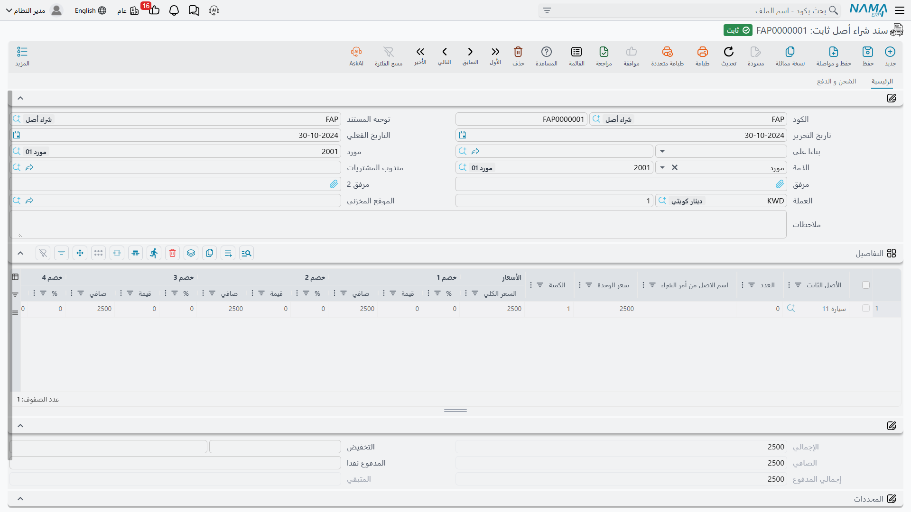
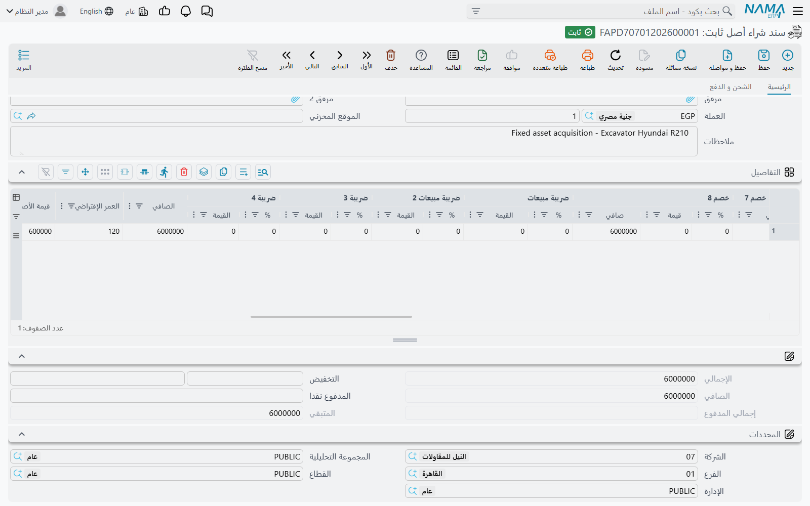
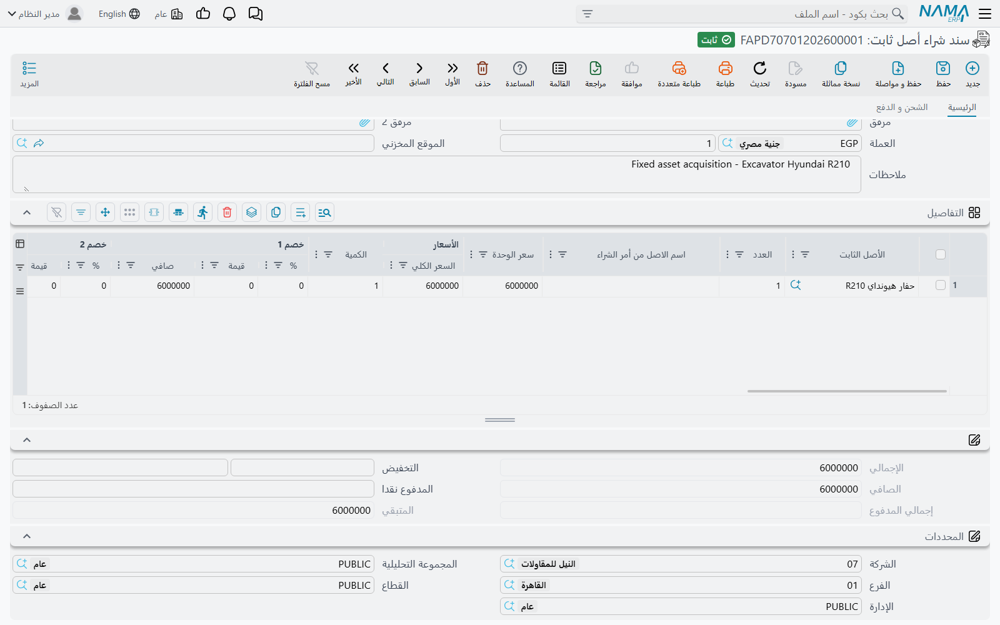
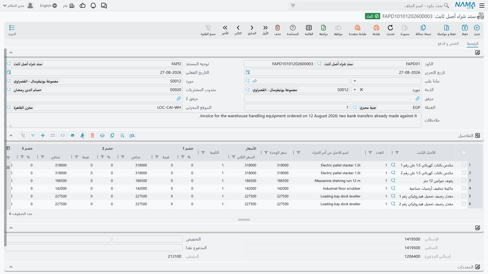
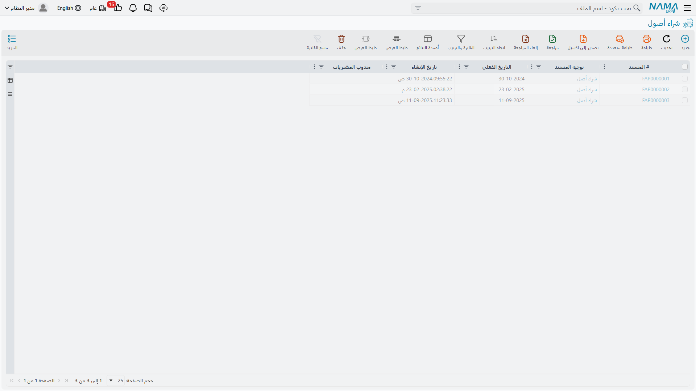

# سند شراء أصل ثابت

كل ما قبل هذا المستند أوراق. أما **سند شراء أصل ثابت** فهو موضع حركة المال، وموضع تحوّل سجل الأصل من
قوقعة فارغة إلى أصل حقيقي: فهو يضع قيمة الاقتناء على الأصل، ويشغّل ساعة الإهلاك، ويسجّل فاتورة
المورد، وينشئ القيد.

هو — بعبارة أخرى — فاتورة مورد لماكينة، مع فارق أن الطرف المدين لا يذهب إلى حساب مصروف يُختار في
التوجيه، بل يذهب إلى **حساب تكلفة الأصل نفسه**، مأخوذاً من سجل الأصل الذي يشير إليه السطر. وهذا القرار
التصميمي وحده يفسّر معظم ما يلي.

القائمة: **الأصول > المستندات > سند شراء أصل ثابت**، الترخيص `fixedassets`.

## أين يولد سجل الأصل

قبل التجول في الشاشة احسم هذه المسألة، فهي التي تحدد كيف تُهيَّأ الوحدة.

### المسار الأول — سجل الأصل موجود أولاً (الافتراضي)

ينشئ أحدهم سجل الأصل مسبقاً: يدوياً من
[شاشة الأصل الثابت](/ar/modules/fixedassets/master-files/fixedassets-asset-master.md)، أو — للأصول
المرسملة من مشروع مقاولات منتهٍ — عبر
[سند إنشاء الأصول](/ar/modules/fixedassets/master-files/fixedassets-creation-document.md). ويحمل
السجل كوداً واسماً ونوعاً وتصنيفات، وحساباته من خلال نوعه. ويقف في حالة **إبتدائى** بلا تكلفة ولا
تاريخ بداية إهلاك ولا قسط.

ثم تختار ذلك السجل في سند الشراء في عمود **الأصل الثابت** بالسطر. والمنتقي لا يعرض عن قصد إلا
**الأصول في الحالة الابتدائية**، وهي طريقة النظام في القول: الأصل يُشترى مرة واحدة. وفي هذا المسار
يكون عمود الأصل الثابت إجبارياً — فلن يُرحَّل المستند وهو فارغ.

وهذا هو السلوك الافتراضي وما تُبقي عليه معظم التركيبات، لأن ترميز الأصل وتصنيفه وربطه بالحسابات فعل
متعمَّد موضعه الملف الرئيسي لا وسط كتابة فاتورة.

### المسار الثاني — سند الشراء ينشئ السجل

شغّل **إنشاء الأصول إذا لم تكن موجودة** في
[توجيه](/ar/modules/fixedassets/document-terms/fixedassets-terms-acquisition.md) المستند فتلين
القاعدة: يصير السطر يقبل إما **أصلاً ثابتاً** وإما **نوع أصل**. املأ النوع فيُنشأ سجل الأصل لك لحظة
ترحيل المستند — يولد في الحالة الابتدائية ثم يُرقَّى فوراً، تماماً كما لو أنشأته يدوياً قبل دقيقة.

ولكي يُنتج ذلك سجلاً صالحاً للاستعمال يحتاج السطر إلى موضع يحمل فيه بيانات الأصل الوصفية، وهذه
الأعمدة مخفية افتراضياً. شغّل إعداد الوحدة **إضافة أعمدة إنشاء الأصول إلى سندات الشراء و الإفتتاح** في
[إعدادات الأصول الثابتة](/ar/modules/fixedassets/fixedassets-configuration.md) فيكتسب الجريد:

**نوع الأصل**، و**اسم الأصل (عربي)**، و**اسم الأصل (إنجليزي)**، و**الرقم المسلسل**، و**القيمة
السوقية**، و**التصنيف 1 إلى 5**، و**المجموعة**.

ويأخذ السجل الجديد اسمه ورقمه المسلسل وقيمته السوقية ومسؤول عهدته وموقعه ونوعه وتصنيفاته من هذه
الأعمدة، ويأخذ حساباته وعلامة قابليته للعد وعلامتَي «أصل سيارة» و«له تأمين» وعلامة «غير قابل للإهلاك»
من نوع الأصل. ويُخصَّص كوده بقواعد الترقيم المعتادة.

::: warning اختر مساراً واحداً لكل توجيه لا المسارين
حين يكون **إنشاء الأصول إذا لم تكن موجودة** مفعَّلاً، يُعامَل كل سطر في المستند على أنه يصف أصلاً
يُراد كتابته — بما في ذلك سطر يشير إلى سجل أصل موجود بالفعل. فتُعاد كتابة اسم ذلك الأصل ورقمه المسلسل
وقيمته السوقية ومسؤول عهدته وموقعه ونوعه وتصنيفاته من أعمدة السطر نفسه، وهي غالباً فارغة.

فأبقِ الخيار **مطفأً** في التوجيهات التي تستخدمها لشراء أصول مُنشأة سلفاً، ولا تشغّله إلا في توجيه
مخصص يُستعمل مع أعمدة الإنشاء. توجيهان اثنان، غرضان واضحان، ولا مفاجآت.
:::

## الشاشة

تحمل الصفحة الرئيسية رأس الفاتورة:

| الحقل | الاسم الإنجليزي | ملاحظات |
|---|---|---|
| الكود (الدفتر) | Code (Book) | دفتر المستند ورقمه |
| توجيه المستند | Term | التوصيلات المحاسبية — انظر [توجيهات الاقتناء](/ar/modules/fixedassets/document-terms/fixedassets-terms-acquisition.md) |
| تاريخ التحرير / التاريخ الفعلي | Issue Date / Value Date | التاريخ الفعلي هو تاريخ الاقتناء الذي يُكتب على الأصل |
| بناءا على | From Document | الأمر أو العرض أو الاستلام المبدئي أو الطلب الذي تجيب عنه الفاتورة |
| مورد | Supplier | من أصدر الفاتورة عليك |
| الذمة | Subsidiary | تأتي افتراضاً من المورد، وعليها يُقيَّد الطرف الدائن |
| مندوب المشتريات | Purchases man | من قام بالشراء |
| مرفق، مرفق 2 | Attachment | صورة فاتورة المورد |
| العملة، المعدل | Currency, Rate | تأتي من المورد ويُجلب المعدل بتاريخ التاريخ الفعلي |
| الموقع المخزني | Location | الموقع الذي تذهب إليه الأصول |
| ملاحظات | Description | نص حر |

ثم جريد **التفاصيل**، وهو قلب المستند.

| العمود | الاسم الإنجليزي | ماذا يفعل |
|---|---|---|
| الأصل الثابت | Fixed Asset | السجل الذي يُرسمل. والمنتقي لا يعرض إلا الأصول الابتدائية |
| العدد | Count | للأصول القابلة للعد — كم وحدة يمثّل هذا السجل |
| اسم الاصل من أمر الشراء | Asset Name From Purchase Order | ينزل من أمر الشراء لترى ما طُلب |
| سعر الوحدة، الكمية، السعر الكلي | Unit price, Quantity, total | بلوك السعر |
| خصم 1 إلى 8، الضرائب 1 إلى 4، الصافي | Discounts, Taxes, Net | حساب الفاتورة المعتاد |
| العمر الإفتراضي | Useful Life | بالأشهر؛ يأتي افتراضاً من نوع الأصل |
| قيمة الأصل كخردة | Salvage Value | القيمة المتبقية؛ تأتي افتراضاً من نوع الأصل |
| تاريخ بداية الاهلاك | Depreciation Start Date | متى تبدأ ساعة الإهلاك |
| مسئول العهدة | Custodian | الموظف الذي سيحمله في عهدته |
| مورد، الذمة | Supplier, Subsidiary | تجاوزات على مستوى السطر |
| موقع الأصل | Asset Location | أين يذهب هذا الأصل بعينه |
| الشركة، الفرع، المجموعة التحليلية، الإدارة، القطاع | Dimensions | [محددات](/ar/modules/fixedassets/fixedassets-overview.md) السطر |
| مرفق، مرفق 2، ملاحظات | Attachments, Description | ملاحظات السطر |

وتحته بلوك الإجماليات — **الإجمالي** و**التخفيض** و**الصافي** و**المدفوع نقدا** و**إجمالي المدفوع**
و**المتبقي** — ثم محددات المستند. وحقول السعر والخصم والضريبة والصافي والإجمالي يحسبها النظام ولا
تُكتب فوقها؛ إنما تحرّكها بسعر الوحدة والكمية ونسب الخصم.

والصفحة الثانية **الشحن و الدفع** تحمل عنواني الشحن والفوترة، وجريد **سندات الدفع** للدفعات المسددة
سلفاً، و**قالب جدول الدفعات** مع إجراء **إنشاء الدفعات** وجريد الأقساط الناتج، وبلوكاً جزئياً للمال.
وإجراء **سندات سداد الدفعات** في قائمة المزيد يفتح سندات السداد المحرَّرة على تلك الأقساط.

## ما تملؤه الشاشة عنك

الكثير، ولهذا فكتابة المستند أسرع مما يبدو:

- اختيار **المورد** يجلب عملته الافتراضية ويجلب سعر الصرف بتاريخ التاريخ الفعلي؛
- اختيار **بناءا على** ينسخ المورد والإدارة، والأهم أنه **يفكّك كل سطر مصدر إلى سطر لكل وحدة**، كمية
  كل منها 1 بسعر المصدر، حاملاً اسم ما طُلب. فثلاث رافعات في أمر الشراء تصير ثلاثة سطور شراء، لأنها
  ستصير ثلاثة سجلات أصول؛
- اختيار **الأصل الثابت** يجلب **العمر الإفتراضي** و**قيمة الخردة** من نوع ذلك الأصل، ويحمّل نسب
  الضريبة من خطتَي الضريبة في الأصل وفي الرأس، ويضع **العدد** صفراً إذا كان الأصل غير قابل للعد،
  ويقترح **تاريخ بداية إهلاك** هو اليوم التالي لنهاية الفترة المالية للمستند — وهو الافتراض الطبيعي
  «يبدأ الإهلاك في الفترة القادمة»؛
- اختيار **نوع الأصل** (في المسار الثاني) يجلب العمر الافتراضي وقيمة الخردة من النوع؛
- ومسح الأصل الثابت يمسح الحقول التي جاءت معه؛
- واختيار **التوجيه** ينسخ إعداداته الضريبية إلى الرأس؛
- وعمود **العدد** لا يقبل إدخالاً إلا إذا كان الأصل أو النوع مؤشَّراً بأنه قابل للعد.

ولك أن تكتب فوق تاريخ بداية الإهلاك المقترح — بقيد واحد: ألا يكون **أسبق** من التاريخ الفعلي للمستند
بالنسبة للأصل القابل للإهلاك. فأصل دخل الخدمة في اليوم نفسه الذي تحمل الفاتورة تاريخه لا بأس به؛ أما
أصل يُفترض أنه بدأ يُهلَك الشهر الماضي فلا، وموضعه
[سند الافتتاح](/ar/modules/fixedassets/acquisition/fixedassets-opening-balances.md).

## ما ينبغي أن يتحقق قبل الترحيل

يفحص المستند كثيراً، وكل فحص يحمي رقماً سيراجعه أحدهم لاحقاً:

1. كل سطر لأصل قابل للإهلاك يحتاج **تاريخ بداية إهلاك**، ولا يجوز أن يسبق التاريخ الفعلي للمستند.
2. كل أصل لا بد أن يكون في الحالة **الابتدائية**، ولا يجوز أن يظهر الأصل نفسه في سطرين.
3. وبحسب المسار: إما أن يكون **الأصل الثابت** إجبارياً، وإما أن يُملأ أحد الحقلين — الأصل أو نوع
   الأصل.
4. **العمر المتبقي لا بد أن يكون أكبر من صفر** للأصل القابل للإهلاك، و**قيمة الخردة لا تساوي السعر** —
   فأصل قيمته كخردة هي تكلفته كلها ليس فيه ما يُهلَك. كما لا بد أن تبلغ قيمة الخردة **أقل قيمة
   للخردة** المضبوطة في إعدادات الوحدة.
5. ولا يجوز تعديل سطر إذا كان الأصل قد مضى قُدُماً — فإن وُجدت له حركة لاحقة (إهلاك أو إعادة تقييم أو
   إضافة) تجمّد الشراء الذي وراءها.
6. ولا بد أن يتطابق جدول الدفعات مع المبلغ المتبقي، وأن تصح أكواد الأقساط، وأن يتسق المدفوع نقداً مع
   المتبقي.
7. وإذا اشترط التوجيه وجود طرف مقابل صار المورد إجبارياً.

::: info الاعتماد عند الإنشاء لا عند التعديل
يمكن وضع سند الشراء خلف تعريف اعتماد، لكن ليس تعريفاً مفعَّلاً فيه خيار الاستخدام مع التعديل. فاعتمد
إنشاء شراء الأصل، ولا تحاول توجيه تعديلاته اللاحقة عبر الآلية نفسها.
:::

## ماذا يفعل الترحيل

ترحيل سند الشراء أكثر لحظات الوحدة ازدحاماً. فهو لكل سطر:

- يكتب التاريخ الفعلي للمستند على الأصل بوصفه **تاريخ الشراء**، ويربط الأصل بهذا المستند؛
- ويسجّل موقع السطر بوصفه **الموقع** الحالي للأصل، ويفتح سطراً في سجل مواقعه؛
- وينقل الأصل من **إبتدائى** إلى **جارى الإهلاك** — أو إلى **غير قابل للإهلاك** إن كان مؤشَّراً بذلك؛
- ويكتب تكلفة السطر بوصفها **قيمة اقتناء** الأصل، مع العمر الافتراضي والعمر المتبقي (الذي يبدأ مساوياً
  للعمر الافتراضي) وقيمة الخردة وتاريخ بداية الإهلاك؛
- ويحسب **القسط الحالي** للأصل من هذه الأرقام؛
- ويكتب مسؤول العهدة الوارد في السطر على الأصل إن وُجد؛
- ويحدّث سجل أعداد الأصول للأصول القابلة للعد؛
- وينسخ محددات السطر على الأصل إذا كان خيار التوجيه **تحديث محددات الأصل من الفاتورة** مفعَّلاً ولم
  يمسّ الأصلَ شيء لاحق؛
- ويختم هذا المستند على الأمر أو العرض الذي جاء منه، فلا يُفوتَر ذلك المصدر مرتين أبداً.

ثم يرسل القيد على هيئة طلب أعمال.

### القيد

| الطرف | الحساب | القيمة |
|---|---|---|
| مدين | **حساب تكلفة الأصل نفسه**، مأخوذاً من سجل الأصل | صافي قيمة السطر |
| مدين | حسابات الضريبة المهيَّأة في التوجيه | ضريبة السطور |
| دائن | حساب المورد / الذمة المهيَّأ في التوجيه | إجمالي الفاتورة |

والطرف المدين يستحق جملة خاصة به. فهو لا يُختار في التوجيه، بل يُستخرج دائماً من الأصل الثابت في
السطر، ولهذا يعرض عليك التوجيه طرفاً دائناً ولا يعرض طرفاً مديناً. أما محددات ذلك السطر المدين (القطاع
والفرع والإدارة والمجموعة التحليلية) فتتبع مفاتيح «التأثير على الحسابات» الأربعة في
[إعدادات الوحدة](/ar/modules/fixedassets/fixedassets-configuration.md): فحيث يكون المفتاح مفعَّلاً
يؤخذ المحدد من الأصل نفسه.

ولحسابات الخصم والنقدية والتكلفة الإضافية أطرافها المهيَّأة في التوجيه لمن يحتاجها.

::: tip الضريبة والتكلفة المرسملة
افتراضاً تُضاف الضريبة المحسوبة على السطر إلى القيمة المرسملة على الأصل. فحيث تكون الضريبة قابلة
للخصم ولا ينبغي أن تضخّم تكلفة الأصل، شغّل خيار **منع إضافة ضريبة** المقابل — وله نظير لكل ضريبة في
إعدادات الوحدة وفي توجيه المستند، ويكفي أحدهما.
:::

## إلغاء الترحيل

إلغاء ترحيل سند شراء مرحَّل يفكّ ذلك كله: تُزال قيمة الاقتناء وتاريخ بداية الإهلاك والقسط وتاريخ
الشراء وسطر الموقع والربط بالمستند، ويعود الأصل إلى **إبتدائى**، ويُعكَس القيد. وهو تماماً ما تريده
إذا أُدخلت فاتورة على الماكينة الخطأ — لكن انتبه إلى أنه غير ممكن إلا ما دام لم يمسّ الأصلَ شيء لاحق.

## الواحة ترسمل ماكينة القص

تستخدم شركة الواحة التوجيه `FAPD-01`: خاضع للضريبة 15 %، و**إنشاء الأصول إذا لم تكن موجودة** مطفأ،
والطرف الدائن على حساب مراقبة الموردين، والضريبة المدينة على ضريبة المشتريات، مع تفعيل **منع إضافة
ضريبة 1** في إعدادات الوحدة حتى لا تضخّم الضريبة القابلة للخصم تكاليف الأصول.

سجل الأصل `MCH-0007 — ماكينة قص CNC` موجود بالفعل، نوعه `FAT-MCH — آلات ومعدات`، حالته إبتدائى،
تصنيفه الأول «معدات إنتاج».

تحرّر المحاسبة سند الشراء `FAPD-0031` في **1 يناير 2026** بناءً على أمر الشراء `FAPO-0009`:

- يتفكك سطر الأمر إلى سطر واحد كميته 1 بـ **240,000**؛
- ويُختار `MCH-0007`، فيأتي **العمر الإفتراضي 60** و**قيمة الخردة 24,000** من النوع؛
- وتاريخ بداية الإهلاك المقترح 1 فبراير 2026، لكن الماكينة دخلت الخدمة في 1 يناير، فيُعاد إلى
  **1 يناير 2026** — وهو مسموح لأنه ليس أسبق من التاريخ الفعلي للمستند؛
- ومسؤول العهدة خالد المطيري، والموقع `LOC-R2 — مصنع الرياض – صالة 2`؛
- والإجماليات: 240,000 زائد ضريبة 15 % بمقدار 36,000 = **276,000** مستحقة لـ «الخليج لتجارة الآلات».

وعند الترحيل يصير `MCH-0007`:

| | |
|---|---|
| الحالة | جارى الإهلاك |
| تاريخ الشراء | 1 يناير 2026 |
| قيمة الاقتناء | **240,000** |
| العمر الافتراضي / المتبقي | 60 / 60 فترة |
| قيمة الخردة | 24,000 |
| تاريخ بداية الإهلاك | 1 يناير 2026 |
| القسط الحالي | (240,000 − 24,000) ÷ 60 = **3,600** |
| الموقع | LOC-R2 — مصنع الرياض – صالة 2 |

ويكون القيد:

| | مدين | دائن |
|---|---|---|
| حساب تكلفة الآلات (من `MCH-0007`) | 240,000 | |
| ضريبة المشتريات | 36,000 | |
| مراقبة الموردين — الخليج لتجارة الآلات | | 276,000 |
| **الإجمالي** | **276,000** | **276,000** |

ويأخذ أول إهلاك لشهر يناير 2026 مبلغ 3,600. أما بقية عمر الماكينة — الإهلاك، وإضافة يناير 2027،
والنقل إلى صالة أخرى، والبيع في نهاية 2027 — فتُروى في صفحتَي
[الإهلاك](/ar/modules/fixedassets/depreciation/fixedassets-depreciation-concepts.md)
و[التخلص](/ar/modules/fixedassets/disposal/fixedassets-disposal.md).

::: info إذا لم يظهر القيد
يُنشأ القيد على هيئة طلب أعمال تتم معالجته في الخلفية. افتح شاشة طلبات الأعمال وفلتِر على الفاشلة،
وحدّد السطور، ثم استخدم **المزيد ← إعادة المعالجة / إعادة الترحيل**. وللمعالجة بالجملة هناك أيضاً
[أدوات الأصول الثابتة](/ar/admin/reprocessing/fixed-asset-utilities.md).
:::
