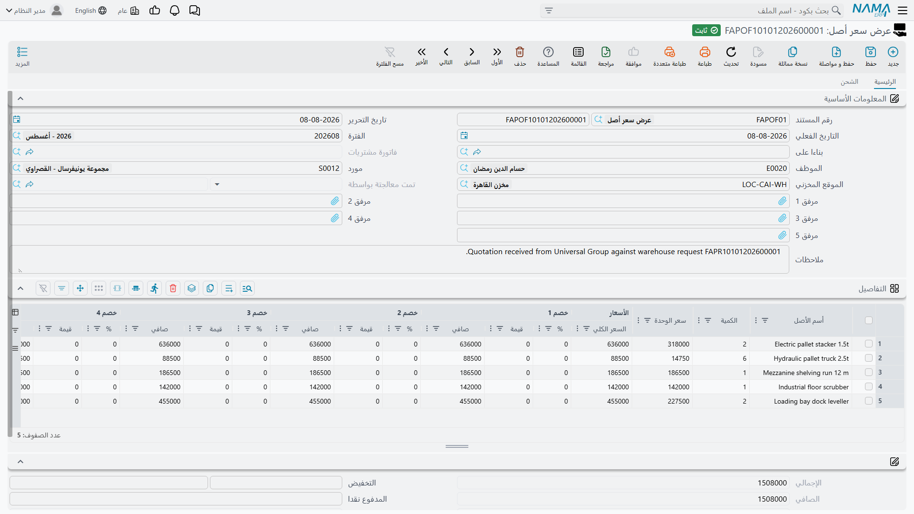

# عروض الأسعار وأوامر الشراء

بين «نحتاج ماكينة قص CNC» و«هذه فاتورة المورد» يقع المستندان اللذان تؤدي فيهما المشتريات عملها:
**عرض سعر أصل**، الذي يسجّل ما يقبل المورد أن يبيع به، و**أمر شراء أصل**، الذي يسجّل ما وافقت أنت على
شرائه.

وهما شاشة واحدة تقريباً، ولسبب وجيه: فالأمر في العادة هو العرض الفائز موقَّعاً عليه. وكلاهما يحمل
تسعيراً كاملاً — سعر الوحدة، وحتى ثمانية مستويات خصم، وأربع ضرائب، وجداول أقساط، وشروط شحن — لأن
ماكينة بربع مليون يُتفاوض عليها بهذه اللغة بالضبط.

وكلاهما تحت **الأصول > المستندات**، ولا يحتاجان إلا الترخيص `fixedassets`.

## ولا واحد منهما يكلّف شيئاً

هذا أول ما ينبغي قوله، لأن المال على هاتين الشاشتين يبدو مقنعاً جداً.

**عرض السعر وأمر الشراء لا يُنتجان قيداً.** فلا شيء يُستحق للمورد، ولا شيء يُرسمل، ولا شيء يظهر في
دفتر الأستاذ. والإجماليات والخصومات والضرائب تُحسب لتتمكن من مقارنة العروض والحصول على اعتماد
والتفاوض — فهي دعم للقرار لا محاسبة. والالتزام في الدفاتر يبدأ مع
[سند الشراء](/ar/modules/fixedassets/acquisition/fixedassets-purchase-document.md).

والأمر نفسه في سجل الأصول. فلا أحد المستندين يُنشئ سجل أصل ثابت ولا يمسّه ولا يحجزه. وكلاهما يسمّي
الأصل المطلوب **نصاً حراً**، تماماً كما يفعل
[الطلب](/ar/modules/fixedassets/acquisition/fixedassets-purchase-request.md).

::: tip فيمَ الضرائب على هاتين الشاشتين
إذا اخترت توجيهاً بخطة ضريبية امتلأت أعمدة الضريبة وشملت الإجماليات الضريبة. فاعتبر هذه الأرقام
للعِلم: هي تتيح لك مقارنة عرض شامل للقيمة المضافة بعرض غير شامل لها. أما الضريبة التي تُسجَّل وتُخصم
فعلاً فهي ضريبة سند الشراء.
:::

## عرض السعر

يحمل الرأس دفتر المستند وكوده، وتاريخي التحرير والتاريخ الفعلي، و**الموظف** الطالب، و**المورد**
المقدِّم للعرض، و**موقع الأصل** المطلوب وضع المعدة فيه، وحتى خمسة مرفقات لملف العرض نفسه، وحقل
**بناءا على** لبناء العرض على الطلب الذي أثاره. أما **تمت معالجتة بواسطة** و**سند الشراء** فيملؤهما
النظام حين يستهلك العرضَ مستندٌ لاحق.

وجريد **التفاصيل** قائمة أسعار:

| العمود | الاسم الإنجليزي |
|---|---|
| أسم الأصل | Fixed Asset Name |
| الكمية | Quantity |
| سعر الوحدة / السعر الكلي | Unit price / total price |
| خصم 1 إلى 8 — % / قيمة / صافي | Discount 1..8 |
| ضريبة مبيعات وضرائب 2 إلى 4 — نسبة وقيمة | Item Tax, Tax 2..4 |
| الصافي | Net value |
| ملاحظات | Description |

والصفحة الثانية **الشحن و الدفع** تعيد بلوك لوجستيات الطلب وتضيف جانب السداد: **قالب جدول دفعات**،
وإجراء **إنشاء الدفعات** الذي يفرده إلى سطور أقساط، وجريد الجدول نفسه. ولا بد أن يتطابق الجدول مع
المبلغ المتبقي في المستند قبل أن يُرحَّل العرض — فعرض بأربعة أقساط لا يبلغ مجموعها السعر مرفوض.

## أمر الشراء

فيه كل ما في عرض السعر، وزيادة:

- حقل **توجيه المستند** في الصفحة الرئيسية، ومنه تأتي الخطة الضريبية وسلوك الضرائب؛
- عمودا **نفذت** و**الكمية الغير مستلمة** على الجريد، فيُظهر الأمر المحرَّر بناءً على طلب ما استهلكه؛
- جريد **سندات الدفع** في الصفحة الثانية — سند الدفع وتاريخه وقيمته وعلامة للدفعات التي ينبغي ألا
  تُنقص المتبقي — للدفعات المقدَّمة على الأمر؛
- جريد الشروط القياسية، للبنود التعاقدية المصاحبة للأمر.

كما تعيد الصفحة الثانية الدفتر والكود والتوجيه، فيمكن إتمام الأمر منها بالكامل.

## أن يستهلك طلباً وأن يُستهلَك

القاعدة التي تحكم عدّادات الكميات بسيطة وتستحق الدقة: **عدّادات الطلب تتحرك حين يُبنى مستند على ذلك
الطلب مباشرة.** فعرض سعر أو أمر شراء أو
[استلام مبدئي](/ar/modules/fixedassets/acquisition/fixedassets-receipts.md) حقلُ **بناءا على** فيه
مشير إلى طلب شراء، سيرفع عند ترحيله «نفذت» في ذلك الطلب، ويخفض «الكمية الغير مستلمة»، ويحدّث «إجمالي
الغير مسلم»، ويختم «تمت معالجتة بواسطة». وإلغاء الترحيل يعيد ذلك كله.

أما الأمر المبني على *عرض سعر* فينسخ سطور العرض وأسعاره بسرور، لكنه لا يخصم شيئاً — فعرض السعر لم يكن
مطلباً يُلبّى أصلاً.

وفي الاتجاه الآخر يتذكر الأمر ما آل إليه. فحين يُرحَّل سند شراء عليه يمتلئ حقل **سند الشراء** في
الأمر، ومن تلك اللحظة يكفّ ذلك الأمر عن الظهور في منتقي «بناءا على» في سندات الشراء الجديدة. أمر
واحد، فاتورة واحدة.

## «الخليج لتجارة الآلات» تفوز بماكينة القص

لدى شركة الواحة للصناعات الطلب `FAPR-0004` مفتوحاً: ماكينة قص CNC وعربتا نقل بالتات. تدعو المشتريات
موردَين لتقديم عرضيهما على الماكينة.

| العرض | المورد | سعر الوحدة | الخصم | الصافي |
|---|---|---|---|---|
| `FAPOF-0011` | الخليج لتجارة الآلات | 250,000 | 4 % | **240,000** |
| `FAPOF-0012` | الرياض للأنظمة الصناعية | 252,000 | — | 252,000 |

وكلا العرضين مبني على الطلب، فيحمل كلاهما سطر «ماكينة قص CNC، الكمية 1» دون أن يعيد أحد كتابته. كما
يقترح عرض «الخليج لتجارة الآلات» ثلاثة أقساط بـ 80,000، تُدخَل في جريد الجدول وتتطابق مع الـ 240,000.

تعرض المشتريات العرض الأرخص على مدير المصنع، وتحصل على الاعتماد، وتحرّر أمر الشراء `FAPO-0009` بناءً
على **الطلب** — لتتحرك عدادات الطلب — بمورد «الخليج لتجارة الآلات» وبالقيمة المتفق عليها 240,000،
والتسليم إلى `LOC-R2 — مصنع الرياض – صالة 2`، وثلاثة أقساط، وبند ضمان اثني عشر شهراً في جريد الشروط.

وعند الترحيل:

- يصير السطر 1 في الطلب: **نفذت 1، غير مستلمة 0**؛ وينزل «إجمالي الغير مسلم» من 3 إلى 2 (فالعربتان لم
  تُطلبا بعد)؛
- ويُظهر **تمت معالجتة بواسطة** في الطلب `FAPO-0009`؛
- ولم يبلغ دفتر الأستاذ شيء البتة، ولا وُجد سجل أصل بعد.

وتُسلَّم الماكينة بعد خمسة أسابيع. فإذا وصلت الفاتورة حرّرت المحاسبة
[سند الشراء](/ar/modules/fixedassets/acquisition/fixedassets-purchase-document.md) بناءً على
`FAPO-0009` — و*تلك* هي اللحظة التي يصير فيها `MCH-0007` أصلاً ثابتاً حياً يحمل تكلفة 240,000.
