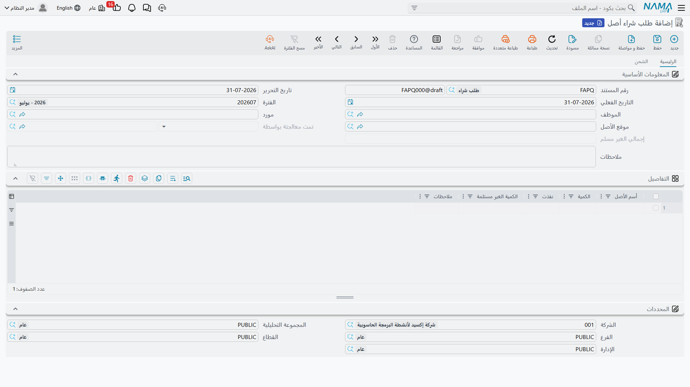

# طلب شراء أصل

طلب الشراء هو الطلب الداخلي: *ورشة الدهان تحتاج ضاغط هواء*، *الإنتاج يحتاج ماكينة قص CNC*. يكتبه من
يحتاج المعدة لا من سيشتريها، وهو لا يحمل عن قصد إلا أقل القليل — اسماً وكمية. فلا مورد ملتزَم به، ولا
سعر معروض، ولا حساب يُمَس.

وشُحّ التفاصيل هذا هو المقصود. فطلب يشترط الأسعار يُلزِم صاحب الحاجة أن يجول على الموردين، والجولان
على الموردين عمل المشتريات لا عمله.

تجده تحت **الأصول > المستندات > طلب شراء أصل**، ولا يحتاج إلا الترخيص الأساسي `fixedassets`.

## كيف تملأ الطلب

الرأس رأس مستند معتاد، مضافاً إليه من يطلب وأين:

| الحقل | الاسم الإنجليزي | فيمَ يُستخدم |
|---|---|---|
| رقم المستند (الدفتر، الكود) | Document Code | دفتر المستند ورقمه المسلسل |
| تاريخ التحرير | Issue Date | متى كُتب الطلب |
| التاريخ الفعلي | Value Date | التاريخ الذي يُحسب منه الطلب |
| الفترة | Fiscal Period | الفترة المالية التي يقع فيها |
| الموظف | Employee | من يطلب |
| مورد | Supplier | مورد مفضَّل إن وُجد — اقتراح لا التزام |
| موقع الأصل | Asset Location | أين تُراد المعدة |
| تمت معالجتة بواسطة | Processed By | يملؤه النظام: المستند الذي استهلك هذا الطلب |
| إجمالي الغير مسلم | Total Unsatisfied Qty | يملؤه النظام: كم بقي من الطلب دون تنفيذ |
| ملاحظات | Description | نص حر — موضع تبرير الطلب |

ثم جريد **التفاصيل**، وفيه يعيش الطلب:

| العمود | الاسم الإنجليزي | ملاحظات |
|---|---|---|
| أسم الأصل | Fixed Asset Name | نص حر. أنت تسمّي *شيئاً تريده* لا تختار سجل أصل — فالسجل لم يوجد بعد |
| الكمية | Quantity | العدد المطلوب |
| نفذت | Satisfied Qty | يديره النظام: كم طُلب أو استُلم مقابل هذا السطر |
| الكمية الغير مستلمة | Unsatisfied Quantity | يديره النظام: الكمية ناقص المنفَّذ |
| ملاحظات | Description | ملاحظة على السطر — مواصفة أو موديل أو درجة استعجال |

وتحت الجريد تقع [المحددات](/ar/modules/fixedassets/fixedassets-overview.md) الخمسة — الشركة والمجموعة
التحليلية والفرع والقطاع والإدارة — ليمكن تقرير الطلب حسب الجهة التي تطلب الإنفاق.

أما الصفحة الثانية **الشحن** فتحمل قائمة أمنيات اللوجستيات: تواريخ الشحن والتسليم المتوقعة، وطريقة
الشحن، وميناءا الشحن والوصول، وأطراف التأمين والشحن والتخليص، ومدة التسليم المتوقعة بوحدة قياسها،
والشروط، وعنوان الشحن. وكلها وصفية؛ وُجدت لتنتقل المعلومة مع السلسلة حين تبني المشتريات
[عرض سعر أو أمر شراء](/ar/modules/fixedassets/acquisition/fixedassets-purchase-offers-and-orders.md)
بناءً على الطلب.

::: info لا توجيه ولا محاسبة
ليس في شاشة طلب الشراء **حقل توجيه**، ولا ينتج عنه قيد من أي نوع. فلا شيء منه يبلغ دفتر الأستاذ، ولا
شيء منه يمسّ سجل الأصول. هو مراسلة داخلية يحتفظ بها النظام مرتبة.
:::

ولا شيء يمنع ترحيل طلب الشراء — فليست له تحققات خاصة به. احفظه ورحّله، فيصير طلباً مفتوحاً.

## كيف يعرف الطلب أنه لُبِّي

عمودا الكمية هما الجزء المتحرك الوحيد، ويستحقان الفهم لأنهما تقرير «الطلبات المفتوحة» الوحيد في
الوحدة.

كلما حُرِّر [عرض سعر أو أمر شراء أو استلام مبدئي](/ar/modules/fixedassets/acquisition/fixedassets-purchase-offers-and-orders.md)
وحقل **بناءا على** فيه مشير إلى هذا الطلب، حملت السطور القادمة من الطلب رابطاً خفياً إلى سطر الطلب
الذي نُسخت عنه. وعند ترحيل ذلك المستند:

- ترتفع **نفذت** في سطر الطلب المقابل بمقدار الكمية المطلوبة،
- وتُعاد **الكمية الغير مستلمة** إلى الكمية ناقص المنفَّذ،
- ويُحدَّث **إجمالي الغير مسلم** في الرأس كمجموع أرقام السطور،
- ويُختم **تمت معالجتة بواسطة** في الطلب بالمستند الذي استهلكه.

وإلغاء ترحيل ذلك المستند يعيد كل رقم من هذه الأرقام إلى ما كان. ولأن العدادات تقوم على الرابط بين
السطور فهي لا تعمل إلا إذا كان المستند اللاحق قد بُني **بناءً على** الطلب حقاً؛ أما كتابة اسم الأصل
نفسه في أمر شراء غير مرتبط فلا تثبت شيئاً ولا تُحسب.

::: tip قراءة شاشة القائمة
لأن **إجمالي الغير مسلم** في الرأس، تجيب شاشة قائمة طلبات الشراء عن سؤال «ما الذي طُلب ولم يُطلب من
المورد بعد» بنظرة واحدة: رتّب أو فلتِر على هذا العمود، وكل ما هو أكبر من صفر ما زال مفتوحاً.
:::

## الواحة تطلب ماكينة القص

يكتب الإنتاج في شركة الواحة للصناعات الطلب `FAPR-0004` بتاريخ 5 يناير 2026:

| السطر | أسم الأصل | الكمية | نفذت | غير مستلمة |
|---|---|---|---|---|
| 1 | ماكينة قص CNC | 1 | 0 | 1 |
| 2 | عربة نقل بالتات | 2 | 0 | 2 |

فيكون **إجمالي الغير مسلم** في الرأس = 3. وتشرح الملاحظة أن ماكينة القص تحل محل منشار يدوي وأن
العربتين لنفس الصالة.

تجمع المشتريات العروض، ويقع الاختيار على «الخليج لتجارة الآلات» للماكينة بـ 240,000. فيُحرَّر أمر شراء
بناءً على الطلب يغطي الماكينة وحدها. وعند الترحيل يصير السطر 1: نفذت 1 وغير مستلمة 0، ويبقى السطر 2
كما هو، وينزل إجمالي الرأس إلى 2. فيظل الطلب مفتوحاً — وهو الصواب — لأن العربتين لم تُطلبا بعد.

وحين تصل فاتورة مورد الماكينة تصير
[سند شراء](/ar/modules/fixedassets/acquisition/fixedassets-purchase-document.md)، ويتلقى سجل الأصل
`MCH-0007` تكلفته البالغة 240,000، ويكتمل الاقتناء — بينما يظل الطلب يذكّر المشتريات في أدب بعربتَي
نقل البالتات.
