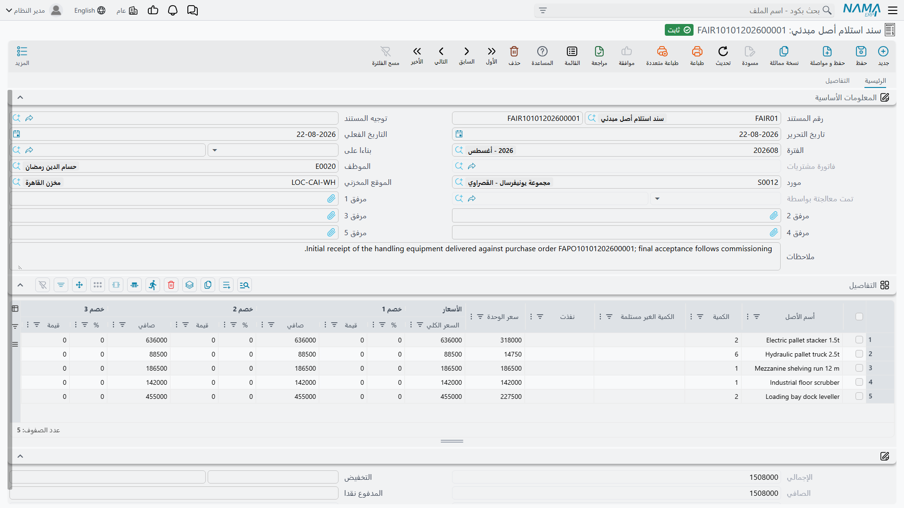

# الاستلام: السند المبدئي ومستند الاستلام

في هذه الوحدة مستندان في اسميهما «استلام»، يقعان في مجلدَي قائمة مختلفين، ويحتاجان ترخيصين مختلفين،
ويؤديان عملين مختلفين تماماً. وتمييزهما لا يحتاج أكثر من فقرة لكل منهما.

**سند استلام أصل مبدئي** يقول: *وصلت المعدة ولم يُصدر المورد فاتورته بعد*. وهو إشعار استلام مسعَّر،
وهو أوراق.

**مستند استلام أصل** يقول: *هذا الأصل يقف الآن هنا، وهذا الشخص وقّع باستلامه*. وهو إشعار عهدة وموقع
يُحرَّر بعد الشراء، وهو أيضاً أوراق — لكنها أوراق تكتب على سجل الأصل.

ولا واحد منهما يُنشئ قيداً، ولا واحد منهما يُنشئ أصلاً أو يقوّمه. فالقيمة تأتي من
[سند الشراء](/ar/modules/fixedassets/acquisition/fixedassets-purchase-document.md).

## سند استلام أصل مبدئي

القائمة: **الأصول > المستندات > سند استلام أصل مبدئي**، الترخيص `fixedassets`.

اعتبره إشعار استلام البضاعة الخاص بالمعدات: الصناديق في الموقع، والمخزن عدّها، ولا شيء يمكن رسملته حتى
تصل فاتورة المورد بسعرها النهائي ومصروف التسليم ومعالجتها الضريبية. وبدلاً من ترك الوصول غير مسجَّل
ثلاثة أسابيع، تُدخِل استلاماً مبدئياً.

والشاشة هي
[شاشة أمر الشراء](/ar/modules/fixedassets/acquisition/fixedassets-purchase-offers-and-orders.md) في
كل شيء: الرأس نفسه بالمورد والموظف وموقع الأصل وحقل **بناءا على**؛ وجريد التفاصيل نفسه يسمّي الأصل
**نصاً حراً** بكمية وبلوك سعر بثمانية مستويات خصم وأربع ضرائب؛ والصفحة الثانية نفسها ببيانات الشحن
وقالب جدول الدفعات وجريد سندات الدفع والشروط القياسية.

وما يترتب على هذه البنية يستحق التصريح:

- السطور **تسمّي** الأصول ولا تشير إلى سجلاتها — فليس فيها عمود أصل ثابت؛
- وسجل الأصول لا يُمَس: لا شيء يُنشأ، ولا حالة تتغير، ولا موقع ولا عهدة تُكتب؛
- ولا شيء يبلغ دفتر الأستاذ، والضرائب المحسوبة للعلم؛
- وإن كان مبنياً على طلب شراء فترحيله يحرّك الكميات المنفَّذة في ذلك الطلب، شأنه شأن عرض السعر وأمر
  الشراء.

وقيمته الحقيقية تأتي لاحقاً. فحين تصل الفاتورة أخيراً حرّر
[سند الشراء](/ar/modules/fixedassets/acquisition/fixedassets-purchase-document.md) وحقل **بناءا على**
مشير إلى الاستلام المبدئي، فتنتقل السطور والأسعار جاهزة لتُطابَق مع سجلات الأصول.

::: tip أيهما أحرّر؟
إذا كانت الفاتورة في يدك فتجاوز الاستلام المبدئي وحرّر سند الشراء. فالاستلام المبدئي لا يستحق عناءه
إلا حين ينفصل الوصول عن الفوترة زمنياً — في الاستيراد، والتسليمات على دفعات، والمعدات المفرَج عنها
بموجب أمر شراء بينما تتنقل الأوراق.
:::

## مستند استلام أصل

القائمة: **الأصول > عهد الأصول > مستند أستلام أصل**.

::: info يحتاج ترخيص الاعتمادات المستندية
هذا المستند خلف ترخيص **`fixedassets-lc`**، لا الترخيص الأساسي ولا ترخيص العهد — رغم وقوعه في مجلد
قائمة *عهد الأصول*. والسبب في رأسه: فمستند الاستلام يحمل مرجع **الإعتماد المستندي**، فيصلح كذلك أن
يكون المستند الذي يوقَّع به على شحنة واردة بموجب
[اعتماد مستندي للأصول](/ar/modules/fixedassets/letters-of-credit/fixedassets-lc-overview.md).

فإذا لم يجد عميل يملك `fixedassets` وحده «مستند أستلام أصل» في القائمة فهذا هو السبب. وليس في الشاشة
ما يُصلَح — إنما هي مسألة ترخيص.
:::

والشاشة قصيرة، لأنها لا تجيب إلا عن سؤالين. يحمل الرأس دفتر المستند وكوده، وتاريخ التحرير، والتاريخ
الفعلي، والفترة، وحقل **بناءا على**، ومرجع **الإعتماد المستندي**، ومرفقاً وملاحظات. وليس فيه **حقل
توجيه** — فلا محاسبة في هذا المستند تُوصَّل.

وجريد **التفاصيل** أربعة أعمدة:

| العمود | الاسم الإنجليزي | ماذا يفعل |
|---|---|---|
| الأصل | Asset | الأصل المستلَم |
| مسئول العهدة | Custodian | الموظف الموقِّع باستلامه |
| موقع الأصل | Asset Location | أين يوضع |
| ملاحظات | Description | ملاحظة السطر |

وتحت الجريد محددات المستند.

وهناك تسهيلان يوفران الكتابة. فاختيار **بناءا على** في مستند استلام محرَّر على سند شراء يبني سطراً لكل
أصل مشترى، مملوءاً سلفاً بالأصل وموقعه ومسؤول عهدته الحالي. واختيار أصل مباشرة في سطر يجلب مسؤول عهدته
وموقعه الحاليين، فلا تغيّر إلا ما تغيّر فعلاً.

### ماذا يكتب الترحيل

ترحيل مستند الاستلام يفعل شيئين اثنين لكل سطر:

1. يصير موقع السطر هو **الموقع الحالي** للأصل؛
2. ويُضاف سطر إلى **سجل عهدة** الأصل — الموظف، والتاريخ الذي يسري منه المستند، ونسبة العهدة.

وهذا كل شيء. لا قيد، ولا حركة مخزنية، ولا تغيير حالة، ولا أثر على التكلفة أو الإهلاك. ولا شيء يمنع
الترحيل كذلك — فليست له تحققات خاصة. وإلغاء المستند يزيل سطر سجل العهدة مرة أخرى.

::: info سطر سجل العهدة لا حقل «مسئول العهدة»
مستند الاستلام يضيف إلى **جريد سجل العهدة** في الأصل؛ ولا يغيّر حقل **مسئول العهدة** في صفحته
الرئيسية. أما المستند الذي يضبط ذلك الحقل فهو
[سند استلام وتسليم العهد](/ar/modules/fixedassets/acquisition/fixedassets-delivery-receipt.md)،
المصمَّم حول تسليم الأشياء من موظف مسمّى إلى آخر. فبعد مستند الاستلام اقرأ جريد السجل — فهناك الجواب.
:::

## الإجراءات في هاتين الشاشتين

يستعير **سند استلام أصل مبدئي** صفحة الدفعات من أمر الشراء، ومعها الزر الوحيد في الشاشتين:
**إنشاء الدفعات**. اختر قالب جدول الدفعات ثم اضغط الزر وأجب عمّا يسأل عنه — كم دفعة، وكم بينها،
ومتى تستحق الأولى، وهل هناك فترة سماح، ودفعة مقدَّمة، ومبالغ مسمّاة للدفعة الأولى والثانية والأخيرة،
وكيف يُقرَّب الكسر — فيوزّع المبلغ المتبقي على جريد الجدول. وهو تسهيل في الكتابة لا أكثر: لا يُحرَّر
به سند دفع ولا يصل منه شيء إلى دفتر الأستاذ.

أما **مستند استلام أصل** فليس فيه أزرار خاصة به. وتسهيلاه — بناء السطور من حقل **بناءا على**، وجلب
مسؤول العهدة والموقع من الأصل الذي تختاره — يحدثان من تلقاء أنفسهما وأنت تملأ الحقول.

## الواحة توقّع باستلام ماكينة القص

تصل ماكينة القص إلى مصنع الرياض في 8 يناير 2026، بعد أسبوع من ترحيل سند الشراء `FAPD-0031` وصيرورة
`MCH-0007` أصلاً حياً بقيمة 240,000.

يحرّر المخزن مستند الاستلام `FARD-0018` وحقل **بناءا على** = `FAPD-0031`. فيظهر سطر واحد تلقائياً:
`MCH-0007`. ويضبط أمين المخزن مسؤول العهدة على **خالد المطيري** والموقع على
`LOC-R2 — مصنع الرياض – صالة 2`، ويرحّل.

فيُظهر `MCH-0007` الآن الصالة 2 موقعاً له، ويحمل سجل عهدته سطراً لخالد من 8 يناير 2026. أما تكلفة
الماكينة وقسطها وحالتها فقد استقرت كلها بسند الشراء قبل أسبوع ولم تتأثر البتة.

وحين تُنقل الماكينة لاحقاً إلى الصالة 3 فذلك
[سند نقل](/ar/modules/fixedassets/movement/fixedassets-transfer-document.md)، لا مستند استلام آخر.
