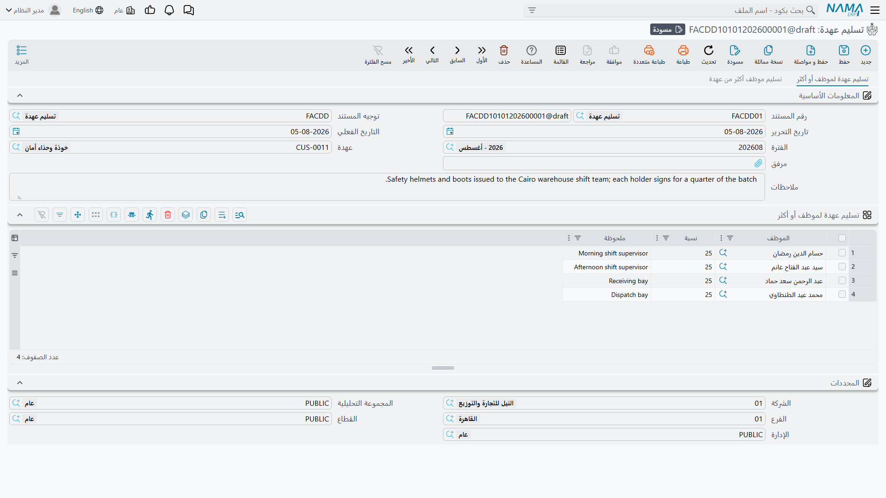
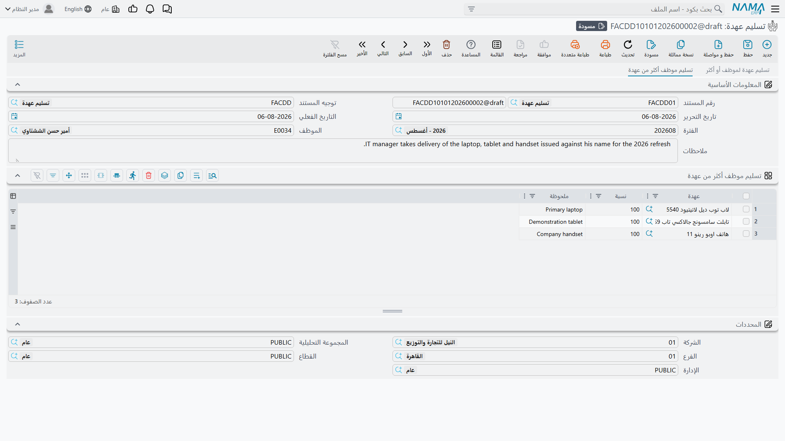
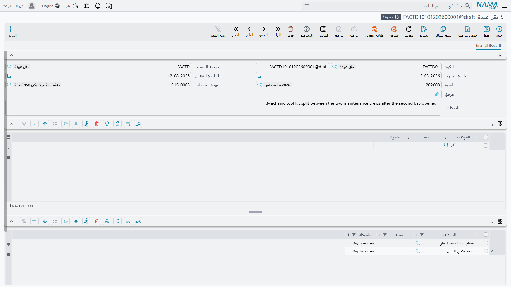

# تسليم العهد ونقلها

العهدة التي لا يحوزها أحد ليست إلا مخزوناً. وغاية السجل هي اللحظة التي تخرج فيها من المخزن فتصير
مسؤولية شخص بعينه — والمستندان في هذه الصفحة هما الطريقتان اللتان يحدث بهما ذلك: **تسليم عهدة** يضع
الصنف في يد موظف لأول مرة، و**نقل عهدة** ينقله ممن يحوزه الآن إلى غيره.

وكلاهما تحت **الأصول > عهد**، وكلاهما يحتاج دفتراً و
[توجيهاً](/ar/modules/fixedassets/document-terms/fixedassets-terms-custody-and-lc.md)، وكلاهما يحتاج
الرخصة `fixedassets-custody`.

::: info الحائز دائماً موظف
في كل موضع من عائلة العهد — رأس مستند التسليم، وكل سطر في الجداول، وجانبا *من* و*إلي* في النقل، وتاريخ
الحيازة على السجل — يُختار الشخص من **ملف موظفي شؤون العاملين**. لا مورد ولا طرف آخر ولا اسم نصي حر.
فمن يحوز ممتلكات الشركة يحتاج سجل موظف، وهذا هو ما يجعل حصر ما بحوزة موظف ممكناً، ويجعل الجرد بحسب
مسؤول العهدة ممكناً.
:::

## التسليم: أول تسليم للصنف

اشترت شركة الواحة للصناعات الحاسب `CDY-0033`؛ وهو الآن في حالة *تم شراؤة* وسعره 6,000. ومستند التسليم
هو ما يضعه في يد خالد المطيري.

وللشاشة **صفحتان تستعمل إحداهما لا كلتيهما** — فهما المستند نفسه منظوراً إليه من اتجاهين، وملء أحد
الجانبين يعطّل الآخر.

### الصفحة الأولى — صنف واحد لموظف أو أكثر

يحمل الرأس كود المستند ودفتره، والتوجيه، وتاريخ التحرير، والتاريخ الفعلي، والفترة، ومرفقاً وملاحظات —
إضافة إلى حقل **عهدة** الذي يسمّي الصنف الواحد الذي يُسلَّم. والجدول تحته يسمّي الأشخاص:

| العمود | English | ملاحظات |
|---|---|---|
| الموظف | Employee | من يستلمه |
| نسبة | Percentage | نصيبه من الصنف |
| ملحوظة | Remark | ملاحظة حرة تُنقل إلى سطر الحيازة |

وللحاسب سطر واحد:

| الموظف | نسبة | ملحوظة |
|---|---|---|
| خالد المطيري | 100 | جهاز العمل الرئيسي |

**ويجب أن يكون مجموع النسب 100 بالضبط.** وليس هذا شكلية — بل هي القاعدة التي تجعل السجل ذا معنى، لأن
قيمة الصنف تُقسَّم بين الحائزين بتلك النسب. فصندوق عدة الورشة `CDY-0050` لدى الواحة، وقيمته 3,000،
يُسلَّم لفنيَّين بنسبة 50 % لكل منهما؛ فكلاهما مسؤول عنه، وتضع المحاسبة 1,500 على كل اسم.

ولا تعرض قائمة اختيار **عهدة** إلا الأصناف في حالة *تم شراؤة* — فالصنف الذي لم يُشترَ بعد لا قيمة له
لتُسلَّم. ويُستثنى الصنف المعلَّم **عينية بدون سعر**: يُعرض مهما كانت حالته، فتخرج معدات السلامة أو
بطاقة الدخول مباشرة دون أن يوجد لها مستند شراء أصلاً.

### الصفحة الثانية — موظف واحد وعدة أصناف

الصفحة الثانية هي «حقيبة الالتحاق». يسمّي الرأس فيها **الموظف** بدل العهدة، ويسرد الجدول الأصناف:

| العمود | English | ملاحظات |
|---|---|---|
| عهدة | Custody | الصنف |
| نسبة | Percentage | نصيب هذا الشخص منه — وهو 100 في العادة لأنه يأخذ الصنف كاملاً |
| ملحوظة | Remark | ملاحظة حرة |

فحين تلتحق نوف الحربي بالعمل في سبتمبر 2027، يسلّمها مستند واحد الهاتف `CDY-0034` (بمبلغ 1,800) وطقم
السلامة `CDY-0035` (عيني بدون سعر)، كلٌّ بنسبة 100 %. ولا يجوز تكرار الصنف نفسه في المستند — سطر واحد
لكل صنف.

ويحدد الصفحةَ التي تعمل عليها أولُ حقل تملؤه: سمِّ عهدة فينطفئ حقل الموظف وجدوله؛ وسمِّ موظفاً فينطفئ
حقل العهدة وجدوله. ولا سبيل للخلط بين الاثنين في مستند واحد، ولا داعي لذلك — حرّر مستندين.

### ماذا يفعل اعتماد التسليم

ثلاثة أشياء، أياً كانت الصفحة التي استعملتها:

1. **تنتقل حالة الصنف إلى *تم تسليمه***، وتبقى كذلك مهما تعاقبت عليه عمليات النقل.
2. **يُفتح سطر حيازة على سجل العهدة** لكل موظف — اسمه ونسبته، والتاريخ الفعلي كـ *من تاريخ*، و*إلى
   تاريخ* فارغ، وهذا المستند كمنشئ للسطر. وإن كان سطر سابق ما زال مفتوحاً أُغلق بالتاريخ نفسه.
3. **يُنشأ القيد المحاسبي** كطلب أعمال يُعالَج في الخلفية.

وذلك القيد هو الجزء المثير، ويستحسن أن نكون دقيقين فيما لا يفعله: إنه لا يحمّل الصنف على المصروف، بل
**ينقل القيمة إلى الشخص**. فكل سطر ينتج مديناً واحداً ودائناً واحداً بمقدار نصيب ذلك السطر من سعر
الصنف:

> قيمة السطر = سعر العهدة × النسبة ÷ 100

فحاسب خالد: 6,000 × 100 ÷ 100 = 6,000:

| | مدين | دائن |
|---|---|---|
| عهد لدى الموظفين — خالد المطيري | 6,000 | |
| عهد بالمخزن | | 6,000 |

ويُضبَط الجانب المدين عادةً بمصدر حساب من نوع *موظف*، فتتجمّع عهد كل شخص على حسابه الفرعي، ويصير سؤال
«ماذا يحمل خالد؟» رصيداً تقرؤه. وفي صندوق العدة بنسبة 50/50 ينتج التوجيه نفسه سطرين بمبلغ 1,500 لكل
منهما على حسابَي موظفَين مختلفين. أما الصنف العيني بدون سعر فلا سعر له، فيخرج قيده بلا قيمة — ويبقى
المستند مسجِّلاً للتسليم، غير أنه لا مال لديه لينقله.

### التراجع عن التسليم

ألغِ اعتماده — وما دام شيء لم يمسّ الصنف بعده — فتعود الحالة إلى *تم شراؤة*، وتُمسح سطور الحيازة التي
أنشأها، ويُلغى القيد المحاسبي. فإن كان قد وقع نقل في أثناء ذلك فلا يمكن حذف مستند التسليم أصلاً:
تخبرك الرسالة بوجود حركة لاحقة على الصنف. ألغِ ذلك النقل أولاً ثم عد إلى التسليم.

## النقل: تحويله إلى شخص آخر

ينتقل خالد المطيري إلى موقع آخر في سبتمبر 2027، فينتقل الحاسب إلى نوف الحربي. هذا هو النقل: **عهدة
واحدة لكل مستند**، من حائزيها الحاليين إلى حائزيها الجدد.

الرأس هو المجموعة المألوفة — الدفتر والكود، والتوجيه، وتاريخ التحرير، والتاريخ الفعلي، والفترة، ومرفق
وملاحظات — إضافة إلى الحقل الذي يسمّي الصنف المنقول. ولا تعرض قائمة اختياره إلا الأصناف في حالة *تم
تسليمه*، وهو الصواب تماماً: لا تستطيع أن تنقل شيئاً لا يحوزه أحد.

ثم جدولان، في كل منهما الموظف والنسبة والملحوظة:

- **من** يملأ نفسه. فبمجرد أن تختار الصنف تُنسخ فيه سطور حيازته الحالية — وللحاسب: خالد المطيري بنسبة
  100 %. ولستَ مقصوداً بتحرير هذا الجانب؛ إنما هو النظام يعرض عليك ما هو على وشك أن يسحبه.
- **إلي** أنت من تملؤه، ويجب أن يكون مجموع نسبه 100 بالضبط مرة أخرى.

| من | | | إلي | |
|---|---|---|---|---|
| خالد المطيري | 100 % | ← | نوف الحربي | 100 % |

والنقل أيضاً هو وسيلتك لإعادة تقسيم الصنف. فصندوق العدة المحوز مناصفةً بين فنيَّين يمكن نقله إلى ثلاثة
بنسب 40/30/30، ويكفي أن يبلغ مجموع نسب جانب *إلي* مئة.

### ماذا يفعل اعتماد النقل

الحالة **لا** تتغير — فالصنف كان خارجاً مع شخص وما زال، فيبقى *تم تسليمه*. الذي يتغير هو الشخص: تُمسح
سطور حيازة الصنف وتُبنى من جديد من جدول *إلي* بتاريخ المستند الفعلي.

وللقيد المحاسبي شقّان، ولهذا السبب بالذات يحمل التوجيه زوجين من الحسابات — زوج للحائزين الخارجين وزوج
للداخلين. فكل سطر في *من* يعكس نصيب ذلك الحائز عنه، وكل سطر في *إلي* يحمّل نصيب الحائز الجديد عليه:

| | مدين | دائن |
|---|---|---|
| عهد لدى الموظفين — نوف الحربي | 6,000 | |
| عهد لدى الموظفين — خالد المطيري | | 6,000 |

فيتنظّف رصيد خالد، وتصير نوف حاملة للحاسب. ولو ذهب الحاسب إلى شخصين بنسبة 50 % لكل منهما لأنتج شقّ
*إلي* سطرين بمبلغ 3,000 بدل سطر واحد بمبلغ 6,000، وبقي شقّ *من* سطراً واحداً بمبلغ 6,000 عن خالد.

### التراجع عن النقل

إلغاء اعتماد النقل يفعل شيئاً أذكى قليلاً من التسليم: يبحث عن المستند الذي كان يحكم الصنف قبله — النقل
السابق، وإلا فمستند التسليم — ويعيد بناء سطور الحيازة من *ذلك* المستند. فيعود الحاسب إلى خالد بنسبة
100 %، ويُلغى القيد المحاسبي. وإن لم يكن قبله شيء أصلاً تُرك الصنف بلا سطور حيازة.

وكالعادة، يجب التراجع عن الأحدث أولاً. فإن كان الصنف قد نُقل مرة أخرى بعد ذلك أو تُخلِّص منه، فعالِج
ذلك المستند قبل أن تعود إلى هذا.

## الإجراءات في هاتين الشاشتين

لا مستند التسليم ولا مستند النقل فيه زر خاص به. كلاهما يُملأ ويُحفَظ، وكل ما يفعلانه — كتابة سطور
الحيازة، وتثبيت مسؤول العهدة، وتحرير القيد المحاسبي — يحدث عند الاعتماد ويُنقض بإلغائه. وأبرز سلوك
يستحق المعرفة في شاشة التسليم ليس زراً كذلك: فالصفحتان تُقفل كل منهما الأخرى. إن ملأت حقل **العهدة**
في الصفحة الأولى تعطّل الموظف والسطور في الصفحة الثانية، وإن ملأت **الموظف** في الصفحة الثانية تعطّلت
العهدة والتفاصيل في الأولى. وبإفراغ الحقل الذي ملأته أولاً يعود الجانب الآخر.
