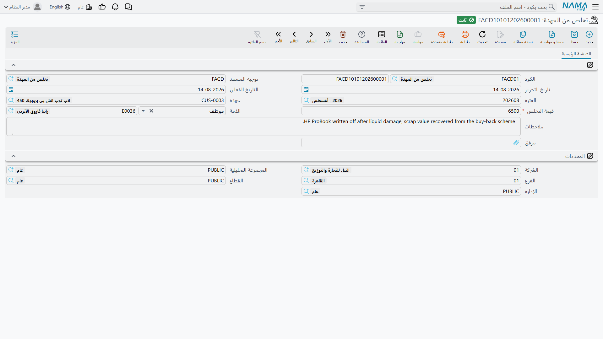

# التخلص من العهدة

يأتي وقت لا يعود فيه الاحتفاظ بالحاسب مجدياً. فيُعدَم، أو يُباع بما يُدفع فيه، أو يدفع قيمته الموظف
الذي فقده، أو يُشطب ببساطة. وأياً كان ما حدث، فمستند واحد يُنهي حياة الصنف ويسحب قيمته ممّن كان
يحوزها.

**الأصول > عهد > تخلص من العهدة** (`Assets > Custodys > Custody Disposal`)، الرخصة
`fixedassets-custody`، ويحتاج دفتراً و
[توجيهاً](/ar/modules/fixedassets/document-terms/fixedassets-terms-custody-and-lc.md) كسائر مستندات
هذا القسم.

## الشاشة قصيرة عن قصد

صفحة واحدة، وصنف واحد، ورقم واحد هو المهم:

| الحقل | English | ملاحظات |
|---|---|---|
| الكود (الدفتر / الكود) | Code | |
| توجيه المستند | Term | مصدر الحسابات |
| تاريخ التحرير / التاريخ الفعلي | Issue / Value Date | |
| الفترة | Fiscal Period | |
| عهدة | Custody | الصنف المتخلَّص منه. وتعرض قائمة الاختيار الأصناف في حالة *مبدأي* أو *تم شراؤة* أو *تم تسليمه* — أي كل ما لم يُتخلَّص منه بعد |
| قيمة التخلص | Dispose value | **مطلوب.** ما يساويه التخلص: حصيلة البيع، أو المبلغ المحصَّل من الموظف، أو 0 في حالة الشطب الكامل |
| الذمة | Subsidiary | الطرف المقابل الذي تُحمَّل عليه قيمة التخلص — المشتري، أو الموظف الذي يدفع قيمته، أو حساب النقدية، أو حساب الشطب |
| ملاحظات | Description | سبب التخلص — وهو الموضع المفيد لتسجيل «تلف الشاشة بما لا يمكن إصلاحه» أو «لم يُعد عند ترك العمل» |
| مرفق | Attachment | |

ولاحظ ما ليس على هذه الشاشة: لا قائمة أسباب، ولا حقل أرباح أو خسائر، ولا اختيار لطريقة. فنوع التخلص
يخرج من شيئين فقط — **التوجيه الذي تختاره** الذي يحدد الحسابات المتأثرة، و**قيمة التخلص التي تكتبها**.
فالإعدام والبيع والشطب هي المستند نفسه بأرقام مختلفة، وبتوجيهات مختلفة إن أردت فصل المعالجة المحاسبية.

## حاسب الواحة بعد ثلاث سنوات

اشتُري `CDY-0033` بمبلغ 6,000، وسُلِّم إلى خالد المطيري، ثم نُقل إلى نوف الحربي التي تحوز 100 % منه.
وفي ديسمبر 2028 تترك نوف العمل وتشتري الحاسب من الشركة بمبلغ 1,200.

مستند التخلص `CDS-2028-004`، تاريخه الفعلي 20 ديسمبر 2028، العهدة `CDY-0033`، قيمة التخلص 1,200،
والذمة هي الموظفة المغادرة.

واعتماده يفعل أمرين. **تصير حالة الصنف *تم التخلص منه***، فيخرج من كل قوائم الاختيار — فلا يمكن تسليمه
أو نقله بعدها أبداً. و**يُنشأ القيد المحاسبي** كطلب أعمال يُعالَج في الخلفية، في شقّين متمايزين:

**شقّ الحائزين.** لكل حائز حالي للصنف يُسحب نصيبه من سعر الصنف عنه. ونوف تحوز 100 % من صنف سعره 6,000،
فيكون:

| | مدين | دائن |
|---|---|---|
| التخلص من العهد (من التوجيه) | 6,000 | |
| عهد لدى الموظفين — نوف الحربي | | 6,000 |

ولو كان الصنف صندوق عدة الورشة المحوز مناصفةً لأنتج هذا الشقّ سطرين بمبلغ 1,500، سطراً على كل فني.

**شقّ القيمة.** زوج آخر بقيمة التخلص، على الذمة التي سمّيتها:

| | مدين | دائن |
|---|---|---|
| الموظفة المغادرة (مدينون) | 1,200 | |
| التخلص من العهد (من التوجيه) | | 1,200 |

::: info الفرق أنت من يضعه في مكانه
هذا هو الأمر الذي يجب فهمه قبل ضبط التوجيه. المستند **لا** يحسب لك ربحاً ولا خسارة — فبخلاف
[التخلص من الأصل الثابت](/ar/modules/fixedassets/disposal/fixedassets-disposal.md) الذي يحمل توجيهه
حسابَي أرباح وخسائر منفصلين، لا يحمل توجيه التخلص من العهدة إلا زوجين من الحسابات لا غير. فالـ 6,000
التي تُسحب من الحائز والـ 1,200 التي تأتي من المشتري تُثبَّتان مستقلتين.

ولذلك يجب أن يستقر الفرق — 4,800 هنا — في مكان ما بحكم التركيب. والطريقة المعتادة أن توجّه الشقّين إلى
حساب وسيط واحد، كما في القيدين أعلاه: تدخل الـ 6,000 مدينة، وتخرج الـ 1,200 دائنة، فيبقى في ذلك
الحساب 4,800 هي المبلغ المشطوب. راجع ذلك الحساب دورياً ورحّله إلى حساب المصروف الذي تريد أن تظهر فيه
المشطوبات.
:::

والشطب الكامل هو المستند نفسه بقيمة تخلص **0**: يسحب شقّ الحائزين الـ 6,000 من على الموظف، ولا يثبّت
شقّ القيمة شيئاً، فتبقى القيمة المحمولة كلها على الحساب الوسيط كخسارة.

## الإجراءات في هذه الشاشة

ليس في شاشة التخلص من العهدة أزرار خاصة بها، وهو ما يليق بمستند بهذا القِصر. تسمّي الصنف والموظف
وقيمة التخلص، ثم تحفظ وتعتمد؛ فالقيد المحاسبي وإقفال سطر الحيازة وتغيّر حالة الصنف كلها تتبع
الاعتماد لا شيئاً تضغطه. وللتراجع ألغِ اعتماد المستند أو احذفه.

## إعادة الصنف ليست تخلصاً منه

إن أعاد أحدهم صنفاً وكان سيخرج مرة أخرى إلى شخص تالٍ فلا تتخلص منه — بل حرّر
[مستند نقل](/ar/modules/fixedassets/custody/fixedassets-custody-delivery-and-transfer.md) إلى الحائز
الجديد. فالنقل يسحب القيمة من الحائز القديم بالطريقة نفسها تماماً، ويحتفظ الصنف بتاريخه وبحالة *تم
تسليمه* فيمكن تسليمه ثانية. أما التخلص فهو للأصناف التي تغادر الشركة نهائياً: بيعاً أو إعداماً أو
فقداً أو شطباً. وحين يصير الصنف في حالة *تم التخلص منه* فلا شيء يعيده إلى التداول إلا إلغاء اعتماد
مستند التخلص.

وهناك أيضاً [سند استلام وتسليم](/ar/modules/fixedassets/acquisition/fixedassets-delivery-receipt.md)
الذي يسجّل التسليم بين الموظفين ويقبل الأصول الثابتة في سطوره نفسها؛ وهو الخيار الطبيعي حين تكون
الحركة المسجَّلة تسليماً مادياً أكثر منها تغييراً في المسؤولية المحاسبية.

## التراجع عن التخلص

إن حُرِّر مستند تخلص خطأً، فإلغاء اعتماده يُلغي القيد المحاسبي ويعيد استنتاج حالة الصنف من تاريخه هو:
فإن كان قد سُلِّم أو نُقل يوماً عاد إلى *تم تسليمه*، وإلا عاد إلى *تم شراؤة* إن كان قد اشتُري، وإلا
عاد إلى *مبدأي*. ولا يلزمك أن تتذكّر أين كان الصنف في حياته — المستند يعيد بناء ذلك بنفسه.

وتعديل مستند تخلص معتمد ليشير إلى صنف آخر يسلك المسلك نفسه: يستعيد الصنف القديم حالته السابقة، ويُعلَّم
الصنف الجديد كمتخلَّص منه.

## أين تظهر البقايا

يستحق موضعان النظر بعد جولة تخلص. شاشة قوائم العهد مرشَّحة على حالة *تم التخلص منه* هي جواب السجل نفسه
عن سؤال «ماذا شطبنا هذا العام». و[مستند الجرد](/ar/modules/fixedassets/movement/fixedassets-stocktaking.md)
يتجاهل الأصناف المتخلَّص منها كلياً حين يبني قائمته المتوقَّعة — وهذا بالضبط سبب وجوب تحرير مستند
التخلص فوراً لكل ما زال فعلاً، بدل تركه ليظهر كعجز في كل جرد.
