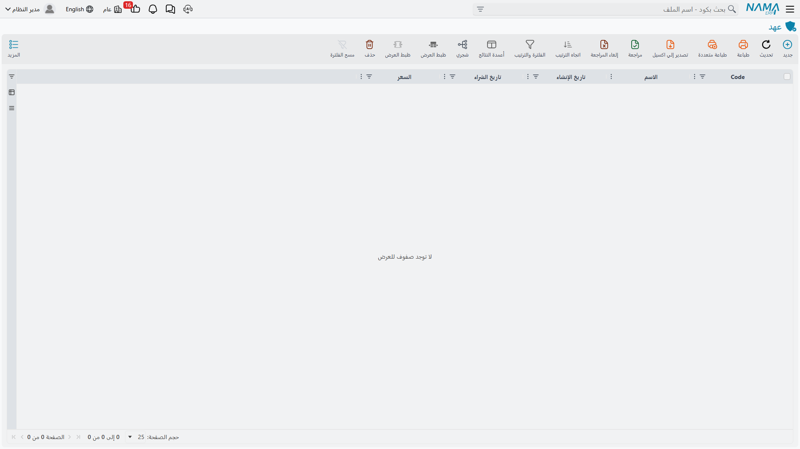
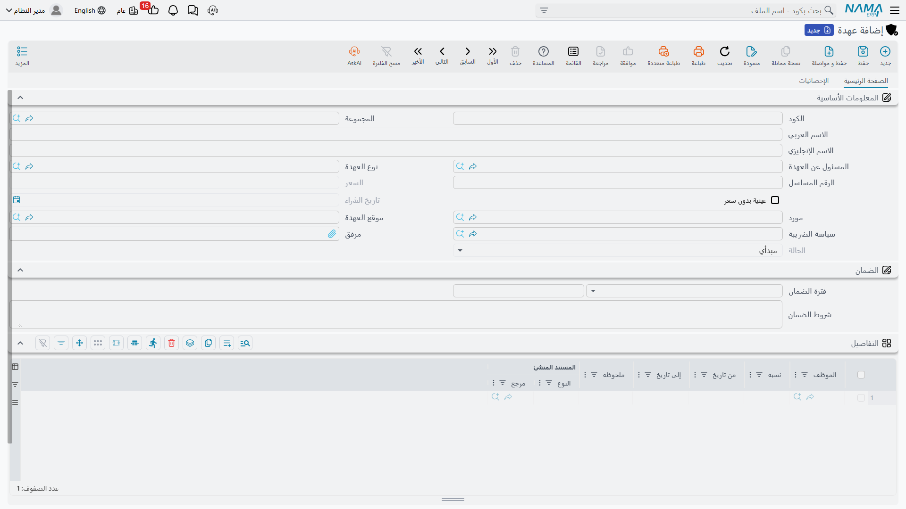

# العهد — الأشياء التي تسلّمها لموظفيك

في أسبوع واحد اشترت شركة الواحة للصناعات شيئين. الأول ماكينة قص CNC بمبلغ 240,000 ستبقى في صالة
الإنتاج خمس سنوات. والثاني حاسب محمول بمبلغ 6,000 يعود كل مساء في حقيبة مهندس الإنتاج الذي يستخدمه.

كلاهما ملك للشركة، وكلاهما سُلّم إلى شخص، وكلاهما يجب أن يُحاسَب عليه. ومع ذلك واحد منهما فقط يخصّه
سجل الأصول الثابتة.

## العهدة سجل مستقل بذاته

هذه هي النقطة التي يجب حسمها قبل كل شيء آخر في هذا القسم: **العهدة ليست نوعاً من الأصول الثابتة**.
ليست علامة على سجل الأصل، ولا نوعاً فرعياً منه، ولا شاشة مُرشَّحة من قائمة الأصول. هي ملف رئيسي
منفصل، له شاشاته، ومستنداته الخاصة للشراء والتسليم والنقل والتخلص، وسلّم حالات خاص به، ورخصة خاصة به.

والسجلان لا يلتقيان في الأرقام إطلاقاً:

| | أصل ثابت (Fixed Asset) | عهدة (Custody) |
|---|---|---|
| ماذا يحفظ | أصلاً مرسملاً له تكلفة ومجمع إهلاك وقيمة دفترية | صنفاً واحداً مادياً سلّمته الشركة وتنتظر عودته |
| الإهلاك | نعم — طريقة إهلاك وعمر إنتاجي وقسط شهري | **لا يوجد إطلاقاً.** لا طريقة إهلاك ولا عمر إنتاجي ولا مجمع إهلاك في أي موضع من العهدة |
| الحسابات على الملف الرئيسي | كل أصل يحمل مجموعة حساباته | لا شيء — كل قيد عهدة يأخذ حساباته من [توجيه](/ar/modules/fixedassets/document-terms/fixedassets-terms-custody-and-lc.md) المستند الذي حرّكها |
| الحالات | إبتدائى، جارى الإهلاك، مهلك، غير قابل للإهلاك، تم التخلص منه | مبدأي، تم شراؤة، تم تسليمه، تم التخلص منه |
| الكمية | الأصل القابل للعدّ يحمل عشرة مكاتب متطابقة في سجل واحد | سجل واحد = صنف واحد. خمسة كراسي متطابقة هي خمس عهد |
| من يحوزها | مسؤول عن الأصل وموقع | موظف أو أكثر، لكل منهم **نسبة** من الصنف |
| المستندات | شراء، افتتاحي، إهلاك، إعادة تقييم، نقل، تخلص… | شراء، تسليم، نقل، تخلص — أربعة، وهذه هي العائلة كلها |

لا تظهر العهدة في أي دورة إهلاك. وليس الأمر أن النظام يتخطّاها أو أن عليك إطفاء خيار ما — ببساطة لا
يوجد في سجل العهدة موضع لعمر إنتاجي أو طريقة إهلاك، ومستند الإهلاك لا يجمع إلا الأصول الثابتة. فإن
كان الصنف يحتاج إهلاكاً فهو يحتاج أن يكون أصلاً ثابتاً.

## إذاً: أصل أم عهدة؟

اسأل عن الشيء الذي اشتريته سؤالين.

**هل تحتاج تكلفته أن تتوزع على سنوات استخدامه؟** إن كان الجواب نعم فهو أصل ثابت — فهذا هو سبب وجود
سجل الأصول أصلاً، وينطبق عليه كل ما في صفحة
[الإهلاك من حيث المبدأ](/ar/modules/fixedassets/depreciation/fixedassets-depreciation-concepts.md).
وماكينة الـ CNC بمبلغ 240,000 هي هذه الحالة: تُهلَك على 60 فترة وتُعرض قيمتها الدفترية كل فترة.

**هل هو صنف منخفض القيمة يُسلَّم لشخص بعينه وتنتظر الشركة عودته؟** إن كان الجواب نعم فهو عهدة. والحاسب
المحمول بمبلغ 6,000 هو هذه الحالة. لا أحد يريد جدول إهلاك خمسي لحاسب محمول؛ ما تريد الشركة معرفته
فعلاً هو **من يحمله**، و**كم كانت قيمته**، و**هل سيعود عند انتقال ذلك الموظف**. وهذا بالضبط ما يجيب
عنه سجل العهد، ويجيب عنه بأن يُبقي قيمة الصنف محمَّلة على الموظف الحائز حتى يُعاد أو يُنقل لغيره أو
يُتخلَّص منه.

والحدّ بين الاثنين ليس مبلغاً محدداً — أنت من يرسمه حين تقرر ماذا تسجّل وأين. وعملياً يقع عند النقطة
التي يكفّ فيها الصنف عن استحقاق جدول إهلاك: الحواسب المحمولة والهواتف والأجهزة اللوحية وشرائح
الاتصال والعُدد اليدوية وصناديق العدة والزي الرسمي ومعدات السلامة وسيارات الخدمة والبطاقات والمفاتيح
هي جمهور العهد التقليدي. أما الآلات والمركبات التي ترسملها والمنشآت وأطقم الأثاث والمباني فهي أصول.

::: tip صنف واحد، سجل واحد، حائز واضح
لأن سجل العهدة يمثّل صنفاً مادياً واحداً، فإن الرقم المسلسل المكتوب عليه يعني شيئاً حقيقياً — هو *هذا*
الحاسب لا «حاسب ما». وهذا ما يتيح لمستند الجرد أن يقول «الصنف صاحب هذا المسلسل يفترض أن يكون مع هذا
الشخص»، وما يجعل قائمة ما بحوزة موظف قائمة ذات معنى.
:::

## رخصة واحدة وست شاشات

كل ما في هذا القسم يحتاج الرخصة `fixedassets-custody`. وبدونها تختفي مجموعة قائمة **عهد** بكاملها —
السجل والمستندات الأربعة معه — وتستمر بقية وحدة الأصول الثابتة كما هي.

مجموعة القائمة تحت **الأصول > عهد** (`Assets > Custodys`) وتضم ستة عناصر بهذا الترتيب:

| الشاشة | English | ما هي |
|---|---|---|
| نوع العهدة | Custody Type | التصنيف الذي تجهّزه أولاً — انظر [أنواع العهد](/ar/modules/fixedassets/custody/fixedassets-custody-types.md) |
| عهدة | Custody | السجل نفسه — انظر [سجل العهدة](/ar/modules/fixedassets/custody/fixedassets-custody-register.md) |
| شراء عهدة | Custody purchase document | الفاتورة التي تشتريها وتثبّت قيمتها — انظر [شراء العهد](/ar/modules/fixedassets/custody/fixedassets-custody-purchase.md) |
| تسليم عهدة | Custody Delivery Document | التسليم إلى موظف أو أكثر |
| نقل عهدة | Custody transfer document | نقلها من الحائزين الحاليين إلى غيرهم |
| تخلص من العهدة | Custody Disposal | نهاية حياتها — انظر [التخلص من العهدة](/ar/modules/fixedassets/custody/fixedassets-custody-disposal.md) |

ويشترك التسليم والنقل في صفحة واحدة:
[تسليم العهد ونقلها](/ar/modules/fixedassets/custody/fixedassets-custody-delivery-and-transfer.md).

وهناك شاشتان خارج هذه المجموعة تقبلان العهد أيضاً. مستند **سند استلام وتسليم** يسلّم الأشياء بين
الموظفين ويقبل في سطوره أصولاً ثابتة وعهداً معاً — انظر
[سند الاستلام والتسليم](/ar/modules/fixedassets/acquisition/fixedassets-delivery-receipt.md). ومستند
**جرد الأصول** يعدّ العهد إلى جانب الأصول ويعرض العجز والزيادة للاثنين — انظر
[جرد الأصول والعهد](/ar/modules/fixedassets/movement/fixedassets-stocktaking.md).

## حياة حاسب محمول واحد

هذه هي السلسلة كاملة، على الصنف الذي يستعمله هذا القسم في كل صفحاته: **`CDY-0033` — حاسب محمول**
بقيمة 6,000، مُسلَّم إلى **خالد المطيري**، مهندس إنتاج في مصنع الرياض.

1. **يُجهَّز النوع أولاً.** يوجد نوع عهدة `CDY-LAP — أجهزة محمولة`، ووظيفته الأساسية أن يحدد هل أصناف
   هذه الفئة تحمل قيمة مالية أصلاً.
2. **يُنشأ السجل.** يُكتب سجل العهدة `CDY-0033` يدوياً: الاسم، ونوع العهدة، والرقم المسلسل
   `5CG3210XYZ`، والموقع `LOC-R2 — مصنع الرياض – صالة 2`. ويُحفظ بحالة **مبدأي** بلا سعر — لم يخبره
   شيء بعدُ كم يساوي.
3. **يُعتمد مستند الشراء.** بتاريخ 1 فبراير 2026، من مورد الرياض لتوريدات الحاسب، بسطر واحد يشير إلى
   `CDY-0033` بمبلغ 6,000. اعتماده يثبّت 6,000 كسعر الصنف و1 فبراير 2026 كتاريخ شرائه، وينقله إلى
   حالة **تم شراؤة**. والقيد المحاسبي قيد فاتورة مشتريات عادي: تستقر القيمة في حساب العهد ويُجعل
   المورد دائناً.
4. **مستند التسليم يسلّمه.** بتاريخ 5 فبراير 2026، العهدة `CDY-0033`، وسطر واحد: خالد المطيري بنسبة
   100 %. ينتقل الصنف إلى حالة **تم تسليمه**، ويُفتح سطر حيازة على سجل العهدة بتاريخ 5 فبراير، وينقل
   القيد المحاسبي الـ 6,000 من حساب العهد إلى حساب خالد الفرعي. صار الحاسب — دفترياً — *مع* ذلك الشخص.
5. **مستند النقل ينقله.** في سبتمبر 2027 ينتقل خالد إلى موقع آخر وينتقل الحاسب إلى نوف الحربي. يعرض
   مستند النقل خالداً بنسبة 100 % في جدول *من*، ونوف بنسبة 100 % في جدول *إلي*؛ ويأخذ القيد 6,000 من
   أحدهما ويضعها على الآخر. وتبقى الحالة **تم تسليمه** — فالصنف ما زال خارجاً مع شخص، لكنه شخص آخر.
6. **مستند التخلص يُنهيه.** في ديسمبر 2028 يُباع الحاسب للموظف المغادر بمبلغ 1,200. يأخذ مستند التخلص
   الـ 6,000 من على الحائز ويثبّت الـ 1,200 على المشتري، وينتقل الصنف إلى حالة **تم التخلص منه**، ولا
   يمكن تسليمه أو نقله بعدها.

## سلّم الحالات

هذه الحالات الأربع ليست زينة — فقوائم اختيار العهدة في كل مستند تقرأها، أي أن الحالة هي التي تحدد أي
مستند سيعرض عليك الصنف أصلاً.

| الحالة | English | من يضعها | ما الذي يمكن أن يحدث بعدها |
|---|---|---|---|
| مبدأي | Initial | حفظ سجل عهدة جديد | مستند الشراء يستطيع شراءها، ومستند التخلص يعرضها |
| تم شراؤة | Purchased | اعتماد مستند شراء عهدة | مستند التسليم يعرضها |
| تم تسليمه | Delivered | اعتماد مستند تسليم | مستند النقل يعرضها، وكل نقل تالٍ يبقيها هنا |
| تم التخلص منه | Disposed | اعتماد مستند تخلص | لا شيء — انتهت حياة الصنف |

وثمة اختصار يستحق المعرفة. الصنف المعلَّم **عينية بدون سعر** (Priceless) — أي ما لا قيمة مالية له،
كبطاقة أو زي رسمي — تعرضه قائمة اختيار مستند التسليم مهما كانت حالته، فيمكن تسليمه مباشرة دون أن
يُحرَّر له مستند شراء أصلاً. وهذه العلامة تُضبط على
[نوع العهدة](/ar/modules/fixedassets/custody/fixedassets-custody-types.md) وتُنسخ إلى كل سجل جديد.

## التراجع يكون بالترتيب العكسي

تتذكّر كل عهدة آخر مستند لمسها. وهذه العلامة الواحدة هي ما يحفظ انضباط السلسلة: فإن حاولت إلغاء اعتماد
تسليم `CDY-0033` بعد أن يكون النقل قد حرّكه إلى غيره، يرفض النظام العملية، لأن التسليم لم يعد آخر كلمة
على هذا الصنف، ويخبرك بوجود مستند لاحق.

فالقاعدة عند تصحيح سلسلة عهدة بسيطة: **ألغِ اعتماد الأحدث أولاً ثم تراجع للخلف**. ألغِ اعتماد النقل،
فتُعاد بناء سطور الحيازة من المستند الذي سبقه؛ ثم ألغِ اعتماد التسليم، فيعود الصنف إلى حالة *تم شراؤة*
وتُمسح سطور حيازته. وتمنعك العلامة نفسها من تبديل العهدة على مستند سبق اعتماده — ألغِ اعتماده أو حرّر
مستنداً جديداً.
