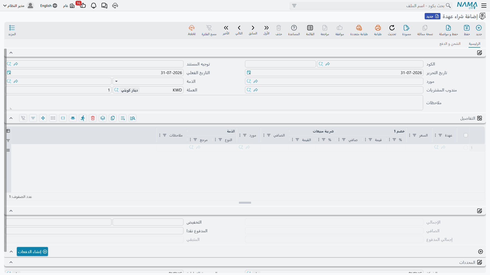

# شراء العهد

اشترت شركة الواحة للصناعات حاسباً محمولاً بمبلغ 6,000 من الرياض لتوريدات الحاسب. والمعالجة المحاسبية
البديهية — تحميل 6,000 على مصروفات المكتب وانتهى الأمر — هي بالضبط ما وُجد سجل العهد لـ*تفاديه*، وفهم
السبب يفسّر شكل هذا المستند.

## لماذا لا تصير الـ 6,000 مصروفاً ببساطة

لو حُمِّل الحاسب على المصروف يوم شرائه لنسيه الدفتر في اللحظة نفسها. وبعد ستة أشهر، حين يترك المهندس
الحائز له العمل، لا يوجد رقم في أي موضع يقول ما الذي تستحقه الشركة إن لم يعد الجهاز، ولا رصيد تقارن
به نتيجة جرد.

لذلك يفعل مستند شراء العهدة ما يفعله أي مستند شراء لأي أصل: يضع القيمة في موضع يمكن رؤيته. تستقر
الـ 6,000 في حساب معناه *عهد نملكها ولم نسلّمها بعد* — أي مخزون أصناف قابلة للتسليم. وتبقى هناك حتى
يسلّم [مستند التسليم](/ar/modules/fixedassets/custody/fixedassets-custody-delivery-and-transfer.md)
الحاسبَ إلى شخص بعينه، فتخرج الـ 6,000 نفسها من ذلك الحساب إلى الحساب الفرعي لذلك الشخص. ومنذ تلك
اللحظة يستطيع الدفتر أن يجيب عن سؤال «كم قيمة ما بحوزة موظفينا ومن يحوزه؟» بقراءة أرصدة الحسابات،
ويطابق جوابُه السجلَّ. ولا تتحرر القيمة — إعداماً أو بيعاً أو تحميلاً على خسارة — إلا عند
[التخلص من الصنف](/ar/modules/fixedassets/custody/fixedassets-custody-disposal.md).

هذا هو التصميم كله: **القيمة تتبع الصنف، والصنف يتبع شخصاً.**

## سجل العهدة أولاً

يشتري المستند صنفاً موجوداً في السجل سلفاً. فالترتيب إذاً: أنشئ سجل العهدة (فيُحفظ بحالة *مبدأي* بلا
سعر)، ثم حرّر مستند الشراء وأشِر بسطر إليه. ولا يوجد هنا خيار ينشئ لك السجل — وهذا أحد فروق عائلة
العهد عن [مستند شراء الأصل الثابت](/ar/modules/fixedassets/acquisition/fixedassets-purchase-document.md)
الذي يستطيع إنشاء الأصل الذي يرسمله.

**الأصول > عهد > شراء عهدة** (`Assets > Custodys > Custody purchase document`)، الرخصة
`fixedassets-custody`. وكشأن كل مستند في الوحدة يحتاج دفتراً و
[توجيهاً](/ar/modules/fixedassets/document-terms/fixedassets-terms-custody-and-lc.md).

## الشاشة فاتورة مشتريات كاملة

ليست نموذجاً داخلياً مبسّطاً. مستند شراء العهدة فاتورة حقيقية تحمل آلية الفواتير كاملة: المورد،
والعملة ومعدلها، وخصومات السطور، والضريبة، وخصم الرأس، والمدفوع نقداً والمتبقي، وسندات الدفع الخارجية،
وجدول أقساط مع إجراء *إنشاء الدفعات*. فإن كنت تعرف فاتورة مشتريات سلسلة الإمداد فأنت تعرف هذه الشاشة.

**الرأس** (صفحة *الرئيسية*) يطلب الدفتر والكود، والتوجيه، وتاريخ التحرير والتاريخ الفعلي، و**المورد**
و**الذمة** التي سيُحمَّل عليها القيد، ومندوب المشتريات، والعملة ومعدلها، والملاحظات.

**جدول التفاصيل** هو موضع أصناف العهد:

| العمود | English | ملاحظات |
|---|---|---|
| عهدة | Custody | السجل الذي يُشترى — `CDY-0033` |
| السعر | Price | ما يطلبه المورد مقابله |
| خصم 1 — % / قيمة / صافي | Discount 1 | خصم السطر |
| ضريبة مبيعات — % / القيمة | Item Tax / Tax value | ضريبة السطر، تقودها سياسة الضريبة على الصنف |
| الصافي | Net value | **العمود المهم** — ما يساويه السطر في النهاية |
| مورد، الذمة، ملاحظات | Supplier, Subsidiary, Description | تجاوزات على مستوى السطر لما في الرأس |

وتحت الجدول الإجماليات: الإجمالي، وخصم الرأس، والصافي، والمدفوع نقداً، وإجمالي المدفوع، والمتبقي.
أما الصفحة الثانية (*الشحن و الدفع*) فتحمل عنواني الشحن والدفع، وجدول سندات الدفع المحرَّرة على هذه
الفاتورة، ونموذج الدفع، وجدول الأقساط — كوده ووصفه ونسبته ومبلغه وتاريخ استحقاقه والمسدد منه والمتبقي.

## ماذا يفعل الاعتماد

مستند الواحة `CPD-2026-014`، تاريخه الفعلي 1 فبراير 2026، المورد الرياض لتوريدات الحاسب، وسطر واحد:
العهدة `CDY-0033` بمبلغ 6,000، بلا خصم وبلا ضريبة — الصافي 6,000.

واعتماده يفعل ثلاثة أشياء.

1. **يثبّت السعر.** يُكتب **صافي** السطر على سجل العهدة كسعر لها. ولاحظ أنه *الصافي* لا المبلغ الذي
   كتبته: فلو حمل السطر خصماً 5 % وضريبة 15 % لكان الرقم النازل على السجل هو ما في عمود الصافي لا
   الـ 6,000. وهذا هو الرقم الذي يعمل عليه كل قيد عهدة لاحق، فيستحق نظرة قبل الاعتماد.
2. **يثبّت تاريخ الشراء** من التاريخ الفعلي للمستند — 1 فبراير 2026 — وينقل الصنف من **مبدأي** إلى
   **تم شراؤة**. وهذا التغيّر في الحالة هو ما يجعل الصنف ظاهراً في قائمة اختيار مستند التسليم.
3. **ينشئ القيد المحاسبي** كطلب أعمال يُعالَج في الخلفية. والقيد قيد فاتورة مشتريات عادي: يأخذ الجانب
   المدين المحدَّد في التوجيه (وهو في إعداد الواحة حساب العهد بالمخزن) القيمة، ويُجعل المورد دائناً،
   وتعمل جوانب الضريبة والخصم والنقدية تماماً كما في أي فاتورة.

فيكون قيد `CPD-2026-014` ببساطة:

| | مدين | دائن |
|---|---|---|
| عهد بالمخزن | 6,000 | |
| الرياض لتوريدات الحاسب | | 6,000 |

وإن فشل الطلب — لفترة مقفلة أو حساب ناقص — يبقى المستند محفوظاً. اعثر عليه في شاشة قوائم طلبات الأعمال،
ورشّح الحالات الفاشلة، وحدّد السطور، ثم **قائمة المزيد ← إعادة المعالجة**.

::: tip مستند واحد لأصناف كثيرة
لا داعي لمستند لكل صنف. مستند شراء واحد يحمل كل الحواسب والهواتف وصناديق العدة في فاتورة مورد واحدة،
بسطر لكل سجل عهدة، ويثبّت كل سطر صافيه على سجله. فتشتري الواحة عشرة حواسب بفاتورة واحدة في عشرة سطور
تشير إلى عشرة سجلات عهدة.
:::

## سداد قيمتها

لأن هذا مستند فاتورة حقيقي، فجانب المال يعمل كما يعمل في كل مكان آخر: اكتب المدفوع نقداً على المستند،
أو اترك المبلغ كله متبقياً وسدّده لاحقاً بسندات دفع، أو ابنِ جدول أقساط واستخدم **إنشاء الدفعات**
لتحرير السندات منه. وتظهر السندات المحرَّرة على الفاتورة في جدول سندات الدفع في الصفحة الثانية، ويتحرك
رقم *المتبقي* مع تسجيلها.

## تصحيح مستند

إلغاء اعتماد مستند شراء العهدة يعكس قيده المحاسبي ويمسح السعر الذي ثبّته المستند على الصنف. وإن كان
المستند يحمل أصنافاً عدة فحذفت سطراً وأعدت الاعتماد، مُسح سعر ذلك الصنف وحده وبقيت أسعار البقية.

ولأن كل عهدة تتذكّر آخر مستند لمسها، تنطبق قاعدة الترتيب المعتادة: إن كان الصنف قد سُلِّم أو نُقل بعد
ذلك فألغِ اعتماد تلك المستندات أولاً ثم تراجع للخلف. انظر
[العهد — الأشياء التي تسلّمها لموظفيك](/ar/modules/fixedassets/custody/fixedassets-custody-overview.md)
لقاعدة الترتيب كاملة.
