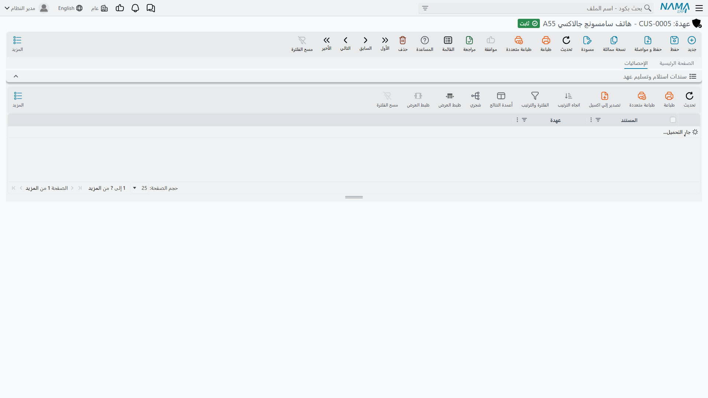

# سجل العهدة

سجل العهدة هو السجل نفسه — سجل واحد لصنف مادي واحد سلّمته شركة الواحة للصناعات أو توشك أن تسلّمه.
فـ `CDY-0033` هو *ذلك* الحاسب صاحب المسلسل `5CG3210XYZ`، لا «حاسب ما». وخمسة كراسي مكتبية متطابقة هي
خمسة سجلات، لأن خمسة أشخاص قد يحوزونها في خمسة أماكن، وغاية السجل أن تعرف أيّها أين.

**الأصول > عهد > عهدة** (`Assets > Custodys > Custody`)، الرخصة `fixedassets-custody`.

## أنت تنشئه والمستندات تملؤه

لا شيء يولّد سجل عهدة؛ أنت من يكتبه — كوداً واسماً ونوعاً ورقماً مسلسلاً وموقعاً — فيُحفظ بحالة
**مبدأي** بلا سعر. ومن تلك اللحظة يصير السجل في معظمه *تقريراً*: مستند الشراء يكتب سعره وتاريخ شرائه،
ومستندا التسليم والنقل يكتبان من يحوزه، وكل واحد منها يحرّك حالته. ويستحسن أن تُبقي هذا التقسيم في
ذهنك وأنت تقرأ الشاشة، فهو يفسّر لماذا لا يمكن الكتابة في عدد من أهم الخانات.

### حقول الهوية — التي تملؤها أنت

| الحقل | English | ملاحظات |
|---|---|---|
| الكود | Code | `CDY-0033` |
| المجموعة | Group | حقل تجميع الملفات الرئيسية المعتاد |
| الاسم العربي / الاسم الإنجليزي | Name1 / Name2 | الاسم العربي والاسم الإنجليزي — حاسب محمول / Laptop |
| نوع العهدة | Custody Type | `CDY-LAP — أجهزة محمولة`؛ واختياره ينسخ علامة *عينية بدون سعر* من النوع إلى هذا السجل |
| الرقم المسلسل | Serial Number | نص حر. وفي سجل أصناف تُسلَّم فرداً فرداً، هذا ما يجعل الجرد ذا معنى |
| عينية بدون سعر | Priceless | هل يحمل هذا الصنف قيمة مالية أصلاً — انظر [أنواع العهد](/ar/modules/fixedassets/custody/fixedassets-custody-types.md) |
| مورد | Supplier | من أين جاء |
| موقع العهدة | Custody Location | المكان الذي يخصّه الصنف. ولا تعرض قائمة الاختيار إلا أدنى مستوى في [شجرة المواقع](/ar/modules/fixedassets/master-files/fixedassets-locations.md) — صالة أو دور بعينه، لا «مصنع الرياض» كاملاً |
| سياسة الضريبة | Tax Plan | سياسة الضريبة المطبَّقة عند شراء هذا الصنف؛ يلتقطها سطر مستند الشراء من هنا |
| مرفق | Attachment | صورة الفاتورة، أو نموذج التسليم، أو صورة لوحة المسلسل |

وتحتها مجموعة **الضمان** لتسجيل فترة الضمان وشروطه للرجوع إليها، ثم مجموعة **المحددات** المعتادة —
الشركة ومجموعة التحليل والفرع والقطاع والإدارة.

### الحقول التي تكتبها المستندات

| الحقل | English | من يكتبه |
|---|---|---|
| السعر | Price | [مستند شراء العهدة](/ar/modules/fixedassets/custody/fixedassets-custody-purchase.md) — يثبّت هنا صافي قيمة السطر. وهو لـ `CDY-0033` مبلغ **6,000** |
| تاريخ الشراء | Purchase date | المستند نفسه، من تاريخه الفعلي — 1 فبراير 2026 |
| الحالة | Status | مبدأي ← تم شراؤة ← تم تسليمه ← تم التخلص منه، يحرّكها كلٌّ من المستند المقابل له |
| المسئول عن العهدة | Custodian | الحائز الذي يسجّله [سند استلام وتسليم](/ar/modules/fixedassets/acquisition/fixedassets-delivery-receipt.md) |
| جدول التفاصيل | Details | تاريخ الحيازة، يبنيه مستندا التسليم والنقل |

و**السعر** هو أكثر ما يُسأل عنه. ليس سعراً استرشادياً تصونه أنت — بل هو ما حسبه مستند الشراء لذلك
السطر بعد خصمه وضريبته، وهو الرقم الذي يستخدمه كل قيد لاحق. فحين ينقل مستند التسليم 6,000 إلى حساب
خالد المطيري، وحين يأخذها مستند التخلص من عليه، فإن الـ 6,000 تلك تأتي من هنا.

## جدول التفاصيل — من يحوز الصنف وبأي نسبة

الجدول أسفل الصفحة الرئيسية هو تاريخ حيازة الصنف، وهو الجزء الذي يستحق أن تتعلّم قراءته:

| العمود | English | ماذا يقول |
|---|---|---|
| الموظف | Employee | من يحوز الصنف (أو حازه) — وهو دائماً سجل موظف من شؤون العاملين |
| نسبة | Percentage | نصيبه منه |
| من تاريخ | From Date | متى استلمه |
| إلى تاريخ | To Date | متى انتهت حيازته. **والفراغ يعني أنه ما زال حائزاً له** |
| ملحوظة | Remark | ما كُتب في سطر المستند |
| المستند المنشئ | Creator Document | أي مستند تسليم أو نقل فتح هذا السطر |

وفيه أمران. الأول أنك **لا تكتب في هذا الجدول أبداً** — كل سطر فيه يأتي من مستند، ولذلك يستطيع عمود
المستند المنشئ أن يدلّك دائماً على مصدر السطر. والثاني أن عمود **نسبة** ليس كمية. سجل العهدة صنف
واحد، والنسبة هي *نصيب كل شخص من ذلك الصنف الواحد* الذي يُسأل عنه. فإن سلّمت حاسباً لشخص واحد حمل
الجدول سطراً واحداً بنسبة 100 %. وإن سلّمت سيارة خدمة لمشرفَين حمل سطرين بنسبة 50 % لكل منهما — وتتبع
المحاسبة النسب فتضع نصف القيمة على كل اسم. ويُشترط في التسليم أن يكون مجموع النسب 100.

فبعد تسليم `CDY-0033` في 5 فبراير 2026 يقرأ الجدول:

| الموظف | نسبة | من تاريخ | إلى تاريخ | المستند المنشئ |
|---|---|---|---|---|
| خالد المطيري | 100 | 05/02/2026 | | CDD-2026-031 |

وبعد النقل إلى نوف الحربي في سبتمبر 2027 يصير:

| الموظف | نسبة | من تاريخ | إلى تاريخ | المستند المنشئ |
|---|---|---|---|---|
| نوف الحربي | 100 | 01/09/2027 | | CTR-2027-009 |

## الصفحة الثانية

تعرض الصفحة الثانية للعهدة سطور **سندات الاستلام والتسليم** التي تذكر هذا الصنف — أي مستندات التسليم
التي مرّرته من شخص إلى آخر خارج المستندات الأربعة. فإن كانت منشأتك تستخدم ذلك السند بدل مستند تسليم
العهدة، فهذه الصفحة هي التي تظهر فيها حركات الصنف.

## الإجراءات في هذه الشاشة

ليس في بطاقة العهدة أزرار خاصة بها، وهذا هو المقصود منها: فهي سجل، ومستندات العهدة الأربعة — الشراء
والتسليم والنقل والتخلص — هي التي تكتب فيه. فإن بدا حائز العهدة أو كميتها على غير الصواب، فالتصحيح
يكون في المستند الذي مسّها آخر مرة، لا في هذه الشاشة.

## كيف تقرأ ما بحوزة موظف واحد

ثلاثة طرق، بالترتيب الذي ستستعمله فعلاً.

**شاشة قوائم العهد** هي أداة العمل اليومية. فيها حقول السجل نفسها كمعايير — نوع العهدة والحالة والموقع
والمورد والمحددات — فـ «كل الحواسب في صالة 2» أو «كل ما لم يُسلَّم بعد» على بُعد فلتر واحد.

**شاشة الموظف نفسه** تحمل صفحة أصول ثابتة فيها قائمة **عهد مشتركة** (Common Custodies). وهذه القائمة
مبنية على سطور الحيازة الموصوفة أعلاه — كل سطر عهدة يذكر ذلك الموظف — فهي الجواب المباشر عن سؤال «ماذا
سُلِّم لهذا الشخص؟» بما في ذلك ما يشترك فيه مع غيره.

**مستند الجرد** هو ما تستعمله حين لا يكون السؤال «ماذا يفترض أن يكون مع هذا الشخص» بل «ماذا معه
فعلاً». شغّله لمسؤول عهدة فيجمع كل عهدة لم يُتخلَّص منها تذكره، فتعدّ مقابل القائمة وتقرأ العجز
والزيادة — انظر [جرد الأصول والعهد](/ar/modules/fixedassets/movement/fixedassets-stocktaking.md).

::: tip لا شيء في السجل نفسه يمنع الحفظ
سجل العهدة ليس فيه تحقق خاص به تستوفيه — فالانضباط يسكن في المستندات لا هنا. والسجل نصف الممتلئ يُحفظ
بلا اعتراض، وهو أمر مريح عند تحميل سجل بالجملة، لكنه يعني أن جودة السجل رهن بدقة إدخال الأكواد والأرقام
المسلسلة والمواقع.
:::
