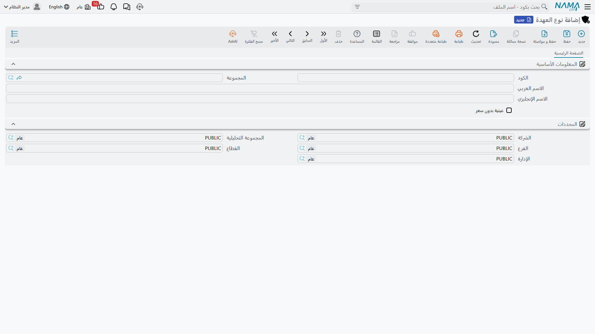

# أنواع العهد

قبل أن تسجّل شركة الواحة للصناعات أول حاسب محمول لها، يجب أن يجيب أحدهم عن سؤال سيسأله النظام وإلا في
كل سجل على حدة: *هل أصناف هذه الفئة لها قيمة مالية؟*

هذه هي وظيفة نوع العهدة. تصنيف قصير — أجهزة محمولة، هواتف، عدد يدوية، زي رسمي، بطاقات دخول — ومهمته
العملية أن يحمل الإجابة عن ذلك السؤال حتى لا يضطر مُنشئ سجل العهدة إلى تذكّرها في كل مرة.

**الأصول > عهد > نوع العهدة** (`Assets > Custodys > Custody Type`)، الرخصة `fixedassets-custody`.

## الشاشة

صفحة واحدة، ولا يكاد يكون فيها شيء:

| الحقل | English | لماذا يوجد |
|---|---|---|
| الكود | Code | الكود القصير الذي ستختار به — `CDY-LAP`، `CDY-PHN`، `CDY-TLS` |
| المجموعة | Group | حقل تجميع الملفات الرئيسية المعتاد، لترشيح القوائم الطويلة |
| الاسم العربي | Name1 | الاسم العربي — أجهزة محمولة |
| الاسم الإنجليزي | Name2 | الاسم الإنجليزي — Laptops |
| عينية بدون سعر | Priceless | الحقل الوحيد الذي يفعل شيئاً: فعّله لفئات الأصناف التي لا تحمل قيمة مالية |

وتحتها مجموعة **المحددات** المعتادة — الشركة ومجموعة التحليل والفرع والقطاع والإدارة — حتى يمكن أن
تخصّ الأنواع شركة واحدة أو فرعاً واحداً في قاعدة بيانات متعددة الشركات.

## ما الذي تغيّره علامة «عينية بدون سعر» فعلاً

حين تفعّل **عينية بدون سعر** فأنت تقول: أصناف هذه الفئة تُسلَّم لكنها لا تُحمَّل بقيمة. بطاقة زائر، زي
رسمي، شريحة اتصال، طقم مفاتيح — أشياء تريد الشركة أن تعرف أين هي دون أن تريد رقماً محمَّلاً على اسم
أحد.

ويترتب على العلامة أمران، وكلاهما يتعلق بإخراج مثل هذا الصنف بسرعة:

- سيعرض مستند التسليم الصنف العيني **مهما كانت حالته**، فيمكن تسليمه مباشرة إلى موظف دون أن يُحرَّر له
  مستند شراء أصلاً. أما الصنف الذي يحمل قيمة فيجب شراؤه أولاً — إذ لا تعرض قائمة اختيار التسليم إلا
  الأصناف في حالة *تم شراؤة*.
- ولأن الصنف العيني بلا سعر، فليس لدى سطور القيد التي ينتجها التسليم والنقل ما تنقله، ويخرج القيد بلا
  قيمة.

واترك العلامة مطفأة فتحصل على الحياة الطبيعية الموصوفة في
[العهد — الأشياء التي تسلّمها لموظفيك](/ar/modules/fixedassets/custody/fixedassets-custody-overview.md):
تشتريه، ثم تسلّمه، فتتبع قيمة الصنف الشخصَ الحائز له.

::: info العلامة تُنسخ ولا تُربط
حين تختار نوع العهدة في سجل عهدة جديد، تُنسخ علامة *عينية بدون سعر* من النوع **إلى ذلك السجل** في تلك
اللحظة. هي قيمة ابتدائية لا ارتباط حي: تغيير النوع لاحقاً لا يعود ليغيّر السجلات التي أُنشئت منه، ويمكن
جعل سجل بعينه عينياً (أو غير عيني) بمعزل عمّا يقوله نوعه. فتستطيع الواحة أن تعلّم حاسباً واحداً للعرض
كصنف عيني دون أن تمسّ نوع «أجهزة محمولة».
:::

## الإجراءات في هذه الشاشة

ليس في شاشة نوع العهدة أزرار خاصة بها — فهي حقلان وعلامة اختيار، تُملأ وتُحفَظ.

## ما لا يفعله نوع العهدة

يستحق هذا التصريح، لأن الملف المقابل في جانب الأصول يفعل أكثر من ذلك بكثير.
[نوع الأصل الثابت](/ar/modules/fixedassets/master-files/fixedassets-asset-types.md) يمدّ كل أصل يُبنى
عليه بحسابات افتراضية وإعدادات إهلاك وترقيم. أما نوع العهدة فلا يفعل شيئاً من ذلك. يمدّ سجلها بعلامة
*عينية بدون سعر* فحسب — لا حسابات، ولا عمر إنتاجي (فالعهد لا تُهلَك أصلاً)، ولا توجيه، ولا قاعدة ترقيم.

والحسابات التي تصيبها حركات العهدة تأتي من
[توجيهات](/ar/modules/fixedassets/document-terms/fixedassets-terms-custody-and-lc.md) مستندات الشراء
والتسليم والنقل والتخلص، لا من النوع. لذلك اجعل قائمة الأنواع قصيرة ووصفية: وظيفتها أن تجعل السجل
مقروءاً وأن تجيب عن سؤال «هل له قيمة»، لا أن تقود المحاسبة.

ومجموعة بداية معقولة لمصنع مثل الواحة هي خمسة أو ستة أنواع — أجهزة محمولة، هواتف وشرائح اتصال، عدد
يدوية، معدات سلامة، زي رسمي، بطاقات دخول — مع تعليم الثلاثة الأخيرة كأصناف عينية بدون سعر.
