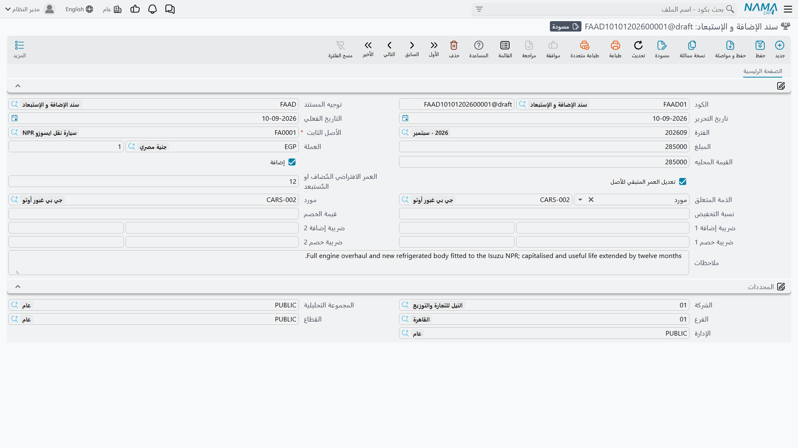
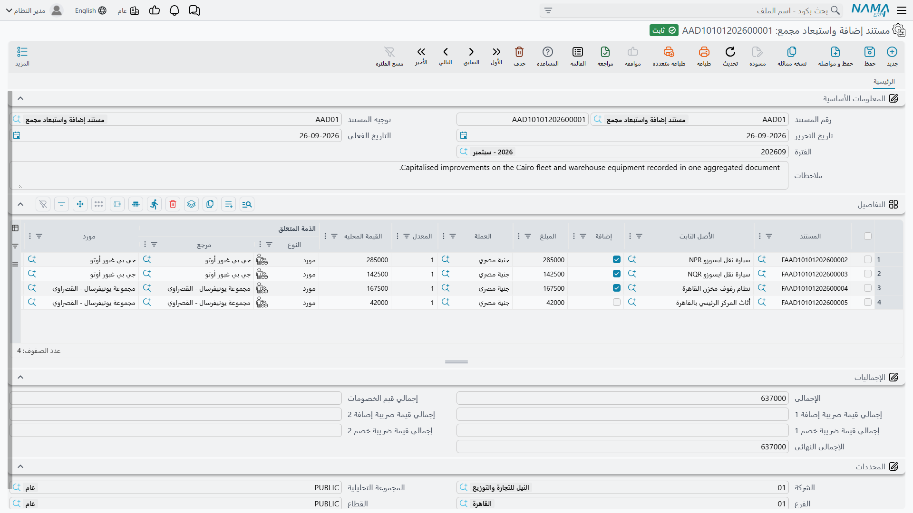

# الإضافة والإستبعاد

في يناير 2027 تحصل ماكينة القص CNC في الواحة على وحدة تحكم جديدة. وليس هذا إصلاحاً — فالماكينة بعده
أقدر، والوحدة ستبقى ما بقيت الماكينة — فالثلاثون ألفاً التي طلبها المورد مكانها تكلفة الماكينة لا
مصروفات الشهر.

و**سند الإضافة و الإستبعاد** هو الطريق الذي يصل بها إلى الأصل. فهو أداة الوحدة لتغيير **تكلفة** الأصل
بعد قيده: لرسملة تحسين، أو لشطب شريحة من القيمة. مستند واحد، وأصل واحد، ومبلغ واحد، في أحد الاتجاهين.

**الأصول > المستندات > سند الإضافة و الإستبعاد** (Asset addition deduction)، ترخيص `fixedassets`.

## ماذا يغيّر وماذا لا يغيّر

هو يغيّر **تكلفة** الأصل. ولا يمسّ مجمع الإهلاك أبداً، ولا يسجّل شيئاً على حساب مجمع الإهلاك — فالقيد
يقع على حساب الأصل نفسه (حساب الأصل).

فبعد تطوير `MCH-0007` تصير تكلفة الماكينة 270,000 بدل 240,000، ويبقى مجمع إهلاكها 43,200 المحمَّلة على
مدى 2026. وتنتقل قيمتها الدفترية من 196,800 إلى 226,800، لأن 30,000 من القيمة الجديدة أُضيفت إليها.

وما **لا** يفعله هو تغيير التاريخ. فلا حركة تُعاد تصويرها، ولا يُنشَأ حِمل تسوية. والأثر كله على
المستقبل عبر القسط.

## الحساب

وهذا هو الموضع الجدير بالقراءة على مهل، لأن الناس يتوقعون هنا جدولاً ولا جدول.

في نهاية ديسمبر 2026، بعد اثني عشر تشغيلاً شهرياً، يقف `MCH-0007` هكذا:

| | |
|---|---|
| التكلفة | 240,000 |
| مجمع الإهلاك | 43,200 |
| القيمة الدفترية | **196,800** |
| قيمة الأصل كخردة | 24,000 |
| العمر المتبقي | **48** فترة |
| القسط | 3,600 |

ويُعتمَد سند إضافة بـ **30,000+**. والتشغيل التالي للإهلاك لا يضيف شيئاً إلى 3,600، بل يعيد تقييم
المعادلة من الوضع الجديد:

> (196,800 + 30,000 − 24,000) ÷ 48 = 202,800 ÷ 48 = **4,225**

فمن يناير 2027 يسجّل كل تشغيل **4,225** بدل 3,600. ولم يتغير العمر المتبقي، فتنتهي الماكينة في التاريخ
نفسه — لكنها تُهلَك أسرع لتصل إليه. وتبقى قيود 2026 الاثنا عشر على 3,600.

والاستبعاد يعمل بالطريقة نفسها في الاتجاه المعاكس: طرح بدل جمع، فينزل القسط.

## لا بد أن تكون قد لحقت بالإهلاك أولاً

قبل أن تقبل الوحدة إضافة أو استبعاداً تشترط أن يكون الأصل مُهلَكاً حتى فترة المستند. فلو كان
`MCH-0007` مُهلَكاً حتى أكتوبر فقط وأرّخت التطوير في يناير لرُفض الاعتماد وأُخبِرت أن الأصل غير مُهلَك
حتى ذلك التاريخ.

وليس هذا تعنتاً. فالقسط مشتق من موضع الأصل في لحظة بعينها، فإدخال تغيير في القيمة خلف فترة لم تُشغَّل
يُنتج رقماً لم يكن صحيحاً قط. شغّل الإهلاك المتأخر ثم أدخل الإضافة.

والانضباط نفسه — إلى الأمام لا إلى الخلف — يسري على التاريخ الفعلي: فلا يمكن تأريخ المستند قبل مستند
لاحق سبق أن مسّ الأصل، وسيُقال لك أي مستند يقف في الطريق.

والاستثناء المعتبر الوحيد على جانب الإهلاك — خيار توجيه الإهلاك *السماح بعمل مستندات اهلاك سابقا لتاريخ
سندات (إضافة واستبعاد و تخلص جزئي و نقل)* الموصوف في
[سند الإهلاك](/ar/modules/fixedassets/depreciation/fixedassets-depreciation-document.md) — يتيح تأريخ
تشغيل إهلاك خلف إضافة أو استبعاد قائم. وهو الإعداد الذي تلجأ إليه حين تصل فاتورة متأخرة يجب رسملتها في
شهر لم تُقفله بعد.

## ملء المستند

| الحقل | |
|---|---|
| **الكود** / **الدفتر**، **توجيه المستند**، **تاريخ التحرير**، **التاريخ الفعلي**، **الفترة** | ترويسة المستند المعتادة |
| **الأصل الثابت** | إجباري — أصل واحد لكل مستند |
| **المبلغ** و**العملة** و**المعدل** و**القيمة المحليه** | القيمة المضافة أو المستبعدة |
| **إضافة** | مفتاح الاتجاه: مؤشَّر = إضافة، غير مؤشَّر = استبعاد |
| **تعديل العمر المتبقي للأصل** | انظر أدناه |
| **العمر الافتراضي المٌضاف او المٌستبعد** | انظر أدناه |
| **الذمة المتعلق** و**مورد** | الطرف الآخر في القيد |
| **نسبة التخفيض** و**قيمة الخصم** | خصم على المبلغ |
| زوجا ضريبة إضافة وزوجا ضريبة خصم، كل زوج نسبة وقيمة | معالجة الضرائب |
| **ملاحظات** و**المحددات** | كما في كل مكان |

وحقول النسبة والقيمة تتبع بعضها أثناء الكتابة — تُدخل نسبة الخصم فتُملأ القيمة، وكذلك كل زوج ضريبي.

والقيمة التي تصل فعلاً إلى تكلفة الأصل هي المبلغ الذي أدخلته، معدَّلاً بالضرائب والخصم حسب التوجيه: فكل
ضريبة إضافة تُرسمَل فقط إذا نصّ التوجيه على ذلك، وضرائب الخصم تُحسم من القيمة المرسملة فقط إذا نصّ
التوجيه على ذلك، وفي **الإضافة** يُنقص الخصم الذي أدخلته ما يُرسمَل. وخلاصة ذلك أن التوجيه هو الذي
يقرر كم من الضريبة والخصم يخصّ الأصل، أما القيد المحاسبي فيغطيها جميعاً على كل حال.

## ماذا يسجّل الاعتماد

يُنشَأ طلب أعمال محاسبي يُعالَج في الخلفية. ففي **الإضافة**:

| الحساب | مدين | دائن |
|---|---|---|
| حساب الأصل نفسه (حساب الأصل) | 30,000 | |
| الحساب المذكور في التوجيه — جانب المورد أو الدائنية | | 30,000 |

وفي **الاستبعاد** ينقلب الطرفان. وتنتج الضرائب والخصم سطورها الإضافية من الحسابات المضبوطة على
التوجيه، وتُدمج الحسابات المتطابقة في سطر واحد إذا طلب التوجيه اختصار القيد.

والذمة على السطر هي *الذمة المتعلق*، والمورد هو *مورد*، ومحددات القيد تأتي دائماً من **الأصل** — فلا
خيار «المحددات من المستند» في هذا المستند.

والمستند مستند ضريبي أيضاً، فحيث تدخل الضرائب ينتج بيانات الفاتورة التي تحتاجها آلية الضرائب والفوترة
الإلكترونية.

أما الحسابات نفسها فتُضبط على التوجيه؛ انظر
[توجيهات الإهلاك والتخلص](/ar/modules/fixedassets/document-terms/fixedassets-terms-depreciation-and-disposal.md).

## تعديل العمر المتبقي في المستند نفسه

أحياناً لا يضيف التحسين قيمة فحسب بل يضيف عمراً. أشِّر **تعديل العمر المتبقي للأصل** وأدخل عدداً من
الفترات في **العمر الافتراضي المٌضاف او المٌستبعد**، فيعدّل المستند نفسه المقام كما عدّل البسط:

- في **الإضافة** تُضاف الفترات إلى العمر المتبقي للأصل؛
- وفي **الاستبعاد** تُطرَح منه.

فلو كان تطوير الواحة قد اشترى للماكينة اثني عشر شهراً إضافية لكان القسط من يناير 2027
(196,800 + 30,000 − 24,000) ÷ 60 = **3,380** بدل 4,225 — قيمة أكبر موزعة على فترات أكثر.

والحقل إجباري متى أُشِّر المفتاح، ويجب تركه فارغاً متى لم يُؤشَّر.

ويترتب على استعماله أمران، وكلاهما مهم:

**الإهلاك التالي للأصل يجب أن يكون في الفترة المالية نفسها التي فيها هذا المستند.** فمتى وُجدت في فترةٍ
إضافةٌ أو استبعادٌ يعدّل العمر، أهلك التشغيلُ ذلك الأصل في تلك الفترة دون غيرها. فأدخل المستند في
الفترة التي تنوي الإهلاك فيها.

**والأصل الذي انتهى عمره يمكن إعادته.** فإضافة عمر إلى أصل بلغ عمره المتبقي صفراً تستأنف سلسلة إهلاكه
من فترة المستند — وهذا هو الطريق المدعوم لإطالة عمر شيء أُهلك بالكامل وما زال في الخدمة.

## معالجة أصول كثيرة دفعة واحدة

حين تُوزَّع فاتورة واحدة على عشرين أصلاً — رفع قيمة تأميني، أو تحديث يشمل الأسطول كله — يكون **مستند
إضافة واستبعاد مجمع** هو نسخة الإدخال الدفعي.

وهو جدول بالحقول نفسها: الأصل، ومفتاح الإضافة، والمبلغ، والعملة، والمعدل، والقيمة المحلية، والذمة
المتعلق، والمورد، ونسبة الخصم وقيمته، والأزواج الضريبية الأربعة، وصافي القيمة، وحقلا العمر. وفي الأسفل
مجموعة **الإجماليات** تجمع القيم والخصم وكل ضريبة وتعطي إجمالياً نهائياً صافياً.

وعند الاعتماد **يصير كل سطر سند إضافة أو استبعاد حقيقياً** — بكوده وقيده المحاسبي وفحوصه — ويُكتب مرجع
المستند المولَّد في عمود **المستند** على السطر لتفتح أي ابن من الجدول مباشرة. وخلافاً
لـ[سند الإهلاك المجمع](/ar/modules/fixedassets/depreciation/fixedassets-aggregated-depreciation.md) لا
يمتد هذا المجمّع عبر فترات: فكل الأبناء يشتركون في فترة المجمّع وتاريخه الفعلي.

والمجمّع نفسه لا يسجّل شيئاً ذا قيمة؛ فكل القيود من أبنائه. وإلغاؤه يحذفها كلها، وحذف سطر ثم إعادة
الاعتماد يحذف ابن ذلك السطر وحده.

## الإجراءات في هذه الشاشة

لا المستند المفرد ولا المجمَّع فيه زر خاص به. ولا يوجد هنا زر *تجميع* — بل تسمّي الأصل وتكتب القيمة
فيُحسَب القسط الجديد لك مع ملء الحقول. وكل ما عدا ذلك يتبع اعتماد المستند ويُنقض بإلغاء الاعتماد.

## هذا ليس مستند الصيانة

الإصلاح يُبقي الأصل عاملاً، والتحسين يجعله أثمن. والثاني وحده مكانه هنا.

فالصيانة الدورية تُسجَّل في
[سند صيانة](/ar/modules/fixedassets/maintenance/fixedassets-maintenance-records.md)، وحقل التكلفة فيه
موجود للتاريخ والتحليل. وهو لا يُرسمِل، ولا يغيّر إهلاك الماكينة، ولا يصل إلى الدفاتر عبر وحدة الأصول
الثابتة. فإذا كان المهندسون قد فعلوا شيئاً يزيد فعلاً من قيمة الأصل أو عمره المتبقي فذلك أوان سند
الإضافة — ويجلس عندئذ سند الصيانة وسند الإضافة جنباً إلى جنب، أحدهما يصف العمل والآخر يحمل المال.
