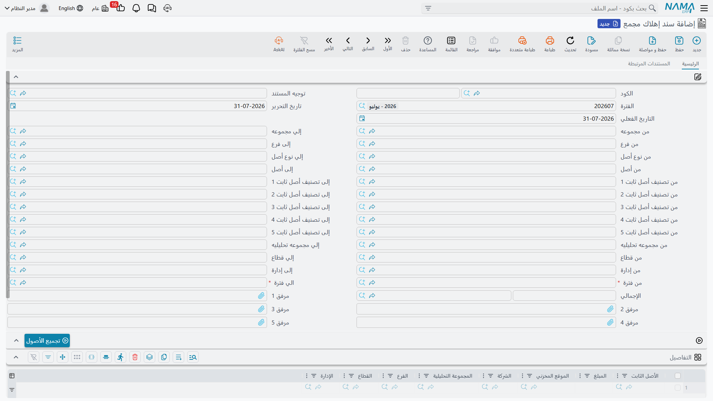
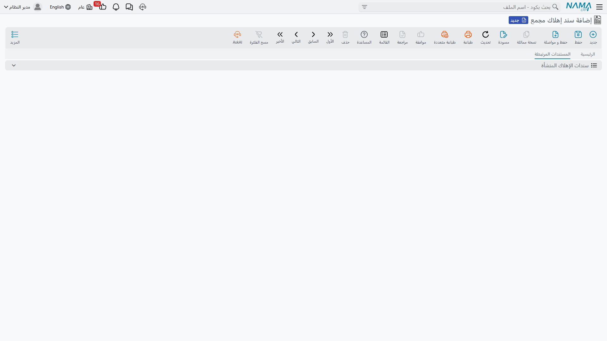

# سند الإهلاك المجمع

تبدأ شركة الواحة للصناعات العمل على نظام «نما» في نوفمبر، بأثر رجعي إلى أول السنة. فعشرة أشهر من
الإهلاك يجب تسجيلها قبل أول إقفال شهري حقيقي، و[سند الإهلاك](/ar/modules/fixedassets/depreciation/fixedassets-depreciation-document.md)
يعالج فترة مالية واحدة في المرة. وإنشاء عشرة منها باليد، بالترتيب، بفترة صحيحة وتاريخ فعلي صحيح لكل
واحد، هو بالضبط نوع العمل الذي يختل عند المستند السابع.

ولهذا وُجد سند الإهلاك المجمع. تعطيه **مدى فترات**، وتجمع الأصول مرة واحدة، وتعتمد — فينشئ لك سندات
الإهلاك المفردة، سنداً لكل فترة، كل واحد منها معتمداً.

وتجده في **الأصول > المستندات > سند إهلاك مجمع** (Aggregated Depreciation Document)، تحت ترخيص
`fixedassets`.

## هو محرّك لا وعاء

وهذا ما ينبغي فهمه قبل استعماله: المجمّع لا **يحمل** الإهلاك، بل **ينتج مستندات تحمله**.

فحين تعتمده يمشي النظام في مدى الفترات من أوله إلى آخره، وينشئ لكل فترة مالية عادية فيه سند إهلاك
حقيقياً — بدفتره وكوده وتاريخه الفعلي في آخر يوم من تلك الفترة — لا يحمل إلا الأصول المستحقة فعلاً في
تلك الفترة. وكل واحد من تلك السندات يُعتمد بذاته ويسجّل قيده المحاسبي بالطريقة المعتادة: مدين حساب
إهلاك الأصل، ودائن حساب إهلاكه التراكمي.

أما المجمّع نفسه فلا يسجّل **شيئاً**. وإجماليه ليس إلا مجموع ما أنتجته أبناؤه، وهو موجود لتَرى بنظرة
واحدة كم بلغت الدفعة.

## كيف تُعِدّه

الشاشة هي شاشة سند الإهلاك مع إضافة واحدة: **من فترة** و**الي فترة** إلى جوار حقل الفترة المفرد. وما
عدا ذلك مألوف — مديات الأكواد المزدوجة نفسها للأصل والنوع والمجموعة الرئيسية والفرع والقطاع والإدارة
والمجموعة التحليلية والتصنيفات، وزر **تجميع الأصول** نفسه، وجدول التفاصيل المقفل نفسه الذي لا إجراء
فيه إلا حذف سطر. وفي الترويسة كذلك خمس خانات مرفقات لا توجد في المستند المفرد.

والإعداد الوحيد الذي يحتاجه فعلاً هو **توجيه**، والتوجيه هنا ليس اختيارياً. وهو يحمل حقلين لا بد من
ملئهما:

| حقل التوجيه | |
|---|---|
| **دفتر سند إهلاك** (Aggregated Depreciation Book) | الدفتر الذي تُكتب فيه سندات الإهلاك المولَّدة |
| **توجيه سند إهلاك** (Aggregated Depreciation Term) | التوجيه المطبَّق على تلك السندات المولَّدة |

وبدونهما يتوقف الاعتماد ويطلب منك ملء الدفتر والتوجيه داخل التوجيه. ويستحق هذا أن يُضبط مرة واحدة على
وجهه عند تأسيس الوحدة — انظر
[توجيهات الإهلاك والتخلص](/ar/modules/fixedassets/document-terms/fixedassets-terms-depreciation-and-disposal.md).

وتُفحص ثلاث قواعد أخرى قبل توليد أي شيء:

- ألا تكون «من فترة» بعد «الي فترة»؛
- أن تكون كلتاهما فترة **عادية** — لا افتتاحية ولا تسوية ولا إقفال؛
- أن تنتميا إلى التقويم نفسه.

## كيف تبدو تسوية الواحة المتأخرة

لنفترض أن المدى من يناير إلى أكتوبر 2026 وأن الفلاتر تُركت فارغة.

1. **تجميع الأصول** يملأ الجدول بكل أصل مستحق في مكان ما من المدى.
2. وعند الاعتماد يعمل النظام فترة فترة. ففي يناير يأخذ الأصول التي فترتها المستحقة التالية يناير —
   ومنها `MCH-0007` الذي يبدأ إهلاكه في 1 يناير — ويكتبها في سند إهلاك ليناير مؤرخ في 31 يناير، ثم
   يعتمده. وسطر `MCH-0007` يقرأ 3,600.
3. ثم يُبنى مستند فبراير من القائمة نفسها، بعد أن نقل يناير موضع الجميع فترةً واحدة إلى الأمام. ويظهر
   `MCH-0007` مرة أخرى بـ 3,600.
4. …وهكذا إلى أكتوبر. فالأصل المشترى في يونيو لا يظهر إلا من يونيو، والأصل الذي تم التخلص منه في أغسطس
   يتوقف ظهوره بعد أغسطس. ومستند كل فترة يحوي بالضبط الأصول التي تخصها.
5. ثم تتجمع الإجماليات العشرة في إجمالي المجمّع.

والمستندات المولَّدة معروضة في التبويب الثاني من المجمّع، **المستندات المرتبطة**، فيمكنك فتح أي منها
ورؤية الفترة التي يغطيها. وهي سندات إهلاك عادية من كل وجه — تظهر في شاشة قائمة سندات الإهلاك، وتُطبع،
وتدخل في التقارير.

## تسهيل إضافي

سند الإهلاك المفرد يتخطى ببساطة الأصل الذي لا يزيد قسطه المحسوب على صفر. أما المجمّع، ولأنه يعرف مدى
فترات، فيفعل ما هو أنفع: حين يخرج قسط أصل صفراً أو أقل في الفترة التي ينظر فيها يمسح المدى إلى الأمام
بحثاً عن أول فترة يصير فيها القسط موجباً، فيلتقط الأصل هناك.

وبهذا يهبط أصل اقتُني في منتصف مدى التسوية في شهره الصحيح دون أن تخبره أنت بأي شهر.

## إذا غيّرت رأيك

إلغاء المجمّع يحذف كل مستند ولّده — بدءاً بالأحدث، فتنفكّ الخطوط الزمنية للقيمة انفكاكاً نظيفاً — ومعها
قيودها المحاسبية. وهذا هو الطريق المدعوم للتراجع عن دفعة، وهو طريق نظيف.

وما **لا** يُدعَم هو تعديل مجمّع سبق اعتماده ثم إعادة اعتماده. فعامل المجمّع المعتمد على أنه منتهٍ: إذا
كانت الدفعة خاطئة فألغِها كاملة وأدخل غيرها. وإذا كانت فترة واحدة داخلها هي الخاطئة فألغِ الدفعة، وعالج
السبب، ثم أعد تشغيلها — أو شغّل الفترات الباقية فرادى بسند الإهلاك العادي.

::: warning إلغاء دفعة يعكس فترات كثيرة دفعة واحدة
المجمّع الذي يغطي عشرة أشهر يقف خلفه عشرة سندات إهلاك معتمدة، دفع كلٌّ منها العمر المتبقي لكل أصل فترةً
إلى الأمام. وإلغاؤه يُرجعها كلها. وهذا هو السلوك الصحيح وهو سبب كون المجمّع بهذه السهولة — لكنه إجراء
كبير يستحق وقفة على سجل حي.
:::
