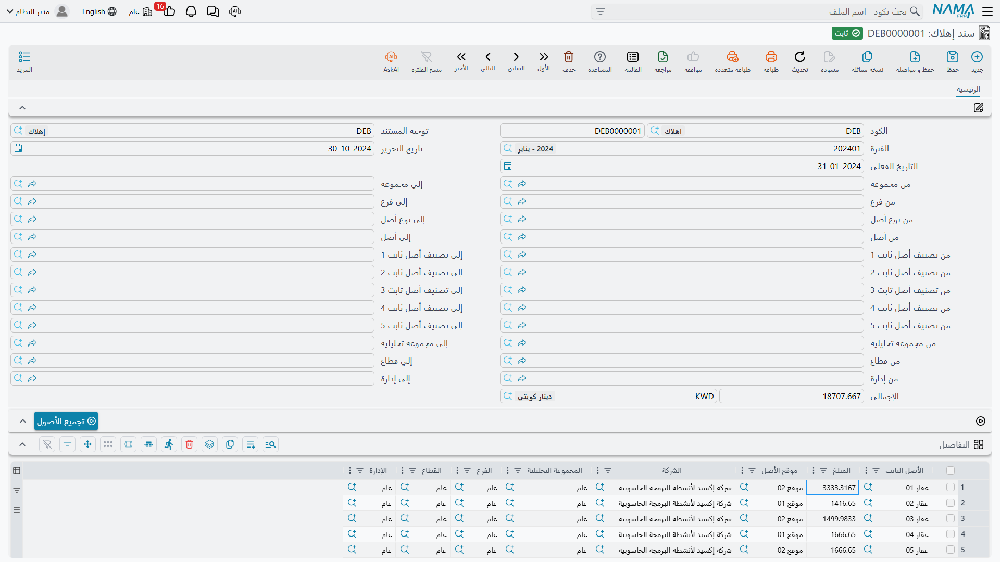
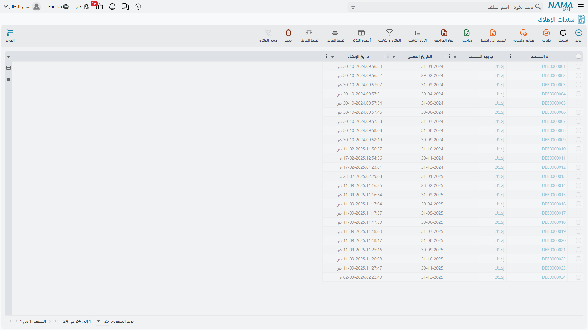

# سند الإهلاك

سند الإهلاك هو تشغيل نهاية الفترة: مستند واحد لكل فترة مالية، يحمل سطراً لكل أصل، وكل سطر يحمل حِمل ذلك
الأصل عن الفترة. وهو المستند الوحيد في الوحدة الذي يسجّل إهلاكاً، وهو في معظم المنشآت أكثر ما يُعمل
روتينياً في الأصول الثابتة — اثنا عشر مستنداً في السنة، لا يستغرق الواحد منها إلا دقائق.

وتجده في **الأصول > المستندات > سند إهلاك** (Depreciation Document). ويحتاج ترخيص `fixedassets` ولا
يحتاج غيره.

## تشغيل يناير 2026 في شركة الواحة

تقفل شركة الواحة دفاترها شهرياً، ففي آخر يوم عمل من يناير يفتح أحدهم سند إهلاك جديداً ويصنع الآتي:

1. **يختار الدفتر والفترة المالية.** الفترة هي جوهر المستند، ولا يكاد يعمل شيء قبل ملئها.
2. **يراجع التاريخ الفعلي.** يملؤه النظام من الفترة، ويجب أن يكون **آخر يوم** في الفترة — أي 31 يناير
   2026 هنا. والتاريخ الفعلي الذي لا يوافق نهاية الفترة يُرفَض عند الاعتماد. أما تاريخ التحرير فهو
   تاريخ المستند العادي ويكون اليوم الذي تعمل فيه فعلاً.
3. **يضيّق نطاق التشغيل إن أراد.** تحمل الترويسة بلوكاً طويلاً من الحقول المزدوجة *من … إلى*: الأصل،
   ونوع الأصل، والمجموعة الرئيسية، والفرع، والقطاع، والإدارة، والمجموعة التحليلية، وتصنيفات الأصل من 1
   إلى 5. وكل زوج منها **مدى أكواد** — من هذا الكود إلى ذاك — فهي لتقطيع السجل لا لانتقاء أصول بعينها.
   واتركها كلها فارغة يشمل التشغيل كل شيء.
4. **يضغط «تجميع الأصول»** (Collect Assets). فيجد النظام كل أصل مستحق في هذه الفترة، ويملأ الجدول
   بسطر لكل أصل يحمل القسط محسوباً. وسطر `MCH-0007` يقرأ **3,600**.
5. **يراجع ويحذف ما لا يريده.** وتفصيل ذلك أدناه.
6. **يحفظ ويعتمد.**

وإجمالي الترويسة يجمع السطور. وعملته تُفرَض عملةَ الشركة، فهو دائماً رقم بالعملة المحلية.

## جدول التفاصيل غير قابل للتعديل عن قصد

| العمود | |
|---|---|
| **الأصل الثابت** | الأصل الجاري إهلاكه |
| **المبلغ** | قسطه عن هذه الفترة |
| **موقع الأصل** | منسوخ من الأصل |
| **الشركة / المجموعة التحليلية / الفرع / القطاع / الإدارة** | محددات الأصل، منسوخة على السطر |

لا يمكنك الكتابة في هذا الجدول. فعمود الأصل وعمود المبلغ مقفلان، والمحددات والموقع تُنسَخ من الأصل عند
الحفظ. والإجراء الوحيد المتاح فعلاً هو حذف سطر.

وهذا مقصود، وهو النموذج الصحيح: فالقسط ليس رأياً، بل ناتج المعادلة الموضحة في
[كيف يحسب النظام الإهلاك](/ar/modules/fixedassets/depreciation/fixedassets-depreciation-concepts.md).
فإذا كان رقم خاطئاً فالمدخل هو الخطأ — العمر المتبقي، أو قيمة الخردة، أو القيمة الدفترية — وطريق
تعديله [سند خصائص أصل ثابت](/ar/modules/fixedassets/depreciation/fixedassets-properties-document.md) أو
[سند إضافة واستبعاد](/ar/modules/fixedassets/depreciation/fixedassets-additions-and-deductions.md)، لا
كتابة رقم بديل هنا.

أما حذف سطر فأداة حقيقية: تُخرج ذلك الأصل من **هذا** التشغيل. لكن انتبه إلى معنى ذلك — تنشأ في سلسلة
الأصل فجوة، وقاعدة الاتصال ستمنع إهلاكه في فبراير حتى تُسَد الفجوة أو تُوثَّق بـ
[مستند منع اهلاك اصول](/ar/modules/fixedassets/depreciation/fixedassets-prevent-depreciation.md).

## أي الأصول تظهر

«تجميع الأصول» يطبّق فلاتر *من/إلى* التي أدخلتها، ثم مجموعة ثابتة من الشروط لا تملك تغييرها: الحالة
**جارى الإهلاك**، والطريقة **قسط ثابت**، وتاريخ بدء الإهلاك في نهاية الفترة أو قبلها، وأن تكون الفترة
تالية مباشرة لآخر إهلاك للأصل، وألا يغطيه منع إهلاك، وأن يكون القسط المحسوب أكبر من صفر. والقائمة
كاملة، مع تعليل كل شرط، في صفحة المفاهيم.

وخلاصتها العملية: إذا غاب أصل توقعته فانظر في حالته أولاً، ثم في آخر فترة أُهلك فيها، ثم في تاريخ بدء
إهلاكه. هذه الثلاثة تفسّر كل غياب تقريباً.

## ماذا يسجّل الاعتماد

الاعتماد ينشئ **طلب أعمال** محاسبياً يُعالَج في الخلفية، فيُحفظ المستند فوراً ويظهر القيد بعد لحظات.
ولكل سطر، بقيمة القسط:

| | الحساب |
|---|---|
| **مدين** | **حساب الإهلاك** للأصل — المصروف |
| **دائن** | **حساب الإهلاك التراكمي** للأصل |

ففي يناير 2026 يسهم `MCH-0007` بمدين ودائن قدرهما 3,600، ويسجّل المستند كله مجموع سطوره.

والتفصيلة المهمة هي مصدر هذين الحسابين: **الأصل نفسه**، عبر حسابات ملفه (التي ورثها غالباً من
[نوع الأصل الثابت](/ar/modules/fixedassets/master-files/fixedassets-asset-types.md)). وهي ليست قابلة
للضبط على التوجيه، ولهذا يمكن لأصلين على المستند نفسه أن يذهبا إلى حسابين مختلفين، ولهذا كان ضبط
حسابات النوع في البداية بهذه الأهمية.

وإلى جانب القيد، يقوم الاعتماد أيضاً بـ:

- كتابة حركة مؤرَّخة على الخط الزمني لقيمة كل أصل؛
- إنقاص العمر المتبقي لكل أصل بمقدار واحد؛
- إعادة حساب القسط الحالي لكل أصل استعداداً للفترة التالية؛
- تحويل كل أصل بلغ قيمة خردته إلى حالة **مهلك**.

وإذا فشل الطلب المحاسبي فتُعاد معالجته من شاشة **طلبات الأعمال** — تُرشِّح الطلبات الفاشلة، وتحدد
السطور، ثم من قائمة **المزيد** تختار *إعادة المعالجة* / *إعادة الاعتماد*. ولا حاجة إلى المساس بالمستند
نفسه.

## التوجيه، والخيار الجدير بالمعرفة

هذا المستند **لا يشترط توجيهاً** — فهو يُعتمد بلا توجيه لأنه يأخذ حساباته من الأصل. والتوجيه يضيف
قوالب الشرح وعدداً من الخيارات، وأهمها للمستخدم العادي:

**السماح بعمل مستندات اهلاك سابقا لتاريخ سندات (إضافة واستبعاد و تخلص جزئي و نقل)**. الأصل أن الوحدة
تُلزمك بالعمل إلى الأمام: فمتى وُجد على الأصل سند إضافة أو استبعاد أو نقل أو تخلص جزئي لم يعد بإمكانك
إقحام سند إهلاك خلفه. ومع تفعيل هذا الخيار يصبح ذلك ممكناً — وهو ما تحتاجه حين تصلك فاتورة تطوير
متأخرة مؤرخة في شهر لم تُهلكه بعد. ومع تفعيله يعيد التشغيل كذلك اشتقاق قسط كل سطر عند الحفظ ويُسقط كل
سطر هبط قسطه إلى الصفر أو دونه.

والمنشآت التي تشغّل المقاولات أيضاً تستخدم الإهلاك مصدراً لتكلفة المشروعات؛ وخيارات ذلك على التوجيه
نفسه، وهي مشروحة مع بقية التوصيلات المحاسبية للوحدة في
[توجيهات الإهلاك والتخلص](/ar/modules/fixedassets/document-terms/fixedassets-terms-depreciation-and-disposal.md).

## تصحيح تشغيل

لا يوجد مستند عكسي ولا إشعار دائن. فالتشغيل الخاطئ يُلغى اعتماده أو يُحذف، ثم يُعاد إدخاله.

وتحكم ذلك ثلاث قواعد:

- **الأحدث أولاً.** الخط الزمني لقيمة الأصل سلسلة، ولا يمكن نزع حلقة من وسطها. فإذا كان `MCH-0007` قد
  أُهلك في يناير وفبراير ومارس فلن ينفكّ مستند يناير حتى يُلغى مستندا مارس وفبراير. والرسالة تسمّي لك
  المستند المانع.
- **لا يمكن تغيير الفترة المالية على مستند قائم.** يقول النظام ذلك صراحة ويطلب منك الحذف وإعادة
  الإدخال. فافعل ذلك ولا تبحث عن التفاف عليه.
- **إلغاء الاعتماد يعيد كل شيء.** تُحذف الحركة المؤرَّخة، وتُستعاد قيم الأصل السابقة، ويعود العمر
  المتبقي إلى ما كان، ويُعاد حساب القسط، ويرجع الأصل الذي صار **مهلكاً** إلى **جارى الإهلاك**، ويُسحب
  القيد المحاسبي بطلب أعمال خاص به.

::: warning حذف تشغيل عكسٌ حقيقي
إلغاء اعتماد سند إهلاك أو حذفه لا يزيل ورقة فحسب — بل يزيل حِمل تلك الفترة عن كل أصل فيه ويُرجع عمر كل
أصل المتبقي خطوة إلى الوراء. وعلى مستند يغطي أربعمائة أصل فهذه أربعمائة عملية إرجاع. فتأكد أنك تقصد
ذلك، وأعد تشغيل الفترة بعده.
:::

## إقفال الفترة يعتمد على هذا المستند

تشارك الأصول الثابتة في إقفال الفترات المالية: فالفترة لا تُقفل ما دام هناك أصل جارٍ إهلاكه ويقع تاريخ
بدء إهلاكه داخلها ولم يُهلَك في الفترة السابقة، ويفشل الإقفال مسمياً الأصل. وهذا الفحص هو السبب
الرئيسي لجعل تشغيل الإهلاك جزءاً من روتين نهاية الشهر لا عملاً يُتذكَّر أحياناً.

وثمة خياران في [إعدادات الوحدة](/ar/modules/fixedassets/fixedassets-configuration.md) يخففان ذلك — أحدهما
يسمح بالإقفال مع وجود أصول غير مُهلَكة، والآخر يسمح به للأصول التي تحمل سجل منع إهلاك. ولا تفعّلهما
إلا إذا قررت عن عمد أن يتأخر السجل عن الدفتر.

## العثور على التشغيلات لاحقاً

شاشة القائمة هي موضع التأكد من أن الفترة شُغِّلت أصلاً، وهي أسرع طريق لرؤية شكل الشهر: سطر واحد، فترة
واحدة، إجمالي واحد. ولرؤية التفصيل أصلاً أصلاً استخدم
[تقارير الوحدة](/ar/modules/fixedassets/reports/fixedassets-reports.md) أو صفحة الإحصائيات على الأصل.

وإذا تباعد السجل عن الدفتر تباعداً حقيقياً — وذلك غالباً بعد حذف مستندات من قاعدة البيانات مباشرة أو
بعد استيراد خاطئ — فهناك أدوات إدارية لإعادة بناء تاريخ إهلاك الأصل؛ انظر
[أدوات وحدة الأصول الثابتة](/ar/admin/reprocessing/fixed-asset-utilities.md). وهي أداة إصلاح لا جزء من
التشغيل العادي.

## حين تكون الفترات كثيرة

إذا كان أمامك اثنا عشر شهراً متأخرة فلست مضطراً إلى إنشاء اثني عشر مستنداً بيدك. فـ
[سند الإهلاك المجمع](/ar/modules/fixedassets/depreciation/fixedassets-aggregated-depreciation.md) يأخذ
مدى فترات وينشئ لك التشغيلات المفردة.
