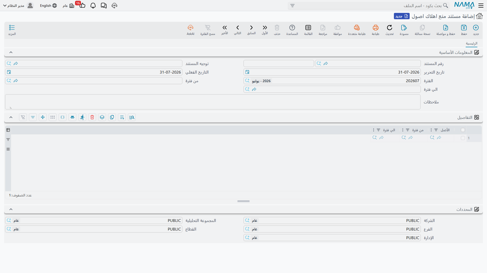

# تجميد إهلاك أصل

يحدث أحياناً ألا يُهلَك أصل لمدة من الزمن. فخط إنتاج يُوقَف ستة أشهر بينما يُعاد تجهيز المصنع. وسيارة
تُحتجَز على ذمة قضية. وأصل تُنازَع ملكيته فيطلب المراجعون تركه حتى يُفصل في النزاع.

والحل البديهي — ترك الأصل خارج تشغيل الشهر — لا يعمل، ويستحق أن تفهم لماذا قبل أن تلجأ إلى المستند
الذي يعمل.

## لماذا لا يمكن تخطي فترة ببساطة

سلسلة إهلاك الأصل يجب أن تكون **متصلة**. فالتشغيل لا يُهلك أصلاً إلا في الفترة التالية مباشرة لآخر فترة
أُهلك فيها، ويفحص ذلك عند الاعتماد. فإذا حذفت سطر `MCH-0012` من تشغيل فبراير ثم حاولت في مارس رُفض
مارس: آخر إهلاك للأصل كان يناير، وفبراير مفقودة.

والأسوأ أن هذا الرفض لا يزول من تلقاء نفسه. لا يوجد زر «استئناف»، ولن تكون أي فترة لاحقة هي الفترة
التالية ليناير مباشرة. ففترة مقفوزة بصمت تُخرج الأصل من سلسلة الإهلاك إلى الأبد.

و**مستند منع اهلاك اصول** هو الطريق إلى تخطي فترة **بصورة موثَّقة**. فهو يعلن أن أصولاً بعينها لا
تُهلَك خلال مدى معلوم من الفترات، فيتعامل تشغيل الإهلاك مع ذلك المدى على أنه فجوة موثَّقة لا ثقب — يستبعد
تلك الأصول ما دام المنع سارياً، ثم يلتقطها التقاطاً نظيفاً في أول فترة بعد انتهائه.

وتجده في **الأصول > المستندات > مستند منع اهلاك اصول** (Prevent Assets Depreciation Document)، تحت
ترخيص `fixedassets`.

## كيف يُملأ

الشاشة قصيرة. ففي **المعلومات الأساسية** رقم المستند والدفتر، وتوجيه المستند، وتاريخ التحرير، والتاريخ
الفعلي، والفترة، وحقل الملاحظات، والزوج الذي يقوم بالعمل الحقيقي: **من فترة** و**الي فترة**.

ثم يعدّد جدول التفاصيل الأصول، ولكل سطر «من فترة» و«الي فترة» خاصتان به. وعملياً تضبط المدى مرة واحدة
على الترويسة، لأن قيم الترويسة تُدفَع إلى كل سطر في كل حفظ — فالترويسة هي المدى، والجدول هو قائمة
الأصول التي يسري عليها.

وفي الأسفل مجموعة **المحددات** كما في كل مستندات الوحدة.

والمستند لا يحتاج إعدادات توجيه ولا ينتج **أي قيد محاسبي**. فلا شيء يُسجَّل، ولا شيء يُؤجَّل إلى حساب
وسيط. وكل ما يفعله أنه يغيّر ما يقبل تشغيل الإهلاك جمعه.

## المدى يجب أن يلتصق بتاريخ الأصل

تُفحص ثلاثة شروط عند الاعتماد، وكلها تحفظ اتصال الخط الزمني للأصل:

- **أن يكون الأصل موجوداً مالياً بالفعل.** فلا بد له من مستند شراء أو رصيد افتتاحي مؤرَّخ قبل الفترة —
  ولا يمكنك تجميد أصل لم يُرسمَل قط استباقاً. *«الأصل ليس له مستند افتتاحي أو شراء قبل الفترة …»*
- **ألا تكون هناك فجوة أمام المنع.** فـ«من فترة» يجب أن تلي آخر فترة استُخدم فيها الأصل مباشرة. فإذا
  كان آخر إهلاك للأصل في يناير وحاولت منعه من أبريل رُفض الاعتماد وطُلب منك تغطية الفجوة — فلا بد أن
  يدخل فبراير ومارس في المنع، أو أن يُهلَكا، قبل أن يمكن منع أبريل.
- **أن يكون المدى خالياً من الحركات الأخرى.** فإذا كان للأصل أي مستند مؤرَّخ داخل المدى الذي تمنعه
  رُفض الاعتماد وسُمِّي لك ذلك المستند.

ومعنى ذلك مجتمعاً أن المنع يُخطَّط **إلى الأمام** من حيث يقف الأصل اليوم، لا يُرقَّع بعد فوات الأوان.
فاتخذ قرار التجميد قبل الفترة التي تريد تخطّيها لا بعدها.

ولا بد أيضاً من **اعتماد** المستند ليكون له أثر. فالمنع المُدخَل غير المعتمد لا يراه تشغيل الإهلاك —
فكل فحص يجريه التشغيل لا ينظر إلا في سطور المنع المعتمدة.

## ماذا يحدث أثناء سريان المنع

خذ `MCH-0012`، الرافعة الشوكية في الواحة، المسحوبة من الخدمة في الربع الثاني من 2026 بينما يُعاد بناء
المخزن. فيُعتمَد مستند منع يغطي أبريل ومايو ويونيو.

- **تشغيلات أبريل ومايو ويونيو لا تجمعه.** فهو ليس في القائمة، ولا يمكن إضافة سطر له باليد لأن الجدول
  غير قابل للكتابة.
- **اعتماد المنع يكتب حركة بقيمة صفر** على الخط الزمني لقيمة الأصل عن كل سطر. وهذه الحركة هي ما يجعل
  الفجوة موثَّقة: فهي لا تغيّر قيمة البتة، لكنها تقف في الخط الزمني سِجلاً للمنع، وهي ما يقرؤه فحص
  الاتصال لاحقاً.
- **ويجمعه يوليو من جديد** بالقسط الذي تقتضيه حالته — وهو بالضبط ما كان عليه في مارس، لأن شيئاً لم
  يُحمَّل بينهما. ولم يتحرك عمره المتبقي أيضاً: فلا ينقص العمر المتبقي إلا قيد إهلاك، ولم يكن ثمة
  قيود. وهكذا امتد عمر الأصل عملياً ثلاثة أشهر، وهو عادةً المقصود.

## إقفال الفترات والأصول مجمَّدة

إقفال الفترة المالية يرفض عادةً إقفال فترة لم يُهلَك فيها أصل جارٍ إهلاكه. والأصل المجمَّد يُوقِع هذا
الفحص، فيتعذر عليك إقفال أبريل أصلاً.

وفي [إعدادات الوحدة](/ar/modules/fixedassets/fixedassets-configuration.md) خيار لهذه الحالة بعينها: السماح
بالإقفال حين يكون الأصل ممنوعاً من الإهلاك. وهو يخفف الإقفال للأصول التي تحمل سجل منع فقط، وهو أضيق
وأسلم من خيار «السماح بالإقفال مع وجود أصول غير مُهلَكة» المجاور له. فإن كنت تستعمل مستندات المنع
أصلاً فهذا هو الخيار الذي تفعّله.

## إنهاء المنع مبكراً أو تمديده

لا يوجد مستند «رفع منع». فلتغيير المنع تلغي اعتماد مستند المنع أو تحذفه ثم تدخله بالمدى الذي تريد —
وذلك خاضع للقاعدة نفسها التي تحكم كل ما في هذا المجلد: الخط الزمني للأصل ينفكّ بدءاً بالأحدث، فإذا كان
الإهلاك قد شُغِّل بعد انتهاء المنع وجب إلغاء تلك التشغيلات أولاً.

::: tip المنع أيضاً هو أداة الأصل الذي سقط من السلسلة
إذا وجدت أصلاً لا يجمعه أي تشغيل إهلاك لأن فترته الأولى فاتته، فمستند منع يغطي الفترات الناقصة هو ما
يعيده: إذ يعامل التشغيل ذلك المنع تاريخاً موثَّقاً للأصل ويستأنف في أول فترة بعده. وتسري القيود نفسها —
أن يبدأ المنع مباشرة بعد آخر حركة للأصل وأن يخلو من مستندات أخرى.
:::
