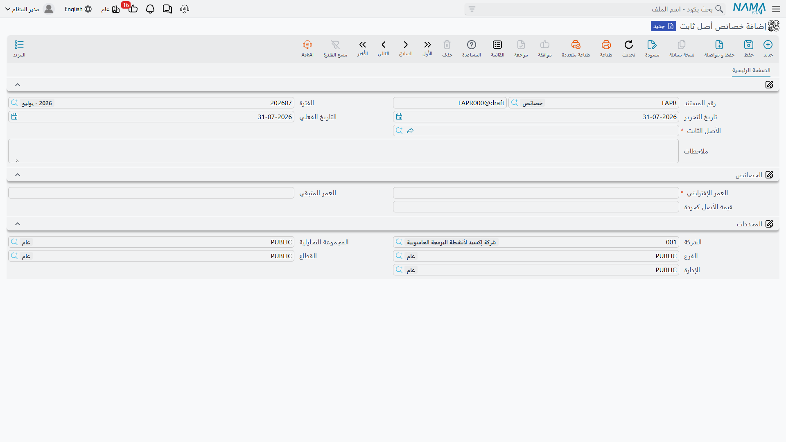
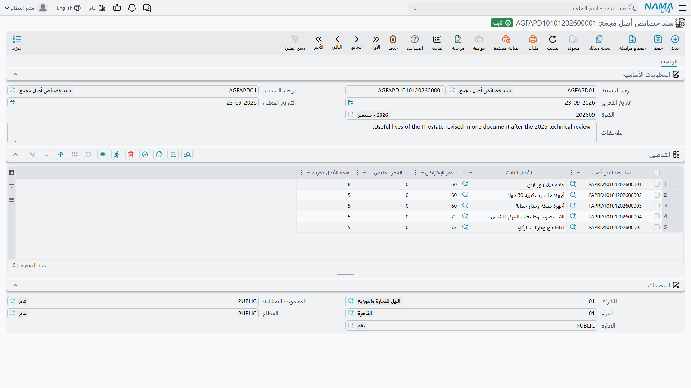

# إعادة تقدير عمر الأصل وقيمة خردته

العمر الإفتراضي وقيمة الخردة تقديران، والتقديرات تُراجَع. فمراجعة هندسية تقول إن أمام الماكينة ثلاث
سنوات لا خمساً. وتغيّر في السياسة يرفع قيمة الخردة المتوقعة للأسطول. وماكينة كان مقرراً تشغيلها بعنف
صارت على مهام خفيفة.

و**سند خصائص أصل ثابت** هو موضع تسجيل هذه المراجعات. مستند واحد، وأصل واحد، وقائمة قصيرة جداً مما
يستطيع تغييره.

**الأصول > المستندات > خصائص أصل ثابت** (Fixed Asset Properties)، ترخيص `fixedassets`.

## ثلاثة أشياء لا رابع لها

الشاشة صفحة واحدة. البلوك العلوي فيه رقم المستند والدفتر، والفترة، وتاريخ التحرير، والتاريخ الفعلي،
و**الأصل الثابت** الذي يخصه، والملاحظات. ثم مجموعة **الخصائص** بثلاثة حقول، ومجموعة المحددات في
الأسفل.

وهذه الحقول الثلاثة هي مدى المستند كله:

| الحقل | |
|---|---|
| **العمر الإفتراضي** | إجمالي العمر المتوقع للأصل بالفترات. إجباري. |
| **العمر المتبقي** | كم فترة بقيت له |
| **قيمة الأصل كخردة** | كم يُتوقع أن يساوي في النهاية |

وما عدا ذلك من بيانات الأصل خارج متناول هذا المستند. فهو لا يستطيع تغيير طريقة الإهلاك، ولا الحسابات،
ولا نوع الأصل، ولا أي تصنيف، ولا الموقع، ولا العهدة، ولا المحددات، ولا تكلفة الاقتناء، ولا مجمع
الإهلاك. فتلك في ملف الأصل نفسه أو تحركها المستندات التي تملكها —
[سند النقل](/ar/modules/fixedassets/movement/fixedassets-transfer-document.md) للموقع والمحددات،
و[سند الإضافة والإستبعاد](/ar/modules/fixedassets/depreciation/fixedassets-additions-and-deductions.md)
للتكلفة.

::: tip العمر المتبقي هو الحقل الذي يغيّر المال
القسط هو *(القيمة الحالية − الخردة) ÷ **العمر المتبقي***، فالحقلان اللذان يحركانه هما **العمر
المتبقي** و**قيمة الأصل كخردة**. أما **العمر الإفتراضي** فهو الرقم المعلن للأصل — يُستهلَك عند رسملة
الأصل أول مرة لتوليد العمر المتبقي — وتغييره هنا على أصل جارٍ إهلاكه تغييرٌ مرجعي لا حسابي. فإن أردت
تغيير الحِمل فغيّر العمر المتبقي.
:::

## المثال المحسوب

يبلغ `MCH-0007` نهاية ديسمبر 2026 وقد أُهلك اثنتي عشرة مرة:

| | |
|---|---|
| التكلفة | 240,000 |
| مجمع الإهلاك | 43,200 |
| القيمة الدفترية | **196,800** |
| قيمة الأصل كخردة | 24,000 |
| العمر المتبقي | **48** فترة |
| القسط | **3,600** |

وتخلص مراجعة هندسية في 1 يناير 2027 إلى أن الماكينة لن تدوم إلا **30** شهراً أخرى، وأن سوق الخردة قد
تحرك — فينبغي أن تُقيَّد خردتها بـ **30,000** لا 24,000.

1. أنشئ سند خصائص **بتاريخ فعلي 1 يناير 2027**. ولا بد أن يكون بعد آخر حركة إهلاك للأصل في 31 ديسمبر
   2026 — وتفصيل ذلك أدناه.
2. الأصل `MCH-0007`؛ **العمر المتبقي** 30؛ **قيمة الأصل كخردة** 30,000. (والعمر الإفتراضي، لكونه
   إجبارياً، يُضبط على 42 حفاظاً على اتساق الملف — 12 فترة مضت و30 باقية.)
3. اعتمد.

فتُكتب حركة مؤرَّخة على الخط الزمني لقيمة الأصل، وتُحدَّث خصائص الأصل، ويُعاد اشتقاق القسط في الحال:

> (196,800 − 30,000) ÷ 30 = 166,800 ÷ 30 = **5,560**

فمن يناير 2027 يسجّل كل تشغيل إهلاك 5,560 بدل 3,600، وتنتهي الماكينة قبل موعدها بثماني عشرة فترة.
وتبقى قيود 2026 الاثنا عشر كما هي تماماً.

## ليس له أثر رجعي — ولا يمكن جعله كذلك

لا حركة تُعاد تصويرها، ولا يُنشَأ حِمل تسوية، ولن يدعك النظام تؤرّخ المستند في الماضي لتصطنع واحداً.

والقاعدة التي تفرض ذلك هي القاعدة التي تحكم الوحدة كلها: **ألا تكون للأصل حركة قائمة بعد التاريخ
الفعلي للمستند**. فـ `MCH-0007` مُهلَك حتى 31 ديسمبر، فيأتي سند الخصائص بعده — و1 يناير هو التاريخ
الطبيعي. وإن حاولت تأريخه في نوفمبر رُفض الاعتماد وسُمِّي لك المستند القائم في التاريخ اللاحق. ويُعاد
الفحص نفسه إذا عدّلت مستنداً معتمداً وأرجعت تاريخه الفعلي خلف حركات أخرى.

وإذا احتجت فعلاً إلى تطبيق العمر الجديد على فترات سبق تشغيلها فليس أمامك إلا طريق واحد: إلغاء تشغيلات
الإهلاك المعنية — بدءاً بالأحدث — ثم إدخال سند الخصائص في التاريخ الذي تريد، ثم إعادة تشغيلها.

ويُطبَّق فحصان آخران عند الاعتماد:

- **ألا تقل قيمة الخردة عن الحد الأدنى في الوحدة.** ففي
  [إعدادات الوحدة](/ar/modules/fixedassets/fixedassets-configuration.md) حد أدنى لقيمة الخردة، وما دونه
  يُرفَض. ولا يجوز أن يكون أي من رقمي العمر سالباً.
- **أن تكون حالة الأصل «جارى الإهلاك» أو «غير قابل للإهلاك».** فلا يمكنك إعادة تقدير أصل ما زال في
  حالته الأولية، أو تم التخلص منه، أو أُهلك بالكامل. أما الأصل المهلَك بالكامل وما زال في الخدمة فطريق
  إعادته
  [سند إضافة يضيف عمراً](/ar/modules/fixedassets/depreciation/fixedassets-additions-and-deductions.md)
  لا هذا المستند.

## لا إعدادات توجيه ولا قيد محاسبي

سند الخصائص يحتاج **دفتراً** ولا يحتاج غيره. فهو لا يشترط توجيهاً، وليس له خيارات توجيه تُضبط، ولا
ينتج **أي قيد محاسبي**.

وهذا صواب لا نقص. فالمستند لا يحرّك قيمة — بل يغيّر المعدل الذي ستُحمَّل به القيمة مستقبلاً، والمال
يُسجَّل فترةً فترة عبر [تشغيلات الإهلاك](/ar/modules/fixedassets/depreciation/fixedassets-depreciation-document.md)
التالية له.

وإلغاؤه يزيل الحركة المؤرَّخة، ويعيد الخصائص التي كانت للأصل قبله، ويعيد حساب القسط منها. وكالعادة،
تمنع الحركة اللاحقة الإلغاءَ حتى تُلغى هي.

## إعادة تقدير أسطول كامل

سيارات التوصيل الاثنتا عشرة في الواحة اشتُريت كلها بعمر 60 شهراً. ثم تعيد مراجعة سياسات تقدير المجموعة
كلها إلى 24 شهراً متبقياً وخردة 5,000 لكل سيارة. واثنا عشر مستنداً منفصلاً عمل ممل وسهل الخطأ.

و**سند خصائص أصل مجمع** (Aggregated Fixed Asset Properties Document) شاشة واحدة بجدول واحد: الأصل،
والعمر الإفتراضي، والعمر المتبقي، وقيمة الخردة لكل سطر، إضافة إلى مرجع المستند المولَّد. وعند الاعتماد
ينشئ **سند خصائص واحداً لكل سطر**، ويدع كلاً منها يقوم بالعمل الحقيقي — حركته المؤرَّخة، وإعادة حساب
قسطه، وفحوصه.

وهو يحتاج ضبطاً واحداً قبل ذلك. فتوجيهه يحمل حقلين:

| حقل التوجيه | |
|---|---|
| **دفتر سند خصائص أصل ثابت** | الدفتر الذي تُكتب فيه المستندات المولَّدة. **إجباري** — وبدونه يفشل الاعتماد ويقول ذلك. |
| **توجيه سند خصائص أصل ثابت** | التوجيه المطبَّق على المستندات المولَّدة. اختياري، لأن الابن لا يشترط توجيهاً. |

والمجمّع نفسه لا يفحص إلا شيئاً واحداً: ألا يتكرر الأصل في الجدول. وكل ما عداه — ترتيب التواريخ
الفعلية، وحالة الأصل، والحد الأدنى للخردة، والأعمار السالبة — يفحصه كل ابن عند إنشائه.

ويترتب على ذلك أمر يستحق التخطيط له: **الدفعة كلٌّ لا يتجزأ**. فإذا كانت السيارة السابعة تحمل أصلاً
حركة إهلاك مؤرخة بعد تاريخك الفعلي فشل ابنها وفشل معه اعتماد المجمّع كله. ولا يبقى شيء منفَّذاً نصف
تنفيذ، لكن عليك معالجة السيارة المخالفة قبل أن تمرّ الإحدى عشرة الأخرى.

وحذف سطر ثم إعادة الاعتماد يحذف المستند المولَّد لتلك السيارة ويعكس أثره؛ وإلغاء المجمّع يحذف الاثني
عشر جميعاً.

## الإجراءات في هاتين الشاشتين

لا مستند الخصائص ولا صورته المجمَّعة فيه زر خاص به — فلا يوجد *تجميع* في أيّهما، ومن ثمّ تُكتب سطور
إعادة التقدير المجمَّعة أو تُستورَد بدل أن تُسحَب من مدى. أما إعادة الحساب التي تريدها فتحدث عند
الاعتماد: يُكتب العمر الجديد وقيمة الخردة الجديدة على الأصول، فيلتقطهما تشغيل الإهلاك التالي.
