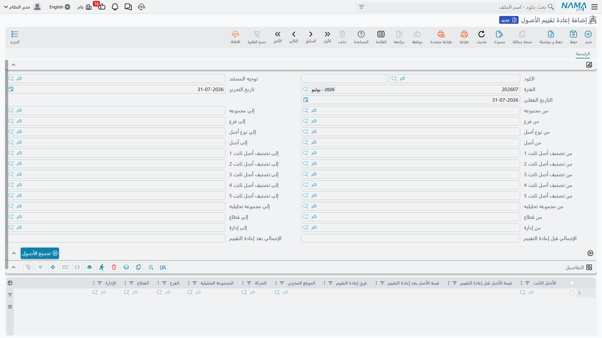

# إعادة تقييم الأصول

بعض الأصول لا تفقد قيمتها بمعادلة. فالأراضي والمباني وقليل غيرها تُقيَّد بما يقوله المُقيِّم إنها تساوي،
ويُعاد تقديرها بين حين وآخر، ويُؤخذ الفرق مكسباً أو خسارة إعادة تقييم. ونظام «نما» يدعم ذلك، ويدعمه
بوصفه **طريقة إهلاك** لا حدثاً عارضاً تُجريه على أصل عادي.

وهذا التمييز هو الصفحة كلها. فالأصل إما أصل قسط ثابت — يحسب النظام حِمله من
[المعادلة](/ar/modules/fixedassets/depreciation/fixedassets-depreciation-concepts.md) — وإما أصل إعادة
تقييم، فلا يحسب النظام شيئاً البتة ويكتفي بتسجيل القيمة التي تعطيه إياها.

## كيف تجعل الأصل أصل إعادة تقييم

في ملف الأصل اضبط **طريقة إهلاك الأصل** على **إعادة تقييم**. وافعل ذلك عند إنشاء الأصل: فمتى صار
للأصل تاريخ حركة أُقفلت الطريقة.

ومن تلك اللحظة يخرج الأصل من دورة الإهلاك العادية خروجاً تاماً. فـ
[تشغيل الإهلاك](/ar/modules/fixedassets/depreciation/fixedassets-depreciation-document.md) لا يجمعه، ولو
تمكنت من إدخال سطر له في سند إهلاك لرفضه الاعتماد وأحالك إلى هذا المستند. ويبقى عمره المتبقي وقيمة
خردته في ملفه دون مساس — فلا شيء يقرؤهما لأصل إعادة تقييم.

## المستند

**الأصول > المستندات > إعادة تقييم الأصول** (Fixed Asset Revaluation)، ترخيص `fixedassets`.

الترويسة هي ترويسة سند الإهلاك — الدفتر والكود، وتوجيه المستند، والفترة، وتاريخ التحرير، والتاريخ
الفعلي، وبلوك الحقول المزدوجة *من … إلى* نفسه للأصل والنوع والمجموعة الرئيسية والفرع والقطاع والإدارة
والمجموعة التحليلية والتصنيفات من 1 إلى 5 — مع استبدال الإجمالي برقمين: **الإجمالي قبل إعادة التقييم**
و**الإجمالي بعد إعادة التقييم**.

وفيها زر **تجميع الأصول** يملأ الجدول بأصول إعادة التقييم المطابقة لمدياتك، كل أصل يحمل القيمة التي
تركها التقدير السابق. والأصول التي ما زالت في حالتها الأولية والأصول التي تم التخلص منها مستبعدة.

ثم يحمل الجدول سطراً لكل أصل:

| العمود | |
|---|---|
| **الأصل الثابت** | إجباري |
| **قيمة الأصل قبل إعادة التقييم** | يملؤه النظام من قيمة الأصل الحالية — ولا تكتبه أنت |
| **قيمة الأصل بعد إعادة التقييم** | **الرقم الوحيد الذي تُدخله** |
| **فرق إعادة التقييم** | يُحسب *بعد − قبل* أثناء الكتابة |
| **الموقع** والمحددات الخمسة | منسوخة من الأصل |

ولا يجوز أن يتكرر الأصل الواحد في المستند.

## ماذا يُسجَّل

خذ مبنى إدارة الواحة، المقيَّد بتكلفة **1,000,000** يقابله مجمع إهلاك **200,000** — أي قيمة دفترية
**800,000**. وتقرير المُقيِّم لمارس 2026 يقدّره بـ **860,000**.

فتُدخل سطراً واحداً: قبل 800,000، وبعد 860,000، والفرق **+60,000**.

والاعتماد ينشئ طلب أعمال محاسبياً يُعالَج في الخلفية، وينتج زوجين من السطور:

| الحساب | مدين | دائن |
|---|---|---|
| المباني — حساب الأصل نفسه | 60,000 | |
| فائض إعادة التقييم — من التوجيه | | 60,000 |
| مجمع إهلاك المباني | 200,000 | |
| المباني — حساب الأصل نفسه | | 200,000 |

واقرأ الأثر على حساب الأصل: 60,000+ ثم 200,000−، فينتقل حساب المباني من 1,000,000 إلى **860,000**،
ويُفرَّغ حساب مجمع الإهلاك. فبعد المستند يحمل حساب الأصل **وحده** القيمة المُقدَّرة. وإعادة التصوير هذه
إلى صافي القيمة الدفترية مقصودة، وهي ما يجعل التقدير التالي بسيطاً — إذ لا يبقى مجمع إهلاك يُطابَق.

والحركة الهابطة صورة معكوسة. فإذا جاء التقييم التالي في يونيو بـ **800,000** كان الفرق **−60,000**
والقيد:

| الحساب | مدين | دائن |
|---|---|---|
| خسارة إعادة التقييم — من التوجيه | 60,000 | |
| المباني — حساب الأصل نفسه | | 60,000 |

ولا يوجد زوج ثانٍ هذه المرة: فمجمع الإهلاك سبق تفريغه في إعادة التقييم الأولى، فلم يبق ما يُلغى. وزوج
التفريغ لا يظهر إلا حين يكون على الأصل مجمع إهلاك سابق على أول تقدير له — وذلك عادةً من
[رصيد افتتاحي](/ar/modules/fixedassets/acquisition/fixedassets-opening-balances.md) أو من حياة سابقة
كأصل قسط ثابت.

وتقدير ثالث في سبتمبر بـ **830,000** يسجّل ببساطة 30,000 مديناً على حساب الأصل مقابل فائض إعادة
التقييم. والسلسلة هي *تقدير ← تقدير ← تقدير*: فرقم «قبل» في كل مستند هو القيمة التي تركها ما قبله.

والسطور التي يخرج فرقها صفراً تُتخطى — فإعادة تقدير تؤكد القيمة القائمة لا تسجّل شيئاً.

## من أين تأتي الحسابات

حساب الأصل نفسه (حساب الأصل) طرفٌ في كل قيد، ويأتي من الأصل تماماً كما يحدث في الإهلاك. أما الطرف
الآخر — المكسب والخسارة — فيأتي من **توجيه** المستند، وهو الموضع الذي تضبط فيه حسابَي فائض إعادة
التقييم وخسارتها. وهذا هو الإعداد الوحيد الذي يحتاجه هذا المستند حقاً؛ وهو مشروح مع بقية التوصيلات
المحاسبية للوحدة في
[توجيهات الإهلاك والتخلص](/ar/modules/fixedassets/document-terms/fixedassets-terms-depreciation-and-disposal.md).

وعلى التوجيه نفسه خياران آخران:

- **المحددات من المستند** — أخذ محددات القيد من مجموعة المحددات في المستند بدلاً من الأصل. وبدونه
  تُستعمل محددات الأصل.
- **السماح بالأصول ذات الإهلاك الثابت و تغيير طريقة الإهلاك** — وتفصيله أدناه.

والقيد يكون دائماً بعملة الدفتر الرئيسية للشركة، والذمة عليه هي الأصل الثابت نفسه.

## تحويل أصل من القسط الثابت

الأصل أن المستند يرفض أصل القسط الثابت، وأن **تجميع الأصول** لا يعرضه. وخيار التوجيه **السماح بالأصول
ذات الإهلاك الثابت و تغيير طريقة الإهلاك** يرفع ذلك: فمع تفعيله يعرض التجميع أصول القسط الثابت أيضاً،
واعتماد إعادة تقييم لأحدها **يحوّل ذلك الأصل إلى طريقة إعادة التقييم**.

وكن قاصداً لذلك. فبعد التحويل لا يعود الأصل جزءاً من دورة الإهلاك أصلاً — لن يظهر في تشغيل إهلاك آخر،
ويكفّ عمره المتبقي عن أن يعني شيئاً. والطريق الوحيد للرجوع هو إلغاء مستند إعادة التقييم، فيستعيد الأصل
طريقته السابقة مع كل شيء آخر.

وهذا استعمال مشروع للخيار — مبنى كان يُهلَك بالقسط الثابت وانتقلت سياسته إلى إعادة التقييم — لكنه ليس
مما يُترك مفعّلاً بحكم العادة.

## الإلغاء

إلغاء اعتماد إعادة تقييم أو حذفها يزيل حركتها من الخط الزمني لقيمة الأصل، ويعيد الأصل إلى ما تركته
الحركة السابقة، ويرجع طريقة الإهلاك المحوَّلة، ويسحب القيد المحاسبي بطلب أعمال خاص به. وكما في كل ما في
هذا المجلد، ينفكّ الخط الزمني بدءاً بالأحدث: فإعادة تقييم خلفها مستندات لاحقة لن تُلغى حتى تُلغى تلك.
