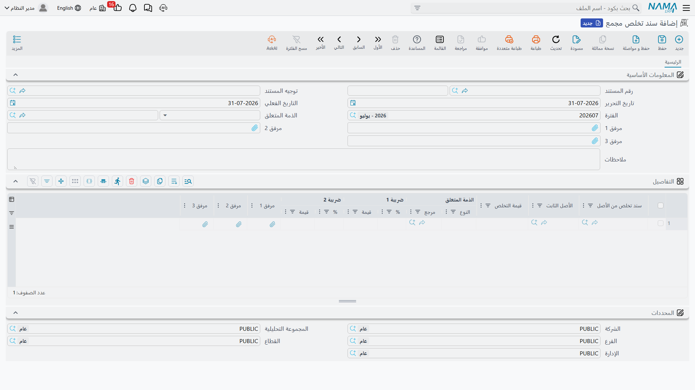
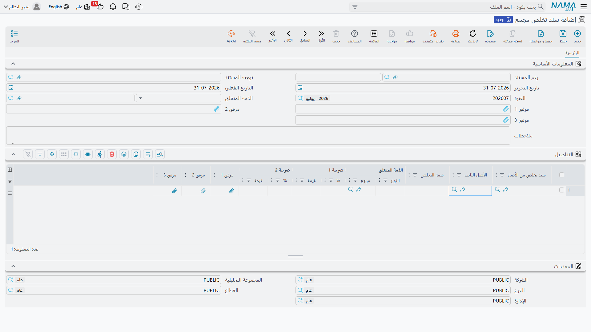

# التخلص من عدة أصول دفعة واحدة

ترتيب نهاية العام يأتي على دفعات في العادة. يُغلق مصنع فتذهب إحدى عشرة آلة خردةً في يوم واحد، أو
يُستبدل أسطول فتُباع تسع سيارات للتاجر نفسه. وتحرير أحد عشر مستند تخلص باليد عملُ صباح كامل، وإحدى
عشرة فرصة لخطأ في التاريخ الفعلي.

و**سند التخلص المجمع** هو الجواب: شاشة واحدة، وجدول واحد، واعتماد واحد — ووراءه مستند تخلص عادي لكل
سطر.

تجده في **الأصول > المستندات > سند تخلص مجمع**، على ترخيص `fixedassets`.

## واجهة لا مستند

هذه أول ما ينبغي فهمه، لأنه يفسّر كل سلوك آخر في الصفحة: **السند المجمع لا ينتج قيداً محاسبياً خاصاً
به.** فليس له حساب مكسب ولا حساب خسارة ولا حساب متحصلات، ولا يسجّل شيئاً.

وإنما الذي يفعله أنه يولّد
[مستند تخلص من الأصل](/ar/modules/fixedassets/disposal/fixedassets-disposal.md) حقيقياً لكل سطر
تكتبه، ويترك **تلك** المستندات تقوم بالعمل. فكل مستند مولَّد يقرأ أرصدة أصله في دفتر الأستاذ، ويستخرج
مكسبه أو خسارته، وينتج قيده بطلب أعمال، ويؤشّر على أصله بأنه تم التخلص منه. وكل ما في صفحة التخلص
ينطبق على كل واحد منها على حدة — بما في ذلك قاعدة أن يكون إهلاك الأصل قد نُفِّذ وعولج دون تخطّي فترة
بين آخر إهلاك له وبين التخلص.

والنتيجة العملية تظهر حين تبحث عن خطأ. فالقيد الفاشل يخص مستنداً **مولَّداً** لا السند المجمع، وكود
ذلك المستند هو الذي ستراه في شاشة قائمة طلبات الأعمال.

## توجيه واحد، ونوع تخلص واحد

يحمل توجيه السند المجمع خيارين اثنين فقط، وكلاهما إلزامي: **دفتر سند التخلص من الأصل** و**توجيه سند
التخلص من الأصل** اللذان سيُنشأ بهما كل مستند مولَّد. فإن تركت أحدهما فارغاً فشل الاعتماد وذُكر اسم
التوجيه في الرسالة.

ويُستعمل هذا الزوج الواحد في **كل سطور الدفعة**. فالدفعة إذن ليست «مستندات تخلص كثيرة» فحسب، بل هي
*مستندات تخلص كثيرة من نوع واحد*. فإن كنت — كما توصي به
[صفحة التخلص من الأصل](/ar/modules/fixedassets/disposal/fixedassets-disposal.md) — تحتفظ بتوجيه لكل
سبب: البيع هنا والإعدام هناك والتبرع في موضع ثالث، فأنت تحتاج سنداً مجمعاً لكل سبب كذلك، يشير كلٌّ منها
إلى توجيهه المجمع الخاص به.

::: tip إعداد الزوج
السند المجمع موصول بمعالج إعداد المستندات المجمعة القياسي، فلست مضطراً إلى بناء زوج الدفتر والتوجيه
يدوياً: إذ ينشئ المعالج دفتر السند المجمع وتوجيهه، ودفتر مستند التخلص المفرد وتوجيهه اللذين يشير
إليهما، مربوطة على الوجه الصحيح، في خطوة واحدة.
:::

## الشاشة

الترويسة صغيرة — دفتر المستند وكوده، وتاريخ التحرير، والتاريخ الفعلي، والفترة، وثلاثة مرفقات وملاحظات،
ومعها مجموعة **المحددات** التي تحمل الشركة والمجموعة التحليلية والفرع والقطاع والإدارة.

وحقل واحد في الترويسة يعمل عملاً حقيقياً: **الذمة المتعلق**، أي الطرف المقابل. فإن ملأته نُقل إلى كل
سطر عند حفظ المستند، وهو عين المطلوب في أسطول يُباع لتاجر واحد. وإن تركته فارغاً احتفظ كل سطر بالطرف
المقابل الذي أعطيته إياه على حدة.

والطرف المقابل هنا — في الترويسة وفي السطور — يجوز أن يكون **موظفاً أو حساب أستاذ أو خزينة أو حساباً
بنكياً**. فإن وجب أن يسمي مستند التخلص مورداً أو طرفاً آخر مشترياً — وهو ما يقتضيه إرسال البيع فاتورةً
إلكترونية — فحرِّر ذلك المستند تخلصاً مفرداً بدلاً من ذلك.

وجدول **التفاصيل** هو موضع الدفعة، سطر لكل أصل:

| العمود | ما يحمله |
|---|---|
| **سند تخلص من الأصل** | للقراءة فقط — المستند المولَّد لهذا السطر. يبقى فارغاً حتى الاعتماد، ثم يصير طريقك المباشر إلى القيد |
| **الأصل الثابت** | الأصل الخارج من الخدمة. إلزامي، ولا يجوز تكرار أصل واحد في الدفعة نفسها |
| **قيمة التخلص** | ما تحصِّله مقابله قبل الضريبة؛ و**صفر** للخردة أو الإعدام. ولا يجوز أن تكون سالبة |
| **الذمة المتعلق** | الطرف المقابل لهذا السطر، ويُستبدل بقيمة الترويسة إن كانت الترويسة تحمل واحداً |
| **ضريبة 1 %** و**قيمتها**، **ضريبة 2 %** و**قيمتها** | الزوجان الضريبيان لكل سطر |

واكتب **نسب** الضريبة في السطور. فالحفظ يستخرج القيم من قيمة التخلص، وعند اعتماد الدفعة يعيد الخادم
حساب الضريبة حساباً صحيحاً على كل مستند مولَّد — بحسب سياسة الضريبة في توجيه التخلص وخضوعه للضريبة —
ثم يكتب الأرقام النهائية على السطر، فينتهي الجدول متفقاً مع المستندات التي أنتجها.

## دفعة في شركة الواحة

في ختام 2027 تُخرج شركة الواحة للصناعات آلتين من الخدمة في يوم واحد. فتُباع ماكينة القص `MCH-0007`
بمبلغ **200,000** تدخل حساب الشركة البنكي، وتُعدَم الرافعة الشوكية `MCH-0012` التي انقضى نفعها منذ
زمن، دون مقابل.

| الأصل الثابت | قيمة التخلص | الذمة المتعلق |
|---|---|---|
| `MCH-0007` ماكينة قص CNC | 200,000 | الحساب البنكي المستلم للمبلغ |
| `MCH-0012` رافعة شوكية | 0 | الحساب البنكي |

وينتج عن الاعتماد مستندا تخلص، كلاهما منشأ في دفتر التخلص وتوجيهه المسمَّيين في توجيه السند المجمع.
ويستخرج كل منهما نتيجته مستقلاً:

- `MCH-0007` — تكلفة 270,000 في دفتر الأستاذ مقابل مجمَّع إهلاك 93,900، فقيمة دفترية 176,100
  و**مكسب 23,900** يُضاف دائناً إلى حساب المكسب في التوجيه؛
- `MCH-0012` — تكلفة 60,000 مقابل مجمَّع إهلاك 38,000، فقيمة دفترية 22,000، ومع انعدام المتحصلات
  **خسارة 22,000** تُضاف مدينة إلى حساب الخسارة في التوجيه.

وقد كفى توجيه واحد للحالتين لأن توجيه التخلص الكامل يحمل حساب مكسب **وحساب خسارة** معاً، فسلكت الآلة
التي لم تُحصِّل شيئاً فرع الخسارة. ولو أن البيع احتاج توجيهاً خاضعاً للضريبة والإعدام توجيهاً غير خاضع
لها لوجب فصلهما في دفعتين.

## ما يمنع الاعتماد

تُفحص السطور كلها قبل أن يُولَّد شيء، وفشل سطر واحد يوقف الدفعة بأسرها:

| القاعدة | ملاحظة |
|---|---|
| لا يجوز تكرار أصل في سطرين | *الأصل مكرر* |
| لا يجوز أن تكون قيمة التخلص سالبة | |
| لا يجوز أن يكون على الأصل قيد **لاحق** لهذا المستند — ويُفحص في السطور التي لم تولّد مستنداً بعد | تذكر الرسالة المستند المانع |
| لا يجوز أن يكون الأصل في حالته الابتدائية | إذ لا شيء في الدفاتر يُرفع |
| لا يجوز أن يكون أصل أُضيف حديثاً إلى الدفعة قد تم التخلص منه سلفاً | |

وفوق ذلك، يطبّق كل مستند مولَّد قواعده الخاصة عند اعتماده، وأهمها قاعدة تتابع الإهلاك. فالتحضير
المعتاد للدفعة إذن: نفِّذ الإهلاك وعالجه لكل أصل فيها حتى لا تبقى فترة غير مهلَكة قبل التخلص، ثم اعتمد
الدفعة. ولا ضير في أن تكون فترة التخلص نفسها قد أُهلكت، فذلك لا يمنع شيئاً.

## ماذا يفعل الاعتماد فعلاً

1. يُقرأ دفتر التخلص وتوجيهه من توجيه السند المجمع.
2. ولكل سطر يُنشأ مستند تخلص — أو، إن كان السطر قد ولَّد مستنداً من قبل، يُفتح المستند نفسه ويُحدَّث
   بدل أن يُستبدل.
3. ويُنقل إليه أصل السطر وقيمة تخلصه وطرفه المقابل وأرقامه الضريبية، مع بيانات ترويسة السند المجمع.
4. ثم إن كل مستند مولَّد إما أن **يُعتمد فوراً وإما أن يُترك للمراجعة** — وأيهما يقع فذلك تابع
   لإعدادات دفتر التخلص الذي اخترته. فإن كانت دفعتك تنتج مستندات تنتظر ولا ترحَّل فذلك الدفتر هو موضع
   النظر.
5. ويُختم السطر برابط إلى مستنده، وتُقرأ قيم الضريبة المعاد حسابها إلى السطر.
6. وأي مستند ولّدته نسخة سابقة من الدفعة ثم حذفت سطره يُحذف.

ولأن الخطوة الثانية تعيد استعمال المستندات القائمة فإن **تعديل دفعة معتمدة آمن**: غيّر قيمة وأعد
الاعتماد، فتُحدَّث مستندات التخلص نفسها ولا تتضاعف.

وإلغاء الاعتماد يفعل العكس — فتُحذف كل مستندات التخلص المولَّدة، وهو ما ينقض قيودها ويعيد أصولها إلى ما
كانت عليه تماماً كما لو ألغيت اعتماد كل مستند بيدك، وتُمحى الروابط من السطور. وإن أخذت **نسخة مماثلة**
من سند مجمع لتعيد استعمال تخطيطه فإن الروابط تُسقَط من النسخة، فتبدأ الدفعة الجديدة نظيفة لا مشيرة إلى
مستندات الأصلية.

## أين تتحقق من النتيجة

الشاشة المجمعة تخبرك أن الدفعة قُبلت. أما لرؤية ما **فعلته** فاتبع رابط **سند تخلص من الأصل** في أي
سطر: فذاك هو المستند الحقيقي، حامل القيد الحقيقي، وفيه يقع المكسب أو الخسارة والحسابات وحالة المعالجة.
والأصول نفسها تُظهر النتيجة كذلك — الحالة «تم التخلص منه»، وتاريخ تخلص، وقيمة دفترية صفر — كما هو
موصوف في [صفحة حالة الأصل](/ar/modules/fixedassets/master-files/fixedassets-asset-status.md).
