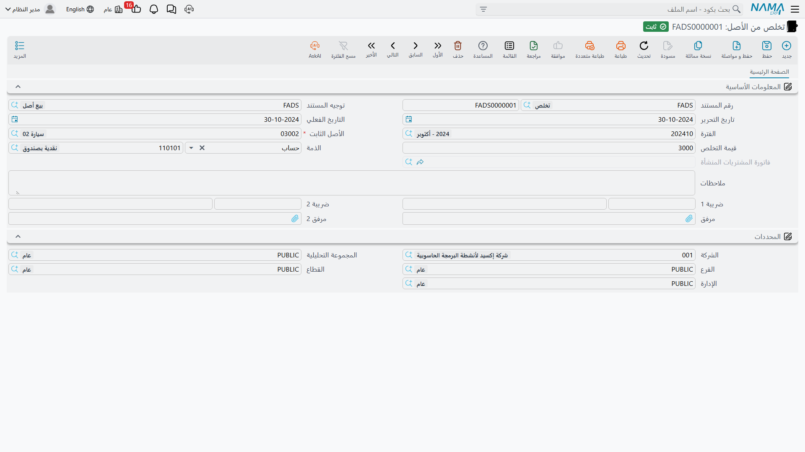
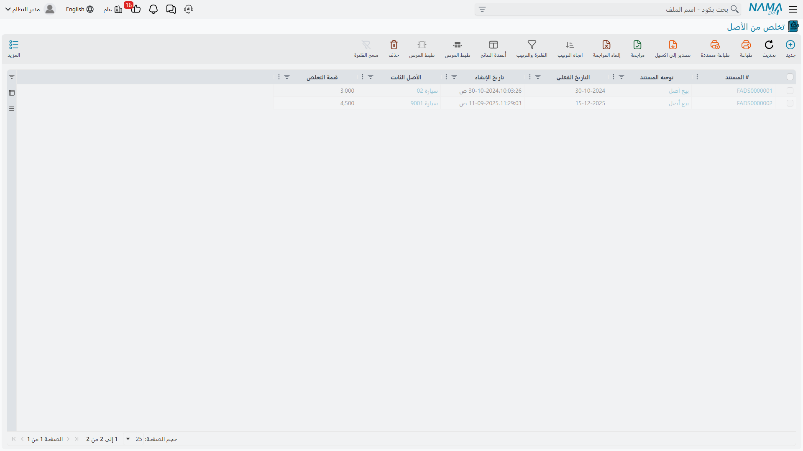

# التخلص من الأصل

كل آلة تغادر في النهاية. تُباع لمن لا يزال ينتفع بها، أو تُقطَّع خردة، أو تُهدى، أو تحترق فتختفي. وأياً
كانت الحكاية فالعمل المحاسبي واحد في الحالات كلها، ثلاث خطوات: ترفع تكلفة الأصل الأصلية من الدفاتر،
وترفع مجمَّع الإهلاك المقابل لها، وتضع ما حصَّلته في مكانه — ويستقر الفرق بين الاثنين في حساب مكسب أو
حساب خسارة.

ومستند **التخلص من الأصل** يفعل ذلك بالضبط، لأصل كامل، في اعتماد واحد.

تجده في **الأصول > المستندات > تخلص من الأصل**، على ترخيص `fixedassets`.

## لا يوجد حقل «سبب التخلص»

هذه أول نقطة تستحق الحسم، لأن كل قارئ تقريباً يصل باحثاً عنها. فشاشة التخلص لا تحمل قائمة تختار منها
*بيع / خردة / تبرع / فقد*. ولا وجود لمثل هذه القائمة في الوحدة كلها، ولا شيء في المستند يسلك سلوكاً
مختلفاً بحسب سبب مغادرة الأصل.

الذي يتفرع عليه النظام فعلاً هو الحساب: **هل حصَّلت أكثر مما كان الأصل يساوي أم أقل؟** هذا هو القرار
الوحيد الذي يتخذه المستند من تلقاء نفسه. وكل ما عداه — الحساب الذي تستقر فيه النقدية، وهل تُحتسب
ضريبة، وأي حساب مصروف يستوعب الإعدام — يأتي من **توجيه المستند** الذي تختاره في الترويسة.

فالتفرقة بين الحالات إذن يُعبَّر عنها في موضعين اثنين لا ثالث لهما:

| ما تريد تسجيله | اختر توجيهاً | واكتب قيمة تخلص |
|---|---|---|
| **بيع** | يشير جانب المتحصلات فيه إلى حساب مدين أو حساب بنكي، ومؤشَّر عليه بأنه خاضع للضريبة | ثمن البيع المتفق عليه قبل الضريبة |
| **خردة أو إعدام** | يشير حساب الخسارة فيه إلى حساب «خسائر التخلص من الأصول الثابتة»، وغير مؤشَّر عليه بأنه خاضع للضريبة | **صفر** |
| **تبرع** | يشير حساب الخسارة فيه إلى حساب مصروف التبرعات | **صفر** |
| **بيع آلة معدومة بوزنها حديداً** | توجيه البيع | المبلغ الصغير المحصَّل فعلاً |

والنتيجة العملية أن شركة لديها ثلاثة أنواع من التخلص تحتفظ بـ **ثلاثة توجيهات تخلص**، وغالباً ثلاثة
دفاتر مستندات معها، واحد لكل حالة. وهذا ما ينبغي إعداده في اليوم الأول؛ فهو أيسر كثيراً من محاولة
استخلاص أي مستندات العام الماضي كان بيعاً وأيها كان إعداماً. وما تحتويه التوجيهات نفسها مشروح في
[صفحة توجيهات الإهلاك والتخلص](/ar/modules/fixedassets/document-terms/fixedassets-terms-depreciation-and-disposal.md).

::: tip سمِّ الدفاتر بأسماء الأسباب
ما دام التوجيه هو الذي يصنِّف، فأعطِ دفاتر المستندات أسماء مطابقة — *بيع أصول*، *إعدام أصول*، *تبرع
بأصول*. عندئذ يظهر كود الدفتر على كل مستند تخلص في كل قائمة وكل تقرير، فتحصل على تحليل «السبب» دون
جهد إضافي.
:::

## لا بد أن يكون الإهلاك محدَّثاً أولاً

هذه هي القاعدة التي توقف من مستندات التخلص أكثر مما يوقفه كل ما في هذه الصفحة مجتمعاً، ولذلك يستحق
فهمها لا مجرد الامتثال لها.

فالمستند **لا** يستخرج القيمة الدفترية للأصل من شاشة الأصل، بل يذهب إلى دفتر الأستاذ العام ويسأل
سؤالين:

- ما رصيد **حساب تكلفة** هذا الأصل، لهذا الأصل بعينه، حتى تاريخ قيمة المستند؟
- ما رصيد **حساب مجمَّع إهلاكه**، لهذا الأصل بعينه، حتى التاريخ نفسه؟

والفرق بين الرصيدين هو القيمة الدفترية الصافية التي سيعتمد عليها. وهذا تصميم مقصود: فالقيد الذي يرفع
الأصل يجب أن يرفع ما هو موجود بالضبط، إلى آخر وحدة، وإلا لما خلا حساب التكلفة أبداً.

لكن معناه أن الأرقام لا تصح إلا إذا كان **كل قسط إهلاك حتى تاريخ التخلص قد رُحِّل فعلاً**. ولذلك يتحقق
المستند قبل اعتماده من ألا تكون هناك فترة مالية غير مهلَكة واقعة بين آخر قيد إهلاك للأصل وفترة
التخلص. فإن وُجدت رُفض الاعتماد.

والذي يبحث عنه هذا التحقق **فجوة**، لا نقطةَ وقوفٍ بعينها. فلا بأس البتة — بل هو الغالب المطلوب — أن
تكون فترة التخلص نفسها قد أُهلكت سلفاً: أصل بيع في 31 ديسمبر وقد نُفِّذ قسط ديسمبر وعولج، يُعتمد
مستند تخلصه دون اعتراض، إذ لم تُتجاوز فترة. وإنما الذي يرفضه هو الثقب: أن تُهلك حتى أكتوبر ثم تتخلص
في ديسمبر، فيُرفض الاعتماد برسالة تقول إن الأصل غير مهلَك حتى فترة التخلص.

::: tip ماذا تفعل إذا رُفض الاعتماد لهذا السبب
1. افتح [مستند الإهلاك](/ar/modules/fixedassets/depreciation/fixedassets-depreciation-document.md)
   ونفِّذ كل فترة فاتت الأصل، ابتداءً من آخر إهلاك له. ويكفي لرفع المنع أن تصل إلى الفترة السابقة
   للتخلص، ويُقبل مثلها أن تمضي إلى فترة التخلص نفسها فتُهلكها، وهو ما يعطيك قسطاً كاملاً في سنة البيع.
2. تأكد أن كل تشغيلة من هذه التشغيلات قد **عولجت** فعلاً — فمستند الإهلاك ينشئ قيده في دفتر الأستاذ
   على هيئة طلب أعمال في الخلفية. وما لم يكتمل هذا الطلب تظل الأرصدة التي يقرؤها مستند التخلص ناقصة.
   وطلبات الأعمال الفاشلة يُعاد تشغيلها من شاشة قائمة طلبات الأعمال: رشِّح على حالة الفشل، وحدِّد
   السطور، ثم **المزيد ← إعادة معالجة** أو **إعادة اعتماد**.
3. ثم اعتمد مستند التخلص.

ولا تلتف على هذا بتأريخ التخلص إلى الوراء في فترة مهلَكة سلفاً، فالمستند يرفض الاعتماد أيضاً إذا سُجِّل
على الأصل أي شيء **بعد** تاريخ قيمته، فلن تكون قد فعلت أكثر من استبدال رفضٍ برفض.
:::

ولا يسري هذا التحقق إلا ما دام الأصل جارياً إهلاكه. أما أصل بلغ نهاية عمره، أو أصل مؤشَّر عليه بأنه
غير قابل للإهلاك، فليس لديه ما يستدركه ويمر دون هذا التحقق.

## تعبئة المستند

الشاشة صفحة واحدة. تحمل الترويسة كتلة المستند المعتادة — دفتر المستند وكوده، وتاريخ التحرير، والتاريخ
الفعلي، والفترة — ثم الحقول الأربعة التي عليها المدار:

- **الأصل الثابت** — الأصل الذي يخرج من الخدمة. إلزامي. ولاحظ أن البحث يعرض **كل** أصول السجل، بما
  فيها ما تم التخلص منه سلفاً وما لم يدخل الخدمة بعد؛ فقواعد الحالة تُفرض عند الاعتماد لا في شاشة
  البحث، فاقرأ رسالة الخطأ ولا تفترض أن اختيارك كان خاطئاً.
- **قيمة التخلص** — ما تحصِّله مقابل الأصل، **دون الضريبة**. اكتب **صفراً** للخردة أو الإعدام أو
  التبرع. ولا يجوز أن تكون سالبة.
- **الذمة** — الطرف المقابل: من يشتري الأصل، أو الحساب الذي يحمله. وهي إشارة إلى **موظف أو خزينة أو
  حساب بنكي أو حساب أستاذ أو طرف آخر أو مورد**. ولا وجود للعميل هنا عن قصد — فبيع الأصل ليس فاتورة
  مبيعات، والوحدة لا تعامله معاملتها. فإن كان المشتري عميلاً تجارياً معتاداً فالجواب المعتاد هو
  تعريفه طرفاً آخر.
- **التاريخ الفعلي** — وهو حدُّ القطع في استعلامَي الرصيد أعلاه، وهو التاريخ الذي يُختم على الأصل
  تاريخاً للتخلص منه. أصِبْ فيه؛ فهو أكثر حقول الشاشة أثراً على الإطلاق.

وتحته زوجان ضريبيان — **ضريبة 1** و**ضريبة 2**، لكل منهما نسبة وقيمة. ولست تكتب فيهما عادة: فاختيار
التوجيه يملؤهما من سياسة الضريبة التي يشير إليها، وتعديل قيمة التخلص يعيد حسابهما. وإن لم يكن التوجيه
خاضعاً للضريبة صُفِّرت الحقول الأربعة عند الحفظ مهما كتبت فيها.

::: info كيف تستقر الضريبة على المشتري
جانب المتحصلات في التوجيه يُحمَّل بقيمة التخلص **الصافية** فقط، والضريبة زوج مدين ودائن مستقل. فإن كان
المشتري مطالباً بالمبلغ الإجمالي، وجب أن يشير جانب المتحصلات وجانب مدين الضريبة 1 في التوجيه إلى
**الحساب المدين نفسه**، حتى يجتمع المبلغان على رصيد المشتري. أما إن أشارا إلى حسابين مختلفين فسيظهر
على المدين الصافي وتستقر الضريبة في موضع آخر.
:::

وأخيراً تحمل مجموعة **المحددات** الشركة والمجموعة التحليلية والفرع والقطاع والإدارة. وهل يأخذ القيد
محدداته من هنا أم من سجل الأصل — فذلك خيار في التوجيه، فإن كانت مستندات التخلص تستقر في الفرع الخطأ
فهذا هو المفتاح الذي تبحث عنه.

### الأصول الناتجة عن التخلص

أحياناً لا يختفي الأصل بقدر ما يتفكك. تعدم خط إنتاج وتحتفظ بثلاثة محركات تستحق أن تُسجَّل أصولاً
قائمة بذاتها. ومستند التخلص يستطيع إنشاءها لك: فعلى الشاشة جدول عنوانه **الأصول الناتجه عند التخلص**
يأخذ سطراً لكل أصل جديد، بالأعمدة نفسها التي في سطر
[مستند شراء أصل ثابت](/ar/modules/fixedassets/acquisition/fixedassets-purchase-document.md): الأصل
وعدده وسعر الوحدة والقيمة والعمر الإنتاجي وقيمة الأصل كخردة وتاريخ بدء الإهلاك والمستلم والموقع.

ويحكم ظهور هذا الجدول أمران: فهو لا يظهر إلا إذا فُعِّل الخيار المقابل له في
[إعدادات وحدة الأصول الثابتة](/ar/modules/fixedassets/fixedassets-configuration.md)، ويحتاج كذلك
خاصية `createAssetsInDisposal` في الترخيص. فإن ملأته وجب أن يسمي التوجيه **دفتر وتوجيه شراء أصل
ثابت** في صفحة التأثير — وإلا رُفض الاعتماد، لأن هذه السطور تتحول خلف الكواليس إلى مستند اقتناء حقيقي.

وذلك المستند المولَّد هو ما يشير إليه حقل **فاتورة المشتريات المنشأة** للقراءة فقط في الترويسة. وهو
رغم مسمّاه ليس فاتورة مورد: بل هو **مستند اقتناء الأصول الثابتة المحرَّر للأصول المدرجة في الجدول**،
وهو الذي يُدخلها فعلاً إلى السجل.

## الحساب، وقيدان مشروحان

القاعدة سطر واحد:

> **المكسب أو الخسارة = قيمة التخلص − (رصيد التكلفة − رصيد مجمَّع الإهلاك)**

فالموجب مكسب يُضاف دائناً إلى حساب المكسب في التوجيه. والسالب خسارة تُضاف مدينة إلى حساب الخسارة
بقيمتها المطلقة. والصفر تماماً لا ينتج عنه سطر مكسب ولا خسارة أصلاً. ولا يوجد على المستند حقل
«مصروفات التخلص» بأي صورة — فإن كلَّفك بيع الآلة أجرة نقل فتلك مصروف عادي يُسجَّل في موضعه، لا شيء
يخصمه هذا المستند من الحصيلة.

### بيع بمكسب

تصل ماكينة القص `MCH-0007` في شركة الواحة للصناعات إلى نهاية 2027 على هذه الحال — 240,000 تكلفة أصلية،
زائد 30,000 لترقية وحدة التحكم رُسملت بـ
[مستند إضافة واستبعاد](/ar/modules/fixedassets/depreciation/fixedassets-additions-and-deductions.md)،
وأربع وعشرون فترة إهلاك وراءها:

| | |
|---|---|
| التكلفة في دفتر الأستاذ | 270,000 |
| مجمَّع الإهلاك في دفتر الأستاذ | 93,900 |
| القيمة الدفترية الصافية | **176,100** |

وتُباع في **31 ديسمبر 2027 بمبلغ 200,000**. وإهلاك ديسمبر قد نُفِّذ وعولج، فالرصيدان أعلاه كاملان.

> 200,000 − (270,000 − 93,900) = 200,000 − 176,100 = **23,900+ ← مكسب**

| الحساب | مدين | دائن |
|---|---|---|
| مدينون أو بنك — من جانب المتحصلات في التوجيه | 200,000 | |
| مجمَّع الإهلاك — حساب الأصل نفسه | 93,900 | |
| تكلفة الأصل — حساب الأصل نفسه | | 270,000 |
| مكسب التخلص من الأصول — من التوجيه | | 23,900 |
| **الإجمالي** | **293,900** | **293,900** |

ولاحظ من أين يأتي كل حساب. فالسطران الكبيران اللذان يخليان الأصل يستعملان حسابَي التكلفة ومجمَّع
الإهلاك **الخاصين بالأصل نفسه**، تماماً كما استُعملا يوم شرائه ويوم إهلاكه. ولا يأتي من التوجيه سوى
سطر المتحصلات وسطر المكسب. ولهذا يمكن أن يخدم توجيه واحد عشرات الأصول ذوات حسابات التكلفة المختلفة
تماماً.

### إعدام بخسارة

الرافعة الشوكية `MCH-0012` تكلفتها 60,000 ومجمَّع إهلاكها 38,000، فقيمتها الدفترية 22,000. وتُعدَم
بتوجيه خردة وقيمة تخلص **صفر**:

> 0 − (60,000 − 38,000) = **22,000− ← خسارة قدرها 22,000**

| الحساب | مدين | دائن |
|---|---|---|
| مجمَّع الإهلاك — حساب الأصل نفسه | 38,000 | |
| خسارة التخلص من الأصول — من التوجيه | 22,000 | |
| تكلفة الأصل — حساب الأصل نفسه | | 60,000 |
| **الإجمالي** | **60,000** | **60,000** |

ولا يوجد سطر متحصلات البتة. فقد بُني سطر لقيمة التخلص، ووُجد صفراً، فحُذف — وهذا عين المطلوب في
الإعدام، وهو سبب استغناء توجيه الخردة عن حساب متحصلات أصلاً.

والقيد نفسه يُنشأ على هيئة **طلب أعمال** يُعالَج في الخلفية، فيُحفظ المستند ويُعتمد فوراً ويلحق به
دفتر الأستاذ بعد لحظة. وإذا فشل الطلب — لفترة مقفلة، أو لحساب ناقص في التوجيه — فمستند التخلص يبقى
معتمداً وينتظرك الفشل في شاشة قائمة طلبات الأعمال.

## ماذا يحدث للأصل

اعتماد مستند التخلص يعيد كتابة سجل الأصل:

| على الأصل | يصير |
|---|---|
| الحالة | **تم التخلص منه** |
| قيمة التخلص | قيمة التخلص التي كتبتها |
| تاريخ التخلص | التاريخ الفعلي للمستند |
| القيمة الحالية بالنظام | صفر — وتُحفظ القيمة التي كان عليها على حدة قيمةً قبل التخلص |
| العمر المتبقي | صفر |
| القسط الحالي | صفر |

والأصل **لا يُحذف ولا يُؤرشف**. بل يبقى في السجل، وعلى شاشة القائمة، وفي التقارير، وفي تاريخه الخاص،
وحالته هي التي تروي القصة. الذي يتغير هو الشاشات التي ما زالت تقبله: فالإهلاك لا يجمع إلا الأصول
الجارى إهلاكها، ومن ثم يسقط الأصل المتخلَّص منه بهدوء من كل تشغيلة لاحقة — دون علامة تضبطها. أما
إعادة التقييم والجرد والإضافة والاستبعاد والنقل فترفضه صراحة برسالة تقول إنه تم التخلص من الأصل.
والصورة كاملة في [صفحة حالة الأصل](/ar/modules/fixedassets/master-files/fixedassets-asset-status.md).

وتعرض شاشة القائمة الأصل وقيمة التخلص إلى جانب أعمدة المستند المعتادة، وهو ما يكفي لمراجعة مستندات
تخلص الفترة بنظرة واحدة.

## بيع الأصل إلكترونياً

بيع الأصل بيع حقيقي، وفي البلاد التي تلزم بالفوترة الإلكترونية لا بد من التبليغ عنه بهذه الصفة.
ومستند التخلص مبني لذلك: فهو يقدِّم نفسه لمصلحة الضرائب فاتورةً بسطر واحد صافيه قيمة التخلص، حاملاً
الضريبتين. وتدعمه ثلاثة إجراءات على الشاشة — إجراء يتأكد من صحة المستند بالنسبة للضرائب قبل الإرسال،
وإجراءان يفتحان الفاتورة المرسلة على بوابة المصلحة.

والقيد الوحيد الذي ينبغي معرفته سلفاً هو الطرف المقابل. فالمستلم المبلَّغ عنه للمصلحة هو ذمة المستند،
ولذلك يجب أن يكون طرفاً تستطيع المصلحة تعريفه — **مورداً أو طرفاً آخر أو موظفاً**. أما مستند تخلص
مسجَّل على حساب بنكي أو حساب أستاذ عادي فليس لديه من يسميه مشترياً ولا يمكن إرساله.

ولا يوجد جدول سداد على مستند التخلص. فإن كان المشتري يسدد على أقساط فالمديونية المنشأة هنا تُسوَّى
بالطريقة المعتادة، بسندات قبض على الطرف الآخر.

## الإجراءات في هذه الشاشة

ليس في مستند التخلص أزرار خاصة به. فكل ما قرأته أعلاه يحدث بما تكتبه وبما يفعله الاعتماد: تُحسب
القيمة الدفترية مع ملء الحقول، ويخرج الربح أو الخسارة من الحساب نفسه، وتتغيّر حالة الأصل عند
الاعتماد. وللعكس تُلغي الاعتماد أو تحذف المستند — ولا يوجد زر عكس ولا حاجة إليه.

## التراجع عن التخلص

لا يوجد زر «عكس»، ولا حاجة إليه: **ألغِ اعتماد المستند أو احذفه** فيُنقض كل ما فعله.

1. تعود حالة الأصل إلى ما كانت عليه قبل التخلص مباشرة — فالمستند يحفظها، ومن ثم يعود الأصل المهلك
   بالكامل مهلكاً بالكامل لا جارياً إهلاكه.
2. تُمحى قيمة التخلص وتاريخ التخلص.
3. يُحذف قيد التخلص من تاريخ الأصل ويُعاد توجيه الأصل إلى القيد السابق له، فتعود القيمة الدفترية
   والعمر المتبقي والقسط كما كانت.
4. يُرسَل طلب حذف إلى دفتر الأستاذ فيزول القيد.
5. ويُحذف معه مستند الاقتناء المولَّد للأصول الناتجة، إن وُجد.

ويوقف ذلك موقفان، وكلاهما يحميك من فوضى أكبر:

- **حدوث شيء للأصل بعد التخلص.** فإن وُجد على الأصل أي قيد لاحق رُفض إلغاء الاعتماد وذكرت الرسالة
  المستند المانع. عالج ذلك المستند أولاً.
- **بقاء مستند الاقتناء المولَّد مرتبطاً بغيره.** فإن كانت الأصول الناتجة عن التخلص قد استُعملت في
  مستندات أخرى تعذر حذف مستند التخلص حتى تزول تلك الروابط.

ولست مضطراً دائماً إلى إلغاء الاعتماد. فمستند التخلص المعتمد يمكن **تعديله** ببساطة — بما في ذلك تغيير
الأصل الذي يشير إليه. وعندها يُستعاد الأصل السابق استعادة كاملة، تماماً كما لو ألغيت الاعتماد، قبل
تطبيق كل شيء على الأصل الجديد. وهذا هو العلاج النظيف للخطأ الكلاسيكي: التخلص من الأصل الخطأ من بين
آلتين متشابهتين.

## إلى أين بعد ذلك

- إذا كان الخارج بعض أصل معدود لا كله — ثلاثة مكاتب من عشرة — فانظر
  [صفحة التخلص الجزئي](/ar/modules/fixedassets/disposal/fixedassets-partial-disposal.md).
- ولمجموعة أصول تخرج دفعة واحدة انظر
  [صفحة التخلص المجمع](/ar/modules/fixedassets/disposal/fixedassets-aggregated-disposal.md).
- وإن كان الخارج حاسباً محمولاً أو هاتفاً مسلَّماً لموظف لا أصلاً مسجَّلاً، فذاك
  [التخلص من العهدة](/ar/modules/fixedassets/custody/fixedassets-custody-disposal.md) لا هذا.
- وإذا احتاج قيد مستند تخلص إلى إعادة بناء بعد تصحيح حسابات التوجيه، فإن
  [أدوات الأصول الثابتة](/ar/admin/reprocessing/fixed-asset-utilities.md) الإدارية تستطيع إعادة
  توليد التأثيرات بالجملة.
