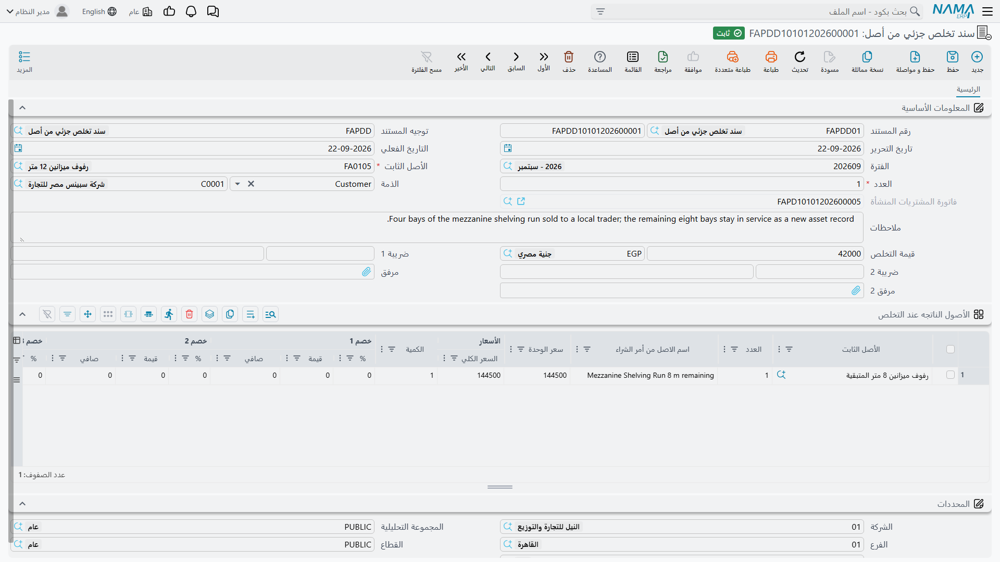
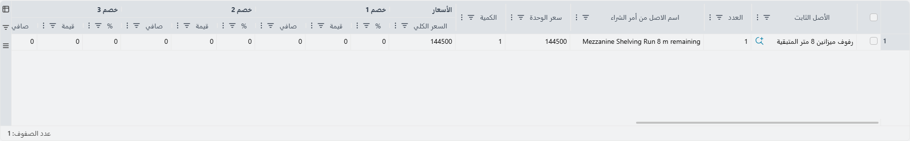

# التخلص الجزئي من أصل

ليس كل سجل أصل شيئاً واحداً. فحين اشترت شركة الواحة للصناعات عشرة مكاتب متطابقة في توريد واحد، كان
تسجيلها عشرة أصول منفصلة يعني عشرة سطور إهلاك كل شهر لبقية العقد، دون أي فائدة تحليلية على الإطلاق.
ولذلك سُجلت المكاتب **أصلاً معدوداً واحداً** — `FRN-0021`، *مكاتب مكتبية (10)* — بعدد عشرة.

ويمضي ذلك على خير ما يرام حتى تُباع ثلاثة من المكاتب. فالأصل لا يغادر، وإنما يغادر بعضه. ولهذا وُضع
**سند التخلص الجزئي من أصل**.

تجده في **الأصول > المستندات > سند تخلص جزئي من أصل**، على ترخيص `fixedassets`.

## ما معنى «الجزئي» هنا

معناه **عدد من الوحدات من أصل معدود**. لا غير.

فهو **ليس** نسبة من قيمة الأصل — لا تستطيع التخلص من «40% من آلة». وهو **ليس** جزءاً مسمّى ولا مكوناً
— فالمستند لا يحمل بنية مكونات أصلاً، و[المكونات](/ar/modules/fixedassets/master-files/fixedassets-components.md)
التي تعرِّفها لأغراض الصيانة لا شأن لها به. فإن أردت إعدام وحدة تحكم تالفة في آلة فذلك استبعاد على
[مستند إضافة واستبعاد](/ar/modules/fixedassets/depreciation/fixedassets-additions-and-deductions.md)،
لا تخلص جزئي.

ومن ثم فالأصل الذي تشير إليه بهذا المستند لا بد أن يكون مؤشَّراً عليه بأنه **معدود**، والعدد الذي
تكتبه لا بد أن يكون متاحاً. وشاشة البحث في الحقل تعرض الأصول المؤهلة بالضبط: المعدودة الجارى إهلاكها.
فإن غاب عن القائمة أصل تتوقعه فالسبب في الغالب أنه لم يؤشَّر عليه بأنه معدود يوم تسجيله.

وكل ما عدا ذلك في هذه الصفحة — كيف يُحسب المبلغ، وكيف يبدو القيد، ومتى يُرفض الاعتماد — يجري على منطق
[التخلص الكامل](/ar/modules/fixedassets/disposal/fixedassets-disposal.md) نفسه، بما في ذلك قاعدة أن
يكون الإهلاك قد نُفِّذ وعولج دون تخطّي فترة قبل المستند. فاقرأ تلك الصفحة أولاً؛ وهذه الصفحة لا تتناول
سوى الفروق.

## الشاشة

الترويسة هي ترويسة التخلص الكامل مع تغييرين:

- **العدد** — كم وحدة تخرج. إلزامي.
- **قيمة التخلص** — وهي هنا مبلغ بعملته الخاصة، تصل معبأة بالعملة التي تعمل بها. وهي كما في التخلص
  الكامل ما تحصِّله قبل الضريبة، وتكون **صفراً** في حالة الخردة.

وتسمّي **الذمة** الطرف المقابل، و**التاريخ الفعلي** هو حدُّ القطع لأرصدة دفتر الأستاذ التي يقرؤها
المستند، وتحمل مجموعة **المحددات** الشركة والمجموعة التحليلية والفرع والقطاع والإدارة. وقيود التخلص
الجزئي تأخذ محدداتها دائماً من المستند.

أما الضريبة على التخلص الجزئي فتُعالَج عبر **ضريبة 1** — تُملأ نسبتها وقيمتها من سياسة الضريبة في
التوجيه عند اختياره، ويُعاد حسابهما عند تغيير قيمة التخلص.

ولا يوجد «سبب» هنا أيضاً. فكما في التخلص الكامل، يُفرَّق بين البيع والخردة بالتوجيه الذي تختاره وبما
تكتبه في قيمة التخلص.

::: info حساب واحد للمكسب والخسارة معاً
يختلف توجيه التخلص الجزئي عن توجيه التخلص الكامل في نقطة واحدة تهمك عند الإعداد. فصفحته المحاسبية تحمل
**جانب متحصلات** ومجموعة واحدة عنوانها *حساب المكسب - الخسارة* — حساب واحد يُجعل دائناً إذا خرجت
الوحدات بمكسب ومديناً إذا خرجت بخسارة. أما فصل حساب المكسب عن حساب الخسارة، وهو متاح في التخلص الكامل،
فغير متاح هنا. فإن كان دليلك المحاسبي يشترط الفصل بينهما فاستعمل تخلصاً كاملاً لآخر الوحدات، واحتفظ
بالتخلص الجزئي للحالات التي يكون اتجاهها معلوماً سلفاً.
:::

## الحساب

يقرأ المستند رصيدَي دفتر الأستاذ اللذين يقرؤهما التخلص الكامل — حساب تكلفة الأصل وحساب مجمَّع إهلاكه،
لهذا الأصل، حتى التاريخ الفعلي — ويأخذ من كل منهما **بنسبة عدد الأصل**:

- **التكلفة المرفوعة** = رصيد التكلفة ÷ العدد × الوحدات المتخلَّص منها
- **مجمَّع الإهلاك المرفوع** = رصيد مجمَّع الإهلاك ÷ العدد × الوحدات المتخلَّص منها

ثم، كما في التخلص الكامل تماماً:

> **المكسب أو الخسارة = قيمة التخلص − (التكلفة المرفوعة − مجمَّع الإهلاك المرفوع)**

### ثلاثة مكاتب من عشرة

يقف `FRN-0021` عند تكلفة **40,000** ومجمَّع إهلاك **12,000**، فقيمته الدفترية **28,000** موزعة على
عشرة مكاتب. وتُباع ثلاثة منها لأحد الموظفين بمبلغ **9,000**.

| | العملية | الناتج |
|---|---|---|
| التكلفة المرفوعة | 40,000 ÷ 10 × 3 | **12,000** |
| مجمَّع الإهلاك المرفوع | 12,000 ÷ 10 × 3 | **3,600** |
| القيمة الدفترية للمكاتب الثلاثة | 12,000 − 3,600 | 8,400 |
| المكسب | 9,000 − 8,400 | **600+** |

| الحساب | مدين | دائن |
|---|---|---|
| مدينون أو بنك — من جانب المتحصلات في التوجيه | 9,000 | |
| مجمَّع الإهلاك — حساب الأصل نفسه | 3,600 | |
| تكلفة الأصل — حساب الأصل نفسه | | 12,000 |
| المكسب والخسارة من التخلص — من التوجيه | | 600 |
| **الإجمالي** | **12,600** | **12,600** |

ولو أن المكاتب الثلاثة أُهديت بدل أن تُباع لكانت قيمة التخلص صفراً ولجُعل الحساب الواحد نفسه **مديناً**
بمبلغ 8,400 خسارةً.

### كيف يصير الأصل بعدها

| على `FRN-0021` | قبل | بعد |
|---|---|---|
| التكلفة | 40,000 | **28,000** |
| مجمَّع الإهلاك | 12,000 | **8,400** |
| القيمة الدفترية | 28,000 | **19,600** |
| العدد الحالي | 10 | **7** |
| العدد المتخلص منه | 0 | **3** |
| الحالة | جارى الإهلاك | **جارى الإهلاك** |

فالحالة لا تتغير. والأصل باقٍ، ولا يزال يُهلك، غير أنه صار أصغر — وهذا هو مقصود المستند كله.

## ماذا يحدث لجدول الإهلاك

هذه هي النقطة التي يخطئ فيها الناس عند أول لقاء بالمستند، فتستحق تقريراً صريحاً: **العمر المتبقي لا
يتغير، والقسط الشهري يتغير.**

فالتخلص الجزئي لا يمس خصائص الأصل — لا العمر الإنتاجي، ولا العمر المتبقي، ولا قيمة الأصل كخردة. الذي
يغيّره هو القيمة الدفترية، والقسط يُعاد اشتقاقه منها كل فترة بمعادلة *(القيمة الدفترية − قيمة الأصل
كخردة) ÷ العمر المتبقي*، تماماً كما هو مشروح في
[صفحة مفاهيم الإهلاك](/ar/modules/fixedassets/depreciation/fixedassets-depreciation-concepts.md).

فلنفترض أن المكاتب سُجلت بلا قيمة كخردة وأن أمامها 40 فترة:

- قبل: 28,000 ÷ 40 = **700** للفترة
- بعد: 19,600 ÷ 40 = **490** للفترة

فتنتهي المكاتب السبعة الباقية من الإهلاك في التاريخ نفسه الذي كانت العشرة ستنتهي فيه. ولا ينقص إلا حجم
القسط، وينقص بالنسبة نفسها التي نقصت بها القيمة، وهي 30%.

## الإجراءات في هذه الشاشة

ليس في شاشة التخلص الجزئي أزرار خاصة بها. فالكمية التي تكتبها هي التي تقود كل شيء: نسبة التكلفة
ومجمَّع الإهلاك المرفوعة، والربح أو الخسارة، وسجل الأصل الجديد للجزء المستبقى إن طلبته. وكل ذلك يحدث
عند الاعتماد.

## ما يمنع الاعتماد

| القاعدة | لماذا وُضعت |
|---|---|
| أن يكون الأصل **معدوداً** | إذ لا عدد يُقتطع منه فيما سواه |
| أن يتفق العدد مع ما يحمله الأصل فعلاً | فلا تتخلص من وحدات أكثر مما هو موجود، ولا أكثر مما هو داخل |
| ألا يُسجَّل على الأصل شيء **بعد** التاريخ الفعلي للمستند | لأن الأرقام النسبية تُحسب على أرصدة ذلك التاريخ، فمستند لاحق يبني على أساس خاطئ |
| ألا يكون الأصل في حالته الابتدائية، ولا متخلَّصاً منه بالكامل | إذ لا قيمة في الدفاتر تُرفع |
| أن يكون الإهلاك متتابعاً حتى فترة المستند | لأن مجمَّع الإهلاك المرفوع يجب أن يكون الرقم المرحَّل الحقيقي |
| إن مُلئ جدول الأصول الناتجة وجب أن يسمي التوجيه دفتر وتوجيه شراء أصل ثابت | لأن تلك السطور تصير مستند اقتناء حقيقياً |

وقاعدة الإهلاك وحدها لها مخرج. فتوجيه التخلص الجزئي يحمل خياراً اسمه *السماح بعمل سند تخلص جزئي لاصل
رغم عدم إنشاء سند الاهلاك للشهور السابقة*، يسمح باعتماد المستند حتى لو لم تُهلك فترات سابقة.

::: tip تمهّل قبل تفعيل هذا الخيار
فهو لا يغيّر الحساب، وإنما يرفع التحقق فقط. ومجمَّع الإهلاك الذي يرفعه القيد يظل هو المرحَّل فعلاً في
دفتر الأستاذ حتى التاريخ الفعلي، فمع غياب الفترات السابقة سترفع إهلاكاً أقل مما تحمله المكاتب حقيقةً،
ويخرج المكسب أعلى بالقدر نفسه. فاستعمل الخيار حين تحتاج فعلاً إلى تسجيل تخلص قبل استدراك متأخرات
الإهلاك، وتوقّع تسوية الفرق بعدها؛ ولا تتركه مفعَّلاً من باب التيسير.
:::

## الأصول الناتجة عن التخلص الجزئي

يحمل التخلص الجزئي جدول **الأصول الناتجه عند التخلص** نفسه الذي يحمله التخلص الكامل: موضع تسجّل فيه ما
تحتفظ به من الوحدات التي خرجت.

وكل سطر فيه سطر شراء أصل ثابت — الأصل وعدده وسعر الوحدة والقيمة والعمر الإنتاجي وقيمة الأصل كخردة
وتاريخ بدء الإهلاك والمستلم والموقع. وعند الاعتماد تتحول هذه السطور إلى مستند اقتناء حقيقي، يشير إليه
بعدئذٍ الحقل المخصص له في الترويسة. فإن ملأت الجدول وجب أن يسمي التوجيه دفتر الشراء وتوجيهه اللذين
سيستعملهما ذلك المستند.

## التراجع عن التخلص الجزئي

ألغِ اعتماد المستند أو احذفه فينعكس كل شيء: يُرفع القيد من دفتر الأستاذ بطلب حذف، ويُحذف قيده من تاريخ
الأصل، وتُعاد القيمة الدفترية والقسط إلى ما كانا عليه بدونه، وينزل العدد المتخلص منه ويرتفع العدد
الحالي. وكما في التخلص الكامل، يُرفض إلغاء الاعتماد إذا سُجِّل على الأصل شيء بعده — فعالج ذلك المستند
أولاً.

::: tip إخراج آخر الوحدات
التخلص الجزئي مصمَّم لاقتطاع شريحة من أصل يستمر. فإذا خرجت آخر الوحدات ووجب أن يُغلق سجل الأصل نفسه،
فاستعمل [مستند التخلص الكامل](/ar/modules/fixedassets/disposal/fixedassets-disposal.md) بدلاً منه:
فهو يخلي الرصيد الباقي كله إلى آخر وحدة، ويضبط حالة الأصل على «تم التخلص منه»، وهو ما يتوقعه السجل —
وكل ما يقرأ منه — في نهاية المطاف.
:::
