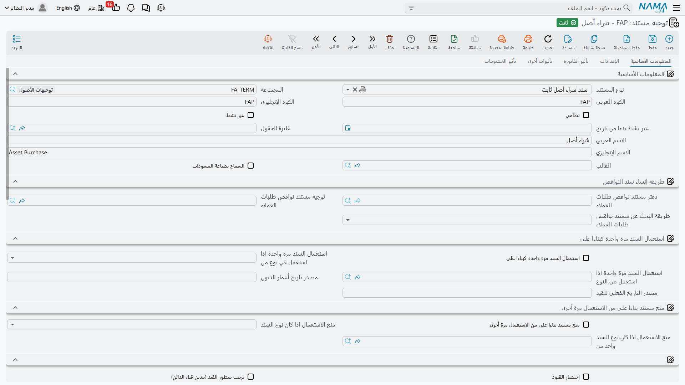

# توجيهات اقتناء الأصول

كل ما في هذه المجموعة يجيب عن سؤال واحد: **حين يصل الأصل، من الذي يُجعل دائنًا؟** أما جانب الأصل من
القيد فليس موضع شك — هو حساب تكلفة الأصل نفسه، المأخوذ من حافظة حساباته. والذي يوفّره التوجيه هو النصف
الآخر: المورد الدائن، ومصلحة الضرائب، والخصومات، والحساب الوسيط الذي يحمل الرصيد الافتتاحي.

إن لم تكن قد قرأت [كيف تعمل التوجيهات](/ar/modules/fixedassets/document-terms/fixedassets-terms-basics.md)
فابدأ منها، وخاصة الفقرة التي تشرح أن الأصل هو مصدر الحساب، لأنها تفسّر لماذا تحمل هذه الشاشات خانات
حسابات أقل مما تتوقع.

## توجيه سند شراء الأصل الثابت

هذا هو التوجيه الذي يقوم بالعمل الحقيقي. تشتري شركة الواحة `MCH-0007` من الخليج لتجارة الآلات بمبلغ
240,000 زائد ضريبة قيمة مضافة 15%، ويقرر التوجيه كل شيء في القيد الناتج ما عدا حساب الأصل نفسه.

والشاشة أربع صفحات.

### الصفحة الأولى — الإعدادات

تحمل الصفحة الأولى هوية التوجيه نفسه — نوع المستند والكود والاسم — يليها السلوك الضريبي الذي يرثه كل سند
شراء يستخدم هذا التوجيه:

| الخيار | ما الذي يتغيّر |
|---|---|
| خاضع للضريبة | يُظهر أعمدة الضريبة على المستندات التي تستخدم التوجيه |
| سياسة الضريبة | السياسة التي تُحسب منها ضرائب الرأس |
| الضريبة قابلة للتعديل | هل يجوز للمستخدم أن يكتب فوق قيمة ضريبة محسوبة |
| تعديل ضريبة الرأس في التفاصيل | هل يجوز لسطر أن يخالف ضرائب الرأس |
| منع إضافة الضريبة 1 إلى 4 | يمنع إضافة ضريبة بعينها على السطر مهما قالت السياسة |
| الربط مع أسطر الفاتورة في المستند المحاسبي | يربط كل سطر قيد بسطر الفاتورة الذي أنتجه، فيُقرأ القيد سطرًا بسطر |

ثم الخيار الذي يأتي الناس إلى هذه الشاشة من أجله:

**إنشاء الأصول إذا لم تكن موجودة** يقرر هل يجوز لسند الشراء أن **يُنشئ سجل الأصل الثابت بنفسه**. فحين
يكون مغلقًا — وهو الوضع المعتاد — يجب أن يشير كل سطر إلى أصل موجود بالفعل في حالته المبدئية، ويفشل ترحيل
سطر بلا أصل. وحين يكون مفتوحًا، فالسطر الذي لا يسمّي أصلًا يُنتج أصلًا عند الترحيل، آخذًا الاسم والنوع
والتصنيفات ومسؤول العهدة والموقع من أعمدة السطر نفسه.

::: tip أي الوضعين تريد؟
استخدم توجيهين. احتفظ بتوجيه شراء عادي والخيار فيه **مغلق** للحالة اليومية التي تكون فيها سجلات الأصول
مُعدّة سلفًا، وبتوجيه ثانٍ والخيار فيه **مفتوح** للتوريدات الكبيرة التي تنشئ فيها السجل أثناء الشراء. ولا
تمرّر الأصول القائمة عبر التوجيه المُنشِئ: فذلك التوجيه للأسطر التي تحمل بيانات أصلها معها.
:::

### الصفحة الثانية — تأثير الفاتورة

هنا يسكن الجانب الدائن. هذا هو الحساب المقابل للأصل — حساب الموردين عادةً — بحيث يترك ترحيل الشراء
المورد دائنًا.

وإلى جانبه:

- **اختصار القيد** — يجمع القيد في أسطر أقل بدل سطر لكل سطر فاتورة.
- **سداد الأقساط بالترتيب** — يفرض سداد جدول الأقساط من الأقدم.
- **تحديث محددات الأصل من الفاتورة** — يدفع الشركة والقطاع والفرع والإدارة والمجموعة التحليلية من السطر
  إلى الأصل نفسه، فيرث الأصل محددات المستند الذي اشتراه.

### الصفحتان الثالثة والرابعة — تأثيرات أخرى وتأثيرات الخصم

تحمل الصفحة الثالثة جانب النقدية وأربع مجموعات لحسابات الضرائب، معنونة `tax1` إلى `tax4` على الشاشة. وكل
مجموعة جانب محاسبي كامل، فيمكن توجيه ضريبة إلى حساب مختلف في كل توجيه.

وتحمل الصفحة الرابعة حسابات الخصم: جانب خصم السطر، وجانب خصم الفاتورة، وسبع خانات خصم أخرى تحت عناوين
المجموعات `additionalDiscount2` إلى `additionalDiscount8`. وفيها أيضًا **الجانب الآخر** لكل ضريبة وخصم،
وجدول أسطر التأثيرات الخارجية للقيود التي يجب أن تصل إلى حسابات خارج مدى هذا المستند المعتاد.

### مثال تطبيقي — `MCH-0007`

التوجيه `FAPD-01`: خاضع للضريبة، سياسة ضريبة 15%، وخيار «إنشاء الأصول إذا لم تكن موجودة» **مغلق**،
والجانب الدائن حساب الموردين، ومدين الضريبة 1 حساب ضريبة المشتريات.

سند شراء بتاريخ 1 يناير 2026، بسطر واحد: `MCH-0007` بقيمة 240,000، عمر إنتاجي 60 شهرًا، وقيمة خردة
24,000.

| | مدين | دائن |
|---|---|---|
| حساب تكلفة `MCH-0007` — *من الأصل* | 240,000 | |
| ضريبة المشتريات — *من مدين الضريبة 1 في التوجيه* | 36,000 | |
| الخليج لتجارة الآلات — *من الجانب الدائن في التوجيه* | | 276,000 |

سطران فقط من الثلاثة قرّرهما التوجيه. أما الأول فجاء من الماكينة.

## عروض الأسعار وأوامر الشراء والاستلام المبدئي

عرض سعر الأصل وأمر الشراء وسند الاستلام المبدئي تُضبط عبر ترتيب واحد مشترك، وهو ترتيب قصير: نوع المستند
والكود والاسم، ونفس إعدادات الضريبة الموجودة على الصفحة الأولى من توجيه الشراء.

وليس فيها شيء آخر عن قصد، لأن **أيًّا من هذه المستندات الثلاثة لا يصل إلى الأستاذ**. هي تحسب الأسعار
والخصومات والضرائب لتقارن عرضًا بعرض وتمرّر الأرقام إلى ما بعده — لكن لا شيء يُقيَّد حتى يُحرَّر سند
شراء. فتعامل مع أرقام الضريبة على العرض أو الأمر بوصفها معلوماتية: تخبرك كيف ستبدو الفاتورة، ولا تُنشئ
التزامًا.

ويشترك طلب الشراء في نفس الضبط، وهو يحتاج أقل من ذلك: الطلب يسجّل ما يريده أحدهم، بلا أسعار وبلا آثار.

## توجيه الافتتاح

مستند الافتتاح يُدخل إلى نظام نما أصولًا تمتلكها بالفعل — ماكينة اشتُريت في 2023 وأُهلك منها 120,000 في
نظام سابق. وقيده مبنيّ بالكامل من حسابات الأصل نفسه ومن الحساب الوسيط الذي تكتبه على المستند، ولذلك **لا
يحمل توجيه الافتتاح أي جوانب محاسبية على الإطلاق**.

الذي يحمله بدلًا من ذلك أربعة مفاتيح، وهي موجودة لأن البيانات القديمة لا تصل نظيفة أبدًا. كل مفتاح منها
يغيّر طريقة اشتقاق التواريخ والعمر المتبقي مما كتبته:

- مفتاح يجعل تاريخ آخر إهلاك للأصل نهاية **شهر المستند نفسه** بدل نهاية الفترة المالية السابقة — وهو مفيد
  حين يقع تاريخ بدء التشغيل في منتصف فترة.
- مفتاح يعالج الأصول التي تصل **مُهلَكة بالكامل**: يجعل العمر المتبقي صفرًا ويحسب تاريخ بدء الإهلاك
  رجوعًا من العمر الإنتاجي.
- مفتاح يشتق تاريخ بدء الإهلاك من **الفرق بين العمر الإنتاجي والعمر المتبقي**، للسجلات التي دوّنت العمر
  المتبقي دون تاريخ بدء.
- مفتاح يخبر النظام أن **يُبقي العمر المتبقي الذي كتبته** بدل إعادة حسابه من التواريخ الموجودة على السطر.

اختر الزوج الذي يناسب شكل البيانات التي تُدخلها، وحمّل حفنة من الأصول، وراجع الأقساط الناتجة قبل تحميل
البقية. أما توجيه تعديل الافتتاح، المستخدم لتصحيح افتتاح بعد وقوعه، فلا يحمل ضبطًا محاسبيًا.

## توجيه سند استلام وتسليم العهد

هذا المستند يسلّم كل ما بحوزة موظف — أصولًا ثابتة وعهدًا على السواء — إلى شخص آخر. وتوجيهه صفحتان، صفحة
لكل طرف من طرفي التسليم، وكل صفحة تحمل جانبًا مدينًا وجانبًا دائنًا.

والمبلغ واحد على كل جانب تضبطه: إجمالي قيمة **العهد** الموجودة على المستند. أما الأصول الثابتة على
المستند فتنتقل بمسؤول العهدة دون أن تسهم بقيمة، فتسليم آلات وحدها ينقل الأوراق دون أن ينقل مالًا.

وهذا التناظر يستحق الفهم قبل الضبط: كل جانب تملؤه يُقيَّد بنفس الإجمالي، فاضبط الزوج الذي يمثّل القيد
الذي تريده فعلًا — فملء الجوانب الأربعة يقيّد القيمة مرتين.

وتحمل الصفحة أيضًا **تغيير مسؤول العهدة في الأصل**، وهو يقرر هل يعيد التسليم كتابة مسؤول العهدة الظاهر على
سجل الأصل الثابت، أم يكتفي بإضافة سطر إلى سجل عُهَده.

## توجيه سند إنشاء الأصول

سند إنشاء الأصول يولّد سندات شراء للأصول التي ينشئها، ووجود توجيهه هو ليقول أي **دفتر وتوجيه تستخدمه سندات
الشراء المولَّدة**. وجّهه إلى توجيه الشراء الذي ضبطته أعلاه، فتصير المستندات المولَّدة موصَّلة تمامًا مثل
سند شراء مكتوب باليد.

## مستندات هذه المجموعة التي بلا توجيه

**مستند أستلام أصل** — المذكّرة التي تسجّل من استلم الأصل وأين استقر — بلا توجيه وبلا حقل توجيه على شاشته.
فهو يكتب مسؤول عهدة وموقعًا على الأصل ولا يُنتج قيدًا، فليس فيه ما يُضبط. راجع
[الاستلام](/ar/modules/fixedassets/acquisition/fixedassets-receipts.md) لمعرفة كيف يُستخدم.
