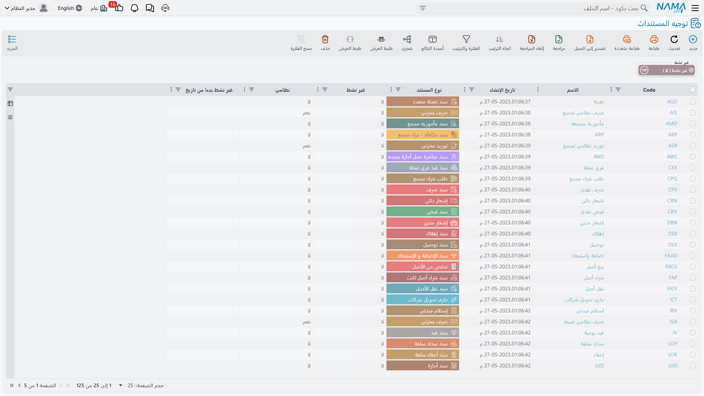

# كيف تعمل توجيهات مستندات الأصول الثابتة

مستند الأصل الثابت يعرف **ماذا حدث**. فحين تشتري شركة الواحة للصناعات ماكينة القص `MCH-0007` بمبلغ
240,000، يعرف سند الشراء الأصل والمورد والقيمة والتاريخ. أما ما لا يعرفه فهو **أي الحسابات** يجب أن
تتحرك بهذه الـ 240,000، وهل يُنشئ سجل الماكينة بنفسه، وماذا يفعل بضريبة القيمة المضافة.

هذه هي مهمة **توجيه المستند**. الدفتر يعطي المستند رقمه ونطاقه، أما التوجيه فيعطيه توصيلاته المحاسبية
ومفاتيح سلوكه. سندا شراء في نفس الدفتر وعلى توجيهين مختلفين قد يذهبان إلى حسابات مختلفة تمامًا.

## أين تسكن التوجيهات وكيف يجد المستند توجيهه

توجيهات الأصول الثابتة ليست في قائمة الأصول. هي سجلات **توجيه مستند** عادية تُحفظ مع توجيهات باقي
الوحدات، والذي يجعل أحدها توجيهًا للأصول الثابتة هو **نوع المستند** المختار فيه: اختر «سند شراء أصل
ثابت» فتظهر لك صفحات الشراء، واختر «تخلص من الأصل» فتظهر لك صفحات التخلص بدلًا منها. الشاشة التي تراها
يحددها هذا الحقل وحده.

ثم يختار المستند توجيهه من حقل **توجيه المستند** في رأسه، بجوار الدفتر والكود. ومعظم مستندات الأصول
الثابتة تحمل هذا الحقل. أما بعضها — مستند استلام الأصل، وعرض السعر، وسندا الخروج والرجوع —
فلا يطلب توجيهًا أصلًا، لأنه لا يوجد فيه ما يُوصَّل.

::: tip توجيه لكل قصة محاسبية
التوجيهات رخيصة، وهي المكان الطبيعي للفصل بين قصتين تتشاركان شاشة واحدة. تحتفظ الواحة بتوجيهي تخلص:
أحدهما يجعل الطرف المدين ذمة عميل للماكينات التي تبيعها، والآخر يجعله حساب خسائر خردة للماكينات التي
تتخلص منها. نفس نوع المستند، ونفس الشاشة، وحسابات مختلفة.
:::

## الجانب المحاسبي — كتلة واحدة تتكرر في كل مكان

كل مجموعة «مدين» أو «دائن» أو «حساب المكسب» أو «حساب الخسارة» على أي شاشة توجيه في هذه الوحدة هي نفس
كتلة الحقول القياسية. تعلّمها مرة واحدة، فتصير كل شاشات التوجيه في الوحدة مقروءة:

| الحقل | السؤال الذي تجيب عنه |
|---|---|
| الجانب المحاسبي | هل يُستخدم هذا الجانب أصلًا، وكيف يتصرف |
| نوع مصدر الحساب | من أين يأتي الحساب — حساب ثابت تسميه هنا، أم حساب يُجلب من شيء على المستند |
| الحساب | الحساب الثابت، حين تسميه مباشرة |
| نوع المرجع والحقل مصدر المرجع | حين يأتي الحساب من مرجع: من المورد على المستند مثلًا، أو من الموظف الذي بحوزته العهدة |
| نوع الحافظة | أي خانة من حافظة حسابات ذلك المرجع تُقرأ |
| كود الحساب من الحقيبة | أي حساب داخل الحقيبة، حين تحمل الحقيبة أكثر من حساب |
| قوالب واستعلامات الشرح | نص الشرح المكتوب على سطر القيد |
| مصدر المجموعة التحليلية | من أين تأتي المجموعة التحليلية على السطر |

فكرة «مصدر الحساب» هي ما يجعل توجيهًا واحدًا يخدم مئات الأصول. أنت لا تسمّي حساب تكلفة الآلات على توجيه
الشراء، بل تقول للتوجيه «خذ الحساب من الأصل الثابت»، فيمتد كل سطر إلى حسابات أصله هو.

## الأصل هو مصدر الحساب في كل شيء تقريبًا

هذه هي الحقيقة الواحدة التي تفسّر معظم توجيهات الأصول الثابتة، وهي سبب بدو كثير منها نصف فارغ.

كل أصل ثابت يحمل حافظة حسابات، يرثها عادةً من
[نوع الأصل](/ar/modules/fixedassets/master-files/fixedassets-asset-types.md). وثلاث خانات في هذه
الحافظة لها معنى ثابت في هذه الوحدة:

| الخانة | التسمية | ما تنشره الوحدة فيها |
|---|---|---|
| الحساب الرئيسي | حساب الأصل | تكلفة الأصل: الشراء، وتكلفة الاعتماد المستندي، والإضافة والاستبعاد، والافتتاح، والتخلص |
| الحساب 01 | حساب الإهلاك | مصروف الإهلاك في كل فترة |
| الحساب 02 | حساب الإهلاك التراكمي | الإهلاك المجمع، وعكسه عند التخلص |

ولأن الوحدة تعرف مسبقًا أين تجد هذه الحسابات، **فلا حاجة للتوجيه أن يسمّيها**. حين يُهلَك `MCH-0007`
بمبلغ 3,600 في يناير 2026، يأتي كلا حسابي القيد من الماكينة نفسها. أما مساهمة التوجيه فهي نص الشرح، وفي
بعض المستندات: **الجانب الآخر** — المورد الدائن، أو العميل المشتري، أو الحساب الذي يستوعب المكسب.

فحين لا تعرض عليك شاشة توجيه سوى جانب محاسبي واحد، فهذا في الغالب ليس نقصًا، بل هو الوحدة تخبرك أن الأصل
يوفّر الجانب الآخر.

أما باقي خانات حافظة الحسابات فليس لها معنى مبني داخل الأصول الثابتة؛ هي عناوين احتياطية يمكن لتوجيه أن
يشير إليها، لا أكثر.

## ماذا يتحكم فيه توجيه كل نوع مستند

هذا هو الجدول الذي يأتي معظم القراء من أجله، وهو مرتب حسب العمل الذي تؤديه لا حسب القائمة.

### اقتناء الأصول

| المستند | له توجيه؟ | ما الذي يتحكم فيه التوجيه |
|---|---|---|
| سند شراء أصل ثابت | نعم | جانب المورد الدائن، وجوانب حسابات الضرائب والخصومات، وإعدادات الضريبة، وهل يُنشئ المستند سجل الأصل بنفسه |
| أمر شراء أصل | نعم | إعدادات الضريبة فقط — الأمر لا يُنتج قيدًا |
| عرض سعر أصل | نعم | إعدادات الضريبة فقط |
| طلب شراء أصل | يشترك مع توجيه أمر الشراء | لا شيء يحتاج ضبطًا — الطلب بلا أثر مالي |
| سند استلام أصل مبدئي | نعم | إعدادات الضريبة فقط |
| أفتتاح أصل ثابت | نعم | أربعة مفاتيح تحدد كيف تُشتق التواريخ والعمر المتبقي للأصول القديمة. لا حسابات — فالقيد يستخدم حسابات الأصل نفسه والحساب الوسيط المكتوب على المستند |
| تعديل أفتتاح أصل ثابت | نعم | لا ضبط محاسبي فيه |
| سند استلام وتسليم عهد | نعم | حسابات كل طرف من طرفي التسليم، وهل يغيّر التسليم مسؤول العهدة المسجَّل على الأصل الثابت |
| سند إنشاء أصول | نعم | الدفتر والتوجيه المستخدمان لسندات الشراء التي يولّدها |

### الإهلاك وتغيّر القيمة

| المستند | له توجيه؟ | ما الذي يتحكم فيه التوجيه |
|---|---|---|
| سند إهلاك | نعم | نص الشرح، ومصدر المجموعة التحليلية، وجانبا تكلفة المقاولات، وثلاثة مفاتيح سلوك. أما الحسابان فيأتيان من الأصل |
| سند إهلاك مجمع | نعم | الدفتر والتوجيه المستخدمان لسندات الإهلاك التي يولّدها |
| إعادة تقييم الأصول | نعم | حساب المكسب وحساب الخسارة، ومصدر المحددات، وهل يُسمح بتحويل الأصول ذات الإهلاك الثابت |
| سند الإضافة و الإستبعاد | نعم | الحساب المقابل للأصل، وثمانية جوانب لحسابات الضرائب، وجانبان لقيمة الخصم، والمفاتيح التي تقرر دخول كل ضريبة في قيمة الأصل |
| مستند إضافة واستبعاد مجمع | نعم | دفتر وتوجيه المستندات التي يولّدها |
| خصائص أصل ثابت | نعم | لا شيء — المستند يغيّر الأعمار وقيم الخردة فقط ولا يصل إلى الأستاذ |
| سند خصائص أصل مجمع | نعم | دفتر وتوجيه المستندات التي يولّدها |

### التخلص من الأصول

| المستند | له توجيه؟ | ما الذي يتحكم فيه التوجيه |
|---|---|---|
| تخلص من الأصل | نعم | جانب المتحصلات، وحساب مكسب وحساب خسارة منفصلان، وأزواج الضرائب، ومصدر المحددات، ودفتر وتوجيه الأصول المستخرجة من التخلص |
| سند تخلص جزئي من أصل | نعم | جانب المتحصلات، وحساب واحد يُستخدم للمكسب والخسارة معًا، وزوج ضريبة واحد، ودفتر وتوجيه الأصول المستخرجة |
| سند تخلص مجمع | نعم | دفتر وتوجيه التخلص للمستندات التي يولّدها — وكلاهما إلزامي |

### نقل الأصول

| المستند | له توجيه؟ | ما الذي يتحكم فيه التوجيه |
|---|---|---|
| سند نقل الأصل | نعم | مفتاح واحد: هل يُنتج النقل قيدًا محاسبيًا أصلًا. ولا توجد جوانب محاسبية — فالنقل يحرّك القيمة بين حسابات الأصل نفسه |
| سند نقل أصل مجمع | نعم | دفتر وتوجيه المستندات التي يولّدها |
| طلب نقل أصل مجمع | يشترك مع توجيه النقل المجمع | دفتر وتوجيه الطلبات التي يولّدها |

### العهد

| المستند | له توجيه؟ | ما الذي يتحكم فيه التوجيه |
|---|---|---|
| شراء عهدة | نعم | جانبا قيد الشراء، وجانبا الضريبة والنقدية، وإعدادات الضريبة والسداد |
| تسليم عهدة | نعم | زوج واحد من الجوانب المحاسبية ينقل قيمة العهدة إلى حائزيها |
| نقل عهدة | نعم | زوجان: زوج للحائزين الذين تغادرهم العهدة، وزوج للحائزين الذين تنضم إليهم |
| تخلص من العهدة | نعم | زوجان: زوج يُصفّي القيمة المحمولة على العهدة، وزوج لقيمة التخلص |

### إعتمادات الأصول

| المستند | له توجيه؟ | ما الذي يتحكم فيه التوجيه |
|---|---|---|
| فاتوره اعتماد مبدئية | غير مطلوب | الفاتورة المبدئية لا تُنتج قيدًا |
| مصروف اعتماد أصل | نعم | جانبا قيد المصروف، وأربعة أزواج ضرائب، وزوج خصم، وهل يُستبعد السطر من التكلفة |
| سند تكليف اعتماد أصل | نعم | حساب التصفية فقط — أما جانب الأصل فيأتي من كل أصل |

## تسعة مستندات بلا توجيه على الإطلاق

بعض مستندات الأصول الثابتة ليس لها ضبط توجيه أصلًا:

- طلب نقل أصل
- اعتماد أصول
- مستند أستلام أصل
- سند رجوع أصول وسند خروج أصول
- مستند جرد أصول
- مستند منع اهلاك اصول
- سجل صيانة وطلب سجل صيانة

وهذا للمستخدم خبر جيد لا ثغرة. فلا واحد من هذه التسعة يصل إلى الأستاذ، ولا واحد منها يحمل إعدادًا في
الأصول الثابتة يستحق الضبط. ومع ذلك تبقى لها **دفاتر**، فهي مرقّمة ومحدَّدة النطاق وخاضعة لما تضعه على
الدفتر من قواعد اعتماد — لكن ليس فيها محاسبة تُوصَّل ولا شيء يلزم إعداده قبل استخدامها. فإذا سألك أحد:
«أي توجيه يستخدم مستند الجرد؟» فالجواب: لا يوجد، ولا حاجة إليه.

## حين تتشارك عدة مستندات توجيهًا واحدًا

ثلاث مجموعات من أنواع المستندات تُضبط عبر ضبط واحد مشترك — أي أن الصفحات التي تراها هي نفس الصفحات؛ لكن
سجل التوجيه يظل مملوكًا لنوع مستند واحد بعينه، فلا يمكن توجيه سجل واحد إلى نوعين:

- **طلب الشراء وأمر الشراء وعرض السعر** تتشارك ضبطًا واحدًا. فما تتعلمه من إعدادات الضريبة على أحدها
  تكون قد تعلمته على الثلاثة.
- **سند النقل المجمع وطلب النقل المجمع** يتشاركان ضبطًا واحدًا: وفي كلتا الحالتين الشيء الوحيد المطلوب
  ضبطه هو دفتر وتوجيه المستندات التي يولّدها المستند المجمع.
- **التخلص الكامل والتخلص الجزئي** مبنيان على أساس مشترك، ولهذا تتشابه إعدادات الضريبة والمحددات
  والأصول المستخرجة بينهما — بينما لا تتشابه معالجة المكسب والخسارة، كما تشرح
  [توجيهات الإهلاك والتخلص](/ar/modules/fixedassets/document-terms/fixedassets-terms-depreciation-and-disposal.md).

## بقية هذا القسم

الصفحات الثلاث التالية تسير على شاشات التوجيه حسب المجال:

- [توجيهات الاقتناء](/ar/modules/fixedassets/document-terms/fixedassets-terms-acquisition.md) — الشراء
  والأرصدة الافتتاحية وتسليم الأصول.
- [توجيهات الإهلاك والتخلص](/ar/modules/fixedassets/document-terms/fixedassets-terms-depreciation-and-disposal.md) —
  الحسابات وراء الأرقام التي تتحرك كل شهر، والمكسب والخسارة عند الخروج.
- [توجيهات العهد والاعتمادات](/ar/modules/fixedassets/document-terms/fixedassets-terms-custody-and-lc.md) —
  السلسلتان اللتان تحتفظان بمحاسبتهما الخاصة.

::: info القيد يظهر في الخلفية
مهما كان ما ضُبط التوجيه على إنتاجه، يُنشأ القيد بوصفه **طلب أعمال** يُعالج في الخلفية. فإذا نقص التوجيهَ
حسابٌ يحتاجه، سترى الإخفاق في شاشة طلبات الأعمال لا لحظة الترحيل — أصلح التوجيه، ثم اختر السطر واستخدم
المزيد ← إعادة معالجة.
:::
