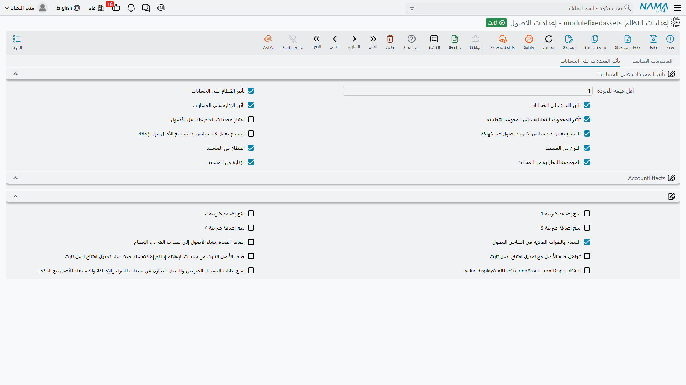

# إعدادات الوحدة

معظم ما تفعله وحدة الأصول الثابتة يُقرَّر مستندًا مستندًا، على توجيه المستند. لكن مجموعة صغيرة من القرارات لا بد أن تكون واحدة في كل مكان: هل يرث القيد المحاسبي الفرع من الأصل أم من المستند الذي حرّكه، وهل يجوز عمل قيد ختامي وما زالت أصول لم تُهلَك، وهل يجوز لسندات شراء الأصول أن تُنشئ بطاقات الأصول بنفسها. هذه القرارات تسكن سجل إعدادات الوحدة.

**والسجل واحد لكل قاعدة بيانات.** ليس لكل شركة ولا لكل فرع: الإعدادات تنطبق على كل الشركات وكل الفروع بلا استثناء، ولا يوجد تجاوز محلي. ويُنشأ السجل لك عند التركيب، فأنت لا تضيف سجلًا جديدًا أبدًا — تفتح الموجود، وتغيّر ما تريد، وتحفظ.

تصل إليه من **الأصول ← الإعدادات**. الشاشة صفحة واحدة تحمل اثنين وعشرين خيارًا، وهي معروضة أدناه مجمَّعة حسب ما تؤثر فيه لا حسب موضعها على الشاشة، لأن عدة خيارات منها لا يتضح معناها إلا بجوار بعضها.

## حدّ قيمة الخردة

**أقل قيمة للخردة** — *Minimum Salvage Value*

أدنى قيمة خردة تقبلها الوحدة على سطر مستند. وتُشحن مضبوطة على **1**، وهذا دفع مقصود: قيمة خردة تساوي صفرًا تعني أن الأصل يُهلَك حتى العدم، وأغلب السياسات تريد بقاء قيمة رمزية في الدفاتر. أدخل سطر شراء أو افتتاح بقيمة خردة تحت هذا الحدّ فيرفض المستند الاعتماد.

والفحص يجري على سطور المستندات وحدها. ولا شيء يمنع بطاقة الأصل نفسها من حمل رقم أدنى كتبه مستند أقدم.

## أي محددات تصل إلى دفتر الأستاذ

خمسة خيارات تقرر معًا كم من الهوية التحليلية للأصل ينتقل إلى قيوده. والخيارات الأربعة الأولى مُشحنة **مفعّلة**.

**تأثير القطاع على الحسابات** — *Sector affect Accounts*
**تأثير الفرع على الحسابات** — *Branch affect Accounts*
**تأثير الإدارة على الحسابات** — *Department affect Accounts*

مع تفعيل أيٍّ منها يُقرأ المحدد المقابل على القيد من بطاقة الأصل الثابت. وبإلغاء التفعيل لا يحمل القيد قيمة لذلك المحدد إطلاقًا — فالوحدة لا ترجع إلى بديل.

وفي المجموعة نفسها خيار رابع يقوم بالدور ذاته بالنسبة إلى **المجموعة التحليلية**. وتسميته غير سليمة في اللغتين وتُقرأ كأن المجموعة التحليلية تؤثر في نفسها؛ وما يتحكم فيه فعلًا هو ما إذا كانت المجموعة التحليلية على القيد تُؤخذ من الأصل، تمامًا كما تفعل أخواته الثلاثة مع القطاع والفرع والإدارة.

ووجود هذه الأربعة أصلًا سببه أن الأصل الثابت شيء طويل العمر يمكن أن يتغيّر موطنه التحليلي. فشركة الواحة تريد تحميل إهلاك الآلات على الإدارة التي تشغّل الآلة، فتترك خيار الإدارة مفعّلًا وتدع بطاقة كل آلة تقرر. أما شركة تُقرِّر أصولها مركزيًا فتُلغي تفعيلها وتُبقي قيودها نظيفة.

**اعتبار محددات العام عند نقل الأصول** — *Consider Public Dimensions In Assets Transfer*

حين يبحث سند النقل عن موضع الأصل السابق ليحرّكه منه فإنه يطابق على محددات الأصل. فعّل هذا الخيار فتقبل المطابقة أيضًا الحركات التي تُرك محددها عامًّا (فارغًا) بدل اشتراط تطابق تام. وهو الخيار الذي تلجأ إليه حين ترفض عمليات نقل الأصول القديمة — المسجَّلة قبل أن تبدأ الشركة ملء المحددات بانتظام — أن تجد نقطة انطلاقها.

## من أين يأتي المحدد: من الأصل أم من المستند

أربعة خيارات أخرى تعكس المجموعة السابقة، محددًا محددًا.

**القطاع من المستند** — *Sector From Document*
**الفرع من المستند** — *Branch From Document*
**الإدارة من المستند** — *Department From Document*
**المجموعة التحليلية من المستند** — *Analysis Set From Document*

فعّل واحدًا منها فيأخذ القيد ذلك المحدد مباشرة من رأس المستند الجاري معالجته، متجاوزًا خيار "تأثير … على الحسابات" الذي فوقه. واتركه غير مفعّل فيسري السلوك الأقدم: يفوز إعداد التوجيه نفسه إن كان له إعداد، وإلا فالأصل هو الذي يعطي القيمة، وإلا فلا يُختم المحدد أصلًا.

والفرق مهم عمليًا. فسندات الإهلاك في الواحة تُنشأ مركزيًا، ولو كان الفرع يأتي من المستند لهبط إهلاك كل آلة على المركز الرئيسي. لذلك تترك الواحة *الفرع من المستند* غير مفعّل وتدع فرع كل آلة يمضي معها. أما شركة لا تُمسك محددات بطاقات أصولها وتفضّل ذكر الموطن التحليلي على كل مستند فتفعل العكس.

::: info سندات النقل استثناء
سندات النقل تعمل دائمًا من الجانب "إلى" في النقل نفسه، فهذه الخيارات الأربعة لا تعيد توجيهها.
:::

## إقفال الفترة

خياران يضبطان صرامة الوحدة حين تحاول الإدارة المالية إقفال فترة مالية.

**السماح بعمل قيد ختامي إذا وجد اصول غير مُهلكة** — *Allow Creating Closing Entry If Non Depreciated Assets Found*

غير مفعّل افتراضيًا، وهذا مقصود. فمع بقائه غير مفعّل يفشل إنشاء القيد الختامي إذا وُجد أصل جارٍ إهلاكه يقع تاريخ بدء إهلاكه قبل نهاية الفترة ولم يُهلَك في الفترة السابقة. وهي شبكة أمان الوحدة ضد إقفال سنة ينقصها شهر إهلاك. لا تفعّله إلا وأنت قابل بأن يفترق السجل عن دفتر الأستاذ.

**السماح بعمل قيد ختامي إذا تم منع الأصل من الإهلاك** — *Allow Closing If Asset Is Prevented From Depreciation*

رفيق الخيار السابق بالطبع. فلدى الواحة آلة متوقفة جُمِّد إهلاكها عمدًا بمستند منع إهلاك؛ ولولا هذا الخيار لظلّت تلك الآلة تمنع كل قيد ختامي طوال فترة توقفها. فعّله فتُستثنى الأصول المذكورة في مستند منع الإهلاك من الفحص. انظر [منع إهلاك الأصول](/ar/modules/fixedassets/depreciation/fixedassets-prevent-depreciation.md).

## الضرائب على شراء الأصول

وأسفل الشاشة تقع المجموعة التي تحكم سلوك الشراء، وتبدأ بأربعة مفاتيح مستقلة — واحد لكل خانة ضريبة.

**منع إضافة ضريبة 1** — *Prevent add tax 1*
**منع إضافة ضريبة 2** — *Prevent add tax 2*
**منع إضافة ضريبة 3** — *Prevent add tax 3*
**منع إضافة ضريبة 4** — *Prevent add tax 4*

كل واحد منها يمنع دخول تلك الضريبة في القيمة التي يُرسمَل بها الأصل. وهذا اختيار محاسبي حقيقي لا مسألة شكل: الضريبة القابلة للاسترداد لا ينبغي أن تسكن داخل تكلفة الآلة، أما ضريبة استيراد غير قابلة للاسترداد فتسكنها عادةً.

ويُجمَع هذا الإعداد مع الخيار المقابل له على توجيه سند الشراء، ويكفي تفعيل أحدهما لتشغيل السلوك. اضبطه هنا حين تكون السياسة على مستوى الشركة، واضبطه على التوجيه حين لا يحتاجه إلا دفاتر بعينها. انظر [توجيهات الاقتناء](/ar/modules/fixedassets/document-terms/fixedassets-terms-acquisition.md).

## الأرصدة الافتتاحية

**السماح بالفترات العادية في افتتاحي الاصول** — *Allow Normal Periods In Fixed Assets Opening*

غير مفعّل افتراضيًا. فمع بقائه كذلك لا يجوز إصدار سند افتتاح أصل ثابت إلا في فترة مالية نوعها *افتتاحية* — وهو ما تريده عند بداية التشغيل، لأن قيود الافتتاح تقع خارج فترات النشاط. أما الشركات التي تظل تُدخل أصولًا قديمة بعد بداية التشغيل بأشهر فتفعّله ليمكن إصدار سند افتتاح في شهر عادي. انظر [الأرصدة الافتتاحية](/ar/modules/fixedassets/acquisition/fixedassets-opening-balances.md).

**تجاهل حالة الأصل مع تعديل افتتاح أصل ثابت** — *Ignore Asset Status With Fixed Asset Opening Document Update*

سند تعديل الافتتاح يرفض عادةً أن يمسّ أصلًا تجاوزت حالته نقطة معينة. فعّل هذا الخيار فيعدّل الأصل مهما بلغت حالته. وهو أداة تصحيح: استخدمه حين يكون رقم افتتاحي خاطئًا وقد بدأ الأصل يُهلَك بالفعل، وتوقّع إعادة تشغيل تاريخ الأصل كله من الافتتاح المصحَّح.

**حذف الأصل الثابت من سندات الإهلاك إذا تم إهلاكه عند حفظ سند تعديل افتتاح أصل ثابت** — *Remove Fixed Asset From Depreciation Document Details If Status Is Depreciated With FA Opening Document Update*

التنظيف المرافق. فحين يؤدي تصحيح الافتتاح إلى استنفاد الأصل تمامًا، يُسقط الحفظ سطر ذلك الأصل من سندات الإهلاك التي لم يعد ينتمي إليها، بدل ترك سطور تفشل عند التشغيل التالي.

## إنشاء بطاقات الأصول من المستندات

**إضافة أعمدة إنشاء الأصول إلى سندات الشراء و الإفتتاح** — *Add Fixed Assets Creation Columns To Fixed Assets Opening And Purchase*

هذا أظهر خيار على الشاشة، لأنه يغيّر ما يراه الناس. فعّله فتكتسب جداول تفاصيل سند شراء الأصل الثابت وسند الافتتاح الأعمدة اللازمة لوصف أصل لم يوجد بعد — نوع الأصل، والاسم العربي والإنجليزي، والرقم المسلسل، والقيمة السوقية، ومجموعة التكويد، ومستويات التصنيف الخمسة — وتُنشئ هذه المستندات بطاقة الأصل بنفسها عند الاعتماد.

ألغِ تفعيله فتختفي تلك الأعمدة، ويصير على كل سطر أن يشير إلى بطاقة أصل أنشأها أحدهم من قبل، وهي في حالتها الابتدائية.

وأي الطريقين تريد قرار سياسة حقيقي يستحق أن يُتخذ مبكرًا. فتسجيل الأصول أولًا يمنحك التحكم في التكويد والتصنيف لكنه يقدّم العمل كله إلى الأمام؛ وإنشاؤها من سند الشراء أسرع لكنه يجعل جودة سجلك رهنًا بجودة سطر الفاتورة. وهذا هو السؤال نفسه الذي يطرحه معالج التأسيس بصيغة *"إنشاء الاصول من خلال الشراء والافتتاحي"* — والإجابة عليه هناك تكتب هذا الخيار بعينه.

::: warning إنشاء الأصول من مستند ليس شبكة أمان على مستوى السطر
مع تفعيل هذا السلوك يقرر توجيه سند الشراء أيضًا ما إذا كان السطر يجوز له إنشاء أصل. والسطر الذي يشير إلى أصل *موجود* بينما إنشاء الأصول مفعّل سيعيد كتابة الحقول الوصفية لذلك الأصل من بيانات السطر — بما في ذلك الكتابة بقيم فارغة حيث يكون السطر فارغًا. فلا توجّه السطور إلى أصول موجودة إلا وأعمدة الأصل على السطر مملوءة بما تريد أن ينتهي إليه الأصل.
:::

## جدول أصول التخلص

وثمة خيار آخر يتحكم في إظهار جدول **الأصول التي أنشأها سند التخلص** واستخدامه على شاشة التخلص — وهي بطاقات الأصول التي تُفتح للأجزاء المستخلَصة من الأصل الجاري التخلص منه، حتى يبقى محرّك آلة مُخرَدة صالح للاستعمال مسجَّلًا كأصل قائم بذاته. وتسميته غائبة من الترجمات المشحونة فيظهر على الشاشة باسمه الخام؛ وهو يقع مع الخيارات السابقة، وتفعيله يُشغّل ذلك الجدول ويجلب معه التحقق الخاص به. انظر [التخلص من الأصل](/ar/modules/fixedassets/disposal/fixedassets-disposal.md).

## نسخ بيانات تسجيل المورد

**نسخ بيانات التسجيل الضريبي والسجل التجاري في سندات الشراء والإضافة والاستبعاد للأصل مع الحفظ** — *Update Tax Registration Number And Commercial Registration Number With Save In Asset Purchase document And Addition Deduction*

مع تفعيله يؤدي حفظ سند شراء أصل ثابت أو سند إضافة واستبعاد إلى نسخ رقم التسجيل الضريبي ورقم السجل التجاري للمورد على المستند. وهذا ما تحتاجه الفوترة الإلكترونية، ولهذا تفعّله أغلب التركيبات التي ترفع مشتريات الأصول إلى مصلحة الضرائب. ومع إلغاء تفعيله تُفرَّغ تلك الحقول عند الحفظ.

## بعد أن تغيّر شيئًا

تُقرأ الإعدادات عند معالجة المستند لا عند كتابته، فيسري التغيير على الاعتماد التالي. وهو **لا** يرجع إلى الوراء ليعيد كتابة قيود موجودة: تفعيل خيار محدد اليوم لا يختم الإدارة على قيود إهلاك العام الماضي. وحين يكون للتغيير أثر تاريخي مطلوب فالطريق هو إعادة توليد التأثيرات المحاسبية للمستندات المعنية — من المستند نفسه، أو بالجملة من شاشة القائمة.
